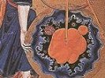

  
[Intangible Textual Heritage](../../index)  [Gnosticism](../index) 
[Index](index)  [Previous](fff23)  [Next](fff25) 

------------------------------------------------------------------------

[Buy this Book at
Amazon.com](https://www.amazon.com/exec/obidos/ASIN/B002CVUVRM/internetsacredte)

------------------------------------------------------------------------

  
*Fragments of a Faith Forgotten*, by G.R.S. Mead, \[1900\], at
Intangible Textual Heritage

------------------------------------------------------------------------

p. 181

### THE "OPHITES."

THE task we have now to attempt is by far the most difficult which can
be undertaken by the student The Obscurity of the
Subject. of Patristic Gnosticism. When we have the name of an
individual teacher to guide us, there is at least a point round which
certain ideas and statements may be grouped; but when we have no such
indications, but only scraps of information, or summaries of "some say"
and "others maintain," as in Irenæus; or vague designations of
widespread schools of various periods, as in Hippolytus; when further we
reflect that among such surroundings we are face to face with one of the
main streams of evolving Gnosticism, and realize the complete absence of
any definite landmarks, where all should have been carefully surveyed--a
feeling almost of despair comes over even the most enthusiastic student.

It has been supposed that up to the time of Irenæus Gnostic documents
were freely circulated; but that by the time of Hippolytus (that is to
say, after the lapse of a generation or more) orthodoxy had made such
headway that the Gnostic documents were withdrawn from circulation and
hidden, and that this accounts for the glee of Hippolytus, who taunts
the Gnostics with his possession of some of their secret MSS. I am,
however, convinced that the most recondite and technical treatises of
the Gnostics were never circulated; the adherents of the Gnosis were too
much imbued with the idea

p. 182

of a "secret doctrine" and grades of initiation to blazon their inner
tenets forth on the house-tops.

Also I doubt exceedingly whether these intertwined schools and phases of
doctrine were separated from one another in any very precise fashion, or
that the Basilidians, Valentinians, and the rest, distinguished
themselves by such designations. Gnosticism was a living thing, no
crystallized system or dead orthodoxy; each competent student thought
out the main features of the Gnosis in his own fashion, and generally
phrased it in his own terms.

In treating this part of our essay also another difficulty presents
itself; we are writing for those who are presumably but slightly
acquainted with the subject, and who would only be confused by a mass of
details. It is, however, precisely these details which are of interest
and importance, and therefore a summary must at best be exceedingly
imperfect and liable to misconstruction. We have thus to set up our
finger-posts as best we may.

The Term "Ophite".As stated above, the
term "Ophite" is exceedingly erroneous; it does not generally describe
the schools of which we are treating; it was not used by the adherents
of the schools themselves, who mostly preferred the term Gnostic; even
where the symbolism of the serpent enters into the exposition of their
systems, it is by no means the characteristic feature. In brief, this
term, which originated in the fallacy of taking a very small part for
the whole--a favourite trick of the hæresiologist, whose main weapon was
to exaggerate a minor detail into a main characteristic--has been used
as a vague designation

p. 183

for all exposition of Gnostic doctrine which could not be ascribed to a
definite teacher. It is in this foundling asylum, so to say, that we
must look for the general outlines which form the basis of the teachings
of even Basilides and Valentinus, each of whom, like the rest of the
Gnostics, modified the general tradition in his own peculiar fashion.

This "Ophite" Gnosticism is said by Philaster to be pre-Christian;
Irenæus, after detailing a system, which Theodoret when copying from him
calls "Ophite," says that it was from the Valentinian school. Celsus,
the Pagan philosopher, in his *True Word*, writing about the third
quarter of the second century, makes no distinction between the rest of
the Christian world and those whom Origen, almost a century afterwards,
in his refutation of Celsus, calls "Ophiani."

The latest criticism is of opinion that Philaster has blundered, but the
statement is sufficient evidence that there was a body of pre-Christian
Gnosis, that the stream flowed unbrokenly and in ever-increasing volume
during the first two centuries, and that the erroneous designation
"Ophite" still marks out one of its main channels.

The serpent-symbol played a great part in the Mysteries of the ancients,
especially in Greece, Egypt, The Serpent
Symbol. and Phoenicia; thence we can trace it back to Syria,
Babylonia, and farther East to India, where it still survives and
receives due explanation. It figured forth the most intimate processes
of the generation of the universe and of man, and also of the mystic
birth. It was the glyph of the creative power, and in its

p. 184

lowest form was debased into a phallic emblem. Physical procreation and
the processes of conception are lower manifestations of the energizing
of the great creative will and the evolutionary world-process. But the
one is as far removed from the other, as man's body is from the body of
the universe, as man's animal desire from the divine will of deity.

The mysteries of sex were explained in the adyta of the ancient temples;
and naturally enough the attempt to get behind the great passion of
mankind was fraught with the greatest peril. A knowledge of the mystery
led many to asceticism; a mere curious prying into the matter led to
abuse. Illumination, seership, and spiritual knowledge, were the reward
of the pure in body and mind; sexual excess and depravity punished the
prying of the unfit. This explains one of the most curious phenomena in
religious history; the bright and dark sides are almost invariably found
together; whenever an attempt is made to shed some light on the mystery
of the world and of man, the whole nature is quickened, and if the
animal is the stronger, it becomes all the more uncontrolled owing to
the quickening. Thus we find that some obscure groups of dabblers in the
mystery-tradition fell into grave errors, not only of theory but of
practice, and that Patristic writers of the subsequent centuries tried
by every means to exaggerate this particular into a general charge
against "error"; whereas, as a matter of fact, it is in the writings of
the Gnostics themselves that we find the severest condemnation of such
abuses.

p. 185

As man was generated in the womb from a "serpent" and an "egg," so was
the universe; but the serpent of the universe was the Great Power, the
Mighty Whirlwind, the Vast Vortex, and the egg was the All-Envelope of
the world system, the primordial "fire-mist." The serpent was thus the
glyph of the Divine Will, the Divine Reason, the Mind of Deity, the
Logos. The egg was the Thought, the Conception, the Mother of All. The
germinal universe was figured as a circle with a serpent lying
diagonally along its field, or twined a certain number of times round
it. This serpentine force fashioned the universe, and fashioned man. It
created him; and yet he in his turn could use it for creation, if he
would only cease from generation. The Caduceus, or Rod of Mercury, and
the Thyrsus in the Greek Mysteries, which conducted the soul from life
to death, and from death to life, figured forth the serpentine power in
man, and the path whereby it would carry the "man" aloft to the height,
if he would but cause the "Waters of the Jordan" to "flow upwards."

The serpent of *Genesis*, the serpent-rod of Moses, and the uplifting of
the brazen serpent in the wilderness, were promptly seized upon by
Jewish Gnostics as mythological ideas similar to the myths of the
Mysteries. To give the reader an insight into their methods of mystical
exegesis, which looked to an inner psychological science, we may here
append their interpretation of what may be called "The Myth of the
Going-forth."

The Myth was common to a number of schools, but Hippolytus ascribes it
to an otherwise unknown

p. 186

school called the Peratæ, supposed to mean Transcendentalists, or those
who by means of the Gnosis had "passed beyond" or "crossed over." The Myth of the Going-forth. Thus then they
explained the Exodus-myth. Egypt is the body; all those who identify
themselves with the body are the ignorant, the Egyptians. To "come
forth" out of Egypt is to leave the body; and to pass through the Red
Sea is to cross over the ocean of generation, the animal and sensual
nature, which is hidden within the blood. Yet even then they are not
safe; crossing the Red Sea they enter the Desert, the intermediate state
of the doubting lower mind. There they are attacked by the "gods of
destruction," which Moses called the "serpents of the desert," and which
plague those who seek to escape from the "gods of generation." To them
Moses, the teacher, shows the true serpent crucified on the cross of
matter, and by its means they escape from the Desert and enter the
Promised Land, the realm of the spiritual mind, where there is the
Heavenly Jordan, the World-soul. When the Waters of the Jordan flow
downwards, then is the generation of men; but when they flow upward,
then is the creation of the gods. Jesus (Joshua) was one who had caused
the Waters of the Jordan to flow upwards.

Many of the ancient myths had a historico-legendary background, but
their use as myths, or religious and mystic romances, had gradually
effaced the traces of history. Those instructed in the Mysteries were
practised in the science of mythology, and thus the learned Gnostics at
once perceived the

p. 187

mythological nature of the Exodus and its adaptability to a mystical
interpretation. The above instance is a very good example of this method
of exegesis; a great deal of such interpretation, however, was
exceedingly strained, when not decidedly silly. The religious mind of
the times loved to exercise its ingenuity on such interpretations, and
the difference between Gnostic exegesis and that of the subsequent
Orthodox, is that the former tried to discover soul-processes in the
myths and parables of scripture, whereas the Orthodox regarded a
theological and dogmatic interpretation as alone legitimate.

Judged by our present knowledge of language, the "silliest" element
which entered into such pious Pseudo-philology. pastimes was the method of
word-play, or pseudo-philology, which is found everywhere in the
writings of the Babylonians, Egyptians, Indians, Jews, and Greeks. Among
the Gnostic and Patristic writers, therefore, we find the most fantastic
derivations of names, which were put forward in support of theological
doctrines, but which were destitute of the most rudimentary philological
accuracy. Men, such as Plato, who in many other respects were giants of
intellect, were content to resort to such methods. It is, however,
pleasant to notice that the nature of the soul and the truths of the
spiritual life were the chief interest for such ancient "philologists,"
and not the grubbing up of "roots"; nevertheless, we should be careful
when detecting the limitation of such minds in certain directions, to
guard against the error of closing our eyes to the limitations of

p. 188

our own modern methods in directions where the ancients have done much
good work.

We will now proceed to give a brief sketch of the main outlines of one
of the presentations of general Gnostic ideas preserved by Irenæus.

------------------------------------------------------------------------

[Next: An Anonymous System From Irenæus](fff25)
