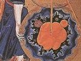

  
[Intangible Textual Heritage](../../index)  [Gnosticism](../index) 
[Index](index)  [Previous](fff31)  [Next](fff33) 

------------------------------------------------------------------------

[Buy this Book at
Amazon.com](https://www.amazon.com/exec/obidos/ASIN/B002CVUVRM/internetsacredte)

------------------------------------------------------------------------

  
*Fragments of a Faith Forgotten*, by G.R.S. Mead, \[1900\], at
Intangible Textual Heritage

------------------------------------------------------------------------

p. 224

### THE SO-CALLED CAINITES.

The Obscurity of the Subject.BEFORE
returning again towards the time of the origins along another line of
tradition, of which one or two obscure indications still remain--the
Carpocrates-Cerinthus trace--we will briefly refer to the obscure chaos
of tendencies classed together under the term "Cainite" and its
variants. Our sources of information are scanty, and (if we exclude the
mere mention of the name) are confined to Irenæus and Epiphanius; the
latter, moreover, copies from Irenæus, and with the exception of his own
reflections and lucubrations, has only a scrap or two of fresh
information to add.

This line of tradition is again generally classed as "Ophite," and as
usual we find that its adherents called themselves simply Gnostics. They
were distinguished by the honour they paid to Cain and Judas; which
fact, taken by itself, was sufficient to overwhelm them with the
execrations of the orthodox, who ascribed the perpetration of every
iniquity to them. Thus we find that Epiphanius, who wrote two hundred
years after Irenæus, embroiders considerably on the account of the
Bishop of Lyons, even where he is in other respects simply copying from
his predecessor. We will now proceed to see the reason why these
Gnostics entertained an apparently so strange belief.

If the reader will bear in mind the systems of Justinus and of the
Sethians, he will be in a better position to comprehend what follows.
The main

p. 225

features of the system of these Gnostics, then, is as follows.

The creator of the world was not the God over all; the absolute power
from above was stronger than the weaker (ἡστέρα--hystera) power of
generation, which was symbolized as the power of the impure world-womb,
containing heaven and earth within it--the sensible world. But this
sensible world was, as it were, an after-birth (ὕστερα--hystera),
compared with the true birth from the virgin spiritual womb, the ideal
world of the æons above. Epiphanius has made a great muddle of this part
of the system; it is evidently consanguineous with the Valentinian
"deficiency" (ὑστέρημα--hysterēma), or "abortion," the sensible world,
without or external to the ideal fullness or perfection
(πλήρωμα--plērōma), or world of the æons.

The inferior power, therefore, was the God of generation, the superior
the God of enlightenment The Enemies of Yahweh
the Friends of God. and wisdom. The Old Testament idea of God
went no further than obedience to the commands of the inferior power.
Those who had obeyed its behests were regarded as the worthies of old by
the followers of the External Law, who, seeing no further, had in their
traditions vilified all who refused to follow this law, the commands of
the inferior power of generation. Thus Abel and Jacob and Lot and Moses
were praised by the followers of the law of generation; whereas in
reality it was the opponents of these who ought to be praised, as
followers of the Higher Law who despised the laws of the powers of
generation, and were thus

p. 226

protected by Wisdom and taken to herself, to the æon above. They
therefore claimed that Cain and Esau, and the inhabitants of the Cities
of the Plain, and Coran, Dathan and Abiram, were types of those
individuals or nations who had followed a higher law, and who,
apparently, were calumniated by the followers of Yahweh.

We can here see very plainly the traces of the same antitheses as those
worked out by Justinus; the influence of the psychic powers or angels
being traceable along the Abel line of descent, and that of the
spiritual powers along the Cain line. Abel was the offerer of
blood-sacrifices, while Cain offered the fruits of the field. This
antithetical device, in one form or other, was common enough--as for
instance, the later Ebionite antitheses of superior and inferior men
(Isaac-Ishmael, Jacob-Esau, Moses-Aaron), or the Marcionite antitheses
of the God of freedom and the God of the law, the God of the Christ and
the Yahweh of the Old Testament--but the school whose tenets we are
describing, seem, in their contempt for Yahweh, to have pushed their
theories to the most extravagant conclusion of any. This is especially
brought out in their ideas of New Testament history, which, in spite of
their strangeness, may nevertheless contain a small trace of the true
tradition of the cause of Jesus’ death.

Judas.This Gnostic circle had a number of
writings, chief amongst which were two small summaries of instruction,
one called *The Gospel of Judas*, and the other *The Ascent of Paul*. To
take the latter first; *The Ascent of Paul* purported to,

p. 227

contain the record of the ineffable things which Paul is reported to
have seen when he ascended into the third heaven. Whether this was the
same as *The Apocalypse of Paul* referred to by Augustine is uncertain;
in any case it is lost. A more orthodox version of one of the documents
of the same cycle has come down to us in *The Vision of Paul*, a
translation of which may be read in the last volume of the Ante-Nicene
Christian Library (1897). If we can rely on this title, for which
Epiphanius alone is responsible, the school of the Cainites is
consequently post-Pauline.

But the strangest and, from one point of view, the most interesting
development of their theory, was the view they took of Judas. The "Poor
Men's" (Ebionite) tradition had consistently handed over Judas to
universal execration; there was, however, apparently another tradition,
presumably Essene in the first place, which took a different view of the
matter. Obscure traces of this seem to be preserved in the unintelligent
Irenæus-Epiphanius account of the Cainite doctrines.

This circle of students looked upon Judas as a man far advanced in the
discipline of the Gnosis, and one who had a very clear idea of the true.
God as distinguished from the God of generation; he consequently taught
a complete divorcement from the things of the world and thus from the
inferior power, which had made the heaven, the world and the flesh. Man
was to ascend to the highest region through the crucifixion of the
Christ. The Christ was the spirit which came down from above, in order
that the

p. 228

stronger power of the spiritual world might be perfected in man; and so
Jesus triumphed over the weaker power of generation at the expense of
his body, which he handed over to death, one of the manifestations of
the God of generation. This was the christological doctrine of the
school, and it was apparently, judging from the "he says" of Epiphanius,
taken from *The Gospel of Judas*.

A Scrap of History.But besides this
general mystical teaching, there was also a historical tradition: that
Jesus, after becoming the Christ and teaching the higher doctrine, fell
away, in their opinion, and endeavoured to overset the law and corrupt
the holy doctrine, and therefore Judas had him handed over to the
authorities. That is to say, those to whom Jesus originally taught the
higher doctrine considered that his too open preaching to the people was
a divulging of the Mysteries, and so finally brought about his
condemnation for blasphemy by the orthodox Jewish authorities.

Yet another more mystical tradition, preserved in one of their books,
declared that, on the contrary, the Christ had not made a mistake, but
that all had been done according to the heavenly wisdom. For the
world-rulers knew that if the Christ were betrayed to the cross, that is
to say, were incarnated, the inferior power would be drained out of them
and they would ascend to the spiritual æon. Now Judas knew this, and, in
his great faith, used every means to bring about His betrayal, and in
this way the salvation of the world. These Gnostics consequently praised
Judas as being one of the main

p. 229

factors in the scheme of salvation; without him the mystic "salvation of
the cross" would not have been consummated, nor the consequent
revelation of the realms above.

The Cainite circle, therefore, from their doctrines appear to have been
rigid ascetics. But, says Epiphanius, embroidering on Irenæus, they were
very dreadful people, and, like Carpocrates, taught that a man could not
be saved without going through every kind of experience. We will
therefore now take a brief glance at the views of the Carpocratians.

------------------------------------------------------------------------

[Next: The Carpocratians](fff33)
