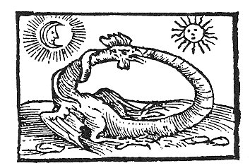

  
[Intangible Textual Heritage](../../index)  [Gnosticism](../index.md) 
[Index](index)  [Previous](fff58)  [Next](fff60.md) 

------------------------------------------------------------------------

[Buy this Book at
Amazon.com](https://www.amazon.com/exec/obidos/ASIN/B002CVUVRM/internetsacredte.md)

------------------------------------------------------------------------

  
*Fragments of a Faith Forgotten*, by G.R.S. Mead, \[1900\], at
Intangible Textual Heritage

------------------------------------------------------------------------

p. 415

 

# Some Traces of the Gnosis in the Uncanonical Acts

### FOREWORD.

JUST as there existed, prior to and alongside of the canonical Gospels,
many other settings of the Sayings The Gnostic
Acts. and Doings of the Lord, so there existed, prior to and
alongside of the selected or canonical Acts, many other narratives
professing to record the doings and sayings of the Apostles and
Disciples of the Lord. Most of these originated in what are now called
heretical circles, but were subsequently worked over by orthodox editors
to suit doctrinal prejudices, and eagerly embraced by the Catholic
Church. As Lipsius, the greatest authority on the subject, says: "Almost
every fresh editor of such narratives, using that freedom which all
antiquity was wont to allow itself in dealing with literary monuments,
would recast the materials which lay before him, excluding whatever
might not suit his theological point of view--dogmatic statements, for
example, speeches, prayers, etc., for which he would substitute other
formulæ of

p. 416

his own composition, and further expanding and abridging after his own
pleasure, or as the immediate object which he had in view might
dictate." (Art. "Apocryphal Acts of the Apostles," in Smith and Wace's
*Dictionary*, incorporated into his exhaustive *Die apokryphen
Apostelgeschichte*, 1883, etc.)

The main point of interest for us is that some of these edited and
re-edited documents still preserve traces of their Gnostic origin; and
Lipsius has shown that their Gnosticism is not to be ascribed to the
third century Manichæism, as has been assumed by some, but to the
general Gnosis of the second century.

Catholic Over-working.There was a very
wide circulation of such religious romances in the second century, for
these formed the main means of Gnostic public propaganda. The technical
inner teachings of Gnosticism the Church Fathers, as we have seen,
assailed with misrepresentation and overwhelmed with ridicule; to these
onslaughts the Gnostics made no reply, most probably because they were
bound by their oaths of secrecy on the one hand, and on the other knew
well that the doctrines of the inner life could not be decided by vulgar
debate. The inner teachings of their Gospel were for those within; to
the rest they were foolishness. But the Acts-romances, often no doubt
based on actual occurrences of the inner life, were not of so difficult
a character. They may seem vastly fantastic to modern criticism, but to
every shade of Christianity in those early years they were entirely
credible. These formed the intermediate link between the General Church
and the inner teachings of Gnosticism, and they could not be disposed of
by ridicule.

p. 417

\[paragraph continues\] Another method had
to be used. As Lipsius says: "Catholic bishops and teachers knew not how
better to stem this flood of Gnostic writings and their influence among
the faithful, than by boldly adopting the most popular narrations from
the heretical books, and, after carefully eliminating the poison of
false doctrine, replacing them in this purified form in the hands of the
people."

Fortunately the "purification" has not been complete, and some traces of
the "poison" are still to be found, as we hope to show our readers in
the sequel.

It would be out of place in these short sketches to attempt a
description of these Acts, or enter into a Early
Collectors. critical treatment of their sources; our only object
is, to rescue from this mass of literature a few fragments which still
preserve traces of old Gnostic teachings. The original works in which
these teachings were first formulated, have disappeared; the tradition
has been badly mutilated by many editors and scribes. Can it be that the
new-found Coptic *Acts of Peter* may give us the translation of an
original untampered-with text?

The earliest collection of these Gnostic Acts is said to have been made
by a certain Leucius (there are no less than eighteen variants of the
name), or Leucius Charinus, who is said to have been a disciple of John;
but of course no reliance can be placed on this latter assertion, unless
"John" is taken for the writer of the Fourth Gospel, and not one of the
original Twelve. At any rate the so-called Leucian Acts were early; in
the opinion of Zahn this collection was made at a time when the Gnostics
were not yet

p. 418

considered heretical, that is to say, prior to 150 A.D. However this may be, the Leucian Acts were a
second century collection, for Clement of Alexandria was acquainted with
them; they were also probably collected at Alexandria.

Another early collector of Gnostic Acts was a certain Linus, of whom
nothing certain is known. He may probably have lived at Rome. The
Abdias-collection is too late to be noticed in this connection.

For a full discussion of all these points, and an analysis of all the
Gnostic fragments and references preserved in the Apocryphal Acts, I
must refer the student to Lipsius' great work on the subject. We will
now present the reader with the most important of these fragments, so
that he may judge of their nature. Some of these Acts are untranslated
in English; I use the most recent texts of Zahn, Bonnet and Lipsius.

------------------------------------------------------------------------

[Next: From The Acts of Thomas](fff60.md)
