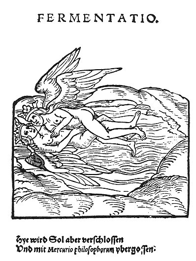

  
[Intangible Textual Heritage](../../index)  [Gnosticism](../index.md) 
[Index](index)  [Previous](fff63)  [Next](fff65.md) 

------------------------------------------------------------------------

[Buy this Book at
Amazon.com](https://www.amazon.com/exec/obidos/ASIN/B002CVUVRM/internetsacredte.md)

------------------------------------------------------------------------

  
*Fragments of a Faith Forgotten*, by G.R.S. Mead, \[1900\], at
Intangible Textual Heritage

------------------------------------------------------------------------

p. 450 p. 451

 

# The Gnosis According to Its Friends

------------------------------------------------------------------------

[Next: The Askew and Bruce Codices](fff65.md)
