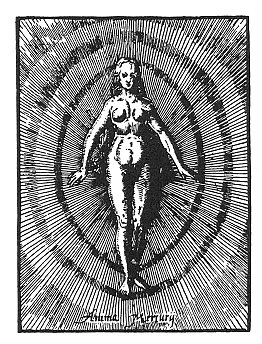

  
[Intangible Textual Heritage](../../index)  [Gnosticism](../index.md) 
[Index](index)  [Previous](fff73)  [Next](fff75.md) 

------------------------------------------------------------------------

[Buy this Book at
Amazon.com](https://www.amazon.com/exec/obidos/ASIN/B002CVUVRM/internetsacredte.md)

------------------------------------------------------------------------

  
*Fragments of a Faith Forgotten*, by G.R.S. Mead, \[1900\], at
Intangible Textual Heritage

------------------------------------------------------------------------

p. 604

<table data-border="0" width="50%">
<colgroup>
<col style="width: 100%" />
</colgroup>
<tbody>
<tr class="odd">
<td data-valign="top" width="655">
O Light of God, adorable! we worship Thee, that Thou may’st pour Thy light into our minds! 
                 Based on the Gāyatrī.
</td>
</tr>
</tbody>
</table>

p. 605

 

### Afterword

READER, if you have read so far, you may have journeyed with me or have
been taken by some other way; but if you have come so far upon the road,
then it seems--to me at least--as though we had journeyed together to
some region of light. We have for some short hours been privileged to
enjoy converse with those who loved and love the Master. With their
words still ringing in our ears, with the life of their love still
tingling in our veins, how can we venture to speak ill of them? "Come
unto Me, ye weary!" In such a light of love, how shall we find the heart
to condemn, because they went out unto Him with all their being? Reading
their words and looking upon their lives, I, for my part, see the brand
"Heresy," writ so large upon their horizon for many, disappearing into
the dim distance, and instead behold the figure of the Master standing
with hands of blessing outstretched above their heads. I do not know why
this side of earliest Christianity has been allowed to be forgotten.
Doubtless there was a purpose served by its withdrawal; but to-day, at
the

p. 606

beginning of the twentieth century, in the greater freedom and wider
tolerance we now enjoy, may not the veil again be lifted? The old forms
need not return--though surely some of them have enough of beauty! But
the old power is there, waiting and watching, ready to clothe itself in
new forms, forms more lovely still, if we will but turn to Him who
wields the power, as He really is, and not as we limit Him by our
sectarian creeds.

How long must it be before we learn that there are as many ways to
worship God as there are men on earth? Yet each man still declares: My
way is best; mine is the only way. Or if he does not say it, he thinks
it. These things, it is true, transcend our reason; religion is the
something in us greater than our reason, and being greater it gives
greater satisfaction. To save ourselves we must lose ourselves; though
not irrationally, if reason is transcended. If it be true that we have
lived for many lives before, in ways how many must we not have
worshipped God or failed to do so? How often have we condemned the way
we praised before! Intolerant in one faith, equally intolerant in
another, condemning our past selves

What, then, think ye of Christ? Must He not be a Master of religion,
wise beyond our highest ideals of wisdom? Does He condemn His
worshippers because their ways are diverse; does He condemn those who
worship His Brethren, who also have taught the Way? As to the rest, what
need of any too great precision? Who knows with the intellect enough to
decide on all these high subjects

p. 607

for his fellows? Let each follow the Light as he sees it--there is
enough for all; so that at last we may see "all things turned into
light--sweet, joyous light." These, then, are all my words, except to
add, with an ancient Coptic scribe, "O Lord, have mercy on the soul of
the sinner who wrote this!"

------------------------------------------------------------------------

[Next: Bibliographies](fff75.md)
