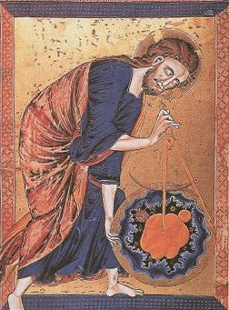

  
[Intangible Textual Heritage](../../index)  [Gnosticism](../index) 

------------------------------------------------------------------------

[Buy this Book at
Amazon.com](https://www.amazon.com/exec/obidos/ASIN/B002CVUVRM/internetsacredte)

------------------------------------------------------------------------

<table width="75%">
<colgroup>
<col style="width: 50%" />
<col style="width: 50%" />
</colgroup>
<tbody>
<tr class="odd">
<td width="50%" data-valign="TOP"> 
God Measuring the World With Compass, Bible Moraliseé (circa 1250) [Public Domain Image]</td>
<td width="50%" data-valign="CENTER"><h1 id="fragments-of-a-faith-forgotten" data-align="CENTER">Fragments of a Faith Forgotten</h1>
<h2 id="by-g.r.s.-mead" data-align="CENTER">by G.R.S. Mead</h2>
<h4 id="section" data-align="CENTER">[1900]</h4></td>
</tr>
</tbody>
</table>

------------------------------------------------------------------------

[Contents](#contents)    [Start Reading](fff00)    [Page
Index](pageidx)    [Text \[Zipped\]](fff.txt.gz)

------------------------------------------------------------------------

|                                                                                                                           |
|---------------------------------------------------------------------------------------------------------------------------|
|  |

------------------------------------------------------------------------

This is one of the best books about the Gnostics written prior to the
Nag Hammadi discoveries. G.R.S. Mead, who also translated the [Pistis
Sophia](../../chr/ps/index), summarizes what was known about the
Gnostics at the turn of the 20th century. At that time, a better picture
of the Gnostics was emerging, based on several papyri which had been
recently discovered. Although there had been a lot of academic research
on this subject, most of the key works were in German or French.
Therefore this book and [The Gnostics and Their Remains](../gar/index)
are the only two major books in English on this subject currently in the
public domain.

It was becoming increasingly obvious that early Christianity was a wide
spectrum of sects, the record of which had been subsequently forgotten
or suppressed by the Church. The Gnostics had deep connections with
ancient Mystery religions, Pythagoreanism, Hinduism and other ancient
beliefs. Most of the sacred texts of Gnosticism were long lost or
survived only in small quotes.

Mead draws on information provided both by the Early Church Fathers
hostile to Gnosticism, and the available corpus of actual Gnostic
documents at the time, cryptic and fragmentary as it was. He includes
excerpts from previously untranslated manuscripts, and extensive
summaries of the Pistis Sophia and the writings of the critics of
Gnosticism. This book is required reading for anyone who wants to
understand Gnosticism and the development of early Christianity.

------------------------------------------------------------------------

 [Title Page](fff00)  
[Synopsis of Contents](fff01)  
[Illustrations](fff02)  
[Index](fff03)  

### Introduction

[Introduction](fff04)  
[Prolegomena](fff05)  

### Some Rough Outlines of the Background of the Gnosis

[Preliminary Considerations](fff06)  
[Greece](fff07)  
[Egypt](fff08)  
[Philo on the Contemplative Life](fff09)  
[Jewry](fff10)  
[Alexandria](fff11)  

### General and Gnostic Christianity

[The Evolution of Catholic Christianity](fff12)  
[The Ebionites](fff13)  
[The Essenes](fff14)  
[The Tendencies of Gnosticism](fff15)  
[The Literature and Sources of Gnosticism](fff16)  

### The Gnosis According to its Foes

[The Gnosis According to its Foes](fff17)  
[Some Gnostic Fragments Recovered from the Polemical Writings of the
Church Fathers](fff18)  
[The ''Simonians''](fff19)  
[Dositheus](fff20)  
[''Simon Magus.''](fff21)  
[Menander](fff22)  
[Saturninus](fff23)  
[The ''Ophites''](fff24)  
[An Anonymous System From Irenæus](fff25)  
[An Early ''Ophite'' System](fff26)  
[The Naasseni](fff27)  
[The Peratæ](fff28)  
[The Sethians](fff29)  
[The Docetæ](fff30)  
[Monoïmus](fff31)  
[The So-Called Cainites](fff32)  
[The Carpocratians](fff33)  
[''Epiphanes''](fff34)  
[Cerinthus](fff35)  
[Nicolaus](fff36)  
[Cerdo](fff37)  
[Marcion](fff38)  
[Apelles](fff39)  
[The Basilidian Gnosis](fff40)  
[The Valentinian Movement](fff41)  
[Valentinus](fff42)  
[i. From a Letter](fff43)  
[ii. From a Letter](fff44)  
[iii. From the Letter to Agathōpus](fff45)  
[iv. From a Homily](fff46)  
[v. A few Sentences preserved in the Controversial Matter of
Clement...](fff47)  
[vi. From the Letter on the Community of Friends](fff48)  
[vii. A very doubtful Fragment from Eulogius of Alexandria writing at
the end of the Sixth Century](fff49)  
[viii. The Myth which Valentinus made](fff50)  
[ix. From a Psalm](fff51)  
[Some Outlines of Æonology](fff52)  
[Hippolytus’ account of One of the Variants of the
Sophia-Mythus](fff53)  
[The Number-Symbolism of Marcus](fff54)  
[Ptolemy](fff55)  
[Heracleōn](fff56)  
[Bardesanes](fff57)  
[The Hymn of the Robe of Glory](fff58)  

### Some Traces of the Gnosis in the Uncanonical Acts

[Foreword](fff59)  
[From The Acts of Thomas](fff60)  
[From The Acts of John](fff61)  
[From The Acts of Andrew](fff62)  
[From The Travels of Peter](fff63)  

### The Gnosis According to Its Friends

[The Gnosis According to Its Friends](fff64)  
[The Askew and Bruce Codices](fff65)  
[Summary of the Contents of the So-Called Pistis Sophia
Treatise](fff66)  
[Summary of the Extracts From the Books of the Saviour](fff67)  
[Summary of the Fragments of the Book of the Great Logos According to
the Mystery](fff68)  
[Selections from the Untitled Apocalypse of the Codex
Brucianus](fff69)  
[Notes on the Contents of the Bruce and Askew Codices](fff70)  
[The Akhmīm Codex](fff71)  
[Some Forgotten Sayings](fff72)  

 

[Conclusion](fff73)  
[Afterword](fff74)  
[Bibliographies](fff75)  
