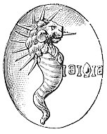

  
[Intangible Textual Heritage](../../index)  [Gnosticism](../index) 
[Index](index)  [Previous](gar01)  [Next](gar03) 

------------------------------------------------------------------------

[Buy this Book at
Amazon.com](https://www.amazon.com/exec/obidos/ASIN/B002BA5FIO/internetsacredte)

------------------------------------------------------------------------

  
*The Gnostics and Their Remains*, by Charles William King, \[1887\], at
Intangible Textual Heritage

------------------------------------------------------------------------

p. xi

# CONTENTS.

<table data-border="0">
<colgroup>
<col style="width: 50%" />
<col style="width: 50%" />
</colgroup>
<tbody>
<tr class="odd">
<td data-valign="top">
 
</td>
<td data-valign="bottom">
PAGE.
</td>
</tr>
<tr class="even">
<td data-valign="top">
PREFACE
</td>
<td data-valign="bottom">
<a href="gar01.htm#page_v">v</a>
</td>
</tr>
<tr class="odd">
<td data-valign="top">
Introduction
</td>
<td data-valign="bottom">
<a href="gar03.htm#page_xiii">xiii</a>
</td>
</tr>
<tr class="even">
<td data-valign="top">
 
PART I.
</td>
<td data-valign="bottom">
 
</td>
</tr>
<tr class="odd">
<td data-valign="top">
GNOSTICISM AND ITS SOURCES.
</td>
<td data-valign="bottom">
 
</td>
</tr>
<tr class="even">
<td data-valign="top">
Introduction--Gnosticism and its origin--Pistis-Sophia--Book of Enoch--Gnosticism in its beginning--Influence of Judaism on the Ancients--The Zendavesta--The Kabbala and the Talmud--Indian Sources of Gnosticism, Manes--Buddhism--Simonianism--Basilides--The Ophites--Machinery of the Gnosis
</td>
<td data-valign="bottom">
 
</td>
</tr>
<tr class="odd">
<td data-valign="top">
 
PART II.
</td>
<td data-valign="bottom">
 
</td>
</tr>
<tr class="even">
<td data-valign="top">
THE WORSHIP OF MITHRAS AND SERAPIS.
</td>
<td data-valign="bottom">
 
</td>
</tr>
<tr class="odd">
<td data-valign="top">
Origin of Mithraicism--The Mithraic Sacraments--A Roman <a href="errata.htm#0">Mithras</a> in his Cave--Mithraic Talismans--Gnostic Sacraments and Initiations, as Connected with the Mithraic--St. Augustine on Gnosticism--The Worship of Serapis--The Figured Representations of Serapis--Probable Origin of Serapis--Monuments of the Serapis-worship--The Caduceus and its Symbolism--Death, as Represented in Ancient Art--Tomb-treasures--Gnostic connection with Superstitious Practices, the Evil Eye--Ceraunia of Jade converted into a Gnostic Talisman
</td>
<td data-valign="bottom">
<a href="gar17.htm#page_113">113</a>
</td>
</tr>
<tr class="even">
<td data-valign="top">
 
PART III.
</td>
<td data-valign="bottom">
 
</td>
</tr>
<tr class="odd">
<td data-valign="top">
ABRAXAS, ABRAXASTER AND ABRAXOID GEMS.
</td>
<td data-valign="bottom">
 
</td>
</tr>
<tr class="even">
<td data-valign="top">
Agathodaemon Worship--The Chnuphis Serpent--The Abraxas--Abraxaster, or Borrowed Types--Abraxoids, or Gems confounded with the true Gnostic--The True Abraxas Gems--The god Abraxas, as described by the Christian Fathers--"Abraxas," Etymology of--"Abraxas," its numerical Value--The Abraxas Religion--The Ineffable name in its Hindoo Form--Abraxas-gems, their Materials, Workmanship, and Nature--Legends and Formula.
</td>
<td data-valign="bottom">
<a href="gar31.htm#page_213">213</a>
</td>
</tr>
<tr class="odd">
<td data-valign="top">
p. xii
</td>
<td data-valign="bottom">
 
</td>
</tr>
<tr class="even">
<td data-valign="top">
 
PART IV.
</td>
<td data-valign="bottom">
 
</td>
</tr>
<tr class="odd">
<td data-valign="top">
THE FIGURED MONUMENTS OF GNOSTICISM.
</td>
<td data-valign="bottom">
 
</td>
</tr>
<tr class="even">
<td data-valign="top">
Gnostic <em>Siglæ</em>, Symbols, Legends Explained--The Name ΙΑΩ--Abraxas, a New Type of--Original Purpose of these Formulæ--The Gnostic Theogony--The <em>Schema</em> of the Ophites--The Cause of Sin--State after death of the Uninitiated--Future Punishments, and the Infernal Hierarchy--Talismanic Leaden Scrolls--Leaden Books--Numerals, Their Virtues--Magic Squares
</td>
<td data-valign="bottom">
<a href="gar44.htm#page_303">303</a>
</td>
</tr>
<tr class="odd">
<td data-valign="top">
 
PART V.
</td>
<td data-valign="bottom">
 
</td>
</tr>
<tr class="even">
<td data-valign="top">
TEMPLARS, ROSICRUCIANS, FREEMASONS.
</td>
<td data-valign="bottom">
 
</td>
</tr>
<tr class="odd">
<td data-valign="top">
Preservation of Gnostic Symbols among the Freemasons--Masonic Pretences--"Constitutiones Artis Geometriae"--Henry VI. and his Masons--Hindoo and. Chinese Symbols--Masons’ Marks--Stonehenge--The Carbonari--De Quincey--The <em>Rosy Cross</em>--"Vultus Triformis"--Hosea Lux--Lodges First Established--Templars Suppressed--"Mystery of Baphomet Revealed"--Articles of Accusation against the Templars--Orphic Mysteries--Clarkson on the Temple Church--"Baphometic Vases"--Manicheism in France--The Assassins of the Lebanon--The Druses--The <em>Sufi</em> of Persia--Lodges first Established--Spartacus Weishaupt--Wren--"Scottish Knights"--Cypher Writing--"Book of Kells"--Brand-marking, National and Mystic
</td>
<td data-valign="bottom">
<a href="gar54.htm#page_373">373</a>
</td>
</tr>
<tr class="even">
<td data-valign="top">
 
DESCRIPTION OF WOODCUTS
</td>
<td data-valign="bottom">
<a href="gar71.htm#page_432">432</a>
</td>
</tr>
<tr class="odd">
<td data-valign="top">
 
DESCRIPTION OF PLATES
</td>
<td data-valign="bottom">
<a href="gar72.htm#page_435">435</a>
</td>
</tr>
<tr class="even">
<td data-valign="top">
 
BIBLIOGRAPHICAL APPENDIX, by Joseph Jacobs, B.A.
</td>
<td data-valign="bottom">
<a href="gar87.htm#page_449">449</a>
</td>
</tr>
<tr class="odd">
<td data-valign="top">
 
INDEX
</td>
<td data-valign="bottom">
<a href="gar88.htm#page_459">459</a>
</td>
</tr>
</tbody>
</table>

 

[(\*)](gar71.htm#an__01200)

------------------------------------------------------------------------

[Next: Introduction](gar03)
