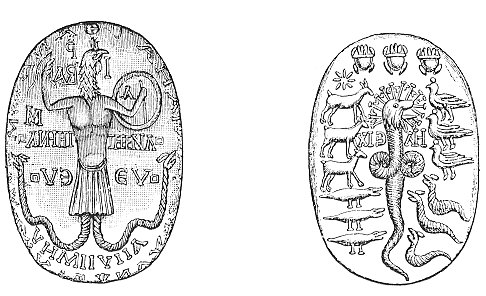

  
[Intangible Textual Heritage](../../index)  [Gnosticism](../index) 
[Index](index)  [Previous](gar09)  [Next](gar11) 

------------------------------------------------------------------------

[Buy this Book at
Amazon.com](https://www.amazon.com/exec/obidos/ASIN/B002BA5FIO/internetsacredte)

------------------------------------------------------------------------

  
*The Gnostics and Their Remains*, by Charles William King, \[1887\], at
Intangible Textual Heritage

------------------------------------------------------------------------

### THE KABBALA AND THE TALMUD.

The origin of the Kabbala is placed by most authors much later than that
of Christianity; and, indeed, it is not impossible that its doctrines
may have received great developments *after* that epoch; [\*](#fn_3) nevertheless, the elements of them go back
to a much more remote antiquity. The Book of Daniel bears the most
conspicuous traces of this antiquity, and to the attestation of this
record are added other proofs no less convincing. The idea of
*Emanation* is, so to speak, the *soul*, the essential element of the
Kabbala; it is likewise, as we have already seen, the essential
character of Zoroastrism. We may therefore consider that it was through
their very intimate connection with Persia that the Jews imbibed that
idea.

According to the Kabbala, as according to the Zendavesta, all that
exists has emanated from the source of the Infinite Light.

Before all things existed the Primal Being, the "Ancient of Days," the
eternal King of Light. This King of Light is the *All*; he is the real
cause of all existence; he is the Infinite (*En Soph*); he alone is
*He*, there is in him no *Thou*; but he cannot be known, "he is a closed
Eye."

The universe is the revelation of the King of Light, and only subsists
in Him. His *qualities* are manifested in it, variously modified and in
different degrees; it is therefore his "Holy

p. 34

\[paragraph continues\] Splendour"--the
*mantle*, as it were, wherewith he must be clothed in silence. All is an
emanation from this Being; the nearer therefore that any approaches to
him, the more perfect is it, and the less so does it become as it
recedes from him: this idea of *gradation* is eminently Persian. Before
the creation of the world, the Primal Light filled all, so that there
was no void at all; but when the Supreme Being, residing within this
Light, resolved to display and manifest his perfection, he retired
within himself, and formed around him a void space. Into this void he
let fall his first emanation--a ray of the Light, which is the cause and
principle of all existence, uniting in itself the generative and
conceptive forces; being both father and mother in the sublimest sense,
pervading all, and without which nothing can for an instant subsist.

From this Double Force, designated by the first two letters of the name
Jehovah (*Yod*, *He* [\*](#fn_4)), emanated the
First-born of God, the *Tikkun*, or "Universal Type" (Platonic *Idea*),
and the general container of all beings, united within himself by means
of the Primal Ray. He is the creator, preserver, and prime animator of
the world. He is the "Light of light," possessing the three primitive
forces of the Godhead: the light, the spirit, and the life. Inasmuch as
he has *received* what he gives, the light and the life, he is
considered as equally a generative and conceptive principle as the
"Primitive Man," *Adam-Kadmon*; and as man himself is called the "little
world," or the microcosm, so this Being, his Type, is properly
designated the "great world," or Macrocosm. In this their Adam-Kadmon,
the principle of light and life, the Kabbalists have united the
attributes of the same principles amongst the Persians.

Adam-Kadmon has manifested himself in ten emanations, which are not
indeed actual beings, but sources of life, vessels of the Almighty
Power, types of all the creation. Their names are: the Crown, Wisdom,
Prudence, Magnificence, Severity, Beauty, 'Victory, Glory, Foundation,
Empire. To Wisdom they gave the title *Jah;* to Prudence *Jehovah;* to
Magnificence *El;* 

p. 35

to Severity *Elohim;* to Victory and Glory *Sabaoth;* to Empire
*Adonai*.

These are all attributes of the Supreme, as displayed in his works,
through which alone it is possible for the human mind to conceive him.
To the same emanations the Kabbalists give other titles, which
constantly present themselves in Gnostic inscriptions. For example, the
*Crown* (Parmenides also calls the Godhead Στέφανος) has the synonym of
*Or*, "Light," (possibly the same with *Our*, the name of a Sabean
genius). *Wisdom* is called *Nous* and *Logos*, and is equivalent to the
*Sophia* of Gnosticism; she has also the names of *Fear*, *Depth of
thought*, *Eden*, according to the several passions that animate her.
*Prudence* is the "river flowing out of Paradise, the fountain of the
oil of unction." *Magnificence* has for symbol a lion's head;
*Severity*, a red and black fire; *Beauty*, the colours green and
yellow; the symbol of *Beauty* is an illuminating mirror; *Victory* is
Jehovah Sabaoth, having for symbol the pillar on the right hand, called
*Jachin;* *Glory* has the left pillar *Boaz*, called likewise the "Old
Serpent," and sometimes "Cherubim and Seraphim;" this principle answers
to the genius *Ophis* of the Gnostic systems. "Jachin" and "Boaz"
signify Strength and Power: they figure conspicuously in the symbolism
of the secret societies of modern times; and naturally so, for these
*illuminati* have borrowed (probably without understanding it) all the
terminology of the Valentinians and the Kabbalists. "Foundation" becomes
the Tree of the knowledge of Good and Evil: also Noah, Solomon, and the
Messiah--all which titles merely express the eternal alliance existing
between the Supreme and all that emanates from him, and in virtue
whereof he brings back into himself all the souls that have lost their
original purity. "Empire" is the Consuming Fire, the wife of the
Church--all three titles being also employed in the Valentinian system.

The relationship of the "Sephiroth," or Æons, to one another the
Kabbalists represent by a number of *circles* intersecting in a
mysterious manner *ad infinitum;* or again, by the figure of a *Man*, or
of a *Tree*, made up of such circles. The figure of the Man,
*Seir-Anpin*, consists of two hundred and forty-three numbers,

p. 36

 being the numerical value of the letters in the name
*Abram*, and signifying the different orders in the celestial hierarchy.
The first idea of this type was possibly borrowed from the Hindoo figure
of Brahma and the several types typified by the different parts of his
body, to which mystical values are still attached by the Hindoos.

The ten Sephiroth served as *types* or models for the visible Creation;
and from them emanated the Four Worlds, Aziluth, B’riah, Jezirah, and
Asiah; each world successively proceeding out of the one above it, and
each in succession *enveloping* its superior. A theory this, possibly
borrowed from Plato's description of the arrangement of the seven
spheres, as given in the "Vision of Er," at the end of his "Republic,"
where he compares them to a set of the hemispherical bowls used by
jugglers, fitting into, and moving loosely within, each other (lib. x.
614B, *seq*.).

These Four Worlds become less pure as they descend in the series; the
least pure of all being the *material* world. But nothing is entirely
*material*, for all subsists through God, the ray of his light
penetrating through all creation being the Life of the life, and
consequently "all is God." This universal *All* is divided into
thirty-two "Gates," the elements or energies out of which all beings are
formed.

The world *Aziluth* is inhabited by the Parsuphaim, the purest
emanations of the Deity, having nothing material in their composition.
*B’riah* is possessed by an inferior order, who are the servants of
Aziluth, although still immaterial creatures. Still lower are the
inhabitants of *Jezirah*, to which world belong the Cherubim and
Seraphim, the Elohim and the Benê-Elohim. But *Asiah* is peopled by
gross material existences of both sexes, the Klippoth delighting in
evil, whose chief is Belial. These last beings are full of ambition, and
ever at war with the pure spirits of the superior worlds, whose empire
they unceasingly endeavour to usurp.

The three superior orders just described answer to the Amshaspands,
Izeds, and Fravashis, of Zoroaster; as do the Klippoth. in their vast
numbers and malicious nature, to his Devs. This discord did not exist in
the beginning, it was the

p. 37

result of a revolution in heaven, called the "Fall of the Seven Kings,"
from whom [\*](#fn_5) the Creator, as a
punishment, extracted the principle of good and light, and bestowed it
upon the inhabitants of the three superior spheres.

This last notion is common to many forms of Gnosticism. The Ophites make
Achamoth extract from Ildabaoth and his six sons the inherent ray of
Divine Light, in order to bestow it upon Man. Again, the Pistis-Sophia
represents two great angels, Melchisedech and Zorocothora (*gatherer of
light*) making their annual rounds through the rebellious "Æons of the
sphere" (zodiacal signs), and *squeezing* out of them all the rays of
Divine Light that are still left in their composition, which having been
all extracted, the fulness of time and the kingdom of heaven are come;
and so, according to the Kabbala, when the contest shall have endured
for the space ordained from the beginning of the world, the Supreme
shall deliver the spirits in Asiah from their material envelope, shall
strengthen the feeble ray of his light that is within them, and shall
establish its pristine harmony throughout all Creation.

The *Human Soul* is composed of all parts borrowed from each of these
four worlds. From Asiah it gets the *Nephesh*, or seat of the physical
appetites; from Jezirah the *Ruach*, or seat of the passions, from Briah
the *Neshamah* or reason, and from Aziluth it obtains the *Chaiah*, or
principle of spiritual life. This looks like an adaptation of the
Platonic theory of the soul's obtaining its respective faculties from
the Planets in its downward progress through their spheres. But the
Pistis-Sophia, with its accustomed boldness, puts this theory into a
much more poetical

p. 38

shape (§ 282). The *Inner Man* is similarly made up of *four*
constituents, but these are supplied by the rebellious Æons of the
Sphere, being the Power (a particle of the Divine light ("Divinæ
particula auræ") yet left in themselves); the Soul "formed out of the
tears of their eyes, and the sweat of their torments"; the Ἀντιμῖμον
Πνεύματος *Counterfeit of the Spirit* (seemingly answering to our
*Conscience*); and lastly the Μοῖρα *Fate*, whose business it is to lead
the man to the end appointed for him; "if he hath to die by the fire, to
lead him into the fire; if he hath to die by a wild beast, to lead him
unto the wild beast, &c." But in truth the entire system of this most
wondrous Gospel is a mixture of the Kabbala with the ideas of Magian
astrology, clouded under the terminology of the old Egyptian creed, to
which belong its "Triple Powers," "Invisible Gods," and "the Proper
Forms" assigned by it to the different Æons.

All the human race having sinned in the First Man, that is as regards
their *souls*, all which were necessarily *contained within* his soul at
the time of the Fall, these souls are exiled hither into prisons of
Matter, called bodies, in order to expiate their sin, and to exercise
themselves in good during their residence on earth. Such as upon
quitting the body are not found sufficiently purified for entrance into
Aziluth, have to recommence their penance in this world. Hence the
question of the Disciples whether a man's being *born* blind were the
punishment for his *own* sins, which on this supposition must have been
committed by him in a *previous* life. This penitential transmigration
of souls forms a very conspicuous feature in the doctrine set forth in
the Pistis-Sophia. The wicked, after undergoing torment for periods
nicely apportioned to their deserts, in prisons belonging to the several
Infernal Powers, are sent into this world again to inhabit human bodies
afflicted in different ways--lame, blind, or sunk in abject poverty.
Similarly the righteous, but *unregenerate*, man is provided with a
fresh body wherein to avail himself of the *sacraments* of the new
religion; which in his former life he had neglected through ignorance,
and not wilfully.

The nature of God, and of Man, is therefore the subject of the Kabbala;
the Government of the Creation is set forth in the

p. 39

\[paragraph continues\] *Talmud*, the
doctrine of which concerning the *Nature of the Angels* is extremely
important for the understanding of much in Gnosticism. The whole system
in this particular is borrowed from the Zendavesta; and could not have
originated *before*, or indeed *without* the Captivity, so opposite is
the spirit pervading it to the genius of the Mosaic Law. According to
it, the government of all things is entrusted to the Angels, of whom
there are seventy Princes, watching over each element, nation, and
language. Thus, Jehuel is the Prince of *Fire*, and has under him seven
subordinates: Seraphiel, Gabriel, Uriel, Temanael, Shimsael, Hadranael,
and Samiel. Again, Michael is Prince of *Water*, and similarly attended
by seven inferior spirits. Moreover, there are an infinity of Angels yet
lower in degree, guardians of the various animals, plants, heat, winds,
rains, &c. There also are others Presiding over the passions of the
soul, fear, grace, favour, love, and so on. Hence it is not to be
wondered at, that the Angel who directs the course of the sun should
have under him no less than two hundred and ninety-six hosts, whose sum
is expressed by the numerical letters in the word *Haaretz* "the earth."
The head of them is Metatron, the "number of his name" being three
hundred and fourteen, and therefore equivalent to that of *Shaddai*,
"the Almighty." Metatron is the Persian Mithras; the names of the others
are all compounded with *El* "God," and contain his titles, or
invocations to him. [\*](#fn_6) All this
celestial roll-call fully explains St. Paul's warning to his flock at
Colossae against being reduced into a "voluntary (that is, an uncalled
for) humility, and the worshipping of Angels," whilst the copious
appearance of their names upon talismans strongly testifies to the
veneration in which their power was held.

This last circumstance was a necessity of the case, for all these
monuments proceed from two sources--the two great schools of Magi
mentioned by Pliny, the most ancient, the

p. 40

\[paragraph continues\] Chaldean, founded
by Zoroaster and Orthanes, the *modern* of his own day, by Moses and
Jambres. So Juvenal, after bringing in the proud and pompous Chaldean,
the maker of emperors--

"Cujus amicitia conducendaque tabella  
Magnus civis obit, et formidatus Othoni," (vi. 557-8.)

makes the poor trembling Jewess fortune-teller steal in with whispers
for the lady's private ear--her profession going no further than the
interpreting or the vending of dreams--"Qualiacunque voles Judæi somnia
vendent." Such nocturnal revelations, we are told, were to be procured
by sleeping with the proper talisman put under one's pillow. Thus, a
writer on magic quoted by Camillo di Leonardo, lays down that "a woman
with her hair hanging down loose, and a man approaching her making a
gesture of love, engraved upon a crystal, or jacinth, being placed under
the head upon going to sleep, will make one see in a dream whatsoever
one desires." [\*](#fn_7)

Such being the nature of the case, the existing productions of
Gnosticism will be most appropriately investigated in the present
Treatise by considering the nature of the various sources from which
they emanated. The series commences with the *Mithraic*, as being the
most ancient in origin, and in which the Magian and the Jewish
Kabbalistic ideas are found the most frequently united. To this class
succeed the *Abraxas-gems*, properly so-called, in which the Magian
ground-work is modified by the refinements of Basilides, introducing a
strong tincture of the primitive Egyptian theology. To Egypt herself
more properly belong the *Agathodæmon* talismans bearing the figure of
the good serpent, Chnuphis--an emblem which gave its name to that very
wide-spreading and clearly defined sect, the *Ophites*. Last of all come
the innumerable relics of the

p. 41

worship of *Serapis*, that most recent of all the gods in the Egyptian
Pantheon, and in which the Brahminical influence is most distinctly to
be traced. This last subject, so curious in itself, shall be the subject
of the following section, where the numerous facts brought forward may
perhaps serve to remove some of the incredulity with which such a thesis
will naturally at first be regarded.

 

   
FIG. 2.

[(\*)](gar71.htm#an_fig02)

 

------------------------------------------------------------------------

### Footnotes

[33:\*](gar10.htm#fr_3) The tradition is that it
was first committed to writing by Simon Ben Jochai, who, being
proscribed by Titus, concealed himself in a cavern for the space of
eleven years, the whole of which he devoted to this work, in which he
was assisted by the prophet Elias.

[34:\*](gar10.htm#fr_4) The I. H. so
conspicuously placed on some Gnostic stones probably expresses this
name; as being the nearest equivalents the Greek alphabet could furnish
for the Hebrew letters.

[37:\*](gar10.htm#fr_5) The author of the Book of
Enoch alludes to the same legend: "Over these fountains also I perceived
a place which had neither the firmament of heaven above it, nor the
solid ground underneath it; neither was there water above it, nor any
thing on wing, but the spot was desolate. And then I beheld *seven
stars* like great blazing mountains, and like spirits entreating me.
Then the Angel said, this place until the consummation of heaven and
earth will be the prison of the stars and the host of heaven. The stars
which roll over fire are those who transgressed the commandments of God
before their time arrived, for they came not in their proper season.
Therefore was he offended with them, and bound them until the
consummation of their crimes in the secret year."--Chap. xviii.

[39:\*](gar10.htm#fr_6) The Book of Enoch thus
states the names and offices of the "Angels who watch": Uriel presides
over clamour and terror; Raphael over the spirits of men; Ragiel
inflicts punishment on the world and the luminaries; Michael, who
presides over human virtue, commands the nations. Sarakiel over the
spirits of the children of men who transgress; Gabriel over Ikisat, over
Paradise, and over the Cherubim.

[40:\*](gar10.htm#fr_7) And again, the "sigil of
a man having a long face and beard, and eyebrows raised, seated upon a
plough, and holding a fox and vulture, with four men lying upon his
neck; such a gem being placed under your head when asleep, makes you
dream of treasures, and of the right manner of finding them." Also,
"Cepheus, a man girt with a sword, having his hands and legs extended,
is held by Aries, and placed in the north. It is of the nature of Saturn
and Jupiter, makes the wearer cautious and prudent; and put under the
head of a sleeping person makes him see delightful visions."

------------------------------------------------------------------------

[Next: Indian Sources of Gnosticism.--Manes](gar11)
