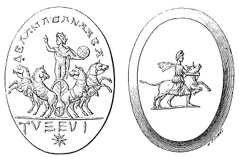

  
[Intangible Textual Heritage](../../index)  [Gnosticism](../index) 
[Index](index)  [Previous](gar21)  [Next](gar23) 

------------------------------------------------------------------------

[Buy this Book at
Amazon.com](https://www.amazon.com/exec/obidos/ASIN/B002BA5FIO/internetsacredte)

------------------------------------------------------------------------

  
*The Gnostics and Their Remains*, by Charles William King, \[1887\], at
Intangible Textual Heritage

------------------------------------------------------------------------

p. 156

### ST. AUGUSTINE ON GNOSTICISM.

The transition from orthodoxy to Gnosticism, in its last and most
elaborate phase is well pointed out by the following reminiscences of
St. Augustine, describing his own experiences. In his eighteenth or
nineteenth year he had begun to study the Scriptures, to satisfy himself
as to the truth of the religion in which he had been brought up.
"Consequently I set to work to study the Holy Scriptures, in order that
I might discover what was their true character. And to! I behold a thing
not discovered unto the proud, nor revealed unto babes; but humble in
gait, lofty in issue, and veiled in mysteries; and I was not such a one
as could enter therein, neither to bow down my neck unto the steps
thereof. For I did not think then, as I speak now, when I was studying
Scripture, but it seemed to me unworthy to be compared with the
sublimity of Cicero's eloquence. Nevertheless that Scripture was such as
should grow up together with babes, but I disdained to be a babe, and
being puffed up with pride I fancied myself a grown-up man. So it came
to pass that I fell in with men full of pride, dotards, too carnal, and
great talkers, in whose mouth is a snare of the Devil, and bird-lime
made up with a mixture of the syllables of Thy Name, and of our Lord
Jesus Christ, and of the Paraclete's, our Comforter the Holy Ghost. All
these names did not proceed out of their mouth except as far as the
sound and echo of the tongue go, but their heart was utterly void of
truth. And they used to repeat 'Truth and Truth,' and so did they repeat
her name to me, but she was nowhere amongst them, but they spoke false
things, not only concerning thee who art the Truth in truth, but even
concerning the elements of this world of ours, thy creation; concerning
which even the philosophers, who declared what is true, I ought to have
slighted for the love of Thee, O my Father, the Supreme Good, the Beauty
of all things beautiful. O Truth! Truth! how inwardly did the marrow of
my soul sigh after thee even then, whilst they were

p. 157

perpetually dinning thy name into my ears, and after various fashions
with the mere voice, and with *many and huge books* of theirs. And these
were the dishes upon which were served up to me who was hungering after
thee, nothing but the *Sun and the Moon*, thy fair works indeed, but not
thyself, and not even the *first* amongst thy works. For thy spiritual
works are before those corporeal works, however splendid and heavenly
they may be. But even for those, thy higher works, I hungered and
thirsted not, but for thee only, O Truth! wherein there is no change,
neither shadow of turning. And again there were set before me, in those
same dishes, splendid phantoms, than which it were even better to love
the Sun himself, for *he* was true as far as regards one's eyes, rather
than to love those fictions whereby the soul was deceived through the
eyes. And yet because I believed them to be Thee, I ate thereof though
not greedily, because Thou didst not taste in my mouth as thou really
art, for thou wert not those empty fictions; neither was I nourished
thereby, but rather weakened. Food in dreams is like to the food of one
awake, yet the sleepers are not fed by the same, for they sleep on: but
those dishes were not in any wise like unto Thee as thou *now* hast
spoken to me, &c."

 

   
FIG. 6.

[(\*)](gar71.htm#an_fig06)

 

------------------------------------------------------------------------

[Next: I. The Figured Representations of Serapis](gar23)
