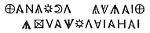
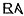
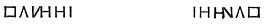
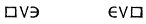
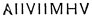

  
[Intangible Textual Heritage](../../index)  [Gnosticism](../index) 
[Index](index)  [Previous](gar34)  [Next](gar36) 

------------------------------------------------------------------------

[Buy this Book at
Amazon.com](https://www.amazon.com/exec/obidos/ASIN/B002BA5FIO/internetsacredte)

------------------------------------------------------------------------

  
*The Gnostics and Their Remains*, by Charles William King, \[1887\], at
Intangible Textual Heritage

------------------------------------------------------------------------

p. 245

### III. THE TRUE ABRAXAS GEMS.

Having in the preceding sections cleared the ground of the innumerable
usurpers of the title "Abraxas gems," we can conveniently proceed to
consider the wondrous Sigil, the invention whereof is universally
ascribed to Basilides himself. And for this [assumption](errata.htm#14)
there are very good grounds, for it is certain that such a Sigil never
occurs executed in a style that bespeaks a date anterior to the grand
heresiarch's, the first years of the second century.

This figure, which has given its name to the whole family, is designed
to represent the god "Abraxas," for so his name is written invariably on
the gems, although the Latin Fathers to suit the genius of their own
language have transposed the final letters. The etymology and *value* of
the name require a whole section to themselves, so deep are the
mysteries that they contain.

The purpose of the composition was to express visibly, and at once, the
365 Æons, emanations from the First Cause, whose number was probably
first suggested by its own numerical signification, and consequently the
figure may be taken as a speaking type of the *Pleroma*, the *one*
embracing *all* within itself, an idea fittingly embodied in a name
containing the sum of all its component powers. To shadow forth
therefore this grand doctrine, the image in question is a "Pantheus," or
combination of many discordant attributes expressing the amalgamation of
many different ideas in one and the same figure. Hence he is depicted
with the head of a *cock*, sacred to Phœbus, or else of a *Lion*, symbol
of Mithras and Belus; his body, *human* and clad in armour, indicates
his guardian power, for he is a Virtue Militant "putting on the whole
armour of God"; his legs are the sacred *asps*, types of the
Agathodæmon, likewise indicating *swiftness*; for in this way, says
Pausanias, was Boreas pictured upon the Coffer of Cypselus: in his right
hand he brandishes a *scourge*, the Egyptian badge of sovereignty; on

p. 246

his left arm a *shield*, usually emblazoned with some word of power,
declaring his perpetual warfare against the rebellious Angels, the "Gods
of death." Bellermann has proposed with much ingenuity an interpretation
of this Pantheus in the more spiritual sense better consonant with the
esoteric teaching of its inventor. According to him, the whole
represents the Supreme Being, with his Five great Emanations, each one
pointed out by means of an expressive emblem. Thus, from the human body,
the usual form assigned to the Deity, forasmuch as it is written that
God created man in his own image, issue the two supporters, *Nous* and
*Logos*, symbols of the inner sense and the quickening understanding, as
typified by the serpents, for the same reason that had induced the old
Greeks to assign this reptile for an attribute to Pallas. His head--a
cock's--represents *Phronesis*, the fowl being emblematical of foresight
and vigilance. His two hands bear the badges of *Sophia* and *Dynamis*,
the shield of Wisdom, and the scourge of Power.

This Pantheus is invariably inscribed with his proper name, **ΙΑΩ**, and
his epithets, **ΑΒΡΑΣΑΞ** and **ΣΑΒΑΩΘ**, and often accompanied with
invocations such as, **ΣΕΜΕΣ ΕΙΛΑΜ**, "The Eternal Sun";
**ΑΒΛΑΝΑΘΑΝΑΛΒΑ**, "Thou art our Father" (sometimes curtailed, but
generally so arranged as to read the same both ways); or **ΑΔΟΝΑΙ**,
"The Lord." [\*](#fn_143)

In all this a further relationship to the ancient idea of the Sun-god is
readily to be discovered. Phœbus, as the god of day, is similarly
furnished with a *whip*, and the *serpent*, according to the Egyptians,
hieroglyphically expressed his tortuous course through the Zodiac.
"Adonai" was the Syrian title of the Sun, whence *Adonis* or *Thammuz*
denoted that luminary at the winter solstice. Moreover, the Gnostic
epithets above are the very words composing that "short prayer," from
the use of which at all sacrifices Macrobius (I. 23) makes out that the
influence of the Sun is the Power supreme over all: "O Sun, Father of
All, Spirit of the world, Strength of the world, Light of the world!"
But the God adored under the name of

p. 247

\[paragraph continues\] "Abrasax" is
clearly shown by the Bosanquet jasper (more particularly described
elsewhere), exhibiting the Pantheus in the very car, and attitude of
Phœbus, and by the Alexandrian coin of Hadrian presenting Serapis
similarly engaged. That the latter was the Solar deity, all mythologists
were agreed; and this identity of action would lead one to suspect that
"Abrasax" was no more than the *mystic* name of the tutelary god of
Alexandria.

The older Chnuphis was occasionally (though rarely) erected with Abraxas
on the same talisman; an example of which is offered in one of the most
remarkable of the class ever brought under my notice. It was brought
from Bombay by a Jew (1874), and sold to M. Gaston Feuardent, whence it
came into the possession of the Rev. S. S. Lewis.

Red jasper of fine quality, 1¾ × 1¼ inch, with figure of Abraxas,
holding whip and shield, engraved in unusually good style upon the
convex face. Round the edge, beginning over the head, runs continuously,

 

at the back of the head, **Ρ**; under beak, **Ι**; over right shoulder,
  (probably *nexus* of
**ΑΒΛΑΝ**); across the field, each side of waist,

 

Again, across field on a level with his loins, on each side,

 

\[paragraph continues\] (perhaps *Eoia*,
"The Serpent," in Syriac).

\[paragraph continues\] Between the
serpent legs,

 

\[paragraph continues\] On the other side,
which is almost flat, is the Chnuphis Serpent, erect, with the Seven
Vowels inserted between the rays of his head. Across the middle of the
field,

**ΝΛ**        **ΕΙΧ** ("Thy God.")

\[paragraph continues\] Over his head,
three scarabei in a row; to the right, three goats, and three crocodiles
above each other; to the left, as many ibises and serpents so arranged.

------------------------------------------------------------------------

### Footnotes

[246:\*](gar35.htm#fr_144) Besides these
regular titles, others are occasionally used, of unknown import. Thus a
well-engraved Abraxas figure (John Evans) has over his head **ΒΙCΤΥC**,
below his feet **ΕΙCΙΤ**.

------------------------------------------------------------------------

[Next: Gnostic Plaque](gar36)
