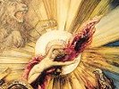

  
[Intangible Textual Heritage](../../index)  [Gnosticism](../index.md) 
[Index](index)  [Previous](gar36)  [Next](gar38.md) 

------------------------------------------------------------------------

[Buy this Book at
Amazon.com](https://www.amazon.com/exec/obidos/ASIN/B002BA5FIO/internetsacredte.md)

------------------------------------------------------------------------

  
*The Gnostics and Their Remains*, by Charles William King, \[1887\], at
Intangible Textual Heritage

------------------------------------------------------------------------

### IV. THE GOD ABRAXAS AS DESCRIBED BY THE CHRISTIAN FATHERS.

That the Pantheus upon our gems was really intended to picture forth the
deity styled "Abraxas" can be established by the indirect evidence of
many contemporary writers. Irenæus remarks of the Basilidans, that "they
use images, incantations, and all other things pertaining unto Magic."
Further on (xxiii.) he adds their custom of giving names to their
*images* of pretended angels. And, what bears more directly on the
subject, Tertullian (*Apol*. xvi.), after laughing at the god of the
heretics as "biforme numen" (evidently in reference to the serpent legs,
"biformes" being the classical synonym for the Giants similarly
equipped), then goes on to say, "They have taken unto themselves gods
with wings, or with heads of dogs or lions, or else *serpents from the
legs downwards*." Here we have unmistakeable reference to the Magian,
Egyptian, and Mithraic idols so common upon these talismans, and in the
last words to the serpent-legged and veritable Abraxas-god.

Lastly, Epiphanius, after stating that Basilides had taught that the
Supreme Being--out of whom proceeded Mind, Intelligence, Providence,
Strength, and Wisdom--was named Abraxas, proceeds to describe in what
manner the idea was embodied by

p. 251

the heresiarch: "Having taken their vain speculations, he and his
followers have converted them into a *peculiar and definite form*, as a
foundation for their own erroneous *idolatrous* and fictitious
doctrines." Further on he adds: "With respect to their 'Kavlacav,' what
person with any understanding would not laugh at their converting a
Hebrew word into a *bodily shape* in order to represent their idol; at
their personified Principalities; in a word, at their fondness for
*images*; whilst through these fancies they sow error in the minds of
the ignorant for the furtherance of their disgraceful and lying trade?"
Then proceeding, it would appear, to the analysis of the figure itself,
he exclaims: "It is a Spirit of deceit, which, like the playing upon a
pipe, leads the ignorant into many sins against the Truth. Yea, even his
*legs* are an *imitation of the Serpent* through whom the Evil One spake
and deceived Eve. For after the pattern of that figure hath the flute
been invented for the deceiving of mankind. Observe the figure that the
player makes in blowing his flute. Both he not bend himself up and down
to the right and to the left, like unto it (the serpent)? These forms
hath the Devil used to support his blasphemy against heavenly things, to
destroy with destruction things upon earth, to encompass the whole
world, taking captive right and left all such as lend an ear to his
seductions."

------------------------------------------------------------------------

[Next: V. ''Abraxas''--Etymology of](gar38.md)
