  
[Intangible Textual Heritage](../../index)  [Gnosticism](../index) 
[Index](index)  [Previous](gar42)  [Next](gar44) 

------------------------------------------------------------------------

[Buy this Book at
Amazon.com](https://www.amazon.com/exec/obidos/ASIN/B002BA5FIO/internetsacredte)

------------------------------------------------------------------------

  
*The Gnostics and Their Remains*, by Charles William King, \[1887\], at
Intangible Textual Heritage

------------------------------------------------------------------------

p. 280

### LEGENDS AND FORMULÆ.

Foremost in the rank of Words of Power stands the "Mystery of the Seven
Vowels," so important as to demand a separate section for its discussion
with befitting reverence. Though inferior to these, great no doubt was
the virtue of those interminable strings of letters that fill both faces
of many a Gnostic stone--later refinements upon the celebrated Ἐφέσια
Γράμματα, as Clemens aptly remarks. Amongst these interminable formulae
lurk, no doubt, those potent spells composed by Solomon himself; by
repeating which and at the same time applying to the sufferer's nose his
ring (under whose gem was placed the herb prescribed by the same oracle
of wisdom) the Jew Eleazar drew out through their nostrils the devils
possessing many people, in the presence of Vespasian, his tribunes and
chief officers. The sapient Josephus adds, that to make sure of the exit
of the diabolical occupant, the exorcist commanded him to overturn in
his flight a basin of water placed at a considerable distance, which was
forthwith done, to the consternation and conviction of all the heathen
spectators. The Ephesian Spell, the mystic words graven on the zone of
the Great Diana, were commonly used by the Magi of Plutarch's times for
the same purpose.

And there can be no doubt that such invocations were often efficacious.
Demoniacal possession was nothing more than epilepsy (its very name,
signifying *possession*, being derived from that same belief); for
Galen, after rationally discussing the natural causes of the malady,
remarks that the vulgar universally attributed it to the agency of
devils. Now our experience of Mesmerism (so far as there is any reality
in that pet science of charlatans) clearly shows what inexplicable
effects can be produced upon persons labouring under nervous derangement
by words of command authoritatively pronounced. How much greater the
effect of those words in old times, when uttered in an unknown tongue by
a person of imposing presence,

p. 281

and over patients already filled with the belief of his power to relieve
them! Hence the Casting-out of devils became the grand staple of their
trade with all the Thaumaturgists, both old and new, of the ages with
which we are dealing. That the cure should be permanent was a thing
perfectly immaterial, it sufficed the exorcist's purpose if the
manifestation of his power should be successful for the moment, to the
edification of the awestruck crowd of believers, and to the confusion of
the few *Rationalistic* doubters amongst the crowd.

Such spells gave power likewise over demons ranging about unconfined in
fleshly prison. Eucrates, in Lucian's amusing 'Philopseudes,' boasts
that he is so accustomed to meet thousands of them roving about, that he
has come not to mind them at all, more especially since "The Arabian has
given me a ring made out of the nail from a cross, and taught me the
spell composed of many *Names*." The last remark is valuable for our
purpose: it proves that the legends in an unknown tongue on our
talismans are sometimes to be explained from the Arabic, [\*](#fn_159) and also may consist of strings of
titles of the one deity invoked. Virgil's--

                        "Crines effusa sacerdos  
Ter centum tonat ore deos, Erebumque, Chaosque,  
Tergeminamque Hecaten, tria virginis ora Dianæ;"  
                                           (Æn. iv. 510)--

distinctly refers to the same superstition, for Servius explains these
"three hundred gods" in the spells of Dido's Massylian sorceress, as not
meaning so many *different* deities, but only so many *epithets* of
*Hecate* herself; whose very names he, for the same reason, fancifully
derives from the numeral ἕκατον. The same idea yet survives in the
religious exercise of the devout Moslem, the mental repetition and
reflection upon the Ninety-and-nine Arabic epithets of the One Almighty.

p. 282

The great object of these adjurations was to address the Deity by the
names under which he was known to all the nations of Earth; in this way
making sure of addressing him by the appellation wherein he most
delighted. This is the fundamental principle of, and sufficient
explanation of, the entire class of these talismanic legends; and of
their syncretism No. 10 of the 'Magic Papyrus' affords a most valuable
illustration. "I call upon thee that didst create the Earth, and bones,
and all flesh, and all spirit, that didst establish the Sea, and that
shakest the Heavens, that didst divide the Light from the Darkness;
Thou, the Great, Directing Mind, that disposest all things, Eye of the
world! Genius of genii (δαίμων δαιμονίων), God of gods, the Lord of
spirits, **ΙΑΩ ΟΥΗΙ**, hearken unto my voice! I call upon Thee, the
Master of the gods, O loud thundering Zeus, O sovereign Zeus, Adonai!
Lord **ΙΑΩ ΟΥΗΕ**! I am he that calleth upon thee in the Syrian tongue,
the great God Ζααλαηρ Ιφ φου; and do not thou disregard my voice in the
Hebrew language, Αβλαναθαναλβα Αβρασιλωα. For I am σιλθωχωουχ λαιλαμ
βλασαλωθ Ιαω Ιαω νεβουθ σαβιοθαρ βωθ αρβαθ Ιαω Ιαωθ σαβαωθ παγουρη
ραγουρη βαρουχ Αδωναι Ελωαι ιαβρααμ βαρβαραυω ναυ σιφ. O lofty-minded,
ever-living Crown of the world; containing all, Σιεπησακτι ετη βιου =
σφη = νουοι = σιεθυ = χθεθωνηρυγχ ΩΗΑΗΗΩΑΤ Α ΩΗΙΑΩ ασιαλ σααπηαλσω
εθμουρησινι σεμ λαυ λου λουριγχ. (This spell) looses fetters, causes
blindness (*i.e.* makes one invisible), procures dreams, gives favour,
for whatsoever purpose thou wishest."

One circumstance, very unaccountable, connected with these Inscriptions
is wherefore the *Pehlevi* character, the national writing of the Magi
in those times, should never be used in formulæ so often embodying the
doctrines of that profession. Neither are any complete legends to be
found written in *Punic*, although that character with the last
mentioned was at the time universally employed, in various
modifications, all over Asia and Africa. In the latter country Punic was
not superseded by Latin until a very late period of the Empire, for in
the second century Apuleius ('Apology') wishing to prove the neglect of
his stepson's education by the boy's uncle who had taken charge of him
(the family belonged to the large city Madaura in

p. 283

\[paragraph continues\] Numidia), declares
that though arrived at the age of sixteen he could speak nothing but
Punic and the little Greek he had picked up from his mother, "praeter
Punicè, et siquid adhuc a matre Græcissat." "And some years later, the
emperor Severus, a descendant of Hannibal's, had to blush for his sister
when she came from his native place Leptis to Court, "vix Latine
loquens." It is true the characters which, are often scattered over the
field of these gems have much the look of Punic; others again of
Palmyrene Syriac; whilst some are obviously the same with the strange
Nubian characters to be seen in abundance graven on the rocks at
Silsilis, upon the upper Nile. As for the square (modern) Hebrew, all
works presenting them are mere fabrications of the astrologers and
Rosicrucians of the 16th and 17th centuries. *Hieroglyphical* writing,
though naturally to be looked for in the manufacture of Alexandria,
hardly occurs at all; it is probable that even its modification the
Demotic had long before been superseded (in that capital at least) by
the Greek alphabet. The only exception known to me is the agate
published by Caylus ('Rec. d’Ant.' viii. pl. 8), presenting the common
four-winged Priapic genius in the sacred boat, the reverse bearing a
long vertical line of neatly cut genuine hieroglyphics. The Arabic
"Kamar" *Moon*, sometimes found in these formulæ, illustrates Pliny's
remark, that the Magi ordered the Name of the *Sun* or *Moon* to be
engraved on emeralds or amethysts, in order to convert them into amulets
against witchcraft, and giving success at Court. An emerald (Praun) of
very bad quality, however, inscribed **ΙΑΩ ΣΑΒΑΩΘ ΑΒΡΑΣΑΖ**, may
represent the very kind of amulet alluded to. But that Alexandria was
the grand *fabrique* of talismans is equally apparent to the
mineralogist from the *materials*, as to the archæologist from the
*lettering* employed in their construction. Nevertheless it still
remains unexplained why the Magi should not have written their own
spells in the character then solely current in the vast dominions of the
Sassanian kings.

The *language* of these inscriptions is never Latin, rarely Greek,
frequently Syriac, but most commonly corrupt Hebrew. For this choice the
sufficient reason is given by Iamblichus in a

p. 284

letter to Porphyrius, where he expressly states that, "The gods are well
pleased with prayers addressed unto them in the *Egyptian* or *Assyrian*
tongues, as being ancient and cognate languages to *their own*, and
moreover those in which prayer was first made unto them; and therefore
they have stamped as sacred the entire speech of those holy nations." It
is a singular coincidence that Justinus Kerner, in his extraordinary
work, 'Die Seherin von Prevorst' (in reading which one continually
fluctuates between the conviction of its being an impudent fiction, and
the uncomfortable suspicion that it may be a revelation of the
profoundest truth), assigns a similar reason for the writing used by the
visitant from the spirit-world so greatly resembling Arabic, "because
*that* had the best claim to be considered the primitive language of
mankind." This "Seer" was a peasant girl, worn out by long sickness to
that degree as to belong more to the next world than to this.
Consequently she had become sensible of the presence of spiritual
visitors, and acted as a medium of communication between them and those
in the flesh. Kerner, a physician, took her into his own house the
better to observe these singular phenomena, and kept a regular diary of
her health and of her disclosures during several months until her death,
with a minuteness of which only a German is capable. He writes evidently
in all good faith, and, amidst heaps of nonsense, puts down some
startling occurrences beyond the flights of forgery and confirmed by
one's own experience.

But as concerns the "Language of the other world," in every country
"Opine ignotum pro magnifico" has ever been the maxim of priestcraft,
the soundness of which has been demonstrated by the experience of all
time. More particularly does this apply to forms of prayer. Thus
Orpheus:

"Then whilst the cauldron bubbles o’er the flame,  
 Address each godhead by his mystic name;  
 Full well th’ immortals all are pleased to hear  
 Their *mystic names* rise in the muttered prayer."

Of such mystic invocations it will be advisable to adduce examples from
writers contemporary with their use, before proceeding to the
consideration of actual remains of similar nature. Of the numerous
specimens cited, the following are the

p. 285

most noteworthy. The 'Pistis-Sophia' (§ 358) makes the Saviour "standing
upon the shore of the sea, the ocean, call upon God with this prayer,
saying, Hear me, O Father, thou Father of all fatherships, Infinite
Light, Αενιουω Ιαω Αωι ωια ψινωθερ θερινωψ νωψιθερ ζαγνουρη παγουρη
μεθμομαωθ νεψιομαωθ μαραχαχθα θωβαρραβαθ θαρναχαχαν ροροκοθορα Ιεου
Σαβαωθ." And again (§ 375) in this valuable description of the gnostic
Sacrament: "Then said Jesus, bring me fire and vine-branches. And they
brought them unto him, and he, placing upon them an offering, set two
vessels of wine, the one on the right, the other on the left of the
offering. He set before them the offering: he put also a cup of water
before the vessel of wine which was on the right hand, and he set a cup
of wine before the vessel of wine that was on the left; and he set
loaves of bread, according to the number of his disciples in the middle
between the cups. He set likewise a cup of water behind the loaves. And
Jesus, standing before the offering, made all the disciples to stand
behind him, being all clothed in linen garments, having all of them in
their *hands the number* [\*](#fn_160) *of the
Name* of the Father of the Treasury of Light. And he cried aloud,
saying, Hear me, O Father, Father of all fatherships, Boundless Light,
Ιαω Ιουω Ιαω αωι ωια ψινωθερ θερινωψ νωψιθερ νεφθομαραχθα ιηαναμεναμαν
αμανηι of heaven! Ισραι αμην αμην σουβαι βαι αππααη αμην αμην δερρα αραι
απαοι αμην αμην σασαρσαρτου αμην αμην κουκαιμην μαι αμην αμην ιαι ιαι
τουαπ αμην αμην μαινμαρι μαριν μαρει αμην αμην αμην." Again Irenæus
copies out a formula "couched in Hebrew words, to inspire greater awe
into the Gallic neophyte (at Lugdunum)," as used by certain Gnostics
there in administering baptism: βασσεμα χαμοσσε βα αιανομα ματαδια
ρουαδα κουστα βαβαφορ κολαχθαι, "I invoke Thee, Supreme over every
virtue, the Light of the Father by name, the Good Spirit, the Life,
because thou hast reigned in the body." Another of their formulæ
was--Μεσσια ου φαρεγ ναμεμψαιμεν χαλδαιαν μοσεμεδια ακφραναι ψαουα Ιησου
Ναζαρια. "I do not separate the Spirit, the Head, and the Supercelestial

p. 286

\[paragraph continues\] Virtue, the
Merciful One. May I prosper in thy name, O Saviour of Truth."

But as regards the expression of divine mysteries by means of letters of
the alphabet, Marcus stands pre-eminently first amongst the Gnostics, as
the following extracts from his "Revelation" will conclusively attest.
"The supreme Tetrad came down unto me from that region which cannot be
seen nor named, in a female form because the world would have been
unable to bear their appearing in a male figure, and revealed to me the
generation of the universe, untold before either to gods or men. When
first the Father, the Inconceivable, Beingless, [\*](#fn_161) sexless, began to be in labour he
desired that his Ineffable should be born, and his invisible should be
clothed with form. He therefore opened his mouth and uttered the Word
like unto himself. This word standing before him showed that he was
manifesting himself as the form or type of the Invisible One. Now the
uttering of the Name came to pass in this wise. He (the Supreme) spake
the first word of his name, the which is a syllable of *four* letters.
He then added the second syllable, also of *four* letters. Then the
third, composed of *ten* letters. Finally the fourth, made up of
*twelve* letters. Thus the utterance of the whole name consists of
*thirty letters*, and of *four syllables*. Each letter has a
form-pronunciation and writing of its own, but neither understands nor
beholds that of the whole Name; nay, not even the power of the letter
standing next to itself. Now these sounds united make up the Beingless
unbegotten Æon, and *these* are the Angels that always behold the face
of the Father. Thus the Father knowing himself to be incomprehensible
gives unto each of the letters, called Æons, its own proper sound,
inasmuch

p. 287

as none of them singly is competent to utter the entire Name." [\*](#fn_162)

The substance of the revelation brought down to Marcus by Truth is to be
found in the Kabbala, which makes the mystic names of God to consist of
four, twelve, forty-two and seventy-two letters respectively. The
Kabbalists go so far as to assert that the forty-two victims offered by
Balaam in order to obtain a favourable response, were consecrated to one
of these great names. If indeed Moses was learned in all the wisdom of
the Egyptians, the magic virtues of numerals would have formed an
essential part of his learning, as we see from the doctrine of
Pythagoras, confessedly derived from Egypt. It looks very much like as
if the framers of the genealogy of Jesus had the same object in view,
when they forced the generations to the required number by omitting
*three* of the kings in the second division, being able to deal with the
*third* in whatever manner they pleased. On counting the number of the
vowels that evidently have some deep purpose in occurring without
consonants on so many talismans of the age of Marcus, we should, I
expect, often find it tally with that of one or the other of these Holy
Names. [†](#fn_163)

A subsequent revelation of the same Tetrad to Marcus, serves to account
for the frequent appearance of the naked woman, the Venus Anadyomene of
earlier times, upon Gnostic monuments. "After having declared these
things, the Tetrad added: I will shew unto thee *Truth*, whom I have
brought

p. 288

down from the celestial mansions that thou shouldest behold her naked,
acknowledge her beauty, hear her speaking, and be astonished at her
wisdom. Look up therefore at her head Α and Ω, at her neck Β and Ψ, at
her shoulders with her hands Γ and Χ, at her breasts Δ and Ρ, at her
chest Ε and ϒ, at her back Ζ and Τ, at her belly Π and Σ, at her thighs
Θ and Ρ, at her knees Ι and Π, at her legs Κ and Ο, at her ankles Λ and
Ξ, at her feet Μ and Ν. This is the body of Truth, this the form of the
letters, this the character of the writing. Whereupon Truth looked upon
me (Marcus) and opened her mouth, and uttered a word, and that word
became a Name, a name which we know and speak--Christ Jesus: and having
named him she held her peace." [\*](#fn_164)

This "figure of Truth" is made up, it will be perceived, by taking
successive *pairs* of letters from each extremity of the alphabet;
perhaps, thereby constituting them male and female, and thus making them
types of so many Æons. All this suggests a rational question, whether
the primary application of the name "Logos" to the Divine Emanation, was
not at first a mere interpretation of the Rabbinical Synonym "Name, or
Word," the respectful substitute for the ineffable Name Jehovah, the
*Shem Hak Kodesh*; and that later, the secondary meaning of *Logos*,
"Reason" suggested to the Platonising Jews of Alexandria its analogy to
their own Sophia-Achamoth, the first-born of the Supreme Cause. And
finally, the composition of this Holy Name, extending to *thirty*
letters, illustrates the purport of that interminable polysyllabic title
which runs either in one unbroken circle, or sometimes in the outline of
an erect serpent, around the margin of so many Gnostic gems, and
circumscribes the mystic device engraved in the centre. In the latter
arrangement of the inscription, one is tempted to recognise that "Good
and Perfect Serpent" of the

p. 289

\[paragraph continues\] Naaseni--that
Messias whose visible type in the heavens their eyes, sharpened by
faith, discovered and adored in the Constellation *Draco*.

To come now to the actual remains of Gnostic manufacture, which preserve
to us formulæ of the nature just considered, the most important, to
judge from its frequent occurrence, and the evident care bestowed upon
its engraving, is the one here transcribed. My copy is taken from an
example formerly in the State collection, [probably](errata.htm#18) the
finest talisman known. It is a thick plaque, somewhat heart-shaped, of
dark garnet, 2¾ x 1½ inches in its greatest dimensions, bearing on the
one side 14 lines, on the other 11, neatly cut in the Greek character in
the third century but making no distinction between the Α and the Λ.

 

<table data-border="0">
<colgroup>
<col style="width: 33%" />
<col style="width: 33%" />
<col style="width: 33%" />
</colgroup>
<tbody>
<tr class="odd">
<td data-valign="top">
<em>Obverse</em>.

 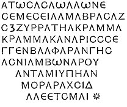 <a href="#fn_165">*</a>
</td>
<td data-valign="top">
              
</td>
<td data-valign="top">
<em>Reverse</em>.

 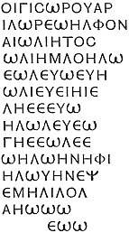
</td>
</tr>
</tbody>
</table>

 

\[paragraph continues\] Amongst the titles
on the obverse several familiar names may be detected, such as *Alon*,
*Shemesh Eilam*, *Abrasax*. The long style filling the fourth line is
clearly the correct spelling of the abbreviated *Agrammaeamereg*
addressed in another part of the "Prayers of the Saviour," as the first
of the "Invisible Gods." The next line *Shemgensalpharanges*, "they who
stand before the mount of Paradise," can be no other than the Æons just
described by Marcus as the "Angels who always behold the Father's face":
whilst in this Jewish hierarchy of heaven the old god of Egypt, Anubis,
oddly intrudes himself under his Coptic title of *Ambo*.

p. 290

Both inscriptions agree literally with those upon the large oval
calcedony figured by Chiflet (fig. 69) except the addition in the letter
of a few words inclosed within a coiled serpent placed at the top of the
obverse. Out of these inscriptions his friend Wendelin, by taking the
language as good Greek, had contrived to elicit a most orthodox
invocation to the Trinity, which however was evidently far from
satisfactory to the sceptical and more sagacious Canon. Amongst the
Townley gems is a large sard, agreeing in all except a few letters with
Chiflet's specimen--convincing attestation to the supposed virtue of the
formula. For the purpose of comparison I insert another, lately
discovered, engraved on a much more minute scale than any of the
preceding (Whelan's copy).

   
Dark red agate, 1 x 7/9 in.: sent me by Mr. Whelan, Nov. 25, 1881.

Doubtless such immense and overcharged pieces of mystery served in their
time the purpose of pocket prayer books, out of which the owner recited
the due invocations at the sacred rites. To some such *manual* of
devotion, the pseudo-Orpheus possibly alludes by

"Pray, with the flowered *Petraces* in thy hand,  
 When hecatombs before the altar stand."

The Orientalist desirous of exercising his ingenuity upon the
decyphering of these, for the most part unexplained monuments will find
an immense collection of them in Raspe (Nos. 433-633) copied with
scrupulous accuracy. The reason he there gives for the attention he has
paid to a class previously so

p. 291

neglected is a very sound one. "All these sects have evidently borrowed
their *symbols*, and probably also their respective explanations, from
the iconology and mysteries of the Egyptians and other nations of the
East. If as regards the meaning of hieroglyphics and symbols they had no
better information, the Gnostics of Egypt and Syria had at least
national tradition to depend upon--a point assuredly of some weight. If
therefore the more recent sects of Gnostics with their symbolical
learning have established new opinions and fresh modifications of
religion upon the basis of the old, we are not therefore to conclude
that they knew nothing about, and wantonly gave a new meaning to, the
symbols which they thus misapplied. This is the only rational point of
view in which these amulets and engravings ought to be studied."

Raspe's collection I shall now proceed to supplement by copies of
several unpublished examples--the most interesting that have come under
my notice in a long course of study, and such as serve best to
illustrate the theories proposed in the foregoing pages. And to show the
curious and puzzling nature of the whole class, they often present the
critical examiner with signs and *siglæ*, now supposed the exclusive
property of national religions, the most diverse from one another, as
they were remote from the recognised metropolis of Gnosticism.
Intermingled with the regular Greek characters appear strange signs
analogous in form, often identical with, the Caste-marks of the Hindoos,
and which in their turn became the parents of those used by the mediæval
alchemists and Rosicrucians, and (during the same ages) of the true
professors of Masonry. The consideration of these *Sigla*, of which I
have collected a large series belonging to all ages and countries, has
proved sufficiently fruitful to supply materials for a separate and
important subdivision of this Treatise. One example, described under
"talismans and amulets," presents unmistakeable evidence of the use of
*Runes* in the Alexandrine studio, whilst another, shortly to be
noticed, demonstrates that the Gnosis may dispute with Hibernia her
supposed peculiar invention of the mysterious *Oghams*.

A tablet of aquamarine (?) communicated to me by the

p. 292

\[paragraph continues\] Rev. Greville
Chester, bears the inscriptions in well-formed characters

*Obverse*.

 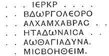

*Reverse*.

 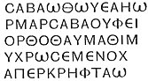

*Extremity*.

 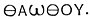

\[paragraph continues\] A string of titles
ending with "Lord of hosts! defend me."

 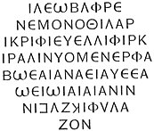

Sapphirine calcedony, the size of a pigeon's egg.--(Forman Collection.)

The concluding word φύλαξον, "Do thou protect," clearly evinces that
this elegantly engraved invocation was addressed to some *one* deity
rejoicing in many titles, and styled "propitious" by its opening ἰλέω.

 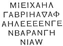

A very thick stone of sapphirine calcedony. This is purely Jewish,
perhaps the ware of some "Magna sacerdos arboris" sold to the Roman
ladies, for it puts the buyer under the

p. 293

protection of the Archangels. "Michael, Gabriel, Raphael, who stand
before the Mount of Paradise of Jehovah."

A remarkable exemplification of the mixture of two opposing creeds is
found in the **ΟΡΩΡΙΟΥΘ**, "Light of lights," accompanying the figure of
a globose vase with bands hanging from the neck. This is evidently "the
small golden vessel shaped like a cow's udder, containing the libations
of milk" mentioned by Apuleius as carried in the Isiac procession by the
same official who bore aloft the Hand of Justice. The *gridiron*-like
object often laid upon it, is the regular Egyptian door-key, made of
wood. In one example figured by Matter (Pl. vi. 6), the key is shown of
the regular *Roman* form in the same position, which places the meaning
of the more usual figure entirely out of doubt. This shows the reason
for κλειδοῦχος, "the keybearer," being a priestly title.

Other types purely Egyptian, offer some curious improvements upon the
old "qualia demens Ægyptus portenta colat." For example, one (Praun)
exhibits Anubis, but now equipped, with two heads and four hands holding
torches and daggers; styled on the reverse
**ΠΕΡΑ**--**ΑΜΒΟ**--**ΥΒΑΚΑ**--**ΚΞΙΚ**--**ΥΚ**. In another (Nelthropp)
the Cat-headed goddess, Taf-Neith stands lotus-crowned, and is addressed
as **ΚVΧΒΑ**--**ΚΥΧΒΑ** [\*](#fn_166)--**ΚΑΧΥΑ**--**ΒΑΖΑΚΑΧ**--**ΚΧ**. Again
Anubis with the superadded heads of Pan (*Mendes*) and a cock (*Phre*),
with arms outstretched in the form of a cross; his body supported upon
the legs of an ibis, has over the heads respectively written the
initials **Θ**, **Π**, **Χ**. On the reverse
**ΛΙΗΒ**--**ΩΠCΧ**--**CVΝΟ**--**ΧΡΑ**. But the most curious composition
of this nature known to me is presented by a large elliptical mottled
jasper, measuring 1⅛ + 1¾ inch, very boldly cut, and better drawn than
usual--apparently a Solar talisman (Mr. Topham, Rome). The obverse shows
a *gryllas* in the outline of a cock having the head of Pan, scorpions
for tail-feathers, and the whip of Sol stuck in his rump to complete
that appendage, standing upon a serpent--overhead are the sun-star and
crescent, on his back rests a tailed globe (a comet?) in front **Α**, in
the field below the astral *siglæ*. On the reverse, **ΟΓ** (73?) over

p. 294

the Agathodæmon serpent uncoiled, and crawling, a star and **Α**. Below
the serpent, **ΕΔΩΓ ΗΙΗΩ**, the letters inverted, then another line
**ΗΙVΟΜCΟΙ**. Below this again the triple **S** on the bar that always
accompanies the Agathodæmon, **ΙΑΗΙΕΩ**--**ΙΕΟVΩΗ**, reading thus in the
impression. In the last word "the Great Ιεου"--special title of the
Supreme Being in the Pistis-Sophia may easily be detected; whilst the
triple-headed deity previously described, very probably expresses the
conception of those mighty Τριδυνάμεις θεοὶ, who play so important a
part in the theology of the same book of wonder.

The following examples are the more genuine offspring of the Kabbala,
consisting of letters alone, uncontaminated by the presence of the idols
of Misraim. First for beauty of material and engraving stands a large
*citrine* (occidental topaz) formerly in the Praun cabinet, now in the
Gnostic Series, British Museum.

On one side is an oval enclosing **ΗΙ** (perhaps denoting the Ogdoad and
Decad, the base of Marcus’ scheme; see Hep. vi. 52); an eye, emblem of
Osiris, a square bisected, and **Δ**, which last letter may also
numerically represent the Tetrad of the same Doctor.

The other face of the gem presents,

 

The next is a legend which, with trivial variations, frequently occurs.
Caylus (VI. Pl. 11) gives it very rudely added, upon the reverse of a
female portrait. The present copy is from a large calcedony, somewhat
coarsely executed, having on its other face the triple **S** and bar
(Praun)--

 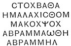

The Hebrew Patriarch figures in this legend, and in many more of the
same kind, as the divinely inspired founder of a

p. 295

\[paragraph continues\] Gnosis, a
reputation he enjoyed even amongst the heathen, who put him in the same
category with Orpheus, first institutor of Mysteries. "Sev. Alexander in
larario suo--omnes sanctiores in quibus Apollonium, et (quantum scriptor
horum temporum dicit) Christum, *Abraham*, et Orpheum, et ejusmodi
cæteros habebat." (Lampridius 29.)

To the same family belongs a yellow jasper. (Maskelyne) displaying a
*perforated* quatrefoil over the name **ΙΑΩ**, then the mystic vowels
**ΑΕΙΗΟΥΩΑΙ**, then **ΓΑΒΑΩΘ** (*sic*) and on reverse  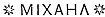. The quatrefoil is originally
the symbol of Sitala, the Tenth Trithakoor, or deified Jaina saint;
whence it found its way along with the other Buddhistic machinery, into
Mediæval symbolism, in which it resembles an angel. [\*](#fn_167)

Very remarkable on account of its adjuncts, is a green jasper (Praun)
bearing a long neatly-cut legend, the central portion of which is
circumscribed by two lines, cut by short strokes at different angles,
exactly after the fashion of the Irish Oghams. In the latter, as is well
known, all the letters of the Roman alphabet are represented by the
different positions of very short lines in relation to one continuous
line in the middle; and it is impossible to imagine any other purpose
subserved by the similar contrivance on our talisman. The Ogham is
*supposed* to be an invention of the first missionaries to Ireland, it
was used as late as the Civil War by Lord Glamorgan in his
correspondence with Charles I. It is, however, very possible that the
monks carried this simple stenography from Rome to their Celtic
mission. [†](#fn_168)

 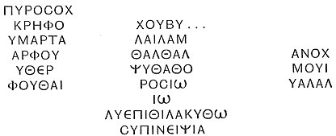

p. 296

A minute figure of Abraxas, green jasper (Praun) takes a new title
"Abrachars" in the invocation **ΑΒΡΑΧΑΡC**--**ΑΓΡΑΩΑ**--**ΩΑΡΙΩΝΙΕ**.

Thoth's caduceus within a wreath, is accompanied by the legend on the
reverse **ΑΚΡΙΩΦΙ’** on a brown calcedony in my collection.

Of all Agathodæmon talismans, no more elegant specimen has come to my
knowledge than a large emerald-like plasma (Bosanquet) displaying the
serpent "the Good and Perfect One" erect above his invariable
concomitant sigla, and whom the reverse propitiates by the beautifully
cut address
**ΟCΟΡ**--**ΜΕΡΦ**--**ΦΕΡΓΑΜΑΡΑ**--**ΦΡΙΔΥΡΙC**--**ΧΝΟΥΦΙC**--**ΝΑΒΙC**--**ΚΙCΝΥΘ**.
True green jade, very convex on back (Rev. S. S. Lewis.) In the field,
each side of serpent  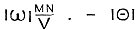.
"With me, with me?" in pure Chaldee. Reverse in two lines, round the
usual symbol.

 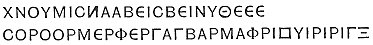

\[paragraph continues\] All cut with
unusual precision and neatness of work. The legend has many words in
common with Mr. Bosanquet's plasma.

Jerome's "Pater Bromius" of the Mithraic Cave has probably some share in
the title "Sabbaoth," so often coupled with "Adonai," for Bacchus
rejoiced in the epithet "Sabazius," derived from the shout "Sabbaoi"
raised by the celebrants of his Orgies--a word identical with the Hebrew
"Sabi" *glory!* Certain sectaries of our own day who bellow out the same
word at their "Revivals," are little aware what an ancient and congenial
authority they have for their vociferation.

"Adonai," *our Lord*, is converted by the Greek into Adoneus, a synonym
for Pluto, and Orpheus, as already quoted, points out the identity of
Bacchus, Pluto, and Sol. This is the foundation for the ancient
exposition of the Syrian rite, the Mourning for Adonis ("The women
weeping for Thammuz") as really applying to the sun's loss of power at
the winter quarter. *Adoneus* or *Aïdoneus*, becoming interpreted
according to Greek etymology, was supposed to signify him "that walketh
unseen," whence spring the "helmet of Adoneus," that rendered the

p. 297

wearer invisible; and Catullus's application of the title to the
intrigue-loving Cæsar.

"Perambulabit omnium cubilia  
 Ut albulas columbas aut *Adoneus*."

The same Adonis had the name "Sal-Anbo" (which often occurs in Gnostic
legends) as appears from the statement in Lampridius, "that Heliogabalus
exhibited *Salanbo* with all the lamentation and tossing of head proper
to the *Syrian* ceremony,"--whereby he gave the omen of his own
impending fate.

The Delphic **Ε** has already been noticed--but its importance demands
further particulars of its history, which have been preserved by
Plutarch in his curious treatise upon the subject. The Greeks with their
usual fondness for explaining all mysteries *rationistically*,
considered the letter as the simple numeral, *Five*, set up in the
Temple to denote the original and proper number of the far-famed "Wise
Men;" but which in later times had been raised to *seven*, by the
addition of two more who had small claims to the honour. The legend went
that these Five Wise Men, to commemorate the accidental meeting of them
all in Delphi at the same festival, had dedicated the numeral carved in
wood, which, decaying through age, the Corinthians replaced by a
facsimile in bronze; which last was finally transmuted by Livia Augusta
into another of *gold*, as more consistent with the dignity of the god
of the place, whose son her husband claimed to be, and whose received
image he represented in his features.

Others, more profoundly, interpreted the letter as representing by its
proper sound in the Greek alphabet the declaration Εἶ "Thou art" as
addressed to the Godhead--thus making it equivalent to the title ὁ ὦν,
"the living God," so frequently given to Jehovah.

But it is much more consistent with the simplicity of antique times, to
understand the figure as merely standing for the number *Five*, a number
sacred for *itself*, not for its reference to the fabled sages of a
later period. The idea of its virtue may have come from an Indian
source, where it is the cause of the five-headed shape assigned to
Brahma. From India it would find its way to

p. 298

\[paragraph continues\] Delphi in company
with the Gorgon-heads, themselves masks of Bhavana the Destroyer, which
guarded the actual oracle--a singular connexion, noticed by Euripides in
his 'Ion.' But it should be remembered that the Hyperboreans, reputed
founders of the Oracle, were placed between the Caspian and the
frontiers of India. The *Omphalos* itself "shaded with garlands, and
encompassed with Gorgons" was no other than the Brahminical *Lingam*, as
its figure demonstrates, whether as repictured in the early vase
paintings when embraced by Orestes seeking sanctuary there from the
pursuing Eumenides, or with Apollo seated thereon, stamped on the money
of the Seleucidae--direct descendants of the god. In form reduced to an
obtuse cone, the emblem had nothing obscene in appearance, its hidden
meaning being a matter of revelation to the initiated few. The same
conically-shaped stone was the solo representative of Venus in her most
ancient temples--Paphos for example. Again that earliest of all statues
of Apollo, the Amyclæan, described by Pausanias, was a veritable Hindoo
*Lat*--a bronze column 50 cubits high, to which later art had added a
head, hands holding bow and spear, and *toes* (ἀκροι πόδες). But his
throne, in the middle of which the idol *stood* erect, was an
after-thought of the best times of Greece, covered with elaborate
figures and reliefs, the work of Bathyeles, or of Myron, with his
scholars.

And in truth this very lunar-shaped 
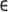 seems to belong to the same class of Indian importations,
and to have been originally a mere Caste-mark--indeed, if placed
horizontally  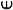, it becomes
at once the badge of the sectaries of Vishnu. What strongly confirms
this explanation is the fact, that this symbol had been consecrated at
Delphi many centuries before that shape of the *letter* came into the
Greek alphabet--a change only dating from the age of Antony and
Cleopatra, upon whose modals, struck in Asia Minor, the lunar-shaped
  is first observable.

In the earliest dawn of Grecian philosophy we find Pythagoras [\*](#fn_169) building his whole system upon the
mystic properties of

p. 299

\[paragraph continues\] Numbers, and
declared by tradition to have been taught the science in Egypt; nay
more, Plato himself has penned in his Republic a certain section in the
same line, worthy of any Alexandrian Kabbalist. In our own day, with the
Sikhs to hold a "Punch," or council of Five, was the formal mode of
deliberating upon all matters of State. And inasmuch as the most serious
things have a ludicrous side, this sacred Numeral only preserves its
reputation amongst ourselves from haying given the name to the
well-known beverage, by reason of the *five* ingredients that go to its
concoction--perhaps too, because its brewing was the inevitable result
of the coming together of the same number of Englishmen in the times
when our language was enriched by so many loans from the
Hindostanee. [\*](#fn_170)

A remarkable feature in the theogony of Valentinus is curiously
illustrated by a Praun Calcedony, elegantly engraved, and mounted in a
gold frame by some later Oriental owner, who justly deemed the gem a
talisman of uncommon power. "The Father at last sent forth a mighty Æon,
called the Cross, and who contained within himself all the other thirty
Æons. The same was likewise denominated *Terminus*, inasmuch as he
served for *Boundary* between the Fulness (*Pleroma*) and the Deficiency
(*Hysteroma*)." Our gem presents the Egyptian Tau, as a Deus Terminus,
topped with a human head, and surrounded by a continuous legend composed
of vowels interspersed with rare consonants; probably expressing the
thirty Æons contained within the sigil's self. On the base of the
Terminus is the legend **ΝΙΧΑΡΟΠΛΗC**, often occurring on talismans. The
same words are found at the foot of a cruciform trophy, above which is
the Christian **Χ** upon a stone in the French Cabinet (No. 2222) also
followed by **ΙΩΑ** upon the back of a gem (*silex*) published in the
'Göttingische Anzeiger,' Nos. 35 *a*, *b*, which clearly emanates from
Mithraic notions, for it represents the usual lion-headed, serpent-girt
man, a torch in one hand, in the other a sword, serpent, and crown of
victory, soaring aloft from the back of a lion, under which lies a
prostrate corpse.

p. 300

A very curious instance of the employment of Gnostic figures in the art
of Medicine is offered by the stone which Matter has published (Pl. II.,
C. 4). The obverse displays the Agathodæmon serpent placed between Phre
(Sol) and a female in the act of adoration. Overhead are the mystic
Vowels; below the undershaped vase, already noticed, placed upon a low
altar, the whole encompassed by a legend in some unknown tongue. But the
other side explains in lucid Greek the object of the composition.
**ΤΑCCΟΝ ΤΗΝ ΜΗΤΡΑΝ ΤΗC ΔΕΙΝΑ ΕΙC ΤΟΝ ΙΔΙΟΝ ΤΟΠΟΝΟΤΟΝ ΚΥΚΛΟΝ ΤΟΥ
ΗΛΙΟΥ**, "Place the womb of such or such a one into its proper region,
**Ο**, the circle of the sun." Matter, in his explanation, has fallen
into a ludicrous mistake, by interpreting μητρὰν as μητέρα he converts
the words into a prayer for the soul of the mother of a certain Dina!
But the real translation shows that the gem was made for *any*
purchaser, to be worn as a preservative against the "prolapsus uteri," a
female complaint very common in ancient times, owing to the abuse of the
hot bath, so relaxing to the internal muscles, and also to the general
employment of "abortiva," whenever thought desirable. In fact the very
definite expression of the object, **ΜΗΡΙΚΟΝ**, *uterine*, is found on
other gems, and places the correctness of the attribution of the former
one quite out of doubt.

The "circle of the sun" means the *navel*, which marks the natural
position of the organ concerned, for the navel in the microcosm was
supposed to [coincide](errata.htm#19) with the sun in the universe. This
idea produced the far-famed hallucination of the Byzantine anchorites,
respecting the mystical Light of Tabor, which shone upon the devotee in
virtue of long-continued fasting, and. unintermitted fixing of the eyes
upon the region of the navel, whence at length it streamed forth, as
from a focus, the "true creation of an empty brain and an empty
stomach." [\*](#fn_171)

p. 301

Another circumstance bearing upon this employment of the sigil is that
Isis, the peculiar goddess of maternity, is often figured in Roman
sculpture, holding up in her hand a conical object, pouch shaped,
exhibiting a triangular orifice. This object some have taken for the
Persia plum; much more probably does it represent the organ in question,
the most natural and expressive symbol of that divinity's peculiar
function. In her mystic coffer were carried the distinctive marks of
both sexes, the *lingam* and *yoni* of the Hindoos. Their Isis, Parvati,
who in this character takes the name of *Deva* "the goddess"
pre-eminently, bears in her hand for distinctive badge the yoni, or
bhaga, often a precious stone carved into that shape. Similarly her
consort, Siva, carries the [lingam](errata.htm#20) or phallus. For
example, the Nizam's diamond, the largest stone of its kind known
*certainly* to exist, exhibits evident traces of the native lapidary's
clumsy endeavours to reduce the native crystal to the proper shape for
the hand of the great goddess. Ugly omen to happen under a female reign,
this diamond was accidentally broken in two just before the outbreak of
the Sepoy revolt.

Deva's Mark, as borne upon their foreheads by Parvati's sectaries, is
formed by three strokes, the two outside white or yellow, the centre
always red. It is interpreted as representing the womb, *methra*, of
Bhavani (another of Parvati's names) out of which proceeded all that
exists. The close relationship between the Egyptian and Hindoo goddesses
cannot fail to strike the observer; Isis carries the very same
attributes with Parvati--the kid and cobras--upon the
talisman--published by Caylus (IV., Pl. 16). But the Egyptian goddess,
having but one pair of hands, is forced to clasp in each the several
attributes borne singly by her many-handed Indian prototype.

A singular union of two contrary deities in one body, is presented by a
hematite (Praun), representing Anubis, who, besides his proper jackal's
head, is equipped with another, maned on the neck, and unmistakably that
of an ass; as Typhon, [\*](#fn_172) the evil
one, was depicted; moreover, one of the feet,

p. 302

too, of the figure is clearly *hoofed*, so as to leave no doubt as to
the ownership of the second head. The same discordance of characters is
still further set forth by what he bears in his hands, the two of Anubis
holding up *torches*, the two of the malignant Typhon, *swords*. This
odd combination probably expressed the same idea as did the Anubis seen
by Apuleius, who exhibited at one time a face black as the night, at
another golden as the day, in order to express his functions exercised
both in heaven and in hell. The reverse bears an inscription containing
the Coptic name of the god,
**ΠΕΡΑ**--**ΑΜΒΩ**--**ΥΒΑΙΑ**--**ΚΞΙΚ**--**Λ**.

 

 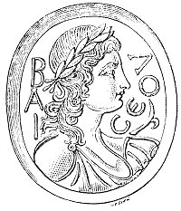  
FIG. 13

[(\*)](gar71.htm#an_fig13)

 

------------------------------------------------------------------------

### Footnotes

[281:\*](gar43.htm#fr_160) In fact, the
"unknown characters" sometimes occurring in the field of these talismans
are unmistakeably Himyaritic letters, belonging to that primitive
alphabet of Arabia. Osiander and Levy have published gems bearing
intagli, of good execution, of Persian deities (therefore long anterior
to Gnostic times), and neatly engraved Himyaritic legends. This
character is perfectly vertical, handsome, and well defined in its
differences; it is a modification of the Palmyrene, and the parent of
the modern Ethiopic.

[285:\*](gar43.htm#fr_161) Meaning, perhaps,
having their fingers arranged so as to express this number; for Pliny
mentions a very *old* statue of Janus displaying the fingers in such
manner as to indicate his own *numeral*, that of the days in the year.

[286:\*](gar43.htm#fr_162) The Kabbalistic
"En-Soph." In this *boundlessness*, or as the En-Soph, God cannot be
*comprehended* by the intellect, nor described by words, for there is
nothing that can grasp or define Him to us; and as such He is a certain
sense *non-existent*, in because as far as our minds are concerned that
which is perfectly incomprehensible does not exist. To make this
existence perceptible, and to render himself comprehensible, the En-soph
had to become active and creative. But the En-Soph cannot be the direct
Creator, for he has neither will, intention, desire, thought, language,
nor action, as these properly imply *limit*, and belong to finite
beings, whereas the En-Soph is Boundless."

[287:\*](gar43.htm#fr_163) This is a regular
Talmudic notion as the Rabbins propound. "At first the Name of *twelve
letters* was communicated to every one; but when the profane multiplied
it was only communicated to the most pious of the priests, and these
pre-eminently pious priests absorbed it from their fellow-priests in the
chant. It is recorded that Rabbi Tarphon said: I once went up the
orchestra in the Temple after my maternal uncle, and bending forward my
ear to a priest I heard how he absorbed it from his fellow-priests in
the chant. R. Jehudah said in the time of Rab the divine name of
*forty-two letters* is only communicated to such as are pious, not
easily provoked, not given to drinking, and are not self-opinionated. He
who knows that name and preserves it in purity, is beloved above,
cherished below, respected by every creature, and is new to both
worlds."--(Babylon. Mid. 71 a.).

[287:†](gar43.htm#fr_164) This explains the
Σενγα Βαρφαρανγες, "those who stand before the Mount" so commonly
following angelic names upon our talismans; where also the long strings
of letters may be designed to express their Æon unbegotten.

[288:\*](gar43.htm#fr_165) Similarly in the
Kabbalistic diagram of the Sephiroth, the *Crown* is the head; Wisdom,
the brain; Intelligence, the heart; Love, the right arm; Gentleness, the
left arm; Beauty, the chest; Firmness, the right leg; Splendour, the
left leg; Foundation, the genitals; Kingdom, or Shekinah, the union of
the whole body. The Venus Anadyomene so often seen on our talismans was
probably adopted by the Gnostics in this spiritualised sense; and
thereby still continues to personify, the virtue, *Truth*.

[289:\*](gar43.htm#fr_166) Probably meant
ἀλεζετέ με "Defend me!"--of exactly similar sound in the spoken
language.

[293:\*](gar43.htm#fr_167) Chaldee, "The Star,
the Star."

[295:\*](gar43.htm#fr_168) One of the heaviest
charges against the mediæval Manichæans was the adoration of an
*Octagon*, as the figure of God.

[295:†](gar43.htm#fr_169) The talisman-makers
loved to press into their service all the strange characters that came
to their knowledge. Even the Runic of the farthest north added its
virtue to the Praun hepatic amulet to be fully noticed in its proper
section.

[298:\*](gar43.htm#fr_170) Who is constantly
affirmed to have visited India, Apuleius stating of him, Sed nec his
artibus animi expletum mox Chaldæas, inde Brachmanas, eorum ergo
Brachmanum Gymnosophistas adiisse."--('Florida.')

[299:\*](gar43.htm#fr_171) For example *caste*
and *dam*. The latter is the probable source of the common English
expression that emphasises the small value of a thing, which ignorance
softens into *curse*. Similarly used is *rap*, the smallest of the Swiss
money.

[300:\*](gar43.htm#fr_172) A neatly engraved
ring-stone, hæmatite, lately communicated to me, has a line of several
of the common *siglae*, followed by two more containing **ΙΑΩ ΑΡΙΗΛ
ΒΙΚΤΟΡΙΝΑ**, "Jehovah, Lion of God (protect) Victorina!" When proper
names can be deciphered on these talismans they are always those of
women. A Praun gem, similarly opening with a line of *siglae* and the
names Iao and Gabriel, was made for a certain Sabinia Quinta.

[301:\*](gar43.htm#fr_173) The ass was sacred
to Typhon. Plutarch (De Iside, 31) quotes an Egyptian legend that this
deity fled from the "Battle of the Gods" upon p.
302 the back of an ass for over seven days’ space without
stopping, until he came into Judæa, where he begat two sons,
Hierosolymus and Palæstinus. Sir G. Wilkinson has met (although but
rarely) with the figure of an ass-headed deity, or demon, in Egyptian
sculptures.

------------------------------------------------------------------------

[Next: Gnostic Siglæ, Symbols, Legends Explained](gar44)
