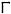
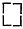
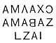
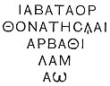
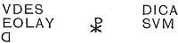
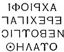

  
[Intangible Textual Heritage](../../index)  [Gnosticism](../index.md) 
[Index](index)  [Previous](gar43)  [Next](gar45.md) 

------------------------------------------------------------------------

[Buy this Book at
Amazon.com](https://www.amazon.com/exec/obidos/ASIN/B002BA5FIO/internetsacredte.md)

------------------------------------------------------------------------

  
*The Gnostics and Their Remains*, by Charles William King, \[1887\], at
Intangible Textual Heritage

------------------------------------------------------------------------

p. 303

# PART IV.

# THE FIGURED MONUMENTS OF GNOSTICISM.

p. 304

<table data-border="0">
<colgroup>
<col style="width: 100%" />
</colgroup>
<tbody>
<tr class="odd">
<td data-valign="top">
<strong>ΤΩΙ ΝΙΚΩΝΤΙ ΔΩΣΩ ΑΥΤΩΙ ΦΑΓΕΙΝ 
ΑΠΟ ΤΟΥ ΜΑΝΝΑ ΤΟΥ ΚΕΚΡΥΜΜΕΝΟΥ ΚΑΙ 
ΔΩΖΩ ΑΥΤΩ ΨΗΦΟΝ ΛΕΥΚΗΝ ΚΑΙ ΕΠΙ 
ΤΗΝ ΨΗΦΟΝ ΟΝΟΜΑ ΚΑΙΝΟΝ ΓΕΓΡΑΜΜΕΝ 
Ο ΟΥΔΕΙΣ ΕΓΝΩ ΕΙ ΜΗ Ο ΛΑΜΒΑΝΩΝ.</strong>
</td>
</tr>
</tbody>
</table>

 

p. 305

## THE FIGURED MONUMENTS OF GNOSTICISM.

### GNOSTIC SIGLÆ, SYMBOLS, LEGENDS EXPLAINED.

THE inscriptions in Greek characters upon Gnostic talismans are
frequently interspersed with mystic figures, formed out of straight
lines set at right angles to each other, and intermingled with dots.
These lines Bellermann plausibly enough supposes to represent the
"sacred lots," of the same nature as the celebrated *sortes Antiates*,
held in the hands of the much-consulted Fortuna of Antium. In their
usual form these lots were only little sticks and balls, taken up by the
handful from an urn, and thrown at random on the ground. The diviner
examined the patterns thus produced by their casual collocation, and
predicted the future from them according to the rules of his art.
Bellermann goes on to suppose that the figures on our talismans
represent certain configurations of the lots, regarded as peculiarly
lucky to the consulter. This explanation is supported by the Geomancy of
the modern Arabs, [\*](#fn_173.md) where lines
drawn at haphazard on the sand by a stick held between the fingers are
interpreted by persons professing that method of divination. Our own
divination, by means of tea-grounds, is carried on upon the same
principle, the fortuitous arrangement of the

p. 306

particles producing to the experienced eye definite pictures and letters
of the alphabet.

These Siglæ, however, may possibly have had another origin. The regular
badge of the *Magus*, as prescribed in the Vendidad, is a bundle of
divining-rods--three, seven, or nine in number. Hence the rebuke of
Hosea: "My people ask counsel of *sticks*, and their *staff* declareth
it unto them." These same divining-rods placed upon the altar are
commonly represented upon the Magian signets, bearing for official type
the Mobed at his devotions; and may therefore be supposed to have passed
down to the talisman-makers of later times. [\*](#fn_174.md)

That others amongst these angular forms are numerals is certain from the
nature of the case, and from Horapollo's express declaration that the
Egyptians represented 10 by the figure 
, and 100 by the same four times repeated in the form
of a square, thus  . *Ten*
being the "perfect number" of the Valentinian creed (whose fountain-head
was Alexandria), its frequent appearance amongst the religious formulæ
of the sect is naturally to be looked for. The primitive Egyptian
numerals were of the simplest kind, but their abbreviated combinations
ultimately became distinct symbols for the different days of the month,
and out of these the Arab astrologers concocted their own system. This
circumstance affords reason for another solution--that some of these
siglæ indicate the particular days connected with the astrological
intention of the talisman. [†](#fn_175.md)

And besides all these, there is every probability that these siglæ
include actual cuneiform letters, belonging to the Assyrian alphabet,
but their forms somewhat corrupted by the semi-

p. 307

\[paragraph continues\] Greek wizard, who
employed them in ignorance of their true nature. The Assyrian language
being considered as late as the times of Iamblichus peculiarly grateful
to the heavenly Powers, what more reasonable than that some at least of
these invocations should continue to be couched in their original
cyphers? Be it remembered, the cuneiform character was the national one
of the whole Persian empire down to the Macedonian conquest, and must
have been preserved in religious usages long after that event by the
Magi. They, at least, were a very unlikely class to trouble themselves
about the Greek alphabet or Greek literature, professing, like the
Talmudists, a pious horror for both. This is well exemplified on the
restoration of the native dynasty under the Sassanians; Greek, employed
for four centuries by the Parthian line, is at once expelled from the
coins by the Pehlevi character, true daughter of the primitive
cuneiform. There is moreover one all-sufficient reason for seeking the
origin of these inexplicable siglæ at Babylon: they constituted a
religious stenography. The Babylonians "attached to each god a certain
*numeral*, which may be used in the place of his proper *emblem*, and
may even stand for his *name* in an inscription" (Rawlinson, 'Anc.
Monarchies,' iii., 466). To give those of the principal deities:

First Triad: Ann = 60; Bel = 50; Hoa = 40.  
Second Triad: Moon = 30; Sun = 20; Air = 10.  
Beltis, or Mylitta = 15; Nergal, or Mars = 12; Niu, or Saturn = 10.

Of the other planets the numerals have not been discovered; but their
names are, Nebo, Mercury: Merodach, Jupiter; Ishtar, Venus.

The great gods are Anu, *Pluto;* Bel, *Jupiter*; Hoa, *Neptune*. Their
consorts are, respectively, Anat, Beltis, Davkana. The minor gods are,
Sin, or Hurke, answering to the later Lunus Deus; San, the Sun; Vid, the
Æther. Their respective consorts are, "The Great Lady "; Gula, or
Anahit; Tula, or Shula. The Pythagoreans had a symbolism of the same
nature, denoting Minerva by an *equilateral triangle*, Apollo by
*unity*; Strife, by the numeral *two;* Justice, by *three*, and the
Supreme Being by *four* (Plat. De Is. et Os. 75). [\*](#fn_176.md) I find a very strong confirmation

p. 308

of my belief that the Gnostic *Powers* were similarly designated by
their numerals, in Raspe's gem, No. 601, where **CΕΝΓΕΝ** is inscribed
in the exergue under a serpent coiled into a cartouche containing
several of the siglæ under consideration. Now this legend (to be
explained farther on) is, when written in full, always followed by the
names of the Archangels, whence it may justly be inferred the same names
are still here, but represented in their mystic form. [\*](#fn_177.md)

"The Great Names" constitute the very essence of every Gnostic spell. To
begin, therefore, with their consideration is obviously the most
appropriate and propitious mode of approaching this part of our
work--pandere res alta terra et caligine mersas. There are three titles
perpetually occurring, and consequently to be supposed denoting beings
of the highest importance in the Gnostic hierarchy of heaven. Their
meaning was unknown until the fortunate discovery of the grand
Valentinian gospels. The Pistis-Sophia informed us (§ 361) that they are
the holy Names of the Three Τριδύναμεις, who are **ΙΨΑΝΤΑΧΑΙΝΧΕΟϒΧ**, a
Power emanating from whom resides in the planet Mars;
**ΒΑΙΝΧΩΩΧ**, [†](#fn_178.md) in Mercury; and
**ΠΙCΤΙC CΟΦΙΑ**, in Venus. Above this Triad is one still higher, the
"Three Unseen Gods," **ΑΓΡΑΜΜΑΧΑΜΑΡΕΓ**, **ΒΑΡΒΗΛΩ** (the Heavenly
Mother of Jesus), and **ΒΔΕΛΛΗ** (§ 359).

The "Five Words" written upon the shining vesture sent down to Jesus at
His glorification (§ 16) were **ΖΑΜΑ** 

p. 309

\[paragraph continues\] **ΖΑΜΑ ΩΖΖΑ ΡΑΧΑΜΑ
ΩΖΑΙ**--"The robe, the glorious robe of my strength." The same
revelation furthermore imparts to the faithful the mystic names of the
planets. "Hearken now, I will tell unto you the Incorruptible Names of
the Planets, which be **ΩΡΙΜΟϒΘ**, Saturn; **ΜΟϒΝΙΧΟϒΑΦΩΡ**, Mars;
**ΤΑΡΠΕΤΑΝΟϒΦ**, Mercury; **ΧΩΣΙ**, Venus; **ΧΩΝΒΑΛ**, Jupiter. These be
the incorruptible names of the same" (§ 362). Of these, the names from
each Triad are to be recognised upon talismans, **ΒΑΙΝΧΩΩΩΧ** most
commonly of all; but no example of these planetary appellations has
hitherto come to my knowledge.

The Naaseni (says Hippolytus) taught that the universe could not hold
together unless the names of the Great Ones (τὰ μεγέθη) were uttered.
These were **ΚΑϒΑΚΑϒ**, **ΣΑϒΑΑΣΑϒ**, **ΖΕΗΣΑΡ**. "The first is the name
of the Adamas who is above; the second, of him who is below; the third
of the Jordan that floweth upwards." "Above are Mariamne the
Sought-after, and Jothor the great and wise; and Sephora she that seeth;
and Moses." According to the text-book of another sect, the Peratæ,
**ΧΩΖΖΑΡ** is the Power whom the ignorant and profane call Neptune:
**ΚΑΡΦΑΚΟΣΗΜΟΧΕΡ** is the Steward of the East: **ΕΚΚΑΒΑΚΑΡΑ** of the
West; called by the vulgar the Curetes. **ΑΡΙΒΑ** is the Ruler of the
Winds; **ΣΩΚΛΑΜ**, or Osiris, rules the twelve hours of the night;
**ΕΝϒΩ**, or Isis, those of the day: her sign is the Dog-star. **ΒΗΝΑ**
is Ceres, or the Left-hand Power of God, presiding over nutrition;
**ΜΗΝ** is the Right-hand Power that presides over the fruits of the
earth. In the same doctrine, *chozzar*, called by the ignorant Neptune,
"who converts into a sphere the dodecagonal pyramid, and paints with
many colours the gate of that pyramid," has Five Ministers, **ΑΟϒ**,
**ΑΟΑΙ**, **ΟϒΩ**, **ΟϒΩΑΒ**; the name of the fifth being lost. Hence it
is probable that the strings of vowels, so often found on these stones,
may contain the names of elementary genii similarly expressed.

Origen (viii. 58) quotes Celsus to the effect, that the Egyptians made
six-and-thirty (or more) dæmons or ætherial powers preside over the
several parts of the body, giving some of their names, Chumis,
Chuachumes, Knat, Sichat, Bou, Erou, Eribiou,

p. 310

\[paragraph continues\] Romanor, and
Reianoor: "Whoever therefore prefers being in health to sickness, and
happiness to trouble, ought to pay all possible honour to these Powers."
Origen therefore accuses Celsus of attempting to divert men from the
worship of the one God to that of six-and-thirty dæmons, only known to
Egyptian magicians, because he cannot understand how "the Name of Jesus,
pronounced by the truly faithful," can cure the sick and those possessed
by devils; the evidence for which is far stronger than that of the
effect of the names of Chnumis, Sichat, and the rest of the Egyptian
catalogue. In another place (i. 22) he shows it was not Moses only that
knew the name of Abraham and his friendship with God, for that others
(pagans) use the words "the God of Abraham" when they are driving out
devils. And again the Egyptians use in their rites, from which they
promise wonderful effects, the names of Abraham, Isaac, Jacob, and
Israel. Also (iv. 33) Origen mentions the use of the form "The God of
Abraham, the God of Isaac, the God of Jacob" in incantations, and that
the same is often to be met with in books of Magic. He adds that the
formula "The God of Abraham, the God of Isaac, who didst overwhelm the
Egyptians and the King of the Egyptians in the Red Sea," was in common
use against demons and the Powers of Evil. All this goes to prove that
the talismans inscribed with the name of Chnumis and the other
thirty-five dæmons named (who now by this assistance may be hereafter
recognised) were of a *medicinal* character, whereas those with
"Abraham," equally common, were more properly of the nature of
talismans.

In the Book of Enoch the Archangel Uriel gives us the mystic names of
the two great luminaries: "The names of the Sun are these, one Aryares,
the other Tomas. The Moon hath *four* names: the first, Asonga; the
second, Ebla; the third, Benase; and the fourth, Erai."

The Pistis-Sophia (§ 125) furnishes the adept with the key to the most
important of the numerical cyphers. "These be the Names that I will give
unto thee, even from the Infinite One downwards. Write them with a sign
(cypher?) that the sons of God may manifest (understand?) them out of
this place. This is the Name of the Immortal One, **ΑΑΑ ΩΩΩ**. And this

p. 311

is the name of the Voice through whose means the Perfect Man is moved,
**ῙῙῙ** These likewise are the *interpretations* of the names of the
Mysteries. The first is **ΑΑΑ**, the interpretation thereof **ΦΦΦ**. The
second which is **ΜΜΜ**, or which is **ΩΩΩ**; the interpretation whereof
is **ΑΑΑ**. The third is **ΨΨΨ**, the interpretation whereof is **ΟΟΟ**.
The fourth is **ΦΦΦ**, the interpretation whereof is **ΝΝΝ**. The fifth
is **ΔΔΔ**, the interpretation whereof is **ΑΑΑ**, the which is over the
throne **ΑΑΑ**. This is the interpretation of the second **ΑΑΑΑ**, which
is **ΑΑΑΑΑΑΑΑ**, and the same is the interpretation of the whole Name."

To pass from the cyphers, where all is guess work, to the actual
inscriptions, engraved legibly enough in the Greek character, but
presenting us with what Jerome aptly terms mere "tormenta verborum."
Many of the more common formula, Bellermann, by the aid of Hebrew,
Coptic, and Syriac, [\*](#fn_179.md) has
satisfactorily explained; of others his interpretations are manifestly
absurd. **ΑΜΑΡΓΕΑ** seems to be the Chaldee *Amarchel*, a president.
**ΑΝΟΧ ΧΟΛ ΧΝΟϒΒΙC**, "I am All the Good Spirit, or the Universal genius
of good." **ΑΙΝ ΘΑΡΡΑΙ**, "The eye shall. behold." **ΑΔΟΝΑΙ ΛΑΝΤΑΛΑ**,
"Lord! Thou art the Lamb." [†](#fn_180.md) **ΧΩCΑ
ΜΙΛΑΩΘ** exactly represents the Hebrew words signifying "He hath seen
the Pleroma."

 

is rendered by Stiechel "Salama zebaam jatzael" = "Peace unto the army
of these" (of the celestial Æons)! This agrees with

p. 312

the benediction pronounced by the Marcosians in administering the holy
unction, "Peace be unto all upon whom this holy Name rests!"

Some of these inscriptions display an evident affectation of obscurity
by their transposition of parts of the same word front one line to
another, the only key to which is the observing the different sizes of
the characters employed, and taking those of the same size as belonging
to the "disjecta membra" of the same word. A most instructive example of
this artifice is supplied by the legend cut on the reverse of a
magnificent Serapis head (Wood), which reads thus:

 

\[paragraph continues\] This will only be
translatable if transposed as follows: **ΙΑΒΑΤΟΡ. ΘΟΝΑΤΗC. ΛΑΙΛΑΜ.
ΑΡΒΑΘ. ΙΑΩ.** "Jehovah, the Pure Æther, the Fire, [\*](#fn_181.md) for ever, the Four, Iao," where "the
Four" signifies the Tetrad, so conspicuous in the Theogony of Marcus.
This legend seems much of the same nature as the Greek one cut on a
piece of copper (communicated to me by Prof. Ch. Babington): ὁ διὰ
πάντων Νοῦς αἰθὴρ, πὺρ, πνεῦμα, ἐλωεὶν ἐλωεὶν (Elohim). The only word in
the first legend not reducible to Hebrew is Θονατ, but it seems to
correspond to the "Æther" of the copper piece, **ΑΡΛΑΝΑ ΘΑΜΑΚΑ ΣΑΛΒΑΝΑ
ΧΑΜΚΙΜ**, "Our Light, let thy goodness grant unto us a full lap": whence
the object of such a talisman would seem to be the procuring of
fecundity. [†](#fn_182.md)

**ΑΝΑΚΛΑ ΑΚΔΑΑΘΩΙΩΙ**, "Pursue then (my foes) unto destruction, O Lord,"
is found very appropriately engraven on the reverse of a sphinx, the
recognised emblem of power and slaughter.

p. 313

**ΒΑΡΙΑ ΖΑΣΤΑ ΙΑΩ**, "Jehovah the Creator, the Destroyer." Chaldee
slightly corrupted.

**ΙΑΘΑΙ**, "The providence of God."

**ΜΑΘΑΝΕ**, "The honour of God."

**ΡΕΟϒΗΛΕ**, "The will of God."

**ΧΩΜΙ**, "The power of God."

**ΣΒΩ** "Wisdom."

These Coptic words thus designate the Five Emanations from the
Godhead--viz., Phronesis, Logos, Nous, Dynamis, Sophia.

‏מֵאִיר עֵינִי‎

"enlightening mine eye,"

or

‏מְאִירֵנִי‎ -- ii

"enlightening me,"

Meireni                             M’ireni

\[paragraph continues\] If **ΗΝΑΜΕΡΩ** and
**ΜΑΡΩΗΝΙ** are really the same, it will be conclusive against ii, where
the *eni* is an affix. The form then might be

‏עֵינִי מֵאִיר‎

enimeir.

Query what of the **Ω**?

**ΙΘΙ** placed on each side of the Chnuphis serpent engraved in green
jade (S. S. Lewis) is correct Hebrew for "With me," which gives an
appropriate sense if understood as a prayer for the constant presence of
the protecting Spirit.

**ΜΕΣ ΧΑΝΑΛΩ**, [\*](#fn_183.md) "The Messiah be
propitious unto me."

**ΜΑΡΩΗΝΙ**, [\*](#fn_183.md) "Enlighten mine
eyes."

**ΚΑϒΛΑΚΑϒ**. The Basilidan name for the Saviour is written by
Epiphanius **ΚΑϒΛΑΚΑϒΧ**, who ridicules it as an expression taken from
Isaiah (xxviii. 10) without any regard to the

p. 314

real meaning of the words. Bellermann, however, thinks he has found a
more sensible derivation for the title in Arabic, signifying "Strength
upon strength," that is, the "All-powerful"; or else in the Coptic
**ΚΑΒ**, "a lamp," and so implying "The burning and the shining Light."

**ΜΟϒΘ**, "Mother," Plutarch informs us (De Is. et Os.), was a title
given to Isis. This word contains a plain allusion to the earth, "lutum
Prometheum," whence Man was taken. **ΜΟϒΘ** and **ΙΕΟϒΔ** are translated
by Sanconiathon as "Hades" and "Only-begotten," the offspring of the
Phœnician Cronos.

**ΝΟΟΤ** for the Coptic **ΝΟϒΤ**, "God."

**ΜΑΙ ΜϒΜ ϒΧΛϒΜ ΩΙ**, "Being, Fount, Salvation, Food, Iao": implying
that Iao is the source, food, life, and salvation of the soul.

**ΟΡΩΡΙΟϒΘ**, "Light of Light." [\*](#fn_184.md)

**ΤΑΛΑ ΑΡΑΙΩ ΩΑΡΑΟΡΟ ΝΤΟΚΟ ΝΒΑΙ**, "Protector, Creator, rule, speak, O
Lord," is a very common formula.

**ΣΕΣΕΜΕΝ ΒΑΡΑΝΓΗΝ ΙΑΩ**, written with many variations, and followed by
the names of the great Angels, has been ingeniously deciphered by a
learned Hebraist (Rev. R. Sinker) as representing the sound of "Shengab
hor anje Jehevoh," "They that stand before the Mountain of God," that
is, the Angels of the Presence. [†](#fn_185.md)

**ΧΑΙΑ**, "Life," is seen on a field of the Roman gem bearing two
figures of *Providentia*, with the Sun and Moon on the field overhead
(Major Pearse).

Three Greek characters often occur in juxtaposition--viz., the **Ε** set
on its back, a vertical line crossed by two horizontal strokes, and
**Ζ**. They stand for the numerals 5, 3, and 7, the Triad, Pentad,
Heptad--lucky and sacred numbers in the religious notions of the East.
For the same reason the inscriptions on our gems will be found to be
arranged for the most part in either three, five, or seven lines. This
also accounts for the name Iao being often written with its elements
repeated

p. 315

\[paragraph continues\] **ΩΑΙΑΩ**, [\*](#fn_186.md) for the sake of obtaining the venerated
numeral, five. And, again, by introducing another vowel, **Η**, the Holy
Name is repeated under five different forms, **ΗΑΙ . ΑΙΗ . ΗΙΩ . ΑΙΩ .
ΙΑΩ**.

The *Priest* officiating, commonly figured in these designs, wears upon
his head the "calantica," a square of purple cloth whence spring two
flamingo feathers; a badge which made πτερόφορος a synonym for the
Egyptian priesthood. The staff in his hand, emblem of his office, has
the serpent coiled *five* times about it. This "sceptrum sacerdotale"
furnishes the true explanation of the meaning of many ancient insignia,
beginning with Moses’ wand, then the club of Æsculapius, and closing
with its derivative the rod in the spiral of **SSS** that so constantly
goes with the Agathodæmon serpent upon the Chnuphis gems.

As for the *geometrical figures* so often introduced, they may be
supposed to have had much the same import here as in the formulæ of the
Rosicrucians, who obtained these with other Gnostic paraphernalia
probably by tradition from the Arabs; for their pretended founder, the
Great Unknown **A. S.**, is declared to have acquired his small learning
at the College of Damascus. In their system the Square stands for the
Four Elements; the Triangle for the body, the spirit, and the life: and
also for Sun, Moon, and Mercury. The last Triad Paracelsus interprets by
*salt*, *sulphur*, *quicksilver*--the three radical forces of Nature
according to his system. The *Rhombus* represents the Orphic Egg, out of
which issued the whole Creation.

*Phœnician Numerals* may, from the very nature of the case, be looked
for amongst the marks that cannot be referred to the Greek alphabet. The
notation was simplicity itself: *one* to *nine* being expressed by
vertical strokes, so many times repeated; *ten* by a horizontal one;
*twenty* by two such parallel to each other, sometimes slightly curving
together. In the

p. 316

\[paragraph continues\] Palmyrene notation
*five* has a special cypher, a sloping line upon which in the middle
stands another at right angles.

It was to be expected that Samaritan characters should make their
appearance upon the productions of a religion of which the reputed
founder was a Samaritan, whose professed followers also formed an
important sect as late as the times of Hippolytus. Stiechel interprets
the reverse legend on his above-quoted gem as having its commencing
words written in this alphabet: thus

 

He also points out that the important word "Auth"=*sign* or token, is
written in these legends in four different ways: **ΘVΟ**, **ΕVΟ**,
**ΕΙW**, **VΙΕ**.

It is possible that in certain legends the letters, taken in an order
known to one having the key, would give a definite meaning; and this
suspicion is supported by the reversing of some of the characters.
Certain it is that the Donatists adopted such a device in order to
disguise their proscribed war-cry from the victorious Catholics. A
door-lintel at Tebessa exhibits the well-known formula thus--

 

to be read by the brethren "Deo laudes dicamus." A second lintel bears
the same in monogram.

The most famous spell of all, **ABRACADABRA**, is first mentioned by
Serenus Sammonicus, the most learned Roman of his times, and physician
to Caracalla, to whom he dedicated his poetical 'Guide to Health,'
entitled 'De Medicina præcepta saluberrima.' This work, remarks
Spartian, was the favourite study of the unfortunate Cæsar, Geta, for
attachment to whose cause this true son of Apollo was afterwards put to
death by the imperial fratricide. Severus Alexander also, "who had known
and loved Serenus," greatly admired his poetry, putting

p. 317

him on a level with Horace, as Lampridius’ expressions seem to intimate.
This high authority orders the word to be written out in the form of an
inverted cone, and declares it of virtue against all diseases.

"Thou shalt on paper write the spell divine,  
Abracadabra called, in many a line;  
Each under each in even order place,  
But the last letter in each line efface.  
As by degrees the elements grow few  
Still take away, but fix the residue,  
Till at the last one letter stands alone  
And the whole dwindles to a tapering cone.  
Tie this about the neck with flaxen string;  
Mighty the good ’twill to the patient bring.  
Its wondrous potency shall guard his head--  
And drive disease and death far from his bed."

The belief in the virtue of this recipe flourished through the Middle
Ages. It seems alluded to in the 'Dialogue on Masonry,' ascribed by
Leland to Henry VI.; for amongst "the things that Masons conceal" is
"the winnynge of the facultye of *Abrac*"*:* perhaps signifying the
possession of this mystical arrangement of letters: unless, indeed, one
chooses to suspect in this "facultye" a deeper sense, some traditionary
knowledge of the ancient Abraxas religion. Again, De Foe mentions how
people commonly wore the word written in the manner above prescribed, as
a safeguard against infection during the Great Plague of London.

As for the etymology of the word, the most satisfactory yet offered is
the compound of the Hebrew *Ha-Brachah*, "blessing," and Dobara,
"speak"; meaning the "Blessing of the Mystic Name"--that is, utter the
Tetragrammaton, invoke the Holy Name of Jehovah, itself the mightiest of
charms. [\*](#fn_187.md)

It is very remarkable, considering its high repute, that no Gnostic
stone bearing such an inscription should be known to exist. On the other
hand that normal address to Iao, **ΑΒΛΑΝΘΑΑΛΒΑ**, "Thou art our Father!"
is so found on talismanic jaspers arranged in the exact pattern
recommended by

p. 318

\[paragraph continues\] Serenus for the
paper spell, and probably so done in compliance with his directions. One
is strongly tempted to discover in this same *Ha-Brachah* the real
origin of the equally famous title "Abraxas." The Greek letters,
constantly in use for numerals, at once presented their numeric value in
every word to the practised eye of the Kabalist.

The celebrated letter of Christ to Abgarus was (according to Cedrenus)
sealed with the initials of the seven Hebrew words, whose Greek
interpretation was Θεὸς Θεοθὲν θαῦμα θεῖον. At the mere sight of the
seal the king was healed of his gout and of his blade leprosy, all but a
slight trace upon the face remaining to be cleansed by the waters of
baptism. Cedrenus' Greek reads like a popular formula, and may serve to
explain the legend on the reverse of an Abraxas gem in my possession,
**ΙΧΘΕΘΩΗΙΑΙΑΩ**, as to be read Ἰησοῦς Χριστὸσ Θεὸς ἐκ Θεοῦ Ιαὼ, "Jesus
Christ, God of God, Jehovah." This inscription encloses the letters
**ΙΗ** placed conspicuously in 'the centre, and which probably
represent, as nearly as the two discordant alphabets allow, the Hebrew
letters *Jod*, *He*, the Kabalistic name of the *Tikkan*, "Express
Image," or First Emanation of the Godhead.

The Crescent and Seven Stars, amongst which are scattered the mystical
Seven Vowels, has for reverse this formula:--

 

Its first line, but written ΑΧΘΙΩΦΙ, is cut in beautiful characters on
the reverse of a caduceus within a wreath. Sinker reads it as ‏עקר יפי‎,
*Essence*, *Beauty:* probably the rest are names of virtues. It is
inconceivable that the Sephiroth--mightiest spell of all--should be
omitted in these gems. It is made up of the *Ten* attributes of
Jehovah--viz., The Crown, Wisdom, Prudence, Security, Magnificence,
Goodness, Glory, Victory, Fortitude, Kingdom. There is consequently a
probability that these Names often lurk in the phonetic Hebrew,
enveloping all in darkness. We have for guide the analogy of the present
Arab talismans, consisting of the ninety-nine epithets of Allah written
on a scroll.

------------------------------------------------------------------------

### Footnotes

[305:\*](gar44.htm#fr_174.md) "Each tribe either
found or introduced in the Caaba their domestic worship; the temple was
adorned or defiled with 360 idols of men, eagles, lions, and antelopes;
and most conspicuous was the statue of Hebal, of *red agate*, holding in
his hand seven arrows, without heads or feathers, the instruments and
symbols of profane divination."--Gibbon, chap. 42.)

[306:\*](gar44.htm#fr_175.md) The ancient Teutons
practised the same method of divining future events. A shoot of a fruit
tree was cut into pieces, each being distinguished by certain marks,
*notis quibusdam*, probably meaning "Runes." The consulter threw them
down at random on a white cloth, with eyes turned to heaven he took up
three separately, and interpreted the response from the inscriptions
upon them,--(Tacitus. Germ. x.)

[306:†](gar44.htm#fr_176.md) Some of these siglæ
may be recognised in the inscriptions in an unknown character, cut in
the hard sandstone rock, and very numerous about Silsilis, Upper Nubia,
where they accompany figures of elephants, giraffes, and ostriches--all
animals long since extinct in that country. Specimens were published by
Greville Chester in the 'Archæological Journal' for 1861, p. 274.

[307:\*](gar44.htm#fr_177.md) In the Egyptian
Ritual papyrus, Thoth is addressed as "the second Hermes by
[his](errata.htm#21.md) *mystic name* of the god A."

[308:\*](gar44.htm#fr_178.md) The Turks represent
the Great Name *Allah* by an oval crossed with intersecting lines, which
is often seen stamped on their old armour, for an amulet. Now this very
mark occurs in the Gnostic set, and it is more than probable that its
true meaning is preserved in the Turkish tradition.

[308:†](gar44.htm#fr_179.md) In Goodwin's
'[Magic](errata.htm#22) Papyrus' the Serapean Divination (No. 1.md) names
this Power: "Appear and give heed unto him who was manifested before
Fire and Snow, Βαινχωωχ, for Thou art he that did make manifest Light
and Snow, Terrible-eyed-thundering-and-lightning-swift-footed-one." This
papyrus, now in the British Museum, was bought of Atanasi, Swedish
Consul at Alexandria: who sold several others of the same nature to the
Leyden Library. All are supposed to have been found together in a
catacomb at Thebes, and to have formed the stock of some magician of the
second century of our era, as the handwriting leads us to infer. Goodwin
edited the Brit. Museum specimen for the Cambridge Antiquarian Society
in 1852, and enriched it with notes giving invaluable assistance to all
who study Gnostic remains.

[311:\*](gar44.htm#fr_180.md) Prof. Stiechel, in
his essay 'De Gemma Abraxea nondum edita,' Jenae, 1848, hay acutely and
satisfactorily elucidated some very important formulæ, giving a key to
the whole class. The necessity for employing Oriental languages in
spells is curiously illustrated by Hippolytus’ statement, that the
magicians of his time used to write the answers to the questions
proposed to their demons, partly in *Hebrew*, partly in Greek letters.

[311:†](gar44.htm#fr_181.md) **ΑΡ ΩΡΙ**, followed
by the Greek words **ΦΡΑCΙC**, **ΦΑCΙC**, **ΙΑCΙC**, "Declaration,"
"Manifestation," "Healing," is always attached to a figure of Venus
Anadyomene, and admits of the translation 'Mountain of Light." The Venus
therefore seems adopted here for the "Virgin of Light," who holds so
high a place in the celestial hierarchy of the Pistis-Sophia. At any
rate the sense of **ΑΡΩΡΙ**, "Mountain of Light," strongly favours this
acceptation.

[312:\*](gar44.htm#fr_182.md) **ΑΒΡΑΜ**, which
often occurs in these legends, may perhaps refer to the Rabbinical
"Seir-Anpen," the Primitive Man, made up of 213 numbers, the numerical
value of the *Hebrew* letters in the name.

[312:†](gar44.htm#fr_183.md) **ΗC** represents the
Hebrew word for "Fire": and this explanation is confirmed by the **ΤΟ
ΦΩC ΠΥΡ ΦΛΟΞ** accompanying a figure of Phre on a gem elucidated by
Froehner in his 'Byrsa,' part i.

[313:\*](gar44.htm#fr_185.md) The Syrian Alexander
Severus expresses his indignation at the sight of a certain notorious
rogue, Arabianus, coming to Court, by exclaiming "O Marna, O Jupiter,"
&c., where his native "Our Lord" he renders by "Jupiter," for the
benefit of his Roman hearers. This word the monkish transcribers very
naturally converted into "Maria." **ΗΝΑΜΕΡΩ**, which often accompanies
the figure of the Cynocephalus, seems to be equivalent to the phrase in
the text: and as that beast belongs to Thoth, god of *knowledge*, this
interpretation has at least appropriateness in its favour.

[314:\*](gar44.htm#fr_186.md) This legend always
goes with the udder-shaped vase of the Isiac rites.

[314:†](gar44.htm#fr_187.md) Γαβριηλ, Μιχαηλ,
Ραφαηλ σενγε(ν)β αρανγην Ιαω.

‏ג׳ מ׳ ר׳ שֶׁנֶּגֶב הַר עַנְגִין יְיָ‎

σεγεν βαρ ένχε

‏שׁנּגב הר ענג‎

[315:\*](gar44.htm#fr_188.md) Stiechel has a very
ingenious explanation of this permutation of vowels; he makes it express
different tenses of the Hebrew verb *to exist*, thus--

**ΙΕΩΑΙΗ** = vivit existens.

**ΑΙΩΟVΕV** = isque est Iao.

**ΑΙΗΑΗΙΩΗ** = existens vivit.

**ΩΑΙΗΟΨΕ** = isque Iao.

[317:\*](gar44.htm#fr_189.md) By the mere
utterance whereof the philosopher Theosebins, though unacquainted with
magic, was able to cast out devils from all who applied to him for aid.

------------------------------------------------------------------------

[Next: The Name ΙΑΩ](gar45.md)
