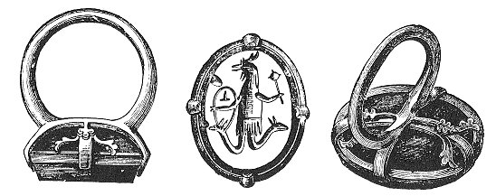

  
[Intangible Textual Heritage](../../index)  [Gnosticism](../index) 
[Index](index)  [Previous](gar45)  [Next](gar47) 

------------------------------------------------------------------------

[Buy this Book at
Amazon.com](https://www.amazon.com/exec/obidos/ASIN/B002BA5FIO/internetsacredte)

------------------------------------------------------------------------

  
*The Gnostics and Their Remains*, by Charles William King, \[1887\], at
Intangible Textual Heritage

------------------------------------------------------------------------

p. 328

### ABRAXAS, NEW TYPE OF.

A most singular variation upon the normal type of the Abraxas pantheus
gives him the head of Serapis for that of the usual cock. In the field
between the serpents are the genital organs, of disproportionate size,
represented in a state of rest, not as the *fascinum* properly appear on
amulets; and unmistakably displaying the seal of circumcision. This
circumstance is another proof to be added to all those previously
observed, that the fabricators of this class of talismans were the
Egyptian Jews. As the distinguishing principle of the Gnosis in all its
forms was the reprobation of the "doing the work of the Demiurgus" that
is, the propagation of the species--it is evident that the object of
this symbolism was not of a religious kind. It is probable that the idea
was to produce a talisman of medicinal use, perhaps for the cure of
impotence or other affections of the parts represented. Of medicinal
talismans, expressing their purpose by the legends they bear, numerous
examples have been already published. The one now described was made
known to me through an impression brought by the Rev. S. S. Lewis of a
jasper in the Bourgignon collection at Rome. Another very uncommon
subject in the same collection is a skeleton seated on a throne, holding
a lance, or perhaps sceptre. Although perfectly corresponding with the
mediæval representation of Death, yet the spirited though rude extension
of the intaglio is that of the earlier Gnostic period, and the idea
intended was that of a *larva*, not that of the Destroying Power. In the
Stosch Cabinet is a similar figure borne along in a car by steeds as
fleshless as himself, like the Wild Hunter of the German legend.

 

   
FIG. 14

[(\*)](gar71.htm#an_fig14)

 

------------------------------------------------------------------------

[Next: Original Purpose of These Formulæ](gar47)
