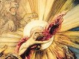

  
[Intangible Textual Heritage](../../index)  [Gnosticism](../index) 
[Index](index)  [Previous](gar81)  [Next](gar83) 

------------------------------------------------------------------------

[Buy this Book at
Amazon.com](https://www.amazon.com/exec/obidos/ASIN/B002BA5FIO/internetsacredte)

------------------------------------------------------------------------

  
*The Gnostics and Their Remains*, by Charles William King, \[1887\], at
Intangible Textual Heritage

------------------------------------------------------------------------

  [  
Click to enlarge](img/pl_k.jpg)  
Plate K  

### PLATE K.

### MITHRAIC (*continued*).

1\. Circular copper plate, of the same size as the drawing, bearing the
name of *Aurelius Furellius*, the person for whose benefit the talisman
was devised. It represents a female figure, standing in the attitude of
adoration; legend, "The Birth of Salvation." On the reverse is seen the
Solar Lion bestriding a corpse, a type so frequent in this class that it
may reasonably be referred to the entrance-rite of initiation, the
"simulation of death" alluded to by Spartianus.

2\. The most elegant of these mystic designs that has ever come to my
knowledge. Two Cranes, one with the head of a Ram, the other of a Bull,
stand guardians over the Mithraic sacramental table, under which lies
crouched the Solar Lion, "the House of the Sun." Upon the table are set
the sacred vessels; above it is the Delphic Ε, badge of Apollo, between
two Palmyrene (?) letters, and over all the Seven Planets, engraved with
an accuracy worthy of its elegance in a very fine sard.

3\. A talisman of uncommon potency, to judge from the profusion of
symbolism with which its two faces are overloaded. A four-winged,
four-armed Power, standing like the Babylonian Belus in the air, is
involved with a multiplicity of legends, amongst which the usual formulæ
"Thou art our Father," "Sun of the Universe," "Michael," "Adonai," can
clearly

p. 444

be read. The reverse shows a female figure standing and adoring the
Deity, who guides the Solar light. In the legends we can distinguish
"Abraxas," "Michael," and "Michalo."

4\. This type only differs from the last by the addition of the
prostrate man under the Lion's feet, and that nothing definite can be
made out of the disjointed inscription. The reverse merely bears the
*Great Name* "Iao, Sabaoth," and the Seven Vowels. The potency of such
words is still an article of faith with all *true* Jews. In the year
1835-6, the Rabbi of Neutra, in Hungary, actually stood his trial for
murder on the charge of having cursed, by the "Ineffable Name" an
*enlightened* lady whom he had ordered to leave the synagogue on the
Sabbath-day, because she had ventured to make her appearance there with
her *hair in sight*, and who had died suddenly on the very same day. The
Rabbi only escaped conviction by publicly and solemnly disclaiming the
possession of any such power, to the inexpressible disgust of his whole
congregation, who looked upon him as a wretch that had denied his God in
order to save his life!

------------------------------------------------------------------------

[Next: Plate L. Mithraic (continued)](gar83)
