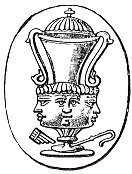

  
[Intangible Textual Heritage](../../index)  [Gnosticism](../index) 
[Index](index)  [Previous](gar87) 

------------------------------------------------------------------------

[Buy this Book at
Amazon.com](https://www.amazon.com/exec/obidos/ASIN/B002BA5FIO/internetsacredte)

------------------------------------------------------------------------

  
*The Gnostics and Their Remains*, by Charles William King, \[1887\], at
Intangible Textual Heritage

------------------------------------------------------------------------

p. 457 p. 458

# INDEX.

A. A. A., Kabalistic, [199](gar30.htm#page_199)

**ΑΒΛΑΝΑΘΑΝΑΛΒΑ**, [246](gar35.htm#page_246), [317](gar44.htm#page_317)

Abdallah, the Magian, [412](gar63.htm#page_412)

Abgarus, Christ's letter to, [317](gar44.htm#page_317)

ABRACADABRA, origin of, [316](gar44.htm#page_316)

Abraxas as Phœbus, [103](gar15.htm#page_103)

------, explained, [117](gar17.htm#page_117)

------, the Sun-god, [117](gar17.htm#page_117)

------, etymology of, [251](gar37.htm#page_251)

------ Religion, [257](gar40.htm#page_257)

------ Religion defined, [257](gar40.htm#page_257)

------, meaning of, [259](gar40.htm#page_259)

------, curious type of, [328](gar46.htm#page_328)

------ figure, first mention of, [111](gar16.htm#page_111)

------ -gems, the true, [245](gar35.htm#page_245)

------ gem-legends, [247](gar35.htm#page_247)

------ -gems, how used, [274](gar42.htm#page_274)

------ -gems, materials and art of, [274](gar42.htm#page_274)

------ -god, described, [250](gar36.htm#page_250)

Abraxaster-gems, [226](gar33.htm#page_226)

Abraxoids, [237](gar33.htm#page_237)

Abraham, statue of, [161](gar23.htm#page_161)

Abrak, the Mystery of, [317](gar44.htm#page_317)

Achamoth, Wisdom, [330](gar47.htm#page_330)

Achoreus, [322](gar45.htm#page_322)

Adad, the Sun, [161](gar23.htm#page_161)

Adam, Book of, [4](gar04.htm#page_4), [415](gar64.htm#page_415)

------ -Kadmon, [34](gar10.htm#page_34)

------ -Kadmon typified, [233](gar33.htm#page_233)

Added talismanic legends, [277](gar42.htm#page_277)

*Adonai*, Adonis, [296](gar43.htm#page_296)

Adoneus, 'the Invisible,' [297](gar43.htm#page_297)

AE.I.O.U., Austrian version of, [234](gar33.htm#page_234)

Æneas, his funeral sacrifice, [367](gar53.htm#page_367)

Æons, Simon's, [67](gar13.htm#page_67)

------, whence derived, [260](gar40.htm#page_260)

------, list of the, [263](gar40.htm#page_263)

------, male and female, [263](gar40.htm#page_263)

------, seals and numbers of the, [331](gar47.htm#page_331)

------, addresses of the Soul to the, [332](gar47.htm#page_332)

------, pictures of the, [363](gar53.htm#page_363)

Æsculapius, [177](gar26.htm#page_177)

------, the Sun, [177](gar26.htm#page_177)

Agathodæmon Serpent, [215](gar31.htm#page_215)

AGATHODÆMON, legend, [216](gar31.htm#page_216)

Agathodæmon gems, examples, [296](gar43.htm#page_296)

Ahriman, Evil, [132](gar20.htm#page_132)

Akbar, his religion, [416](gar64.htm#page_416)

Alabarches, [27](gar08.htm#page_27)

Albigenses, their creed, [340](gar47.htm#page_340)

------, last traces of the, [399](gar60.htm#page_399)

Alexamenos, *graffito* of, [230](gar33.htm#page_230)

Alexandria, the Serapis of, [159](gar23.htm#page_159)

*Allah*, sigla for, [10](gar04.htm#page_10)

Alleius Caronius, spell of, [223](gar32.htm#page_223)

Alphabetical names, [311](gar44.htm#page_311)

'Amen,' why used in prayer, [267](gar41.htm#page_267)

Amenti, the-Four,  [106](gar16.htm#page_106)

**ΑΜΗΝ**, the Three, [147](gar21.htm#page_147)

Ammian, upon the Magi, [272](gar41.htm#page_272)

Amor, how adopted, [234](gar33.htm#page_234)

Amshaspands, the Seven, [140](gar20.htm#page_140)

Amyclae, Apollo of, [298](gar43.htm#page_298)

Andrew, and the Rosy Cross, [394](gar59.htm#page_394)

Andrew, Revelation to St., [341](gar48.htm#page_341)

Angel-worship, [344](gar49.htm#page_344)

Angels' Names, talisman, [193](gar28.htm#page_193)

------, planetary, [344](gar49.htm#page_344)

Antigonus Gonatas, his treaty with Asoka, [51](gar12.htm#page_51)

Anubis, with two faces, [110](gar16.htm#page_110)

------, with triple head, [293](gar43.htm#page_293)

------ -Christus, [230](gar33.htm#page_230)

------ -Christus, figure of, [279](gar42.htm#page_279)

------ -Typhon, [302](gar43.htm#page_302)

Apis-bulls, catacombs of the, [164](gar23.htm#page_164)

Apollo, with talismanic legend, [302](gar43.htm#page_302)

Apollonius of Tyana, [53](gar12.htm#page_53)

Apsethus and the parrots, [58](gar13.htm#page_58)

Apuleius, [110](gar16.htm#page_110)

------, 'De Magia,' [283](gar43.htm#page_283)

Arabic terms in mediæval art, [418](gar65.htm#page_418)

Archon, the Second, [77](gar14.htm#page_77)

------, Demiurgus, [81](gar14.htm#page_81)

'Archons of the Great Fate,' [352](gar50.htm#page_352)

Aristotle, copied by Basilides, [70](gar13.htm#page_70)

Ark of the Covenant, [7](gar04.htm#page_7)

Artemis of Pallene, [167](gar24.htm#page_167)

Arthur's Oon, [136](gar20.htm#page_136)

A.S. the Rosicrucian, [315](gar44.htm#page_315)

Asceticism, why enjoined, [419](gar66.htm#page_419)

Asoka's Edicts, [51](gar12.htm#page_51)

Assassins, the sect of, [410](gar62.htm#page_410)

------, their Degrees, *ib*.

------, grades of, [411](gar63.htm#page_411)

'Assembly,' Masonic, [378](gar55.htm#page_378)

Ass-headed deity, [230](gar33.htm#page_230)

Astrology, in Rome, [227](gar33.htm#page_227)

Assumption of deities’ forms, [365](gar53.htm#page_365)

Athelstan, first Saxon builder, [383](gar55.htm#page_383)

Athelstans’ Constitutions, [381](gar55.htm#page_381)

**ΑΓΙΟΝ ΟΝΟΜΑ**, gem-legend, [172](gar24.htm#page_172)

Augustine, a Manichæan, [48](gar11.htm#page_48)

**AUM**, symbolism of, [266](gar41.htm#page_266)

------ *or* OM, [266](gar41.htm#page_266)

------, virtues of its use, [267](gar41.htm#page_267)

------, type of the Trinity, [320](gar45.htm#page_320)

Avila, bishopric of, [339](gar47.htm#page_339)

Ἀχθαναβάς, place of torment, [355](gar51.htm#page_355)

BABYLONIAN characters used in talismans, [368](gar53.htm#page_368)

*Babylonii numeri*, [368](gar53.htm#page_368)-[69](gar13.htm#page_69)

Bacchic serpent, [323](gar45.htm#page_323)

Bacchus, the sun-god, [322](gar45.htm#page_322)

------, god of the Jews, [323](gar45.htm#page_323)

Bacon's 'House of Wisdom,' [398](gar60.htm#page_398)

Balsamus, Barbelus, [259](gar40.htm#page_259)

Balaam's sacrifices, [442](gar80.htm#page_442)

Bambino, il santissimo, [336](gar47.htm#page_336)

'Baphomet' of the Templars, [235](gar33.htm#page_235)

Baphometic figures, [403](gar61.htm#page_403)

------ Tablets, [383](gar55.htm#page_383)

'Baphometicum Mysterium,' [128](gar18.htm#page_128)

Barbelo, [259](gar40.htm#page_259)

------, 'Mother of the Saviour,' [333](gar47.htm#page_333)

Barruel, upon the Illuminati, [425](gar69.htm#page_425),
[426](gar69.htm#page_426)

Basilides, his system, [70](gar13.htm#page_70),
[257](gar40.htm#page_257)

Basilidan doctrine defined, [258](gar40.htm#page_258)

Bath, scroll found at, [360](gar53.htm#page_360)

B. C. D. L. M. N. S., [402](gar60.htm#page_402)

Belenus, [136](gar20.htm#page_136)

------, Gallic Sun-god, [136](gar20.htm#page_136)

Betulus, thunderbolt, [210](gar30.htm#page_210)

'Birth of the New Sun,' [366](gar53.htm#page_366)

'Birthday of Mithras,' [119](gar17.htm#page_119)

Blood-offerings to ghosts, [165](gar24.htm#page_165)

Boethius’ Arithmetic, [370](gar53.htm#page_370)

'*Bologna, Scavi presso*,' [428](gar70.htm#page_428)

Bouillon, Cardinal, [362](gar53.htm#page_362)

Boundary Spirit, the, [76](gar14.htm#page_76)

'------ Spirit,' Deus Terminus, [299](gar43.htm#page_299)

Boundless Power, [59](gar13.htm#page_59)

Bouteilles cemetery, [371](gar53.htm#page_371)

Brachmans, origin of, [272](gar41.htm#page_272)

Brandmarks, Mithraic, [139](gar20.htm#page_139)

Brazen Serpent, the, [218](gar31.htm#page_218)

'------ Serpent' whence derived, [3](gar04.htm#page_3)

'Bringer of luck, the,' [85](gar15.htm#page_85)

Bromius, how figured, [132](gar20.htm#page_132)

'Brother,' Masonic, [378](gar55.htm#page_378)

Buddha Gaya, inscription at, [269](gar41.htm#page_269)

Buddha's Foot, [270](gar41.htm#page_270), [271](gar41.htm#page_271)

Buddhism described, [49](gar11.htm#page_49)

Buddhist missions, [51](gar12.htm#page_51)

------ symbols, [389](gar57.htm#page_389)

------ influence on Gnosticism, [390](gar57.htm#page_390)

Bulgarians, the sect, [409](gar62.htm#page_409)

Bull, Mithraic, [132](gar20.htm#page_132)

'Bulletin Monumental,' on Masons’ Marks, [383](gar55.htm#page_383)

Bulls, mummies of, [164](gar23.htm#page_164)

Burying-alive, penance, [154](gar21.htm#page_154)

Byzantine Gorgon-amulets, [169](gar24.htm#page_169)

CABIRI, copper of the, [89](gar15.htm#page_89)

Caduceus, its symbolism, [176](gar26.htm#page_176)

Camillus Leonardi, [338](gar47.htm#page_338)

Capricorn, [183](gar27.htm#page_183)

------, bearer of souls, [183](gar27.htm#page_183)

*Carbonari*, their origin, [391](gar57.htm#page_391)

Carnarvon, gold plaque found at, [339](gar47.htm#page_339)

Caste-marks, and various *siglæ* explained, [13](gar04.htm#page_13),
[14](gar05.htm#page_14)

------ diffusion of, [386](gar56.htm#page_386)

Catalogues of Gnostic gems, [278](gar42.htm#page_278)

Cave of Mithras, [136](gar20.htm#page_136)

Chain, Magic, [362](gar53.htm#page_362)

Chalice, Mithraic, [126](gar18.htm#page_126)

Charun, the Etruscan, [182](gar27.htm#page_182),
[187](gar27.htm#page_187)

Ceraunia, talismanic, [197](gar30.htm#page_197)

Chest-protector, [223](gar32.htm#page_223)

Chiflet's talisman, [290](gar43.htm#page_290)

Childeric, Tomb of, [194](gar28.htm#page_194)

Chinese symbols, [391](gar57.htm#page_391)

Christ, identified with Serapis, [161](gar23.htm#page_161)

Christ's person described, [162](gar23.htm#page_162)

Christmas day, how fixed, [120](gar17.htm#page_120)

Chrysocheir of Tephrice, [412](gar63.htm#page_412)

'Chnumis,' various spellings of, [216](gar31.htm#page_216)

Chnuphis, with mystic numeral, [340](gar47.htm#page_340)

------ gem-legends, [243](gar34.htm#page_243)

'Circle of the Sun,' [300](gar43.htm#page_300)

Clemens Alexandrinus, [257](gar40.htm#page_257)

Clemens and Basilides, [257](gar40.htm#page_257)

'Cleopatra, Death of,' [181](gar27.htm#page_181)

p. 459

Cnidus, Temple at, [360](gar53.htm#page_360)

Cochet, abbé, [371](gar53.htm#page_371)

Colic, amulet for the, [367](gar53.htm#page_367)

Collar of SS, its origin, [219](gar32.htm#page_219)

'College of Arabian Sages,' [394](gar59.htm#page_394)

Colossus of different metals, [163](gar23.htm#page_163)

Constancy, emblem of, [220](gar32.htm#page_220)

'Constitutiones Artis Geometricae,' [377](gar54.htm#page_377)

Continence, meritorious, [334](gar47.htm#page_334),
[335](gar47.htm#page_335)

'Corax' of Mithras, [126](gar18.htm#page_126)

Cow, type of Isis, [110](gar16.htm#page_110)

'Counterfeit of the Spirit,' [38](gar10.htm#page_38)

Crescent and seven stars, [318](gar44.htm#page_318)

Cross, Sign of the, [276](gar42.htm#page_276)

Crown of Mithras, [128](gar18.htm#page_128)

Crusades, their effect, [418](gar65.htm#page_418)

Cursing by the *Name*, [444](gar82.htm#page_444)

'------ Psalm,' the, [360](gar53.htm#page_360)

Cynocephalus, [108](gar16.htm#page_108)

Cypher of the Illuminati, [425](gar69.htm#page_425)

Cypselus, Coffer of, [183](gar27.htm#page_183)

**Δ.Δ.Δ**., [199](gar30.htm#page_199)

Δαίμων, Νοῦς, Ψυχή, [347](gar49.htm#page_347)

**ΔΑΜΝΑΜΕΝΕΥC**, [198](gar30.htm#page_198)

Dante's allotment of Heaven, [345](gar49.htm#page_345)

Dante's Charon, [188](gar27.htm#page_188)

Death, antique type of, [179](gar27.htm#page_179)

------, extinction of, [335](gar47.htm#page_335)

------, Grecian types of, [188](gar27.htm#page_188)

------, in ancient art, [179](gar27.htm#page_179)

'------, Spiritual,' what, [180](gar27.htm#page_180)

Decline, gems of the, [274](gar42.htm#page_274)

Deities represented by numerals, [307](gar44.htm#page_307)

Delphic **Ε**, the, [297](gar43.htm#page_297)

Demiurgus, how baffled, [330](gar47.htm#page_330)

'------, doing the work of the,' [334](gar47.htm#page_334)

Demons, Kabbalistic, [36](gar10.htm#page_36)

De Quincy, on the Rosicrucians, [393](gar59.htm#page_393)

Destructive Principle, [167](gar24.htm#page_167)

*Deva*, her symbol, [301](gar43.htm#page_301)

Devils, casting out of, [259](gar40.htm#page_259)

------, their various shapes, [357](gar52.htm#page_357)

*Dextræ: Fede*, [336](gar47.htm#page_336)

Diagramma of the Ophites, [332](gar47.htm#page_332)

**ΔΙΚΑΙΩΣ**, on a gem, [129](gar18.htm#page_129)

Dionysiac symbols in vase-painting, [427](gar69.htm#page_427)

Dis, the Roman, [187](gar27.htm#page_187)

Dis-pater, of Gaul, [164](gar23.htm#page_164)

Divining-rods of the Magi, [307](gar44.htm#page_307)

*Docetae*, illusionists, [261](gar40.htm#page_261)

------, typical, [109](gar16.htm#page_109)

------, of the Parsecs, [137](gar20.htm#page_137)

'Domine quo vadis,' Church of, [271](gar41.htm#page_271)

*Donati*, *Oblati*, [412](gar63.htm#page_412)

Donatist Confession of Faith, [316](gar44.htm#page_316)

*Donner-keil*, *strahl-pfeil*, [205](gar30.htm#page_205)

Draco, type of 'The good and Perfect Serpent,'
[289](gar43.htm#page_289).

'Dragon of the Outer Darkness,' [358](gar52.htm#page_358)

Dragon shaped, lion-shaped, demons, [357](gar52.htm#page_357)

Dream-bringing demons, [70](gar13.htm#page_70)

Dreams, caused by magic, [40](gar10.htm#page_40)

------, sold by Jews, [221](gar32.htm#page_221)

Druidical religion, [422](gar67.htm#page_422)

------ stone, with Caste-marks, [387](gar57.htm#page_387)

Druidism, invented in Britain, [421](gar67.htm#page_421)

Druids, put down by Tiberius, [421](gar67.htm#page_421)

Druses of Lebanon, [413](gar63.htm#page_413)

Dualism, Hindoo, [264](gar40.htm#page_264)

------ of deities, [264](gar40.htm#page_264)

Dolcino Fra, and Margarita, [68](gar13.htm#page_68)

*Durga*, of the Indians, [260](gar40.htm#page_260)

**Δ.V.Χ**, [256](gar39.htm#page_256)

'E DELPHICUM,' [297](gar43.htm#page_297)

Egg of the World, [367](gar53.htm#page_367)

Egyptian deities, list of, [105](gar16.htm#page_105)

------ sacred animals, [107](gar16.htm#page_107)

'------ Gospel of the,' [335](gar47.htm#page_335)

**ΕΙC ΖΕϒC CΑΡΑΠΙC**, [327](gar45.htm#page_327)

Eleazar, drives out devils, [280](gar43.htm#page_280)

Elements, Angels of the, [39](gar10.htm#page_39)

------, æons of the, [262](gar40.htm#page_262)

Elephanta, rock-temple of, [427](gar69.htm#page_427)

Elias, legend of, [334](gar47.htm#page_334)

Emanation, doctrine of, [92](gar15.htm#page_92)

'Emanations,' the Basilidan, [259](gar40.htm#page_259)

------, doctrine of, [259](gar40.htm#page_259)

------, the Five, their Coptic names, [313](gar44.htm#page_313)

Emesa, Temple of, [154](gar21.htm#page_154)

Empedocles quoted, [61](gar13.htm#page_61)

Enoch, Book of, [18](gar05.htm#page_18)

------, or the "Name," [253](gar38.htm#page_253)

Epiphanius, [13](gar04.htm#page_13)

Ephesus, School of, [7](gar04.htm#page_7)

'Ephesian Spell, The,' *ib*.

*Epoptas*, the Masonic, [426](gar69.htm#page_426)

Esoteric Mohammedanism, [415](gar64.htm#page_415)

Essenes, origin of the, [51](gar12.htm#page_51)

Evil Eye, talisman for, [256](gar39.htm#page_256)

------ ------, theory of the, [195](gar29.htm#page_195)

------ Spirits, origin of, [439](gar77.htm#page_439)

Eye-covered figure, [403](gar61.htm#page_403)

FABLES, Gnostic love of, [257](gar40.htm#page_257)

Faculties, whence derived, [346](gar49.htm#page_346)

p. 460

Fakir, badge of a, [390](gar57.htm#page_390)

Fate, office of, [350](gar50.htm#page_350)

Ferdinand of Naples, [392](gar58.htm#page_392)

*Fermesse*, emblem of, [219](gar32.htm#page_219)

'Fifteen Points,' Masonic, [379](gar55.htm#page_379)

Fire, amulet against, [422](gar67.htm#page_422)

------the First Principle, [69](gar13.htm#page_69)

Five, the sacred number, [299](gar43.htm#page_299)

'------words' on the vesture of Jesus, [308](gar44.htm#page_308)

Foot, carved on stone, [185](gar27.htm#page_185)

'------, the divine,' [270](gar41.htm#page_270)

------, winged, [271](gar41.htm#page_271)

Formulæ, Gnostic, [280](gar43.htm#page_280)

------, purpose of, [329](gar47.htm#page_329)

Forty-two a sacred number, [442](gar80.htm#page_442)

'Free and accepted,' [385](gar56.htm#page_385)

Freemasonry, antiquity of, [375](gar54.htm#page_375)

------, first established, [391](gar57.htm#page_391)

------, pretender founder of, [376](gar54.htm#page_376)

'Free-masons,' the real, [386](gar56.htm#page_386)

Freemasons, true origin of title, [391](gar57.htm#page_391)

Frog and serpent, symbolical, [36](gar10.htm#page_36)

Future punishments, [356](gar51.htm#page_356)

Fylfot, *Swastika*, [389](gar57.htm#page_389)

'GABES, the book of,' [343](gar49.htm#page_343)

Galen, upon the jasper, [219](gar32.htm#page_219)

------, upon demoniacal possession, [280](gar43.htm#page_280)

Gallic brand-marks, [428](gar70.htm#page_428)

------ coins with Tribal marks, [429](gar70.htm#page_429)

Garnet talisman, [289](gar43.htm#page_289)

'Gate of the Gods,' [346](gar49.htm#page_346)

Gaul, Gnosticism in, [338](gar47.htm#page_338)

Gayatris, quoted, [268](gar41.htm#page_268)

Geomancy, Arab, [305](gar44.htm#page_305)

Geometrical symbols for deities, [307](gar44.htm#page_307)

'Genealogy of Mary,' [231](gar33.htm#page_231)

Germanicus, bewitched, [358](gar52.htm#page_358)

Gitteh, [21](gar07.htm#page_21)

Gnosis, machinery of the, [104](gar16.htm#page_104)

------, the Jewish, [4](gar04.htm#page_4)

------, true aim of the, [333](gar47.htm#page_333)

Gnostic gems, lists of, [278](gar42.htm#page_278)

------ symbolism, preservation of, [375](gar54.htm#page_375)

Gnosticised types, [277](gar42.htm#page_277)

Gnosticism, beginnings of, [21](gar07.htm#page_21)

------, wide diffusion of, [337](gar47.htm#page_337)

Godhead, how constituted, [39](gar10.htm#page_39)

God's name, how expressed by the Egyptians, [319](gar45.htm#page_319)

Gold plaque, Carnarvon, [339](gar47.htm#page_339)

'Good one, the,' [354](gar50.htm#page_354)

Gorgon, an amulet, [169](gar24.htm#page_169)

Gorgon, original type of, [167](gar24.htm#page_167)

------, type of Death, [18](gar05.htm#page_18)

Gracchus destroys Cave of Mithras, [126](gar18.htm#page_126)

'Great Names,' the, [308](gar44.htm#page_308)

Gustavus Adolphus, chymic gold coins of, [396](gar60.htm#page_396)

*Ha-Brachah*, 'Abraxas,' [251](gar37.htm#page_251)

Hadrian, upon Serapis, [161](gar23.htm#page_161)

Harpies and Syrens, [189](gar27.htm#page_189)

Harpy, on tombs, [188](gar27.htm#page_188)

Heavens, the, [259](gar40.htm#page_259), [365](gar53.htm#page_365)

Hebdomad of Basilides, [81](gar14.htm#page_81)

Hebrew terms used by Christians, [125](gar18.htm#page_125)

------ words, false use of, [88](gar15.htm#page_88)

------ words, use of, [285](gar43.htm#page_285)

Hecate, how invoked, [281](gar43.htm#page_281)

Helena, 'the Lost Sheep,' [68](gar13.htm#page_68)

------, made an idol, [70](gar13.htm#page_70)

Heliodorus, upon the Evil Eye, [195](gar29.htm#page_195)

Heliogabalus, [119](gar17.htm#page_119)

------, magic practices of, [226](gar33.htm#page_226)

Hell, description of, [356](gar51.htm#page_356)

------, gods of, [170](gar24.htm#page_170)

'Helmet of Adoneus,' [296](gar43.htm#page_296)

'------ of Hades,' [186](gar27.htm#page_186)

Henry III. employs Italian artists, [384](gar56.htm#page_384)

Henry VI. on Freemasonry, [376](gar54.htm#page_376)

Heracleonite passport to the moribund, [329](gar47.htm#page_329)

Hiero prohibits human sacrifices, [417](gar64.htm#page_417)

Hindoo deities, [264](gar40.htm#page_264)

------ dualistic deities, [264](gar40.htm#page_264)

------ symbols explained, [388](gar57.htm#page_388)

Hippolytus, on Basilides, [257](gar40.htm#page_257)

------, his Treatise, [11](gar04.htm#page_11)

Historians of Gnosticism, [11](gar04.htm#page_11)

'Holy Name,' Basilidan, [259](gar40.htm#page_259)

Homer, Ophite explanation of, [86](gar15.htm#page_86)

Hoop, type of Time, [179](gar27.htm#page_179)

Horapollo's 'Interpretation,' [108](gar16.htm#page_108)

Horse, symbolic, [185](gar27.htm#page_185)

Horus or Moses, [322](gar45.htm#page_322)

------, how adopted, [232](gar33.htm#page_232)

Hosea Lux, mystic book of, [397](gar60.htm#page_397)

Hours, Genii of the, [366](gar53.htm#page_366)

Human sacrifices, [226](gar33.htm#page_226)

------, Druidical, [421](gar67.htm#page_421)

IAO, his various titles, [326](gar45.htm#page_326)

Iao, the Lunar Genius, [332](gar47.htm#page_332)

*Iaos*, Autumnal Sun, [321](gar45.htm#page_321)

**ΙΑΩ**, the name explained, [319](gar45.htm#page_319)

Ibis, type of Moon, [107](gar16.htm#page_107)

p. 461

Idea, the Platonic, [34](gar10.htm#page_34)

Idol-worship, Gnostic, [70](gar13.htm#page_70)

Idols, wooden, of primitive Greece, [167](gar24.htm#page_167)

**CΙΨ** the Primal Man, [351](gar50.htm#page_351)

Ignorance, the god of, [261](gar40.htm#page_261)

**ΙΗCΟVC**, numerical value of, [255](gar39.htm#page_255)

Ildabaoth, demon, [357](gar52.htm#page_357)

------, son of Darkness, [37](gar10.htm#page_37)

*Illuminati*, grades of the, [425](gar69.htm#page_425)

Imprecations fixed on Temple-walls, [360](gar53.htm#page_360)

Incubi and Succubæ, [334](gar47.htm#page_334)

India, her connexion with Greece, [271](gar41.htm#page_271)

------, her influence upon Egypt, [320](gar45.htm#page_320)

------, primitive religion of, [272](gar41.htm#page_272)

------, source of the Magi, [272](gar41.htm#page_272)

------ visited by Greeks, [53](gar12.htm#page_53)

Indian sources of Gnosticism, [42](gar11.htm#page_42)

Ineffable Name, the, [266](gar41.htm#page_266)

------ Name, Hindoo, [266](gar41.htm#page_266)

------ Name, origin of, [320](gar45.htm#page_320)

------ One, Mystery of the, [148](gar21.htm#page_148)

Infant sacrifice, [334](gar47.htm#page_334)

Infernal powers depicted, [364](gar53.htm#page_364)

Initiated, brand-marking of the, [139](gar20.htm#page_139)

Initiation, tests at, [421](gar67.htm#page_421)

Inner Man, the, [38](gar10.htm#page_38)

Innsbruck Tablet, the, [127](gar18.htm#page_127)

Inscriptions, Abraxas, [248](gar36.htm#page_248)-[9](gar04.htm#page_9)

------, Gnostic, [248](gar36.htm#page_248)-[9](gar04.htm#page_9)

Inserted legends, [327](gar45.htm#page_327)

Intelligences, Simon's, [67](gar13.htm#page_67)

'Invisible Gods, the,' [289](gar43.htm#page_289)

Invocation of Names, [310](gar44.htm#page_310)

*Ioh*, the Moon, [324](gar45.htm#page_324)

Irenæus, [11](gar04.htm#page_11)

Isiac Procession, [111](gar16.htm#page_111)

------ Symbols, *ib*.

Isis, symbol held by, [301](gar43.htm#page_301)

Italian masons, mediæval, [384](gar56.htm#page_384)

Iva, god of thunder, [175](gar25.htm#page_175)

**ΙΨΑΝΤΑ**, [198](gar30.htm#page_198)

Izeds, Zoroastrian, [132](gar20.htm#page_132)

JAMBRES, magician, [40](gar10.htm#page_40)

James I. of Scotland, Act concerning Masons, [371](gar53.htm#page_371)

Jasper, virtue of, [219](gar32.htm#page_219), [222](gar32.htm#page_222)

Jerome, on Basilides, [259](gar40.htm#page_259)

------, on Spanish Gnosticism, [339](gar47.htm#page_339)

------ to Læta, [126](gar18.htm#page_126)

Jersey, Gallic coins of, [429](gar70.htm#page_429)

Jerusalem, visited by Scythicus, [44](gar11.htm#page_44)

Jesus, his invocation, [285](gar43.htm#page_285)

------, ineffable origin of, [255](gar39.htm#page_255)

Jewish badge, [388](gar57.htm#page_388)

------ influence at Rome, [27](gar08.htm#page_27)

------ Magicians, [40](gar10.htm#page_40)

Joan of Navarre, [220](gar32.htm#page_220)

Jovis Axur, [278](gar42.htm#page_278)

Judaism, origin of, [28](gar08.htm#page_28)

Justice, symbol of, [110](gar16.htm#page_110)

Justinian's persecution, [340](gar47.htm#page_340)

Justin Martyr on Mithras, [122](gar18.htm#page_122)

KABBALA, real source of the, [3](gar04.htm#page_3)

------, and Talmud, [33](gar09.htm#page_33)

Kabbalistic cyphers, [199](gar30.htm#page_199)

------ titles, [287](gar43.htm#page_287)

Kali Bhavani, [167](gar24.htm#page_167)

Karamala, Psychopompos, [166](gar24.htm#page_166)

*Kaulakauch*, [262](gar40.htm#page_262)

Kavlacav, [88](gar15.htm#page_88)

*Kef Mariam*, Agnuscastus, [369](gar53.htm#page_369)

'Kells, Book of,' [430](gar70.htm#page_430)

Kerner, on talismans, [205](gar30.htm#page_205)

Kerner's division of the Soul, [348](gar49.htm#page_348)

Kingdoms of Nature, [98](gar15.htm#page_98)

Kircher's Leaden Book, [362](gar53.htm#page_362)

Klippoth, demons, [36](gar10.htm#page_36)

Knocker, Masonic, [403](gar61.htm#page_403)

'Knot of Hercules,' [176](gar26.htm#page_176)

*Kosti*, Zoroastrian [401](gar60.htm#page_401)

Kronos, abode of, [241](gar34.htm#page_241)

------, how figured, [240](gar34.htm#page_240)

Κῆρ, how figured, [190](gar27.htm#page_190)

'LADY, the Great,' [307](gar44.htm#page_307)

Lamp, spell made to the, [223](gar32.htm#page_223)

Language of Gnostic legends, [282](gar43.htm#page_282)

Lapo, il Tedesco, [384](gar56.htm#page_384)

Larva, [181](gar27.htm#page_181)

------, ghost, [181](gar27.htm#page_181)

*Lat*, the Hindoo, [298](gar43.htm#page_298)

Lantef, Temple of, [422](gar67.htm#page_422)

Leaden Books, [362](gar53.htm#page_362)

------ scrolls, magical, [358](gar52.htm#page_358)

Lebanon, sects of the, [340](gar47.htm#page_340)

Legends, translations of, [311](gar44.htm#page_311)

'Leonticus,' 'Coracicus,' [126](gar18.htm#page_126)

Lessing, on Freemasonry, [422](gar67.htm#page_422)

Lettering of legends, [276](gar42.htm#page_276)

Letters, composing a female form, [288](gar43.htm#page_288)

Life, possible duration of, [221](gar32.htm#page_221)

Light, Empire of, [8](gar04.htm#page_8)

'------ of lights,' [293](gar43.htm#page_293)

------, The Divine, [81](gar14.htm#page_81)

'------, Place of,' [350](gar50.htm#page_350)

Lines and dots on gems, [305](gar44.htm#page_305)

Lion, typical, [109](gar16.htm#page_109)

p. 462

Lion, form of Bacchus, [131](gar19.htm#page_131)

------ headed man, [131](gar19.htm#page_131)

Litanies of the dead, [331](gar47.htm#page_331)

Lizard, type of Logos, [107](gar16.htm#page_107)

Lodge, ceremonies at the, [382](gar55.htm#page_382)

'------,' Masonic, [380](gar55.htm#page_380)

'------ of St. Theodosius,' [424](gar68.htm#page_424)

'------, the Scottish,' [425](gar69.htm#page_425)

'------, Templars,' [413](gar63.htm#page_413)

'Logos,' emanation of the, [261](gar40.htm#page_261)

------, Nous, Sophia, [261](gar40.htm#page_261)

------, version of *Shem*, [288](gar43.htm#page_288)

'Lord of Light,' [47](gar11.htm#page_47)

Lots of the Kingdom, [153](gar21.htm#page_153)

Lotus, explained, [174](gar25.htm#page_174)

'Love, Perfect,' [69](gar13.htm#page_69)

Lower world, Ruler of, [97](gar15.htm#page_97)

Lucan's Gods of Hell, [170](gar24.htm#page_170)

Lucian's Philopatris, [184](gar27.htm#page_184)

------ 'Toxaris,' [53](gar12.htm#page_53)

Lingam-yoni, the, [112](gar16.htm#page_112)

Lunus deus, [324](gar45.htm#page_324)

Lydney, leaden scrolls found at, [361](gar53.htm#page_361)

MACROBIUS, on Æsculapius, [177](gar26.htm#page_177)

------, on Serapis, [159](gar23.htm#page_159)

------, on the descent of the Soul, [346](gar49.htm#page_346)

Magdalene, discourse of the, [150](gar21.htm#page_150)

Magi, General Council of, [49](gar11.htm#page_49)

------, their origin, [273](gar41.htm#page_273)

Magic, cultivated in Britain, [421](gar67.htm#page_421)

------, the founders of, [40](gar10.htm#page_40)

------, founders of, [221](gar32.htm#page_221)

------ chain, to make a, [362](gar53.htm#page_362)

'------ Papyrus,' spell from the, [242](gar34.htm#page_242),
[282](gar43.htm#page_282)

*Magione*, *Masson*, *Massoney*, a Templars' Lodge,
[413](gar63.htm#page_413)

*Makamat*, of Hariri, [416](gar64.htm#page_416)

Mandaites, [4](gar04.htm#page_4)

------, the, [415](gar64.htm#page_415)

Manenti, inscription at Villa, [361](gar53.htm#page_361)

Manes, history of, [46](gar11.htm#page_46)

------, his use of Palmyrene alphabet, [370](gar53.htm#page_370)

Manicheism, [156](gar22.htm#page_156), [157](gar22.htm#page_157)

------, elements of, [47](gar11.htm#page_47)

------, how diffused over Europe, [409](gar62.htm#page_409)

------, why successful, [420](gar66.htm#page_420)

Manicheists, persecuted by Justinian, [408](gar61.htm#page_408)

ΜΑΡΩΗΝΙ, talisman, [313](gar44.htm#page_313)

Marcus, 'Revelation' of, [2](gar04.htm#page_2)S[6](gar04.htm#page_6)

Maria Honorii, [191](gar28.htm#page_191)

Marini, scrolls found at Villa, [366](gar53.htm#page_366)

Marks of owners’, Gallic, [428](gar70.htm#page_428)

Maroni, abbè, [425](gar69.htm#page_425)

Mary Magdalene, on the use of talismans, [332](gar47.htm#page_332)

------ ------, Revelation to, [349](gar49.htm#page_349)

------, the Heavenly, [141](gar20.htm#page_141)

'Masonic Grip,' [337](gar47.htm#page_337)

------ rules, *genuine*, [379](gar55.htm#page_379)

------ secrecy, [380](gar55.htm#page_380)

------ signs, origin of, [427](gar69.htm#page_427)

Masonry, *genuine* rules of, [377](gar54.htm#page_377)

Masons’ Marks, origin of, [385](gar56.htm#page_385)

Matter, to be renounced, [356](gar51.htm#page_356)

------’s theory, [326](gar45.htm#page_326)

*Maya*, illusion, [261](gar40.htm#page_261)

Medicinal talismans, [328](gar46.htm#page_328)

'Mercia, the Lady of,' [383](gar55.htm#page_383)

'Merchants of the Staple,' their Marks, [385](gar56.htm#page_385)

Meru, Mount, [42](gar11.htm#page_42)

*Mete*, Von Hammer's, [404](gar61.htm#page_404)

Metempsychosis, [355](gar51.htm#page_355)

Middle space, the, [102](gar15.htm#page_102)

------ ------, archon of the, [353](gar50.htm#page_353)

'------ ------,' the Platonic, [347](gar49.htm#page_347)

------ ------, Iao, Ruler of the, [325](gar45.htm#page_325)

*Missa*, derived, [125](gar18.htm#page_125)

Mithraic bronze ticket, [9](gar04.htm#page_9)

------ Cave, discovery of a, [131](gar19.htm#page_131)

------ Degrees, the, [127](gar18.htm#page_127)

------ monuments, [115](gar17.htm#page_115)

------ Sacraments, [122](gar18.htm#page_122)

------ remains in the West, [422](gar67.htm#page_422)

Mithras, bought with blood, [122](gar18.htm#page_122)

------, how figured, [133](gar20.htm#page_133).

------ identified with Christ, [119](gar17.htm#page_119)

------, Zoroaster's, [116](gar17.htm#page_116)

*Mobed*, insignia of a, [10](gar04.htm#page_10)

Modern forgeries, [275](gar42.htm#page_275)

Molochites, green jasper, [275](gar42.htm#page_275)

Montfaucon, [365](gar53.htm#page_365)

Moon, absorber of souls, [347](gar49.htm#page_347)

------, Egyptian idea of the, [324](gar45.htm#page_324)

------, how lighted, [48](gar11.htm#page_48)

------, type of, [107](gar16.htm#page_107)

Moor's 'Hindoo Pantheon,' [267](gar41.htm#page_267)

Moses, magician, [221](gar32.htm#page_221)

Mylitta, [155](gar21.htm#page_155)

'Mysteries, the,' [145](gar21.htm#page_145)

------, benefit of the, [352](gar50.htm#page_352)

------, explanation of the, [89](gar15.htm#page_89)

Mystery of the First Court, [352](gar50.htm#page_352)

p. 463

'Mystery, the First,' [342](gar48.htm#page_342)

Mystic Names, Invocation by, [285](gar43.htm#page_285)

*Naas*, the element Water, [224](gar32.htm#page_224)

------, worship of the, [101](gar15.htm#page_101)

Naaseni, their celestial hierarchy, [309](gar44.htm#page_309)

------, Ophites, [101](gar15.htm#page_101)

'Nabis' on gem, [244](gar34.htm#page_244)

'Name,' power of the, [201](gar30.htm#page_201)

------, virtue of the, [253](gar38.htm#page_253)

Names, expressed by numerals, [254](gar39.htm#page_254)

------, spells made up of Holy, [281](gar43.htm#page_281)

------ of God, how made up, [286](gar43.htm#page_286)

Nushirwan protects Philosophers, [56](gar12.htm#page_56)

Nature, Active and Passive, symbolized, [112](gar16.htm#page_112)

Navel, 'Circle of the Sun,' [363](gar53.htm#page_363)

Nebuchadnezzar, [382](gar55.htm#page_382)

Nebuchadnezzar's 'Image,' whence derived, [163](gar23.htm#page_163)

Nechepsos, King, [216](gar31.htm#page_216)

Neutra, Rabbi of, *plate* K, [4](gar04.htm#page_4)

'New Name,' a, [129](gar18.htm#page_129)

Newton Stone, the, [386](gar56.htm#page_386)

Nicocreon, [160](gar23.htm#page_160)

'Nile,' derivation of, [320](gar45.htm#page_320)

'Ninety-nine Names of God,' [231](gar33.htm#page_231)

'No-being God, The,' [75](gar14.htm#page_75)

Nodens, Temple of Deus, [361](gar53.htm#page_361)

'Nothing,' of Basilides, [72](gar14.htm#page_72)

Numbers of the Names, [287](gar43.htm#page_287)

Numerals, sacred, [10](gar04.htm#page_10), [369](gar53.htm#page_369)

------, standing for deities, [307](gar44.htm#page_307),
[368](gar53.htm#page_368)

Numerical forces, [254](gar39.htm#page_254)

O. O. O. [199](gar30.htm#page_199)

Oath of Artaxerxes, [116](gar17.htm#page_116)

Obsidian arrow-heads, [203](gar30.htm#page_203)

'Ocean' of the Ophites, [87](gar15.htm#page_87)

Ogdoad of Basilides, [84](gar15.htm#page_84)

'Old Man of the Mountain,' [418](gar65.htm#page_418)

'Old Man's Head,' Baphometic idol, [404](gar61.htm#page_404)

'Omestes’ Dionysos, human sacrifice to, [168](gar24.htm#page_168)

Omphalos of Delphi, [298](gar43.htm#page_298)

**ΟΝΟΚΟΙΗΤΗΣ**, [230](gar33.htm#page_230)

Ophiuchus, [98](gar15.htm#page_98), [237](gar33.htm#page_237)

Ophite doctrine of the First Principle, [224](gar32.htm#page_224)

------ theogony, [309](gar44.htm#page_309)

Ophites, [12](gar04.htm#page_12)

------, hymn of the, [92](gar15.htm#page_92)

------, their 'perfect sacrifice,' [323](gar45.htm#page_323)

------, their system, [82](gar15.htm#page_82), [92](gar15.htm#page_92)

Ophites, *Schema* of the, [332](gar47.htm#page_332),
[342](gar48.htm#page_342)

*Or*, The Divine Light, [35](gar10.htm#page_35)

Oracle of the Clarian Apollo, [321](gar45.htm#page_321) Orcus,
[189](gar27.htm#page_189)

------, the demon, [356](gar51.htm#page_356)

------, typified, [182](gar27.htm#page_182)

*Orai*, Venus, [332](gar47.htm#page_332)

Origen, [12](gar04.htm#page_12)

------, on Gnostic deities, [325](gar45.htm#page_325)

Orites, [209](gar30.htm#page_209)

Orléans, Paulicians of, [410](gar62.htm#page_410)

Ormuzd, Good, [132](gar20.htm#page_132)

Orpheus, on mystic Names, [284](gar43.htm#page_284)

------, Mysteries of, [401](gar60.htm#page_401)

Osiris, Lord of the West, [188](gar27.htm#page_188)

'Osor-Apis,' [164](gar23.htm#page_164)

Osthanes, magician, [421](gar67.htm#page_421)

Outer Darkness, the, [357](gar52.htm#page_357)

Ovid's 'Ibis,' [181](gar27.htm#page_181)

PALMYRENE alphabet, [370](gar53.htm#page_370)

Pantheism of Manes, [48](gar11.htm#page_48)

Pantheism of the Manicheans, [156](gar22.htm#page_156)

'Papyrus, the Magic,' [223](gar32.htm#page_223)

Parca, how personified, [190](gar27.htm#page_190)

Parvati, origin of Isis, [171](gar24.htm#page_171)

'Passover, the perfect,' [334](gar47.htm#page_334)

Passport, for the next world, [329](gar47.htm#page_329)

Paulicians, sect of, [409](gar62.htm#page_409)

Pegasus, badge of the Templars, [420](gar66.htm#page_420)

Penances, Hindoo, [153](gar21.htm#page_153)

'Peratai,' sect, [225](gar32.htm#page_225)

Persea-plum, [301](gar43.htm#page_301)

Perugia, Mithraic Cave at, [132](gar20.htm#page_132)

'Peter Gower,' Pythagoras, [376](gar54.htm#page_376)

*Petraces*, talismanic gem, [299](gar43.htm#page_299)

Petrus, *civis Romanus*, [384](gar56.htm#page_384)

Phanaces, Sun-god, [116](gar17.htm#page_116), [140](gar20.htm#page_140)

Philip, Gospel of, [333](gar47.htm#page_333)

Phœnician deities, [240](gar34.htm#page_240)

Photius, on the *Bætylus*, [207](gar30.htm#page_207)

Pictish tattoo-marks, [420](gar66.htm#page_420)

Pilate's letter to Lentulus, [162](gar23.htm#page_162)

Pile Cinq-Mars, the, [429](gar70.htm#page_429)

'Pistis-Sophia,' analysis of, [14](gar05.htm#page_14)

------ ------, analysis of the soul, [349](gar49.htm#page_349)

------ ------, celestial hierarchy, [239](gar34.htm#page_239)

------ ------, doctrine of the Sacraments, [141](gar20.htm#page_141)

------ ------, Kabbalistic names of deities, [311](gar44.htm#page_311)

------ ------, Theogony of the, [341](gar48.htm#page_341)

------ ------, Types explained, [233](gar33.htm#page_233)

Plague, amulet against, [317](gar44.htm#page_317)

p. 464

Planetary genii, Gnostic gods, [325](gar45.htm#page_325)

Planets, mystic names of the, [309](gar44.htm#page_309)

Pleroma, defined, [245](gar35.htm#page_245)

Pluto, how figured, [186](gar27.htm#page_186)

Pluto, Plutus, [186](gar27.htm#page_186)

Potentiality and Activity, [65](gar13.htm#page_65)

Powers, figures of the, [343](gar49.htm#page_343)

------, invocations to the, [343](gar49.htm#page_343)

------, names of the, [198](gar30.htm#page_198)

Praun Cabinet, gems in the, [292](gar43.htm#page_292)

Prayer of the Saviour, [289](gar43.htm#page_289)

Priscillian, [338](gar47.htm#page_338), [406](gar61.htm#page_406)

Procopius, [340](gar47.htm#page_340)

Propagation of species why prohibited, [419](gar66.htm#page_419)

Proserpine, Rape of, [187](gar27.htm#page_187)

Πτερόφορος, Egyptian priest, [315](gar44.htm#page_315)

Ptolemy iv., [158](gar23.htm#page_158)

*Punch*, council of five, [299](gar43.htm#page_299)

Punic language, late use of, [283](gar43.htm#page_283)

Pythagoras, his Four Books, [43](gar11.htm#page_43)

------, studies in Egypt, [287](gar43.htm#page_287)

------, source of his system, [12](gar04.htm#page_12)

Pythagorean Numerals, [370](gar53.htm#page_370)

------ symbols for Deities, [307](gar44.htm#page_307)

QUARRELSOMENESS, Christian, [394](gar59.htm#page_394)

Quaternion, the Basilidan, [261](gar40.htm#page_261)

*Quatuor Coronati*, [381](gar55.htm#page_381)

Queen of the dead, [184](gar27.htm#page_184)

Quietism, *Indolentia*, [344](gar49.htm#page_344)

Quinternion, the Basilidan, [262](gar40.htm#page_262)

RADICALS, Simon's Six, [61](gar13.htm#page_61)

Raspe's remarks on Gnostic symbolism, [291](gar43.htm#page_291)

'Receivers of Light,' [354](gar50.htm#page_354)

Recognition by signs, [337](gar47.htm#page_337)

Regeneration typified, [233](gar33.htm#page_233)

Ring, Magic, to make a, [243](gar34.htm#page_243)

Rosicrucian ceremonies, [396](gar60.htm#page_396)

------ symbolical pictures, [397](gar60.htm#page_397)

Rosicrucians, their object, [393](gar59.htm#page_393)

Round Churches, [402](gar60.htm#page_402)

Rudolf II. patronises alchemists, [408](gar61.htm#page_408)

Runic legend on a talisman, [11](gar04.htm#page_11)

S.S.S. on bar, [218](gar31.htm#page_218)

Sacred animals of Egypt, [108](gar16.htm#page_108)

Sacrifice, the True, [225](gar32.htm#page_225)

*Sacti*, female Power, [264](gar40.htm#page_264)

Salagrama, [209](gar30.htm#page_209)

Samaritan legends, [316](gar44.htm#page_316)

Samothracian Mysteries, [89](gar15.htm#page_89)

Sangraal, quest of the, [405](gar61.htm#page_405)

Sanscrit names in Egypt, [265](gar40.htm#page_265),
[320](gar45.htm#page_320)

Satan, his real character, [441](gar79.htm#page_441)

'Saturn,' sons of, [422](gar67.htm#page_422)

Saturninus, [260](gar40.htm#page_260)

Sayce, Professor, [368](gar53.htm#page_368)

'Scottish Knight,' costume and ceremonies of the,
[426](gar69.htm#page_426)

Scythicus, precursor of Manes, [43](gar11.htm#page_43)

Seal used by Christ, [317](gar44.htm#page_317)

Seals of the Æons, [331](gar47.htm#page_331)

'Seed of the World,' [73](gar14.htm#page_73)

*Seele*, *Nerven-geist*, *Geist*, [348](gar49.htm#page_348)

Seffrid, ring of, [338](gar47.htm#page_338)

'Seherin von Prevorst,' [284](gar43.htm#page_284)

'Self-collection,' continence, [334](gar47.htm#page_334)

**CΕΜΕCΕΙΛΑΜ**, explained, [222](gar32.htm#page_222),
[326](gar45.htm#page_326)

Sepheroth, the, [35](gar10.htm#page_35)

Sepoy Mutiny, [125](gar18.htm#page_125)

Serapeum, when destroyed, [164](gar23.htm#page_164)

Serapion, Aganaric, [164](gar23.htm#page_164)

Serapis, [158](gar23.htm#page_158)

------, Foot, attribute of, [271](gar41.htm#page_271)

------, gems referring to, [172](gar24.htm#page_172)

------, how figured, [159](gar23.htm#page_159)

------, introduction of, [158](gar23.htm#page_158)

------, type of the Universe, [321](gar45.htm#page_321)

------ and Agathodæmon combined, [358](gar52.htm#page_358)

Serenus Sammonicus, [220](gar32.htm#page_220), [316](gar44.htm#page_316)

Serpent, kept in an ark, [323](gar45.htm#page_323)

------, guardian of tomb, [367](gar53.htm#page_367)

------, guide of souls, [368](gar53.htm#page_368)

Servatius, seal of saint, [57](gar12.htm#page_57)

Seven-branched candlestick, [388](gar57.htm#page_388)

Seven vowels, mystery of the, [201](gar30.htm#page_201)

Severus Alexander, his worship, [16](gar05.htm#page_16),
[227](gar33.htm#page_227)

*Siglæ*, standing for deities, [10](gar04.htm#page_10)

'Sign of Life,' [366](gar53.htm#page_366)

Signs and Passwords, Masonic, [384](gar56.htm#page_384)

Simon Magus, history of, [58](gar13.htm#page_58)

Simon's Four Books, [64](gar13.htm#page_64)

*Sin*, Assyrian Moon-god, [324](gar45.htm#page_324)

Sin, the cause of, [349](gar49.htm#page_349)

Sins to be renounced, [356](gar51.htm#page_356)

Skeleton, *larva*, [181](gar27.htm#page_181)

Sleep and Death, typified, [183](gar27.htm#page_183)

Solar symbols explained, [155](gar21.htm#page_155)

'Soli Invicto Comiti,' [222](gar32.htm#page_222)

Salome's question to the Lord, [335](gar47.htm#page_335)

Solomon's Seal, [388](gar57.htm#page_388), [423](gar67.htm#page_423)

'Sons of the prophets,' [273](gar41.htm#page_273)

*Sortes Antiates*, [305](gar44.htm#page_305)

Soul, change of shape in the, [346](gar49.htm#page_346)

------, how constituted, [37](gar10.htm#page_37)

------, planetary origin of the, [344](gar49.htm#page_344)

p. 465

Soul, Platonic division of the, [347](gar49.htm#page_347)

Souls, sent back into other bodies, [355](gar51.htm#page_355)

Spells, specimens of, [243](gar34.htm#page_243)

Sphinx, the Destroyer, [327](gar45.htm#page_327)

Spiritual Man, the, [99](gar15.htm#page_99)

'------ ------,' who, [414](gar64.htm#page_414)

'------ Men,' who, [225](gar32.htm#page_225)

'Spirits, Essay on,' [395](gar59.htm#page_395)

*Spuken*, its cause, [348](gar49.htm#page_348)

Square-cut letters, [276](gar42.htm#page_276)

*Sri-pa*, Serapis, [165](gar24.htm#page_165)

'Sticks, asking counsel of,' [306](gar44.htm#page_306)

Stone, tools of, [202](gar30.htm#page_202)

Stonehenge, Mason's mark at, [387](gar57.htm#page_387)

Stukeley's theory, [323](gar45.htm#page_323)

*Sufi*, the Persian, [414](gar64.htm#page_414)

Sun, invoked, [268](gar41.htm#page_268)

------ and Moon, their names used as talismans,
[283](gar43.htm#page_283)

------ god, various types of, [322](gar45.htm#page_322)

*Suttee*, monument of a, [185](gar27.htm#page_185)

*Swastika*, mendicants’ badge, [390](gar57.htm#page_390)

Symbol, Emblem, [336](gar47.htm#page_336)

*Symbola* of bronze, [338](gar47.htm#page_338)

Symbolic figures, expressing doctrines, [263](gar40.htm#page_263)

Symbolism, degradation of, [427](gar69.htm#page_427)

Symbols, transmission of, [423](gar67.htm#page_423)

Syrian influence on mediæval Europe, [417](gar64.htm#page_417)

'TABOR, Light of,' [300](gar43.htm#page_300)

Talismanic conversions, [277](gar42.htm#page_277)

Talismans, material of, [275](gar42.htm#page_275)

Taraka's penances, [153](gar21.htm#page_153)

*Tat* and *Sat*, [267](gar41.htm#page_267)

Tau, the Egyptian, [102](gar15.htm#page_102), [112](gar16.htm#page_112),
[403](gar61.htm#page_403)

Taurobolia, [154](gar21.htm#page_154)

Templars, accusations against, [401](gar60.htm#page_401)

------, cause of their ruin, [420](gar66.htm#page_420)

------, grades of, [411](gar63.htm#page_411)

------, the Parisian, [399](gar60.htm#page_399)

------, suppression of, *ib*.

Temple-church, symbolism of the, [401](gar60.htm#page_401)

Ten, a sacred number, [369](gar53.htm#page_369)

Terbinthus, [46](gar11.htm#page_46)

Tertullian, [187](gar27.htm#page_187)

Tetragrammaton, talismanic, [441](gar79.htm#page_441)

------, [319](gar45.htm#page_319)

Theogony, the grades in the Gnostic, [341](gar48.htm#page_341)

Theosebius, [259](gar40.htm#page_259)

Thales, doctrine of, [224](gar32.htm#page_224)

Thor's hammer, [206](gar30.htm#page_206), [403](gar61.htm#page_403)

Thunderbolt, cell, [206](gar30.htm#page_206)

Tikkun, universal type, [34](gar10.htm#page_34)

Timothy, Epistle to, [7](gar04.htm#page_7)

Toleration, ancient, [417](gar64.htm#page_417)

Tomb of a Roman Empress, [192](gar28.htm#page_192)

------ treasures, [191](gar28.htm#page_191)

Tombs, talismans found in, [371](gar53.htm#page_371)

Tortures, the Twelve, [127](gar18.htm#page_127)

Tower of Babel, [382](gar55.htm#page_382)

------ of Silence, [137](gar20.htm#page_137)

Townley talisman, the, [290](gar43.htm#page_290)

Trades-union Rules, mediæval, [383](gar55.htm#page_383)

Transposition of letters, [312](gar44.htm#page_312)

Trees, the Five, [147](gar21.htm#page_147)

Triad, Pentad, Heptad, how typified, [314](gar44.htm#page_314)

'Trial-piece,' [383](gar55.htm#page_383)

Triangle, Rosicrucian, [315](gar44.htm#page_315)

*Trikasa*, Cerberus, [166](gar24.htm#page_166)

Trinity, Egyptian, [321](gar45.htm#page_321)

------, the Hindoo, [269](gar41.htm#page_269)

Truth, how figured, [288](gar43.htm#page_288)

------, Revelation of, [286](gar43.htm#page_286)

UDDER-SHAPED BOWL, [111](gar16.htm#page_111)

Ulysses and the Syrens, [189](gar27.htm#page_189)

Ulysses’ visit to Hades, [165](gar24.htm#page_165)

Uninitiated, their future state, [354](gar50.htm#page_354)

Universal Nature typified, [446](gar85.htm#page_446)

------ religion, idea of, [417](gar64.htm#page_417)

Universe, re-absorption of, [321](gar45.htm#page_321).

------ typified by Serapis, [160](gar23.htm#page_160)

Uterine amulet, [300](gar43.htm#page_300)

VALENTINUS, [241](gar34.htm#page_241)

------, his system, [260](gar40.htm#page_260)

Valentinian Sacraments, [141](gar20.htm#page_141)

'Vultus Triformis,' [395](gar59.htm#page_395)

'Varanes,' derived, [273](gar41.htm#page_273)

Vase, the Baphometic, [405](gar61.htm#page_405)

'Vase of Sins,' [111](gar16.htm#page_111)

Velaunii, [335](gar47.htm#page_335)

Venus Anadyomene, [287](gar43.htm#page_287)

Verulamium, spells found at, [339](gar47.htm#page_339)

------, scrolls found at, [360](gar53.htm#page_360)

Vesture, the shining, of Jesus, [308](gar44.htm#page_308)

'Vibies abreptio,' [182](gar27.htm#page_182)

Victory-stones, Runic, [212](gar30.htm#page_212)

Vienna Cabinet, gems of the, [278](gar42.htm#page_278)

Virgil, on spells, [281](gar43.htm#page_281)

Virgil's 'Copa Syrisca,' [181](gar27.htm#page_181)

'Virgin of Light,' [351](gar50.htm#page_351)

Visconti's magic scroll, [358](gar52.htm#page_358)

p. 466

Vishnu's Foot, [270](gar41.htm#page_270)

Von Hammer on Tortures, [128](gar18.htm#page_128)

------ ------’s theory, [403](gar61.htm#page_403)

Vowel, the seven, [199](gar30.htm#page_199)

Vowels, shrouding the 'Great Name,' [315](gar44.htm#page_315)

WATER, the First Principle, [224](gar32.htm#page_224)

Weishaupt, Spartacus, [424](gar68.htm#page_424)

Westminster Hall, Masons’ Marks at, [325](gar45.htm#page_325)

'White stone,' St. John's, [129](gar18.htm#page_129)

Winds, Hindoo, [265](gar40.htm#page_265)

'Winged Foot,' the, [185](gar27.htm#page_185)

'Wisdom of Egypt,' [278](gar42.htm#page_278)

'Wisdom of the Egyptians,' [437](gar75.htm#page_437)

'Wisdom,' the Power, [330](gar47.htm#page_330)

Wisdom, secret, [6](gar04.htm#page_6)

Woes, denounced, [358](gar52.htm#page_358)

Wolf of Serapis, [160](gar23.htm#page_160)

Wood's Serapis, [312](gar44.htm#page_312)

'Word, the true,' [252](gar38.htm#page_252)

Words of power, [280](gar43.htm#page_280)

World, creation of, [132](gar20.htm#page_132)

Worlds, the four, [36](gar10.htm#page_36)

*Wormenhert*, specus at St. Albans, [423](gar67.htm#page_423)

Wren establishes Freemasonry, [391](gar57.htm#page_391),
[422](gar67.htm#page_422)

XERXES, Ethiopian troop of, [203](gar30.htm#page_203)

------, sacrifice of his nephews, [168](gar24.htm#page_168)

X.P.S. on coffer, [396](gar60.htm#page_396)

YAMA, Lord of Hell, [165](gar24.htm#page_165)

------, and Serapis, [270](gar41.htm#page_270)

------ -putra, Hades, [71](gar14.htm#page_71)

Yang, Chinese symbol, [391](gar57.htm#page_391)

Year, how typified, [179](gar27.htm#page_179)

Yellow jasper, talismanic, [132](gar20.htm#page_132)

Yoni, Hindoo, [111](gar16.htm#page_111)

York, Mithraic Tablet at, [136](gar20.htm#page_136)

Z.Z.Z. on bar, [218](gar31.htm#page_218)

Zarmanes Chagan, [54](gar12.htm#page_54)

Zendavesta, analysis of the, [29](gar08.htm#page_29)

Zenodorus, his colossus of Mercury, [430](gar70.htm#page_430)

Zodiac, mystic sense of the, [346](gar49.htm#page_346)

Zodiacal gems, frequency of, [132](gar20.htm#page_132)

------ Lords, [349](gar49.htm#page_349)

Zoroaster, a Bactrian, [272](gar41.htm#page_272)

Zoroastrian Angelology, [9](gar04.htm#page_9)

------ burial, [137](gar20.htm#page_137)

Zwacke, Cato, [424](gar68.htm#page_424)

 

 

 

   
FIG. 19.

[(\*)](gar71.htm#an_fig19)

 

 

\_\_\_\_\_\_\_\_\_\_\_\_\_\_\_\_\_\_\_\_\_\_\_\_\_\_\_\_\_\_\_

LONDON: PRINTED BY WILLIAM CLOWES AND SONS, LIMITED, STANFORD STREET AND
CHARING CROSS.

 

 

 
