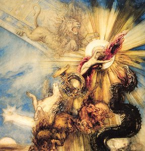

  
[Intangible Textual Heritage](../../index)  [Gnosticism](../index) 

------------------------------------------------------------------------

[Buy this Book at
Amazon.com](https://www.amazon.com/exec/obidos/ASIN/B002BA5FIO/internetsacredte)

------------------------------------------------------------------------

<table width="75%">
<colgroup>
<col style="width: 50%" />
<col style="width: 50%" />
</colgroup>
<tbody>
<tr class="odd">
<td width="50%" data-valign="TOP"> 
Phaethon, by Gustave Moreau [1878] (Public Domain Image)</td>
<td width="50%" data-valign="CENTER"><h1 id="the-gnostics-and-their-remains" data-align="CENTER">The Gnostics and Their Remains</h1>
<h2 id="by-charles-william-king" data-align="CENTER">by Charles William King</h2>
<h4 id="section" data-align="CENTER">[1887]</h4></td>
</tr>
</tbody>
</table>

------------------------------------------------------------------------

[Contents](#contents)    [Start Reading](gar00)    [Page
Index](pageidx)    [Text \[Zipped\]](gar.txt.gz)

------------------------------------------------------------------------

|                                                                                                                           |
|---------------------------------------------------------------------------------------------------------------------------|
|  |

In the mid-19th century, eighty years before the chance discovery of a
treasure trove of Gnostic manuscripts in a dump in Egypt, C.W. King
collected what was known about the Gnostics in this book. At that time
there were only three sources of information on Gnosticism: polemics
against them by [early Christian writers](../../chr/ecf/index), the
*[Pistis Sophia](../../chr/ps/index)*, and a jumble of confusing images
and cryptic inscriptions on Roman-era gems and amulets.

In spite of all of the missing jigsaw pieces, King managed to assemble a
picture of the Gnostics which is still cited today as authoritative.
Rather than one monolithic group, the Gnostics had very diverse beliefs.
Some thought that Jesus was a man, while others thought that he was a
God, and some believed that he became a God only after he was baptized.
Some believed in a struggle between good and evil, others were
non-dualistic. Most had widely-varying intricate systems of
intermediaries between the ultimate deity and humanity. On the face of
it, this looks polytheistic, but instead was an attempt to solve the
problem of how a perfect God could create an imperfect world. Many of
these *Aeons* later became the demons and angels of Medieval and
Renaissance magic.

King seeks links to Gnostic symbols and beliefs far afield, from India,
to the Templars, Rosicrucians and Illuminati. He discusses Mithra and
Serapis worship, and gives many examples of Roman and Greek magical
spells and talismans. He discusses the fudged birthdate of Jesus,
Masons' marks, and Simon Magus. The book is a fascinating tour of hidden
knowledge.

Production Notes: This text uses Unicode extensively, so you should
consult the sacred-texts [Unicode help page](../../unicode) if the Greek
and Hebrew text in this text is not displayed correctly in your browser.
There are many quotations of Greek and Latin text from inscriptions. In
some cases I have silently replaced rare forms of some greek letters
(particularly uppercase omega) with the more common ones. In the final
part of the book, there were no sub-sections. To break up this long part
of the book into files, I have inserted logical sub-section headings. As
usual, these are in green type.

--J. B. Hare, 5/28/2006

------------------------------------------------------------------------

 [Title Page](gar00)  
[Preface](gar01)  
[Contents](gar02)  
[Introduction](gar03)  

### Part I. Gnosticism and its Sources

[Gnosticism and its Origin](gar04)  
[Pistis-Sophia](gar05)  
[The Book of Enoch](gar06)  
[Gnosticism in its Beginning](gar07)  
[Influence of Judaism on the Ancient World](gar08)  
[The Zendavesta](gar09)  
[The Kabbala and the Talmud](gar10)  
[Indian Sources of Gnosticism.--Manes](gar11)  
[Buddhism](gar12)  
[Simonianism](gar13)  
[Basilides](gar14)  
[The Ophites](gar15)  
[Machinery of the Gnosis](gar16)  

### Part II. The Worship of Mithras and Serapis

[I. Origin of Mithraicism](gar17)  
[II. The Mithraic Sacraments](gar18)  
[III. A Roman Mithras in His Cave](gar19)  
[IV. Mithraic Talismans](gar20)  
[V. Gnostic Sacraments and Initiations as Connected with the
Mithraic](gar21)  
[St. Augustine on Gnosticism](gar22)  
[I. The Figured Representations of Serapis](gar23)  
[II. The Probable Origin of Serapis](gar24)  
[III. Monuments of the Serapis Worship](gar25)  
[The Caduceus, and its Symbolism](gar26)  
[Death, as Depicted in Ancient Art](gar27)  
[Tomb-Treasures](gar28)  
[I. The Evil Eye](gar29)  
[II. On a Ceraunia of Jade Converted into a Gnostic Talisman](gar30)  

### Part III. Abraxas, Abraxaster, And Abraxoid Gems

[The Agathodæmon Worship](gar31)  
[The Chnuphis Serpent](gar32)  
[I. Abraxaster, or Borrowed Types](gar33)  
[II. Abraxoids, or Gems Confounded with the True Gnostic](gar34)  
[III. The True Abraxas Gems](gar35)  
[Gnostic Plaque](gar36)  
[IV. The God Abraxas as Described by the Christian Fathers](gar37)  
[V. ''Abraxas''--Etymology of](gar38)  
[VI. Abraxas--Its Numerical Force](gar39)  
[The Abraxas Religion](gar40)  
[The Ineffable Name in the Hindoo Form](gar41)  
[Abraxas-Gems, Their Materials, Workmanship, and Nature](gar42)  
[Legends and Formulæ](gar43)  

### Part IV. The Figured Monuments of Gnosticism

[Gnostic Siglæ, Symbols, Legends Explained](gar44)  
[The Name ΙΑΩ](gar45)  
[Abraxas, New Type of](gar46)  
[Original Purpose of These Formulæ](gar47)  
[Gnostic Theogony](gar48)  
[The Scheme of the Ophites](gar49)  
[The Cause of Sin](gar50)  
[State After Death of the Uninitiated](gar51)  
[Future Punishments](gar52)  
[Talismanic Leaden Scrolls](gar53)  

### Part V. Templars, Rosicrucians, Freemasons

[Masonic Origins](gar54)  
[The Earliest Masonic Document](gar55)  
[No Relation of Modern Masons to Mediæval Guilds](gar56)  
[Masons’ Marks](gar57)  
[Origin of Modern Freemasonry](gar58)  
[The Rosicrucians](gar59)  
[The Templars](gar60)  
[Idols of Baphomet](gar61)  
[Manicheism](gar62)  
[The Assassins](gar63)  
[The Sufis](gar64)  
[Diffusion of Oriental Culture](gar65)  
[Profession of Continence](gar66)  
[Mithraicism](gar67)  
[The Transmission of Gnostic Symbols](gar68)  
[The Illuminati](gar69)  
[Conclusion](gar70)  

 

[Woodcuts in the Text](gar71)  

### Description of the Plates

[Introduction](gar72)  
[Plate A. Various Types of the God Abraxas](gar73)  
[Plate B](gar74)  
[Plate C](gar75)  
[Plate D. Sigils of the Cnuphis Serpent](gar76)  
[Plate E. Monuments of the Serapis Worship](gar77)  
[Plate F. Ancient Egyptian Types Adapted to Gnostic Ideas](gar78)  
[Plate G. Egyptian Types (continued)](gar79)  
[Plate H. Egyptian Types (continued)](gar80)  
[Plate J. Subjects Connected with the Mithraic Mysteries](gar81)  
[Plate K. Mithraic (continued)](gar82)  
[Plate L. Mithraic (continued)](gar83)  
[Plate M. General Talismans](gar84)  
[Plate N. General Talismans (continued)](gar85)  
[Plate O. Hindoo Symbols and Caste-Marks](gar86)  

 

[Bibliographical Appendix](gar87)  
[Index](gar88)  
