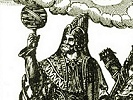

  
[Intangible Textual Heritage](../../index.md)  [Gnosticism and
Hermetica](../index)  [Index](index)  [Previous](th109)  [Next](th111.md) 

------------------------------------------------------------------------

[Buy this Book at
Amazon.com](https://www.amazon.com/exec/obidos/ASIN/0766126129/internetsacredte.md)

------------------------------------------------------------------------

  
*Thrice-Greatest Hermes, Vol. 1*, by G.R.S. Mead, \[1906\], at
Intangible Textual Heritage

------------------------------------------------------------------------

p. 139

### VII

#### THE MYTH OF MAN IN THE MYSTERIES

##### THE GNOSTIC TRADITION

“But All-Father Mind, being Life and
Light, did bring forth Man (Ἄνθρωπον) co-equal to Himself.” [1](#fn_300.md)

So runs the opening paragraph of what we may call the soteriological
part of the “Pœmandres” treatise of our Trismegistic literature. This
Man or Anthrōpos is the Spiritual Prototype of humanity and of every
individual man, and is a technical term found in a number of the early
Christianised Gnostic systems.

For instance, in a system some outlines of which are preserved in the
polemical *Refutation* of Irenæus, [2](#fn_301.md)
and which the Bishop of Lyons seems to associate with an Ophite
tradition, while Theodoret [3](#fn_302.md)
ascribes it to the Sethians, we are told that in the Unutterable Depth
were two Great Lights,—the First Man, or Father, and His Son, the Second
Man; and also the Holy Spirit, the First Woman, or Mother of all living.

In this tradition, moreover, the Son of the Mother—the chief Formative
Power of the seven Demiurgic Potencies of the sensible cosmos—is called
Ialdabaōth (? the Child of the Egg), who boasts himself to be

p. 140

supreme. But his mother, Wisdom, reproves his pride, saying unto him:
“Lie not, Ialdabaōth, for above thee is the Father of All, First Man,
and Man Son of Man.” [1](#fn_303.md)

##### THE “PHILOSOPHUMENA” OF HIPPOLYTUS

But the main source of our information on this Anthrōpos tradition, in
its Christianised Gnostic form, is to be found in Hippolytus’
*Philosophumena; or, Refutation of all Heresies.*

In 1842, Minoïdes Mynas, a learned Greek, sent on a literary mission by
the French Government, discovered in one of the monasteries on Mount
Athos the only MS. (generally ascribed to the fourteenth century) which
we possess of this extremely valuable work. It was originally in ten
books, but, unfortunately, the first three and the beginning of the
fourth are missing from our MS. The first book, however, was already
known, though previously erroneously ascribed to Origen, and was
accordingly prefixed to the text of the *editio princeps* of our work by
Emmanuel Miller (Oxford, 1851).

The missing Books II. and III. dealt respectively with the doctrines and
mysteries of the Egyptians and with those of the Chaldæans. Hippolytus
(Proœm.) boasts that he has divulged all their mysteries, as well as the
secrets of those Christian mystics whom he stigmatises as heretics, and
to whom he devotes Books V.-IX.

It is a curious fact that it is precisely those Books wherein this
divulging of the Mysteries was attempted, which should be missing; not
only have they disappeared, but in the Epitome at the beginning of Book
X. the summary of their contents is also omitted. This seems almost to
point to a deliberate removal of just

p. 141

that information which would be of priceless value to us to-day, not
only for the general history of the evolution of religious ideas, but
also for filling in an important part of the background of the
environment of infant Christianity.

Why, then, were these books cut out? Were the subsequent Christian
Orthodox deterred by religious scruples, or were they afraid to
circulate this information? Hippolytus himself seems to have had no such
hesitation; he is ever delightedly boasting that he is giving away to
the multitude the most sacred secrets of others; it seems to have been
his special *métier* to cry aloud on the house-tops what had been
whispered in their secret chambers. It was for him a delicious triumph
over “error” to boast, “I have your secret documents, and I am going to
publish them!”

Why, then, should those who came after him hesitate? Surely they were
like-minded with Hippolytus, and would have been as delighted as himself
in humbling the pride of the hated Mystery-institutions in the dust? Can
it possibly be that they saw far more clearly than he did that quite
other deductions might be drawn from his “startling revelations”?

##### THE NAASSENES

That far other deductions could be drawn from the Mystery-rites and
Mystery-myths was at anyrate the view of a tradition of early Jewish and
Christian mystics whom Hippolytus calls Naassenes. The claim of these
Gnostics was practically that Christianity, or rather the Good News of
the Christ, was precisely the consummation of the inner doctrine of the
Mystery-institutions of all the nations; the end of them all was the
revelation of the Mystery of Man.

p. 142

It is further to be noticed that these Naassenes, “who call themselves
Gnostics” (v. 2), are the very first school of Christian “heresy” with
which Hippolytus deals; he puts them in the forefront of his
*Refutation,* as being, presumably, in his opinion, the oldest, or, at
anyrate, as representing the most ancient form of Christian “heresy.”

Although the name Naassene (Ναασσηνοί) is derived from the Hebrew
*Naḥash* (Serpent), Hippolytus does not call them Ophites; indeed, he
reserves the latter name to a body to which he also gives (viii. 20) the
name Caïnites and Nochaïtæ (Νοχαϊταί)—? Nachaïtæ, again, from
*Nachash* [1](#fn_304.md)—and considers them of
not sufficient importance for further mention.

These Naassenes possessed many secret books or *apocrypha*—that is,
books kept back from general circulation—and also regarded as
authoritative the following scriptures: *The Gospel of Perfection, The
Gospel of Eve, The Questions of Mary,* [2](#fn_305.md) *Concerning the Offspring of Mary, The
Gospel of Philip, The Gospel according to Thomas,* and *The Gospel
according to the Egyptians.* All of which points somewhat to an
Alexandrian or Egyptian circle.

##### ANALYSIS OF HIPPOLYTUS’ ACCOUNT OF THE NAASSENE DOCUMENT

One of their secret MSS. had fallen into the hands of Hippolytus. It is
in the Bishop of Portus’ quotations

p. 143

from this document that Reitzenstein (pp. 81 ff.) seeks to discover what
he calls the “Hellenistic Myth of the God Anthrōpos.” His theory is
that, by eliminating the Christian citations and thoughts of the
Naassene writer, we are face to face with a purely Heathen document.

The reproduction of their views, as given by Hippolytus, [1](#fn_306.md) falls according to Reitzenstein into
three divisions.

(i.) The first begins with the explanation of the name “Naassene” (S.
131, 1; C. 139, 1 [2](#fn_307).md), and, after
giving a few brief headings, ends (S. 134, 8; C. 141, 2) with the
statement that the writer of the MS. said they had their tradition from
James, the Brother of the Lord, who had delivered it to Mariamnē.

(iii.) The third begins (S. 170, 64; C. 178, 1) with another explanation
of the name. In both of these parts are found remains of hymns from some
liturgical collection.

(ii.) Between i. and ii. lies a longer exposition in which Hippolytus
tries to show that the Naassene doctrines are taken from the Mysteries,
culminating in the assertion that the Naassenes, as a matter of fact,
were nothing else than sectaries of the Mysteries of the Mother of the
Gods, in proof of which he quotes at length from a secret document of
their school.

Our interest in these quotations, however, is very different from that
of Hippolytus, for, as Reitzenstein has now shown, it is manifest on
inspection that the Christian quotations and thoughts in this document

p. 144

violently disrupt its underlying continuity, and that they are for the
most part easily removable without damage to the sense.

With regard to the Old Testament quotations it is not always so easy to
disentangle them from the Hellenistic source, much less from the New
Testament quotations; the phenomena, however, presented by them are of
such a nature that, in my opinion, there is ample evidence before us
that there was a Jewish working-over of the matter before it came into
the hands of the Christian overwriter. Reitzenstein, however, does not
venture so far.

Even, then, if we were content with Reitzenstein’s analysis only, it is
quite clear that the quotations from the Old Testament formed no part of
the original; and that we have, therefore, before us what was once a
purely Heathen text, with Gnostic Christian *scholia,* or rather
overworked by a Christian Gnostic. The original Pagan text had,
accordingly, been cut up by the Naassene overwriter before ever it came
into the hands of Hippolytus.

Now, as the Christianised text must have been for some time in private
circulation before it reached the library of the Bishop of Portus [1](#fn_308.md)—even if we make no allowance for a
Jewish Hellenistic stratum of overwriting, still seeing that Hippolytus’
own view was that, in the Naassene MS., he had before him a basic
document of those whom he regarded as the earliest Christian
“heretics”—it is quite evident that if we were to place the date of the
original Hellenistic source in the first century, we should not be doing
violence even to the ecclesiastical traditional absurdity that
Gnosticism first sullied the orthodox purity of the Church only

p. 145

in the reign of Trajan (96-117 A.D.). But we will return to the question
of date later on.

As the whole matter is not only one of considerable interest for the
student of our treatises, but also of the greatest importance for the
student of the history of Gnosticism, I shall give a translation of
Hippolytus’ introductory and concluding sections, as well as of the
intermediate section which specially concerns us, so that the reader may
have a view of the whole medley as it comes to us from the hands of the
heresy-hunting bishop.

I shall, moreover, proceed a stage further in the analysis of the
material of Hippolytus than Reitzenstein has done, and hope, when the
evidence has been laid before the reader, to win his assent to what
appears to me to be the natural sifting out of the various elements,
with resultant phenomena which are of the greatest importance for the
history of Gnosticism, and, therefore, of the evolution of Christian
dogmatics, and which lead to conclusions that are far too serious to be
treated in the short space of a single chapter of our present essay.

In the following analysis H. stands for Hippolytus; C. for the Christian
Gnostic final overwriter, the “Naassene” whose MS. lay before H.; J. for
the Naassene Jewish mystic who preceded C. and overworked the original;
S. for the original Heathen Hellenistic Source.

As H. and C. are of secondary importance for our immediate enquiry,
though of themselves of the greatest value and interest, I shall print
them in smaller type. J. I shall print in the same type as S., as nearer
in contact with S. than C., and as being sometimes more difficult to
detach from S. than from C.

The reader, to have the text of Hippolytus before him, must neglect all
the critical indications and read straight on.

p. 146

With these brief preliminary indications we will, then, present the
reader with a translation of the first section, or introductory
part, [1](#fn_309.md) of Hippolytus’ exposure or
exposition of the Naassene doctrines, begging him to remember throughout
that it is a portrait painted by the hand of one of their bitterest
foes.

##### HIPPOLYTUS’ INTRODUCTION

H. The priests and chiefs of \[this\]
doctrine [2](#fn_310.md) were first of all those
who were called Naasseni—so named in Hebrew, \[in which\] “serpent” is
called *naas*. [3](#fn_311.md) But subsequently
they called themselves Gnostics, pretending that they alone knew the
Depths. 

From these many separated themselves and
\[so\] turned the school, which was originally a single one, into
numerous sects, setting forth the same ideas in various doctrinal forms,
as our argument will show as it advances. 

These \[Naassenes\] honour as the Logos
(Reason) of all universals [4](#fn_312.md) Man,
and Son of Man. This Man is male-female, and is called by them
Adamas. [5](#fn_313.md) And they have many
intricate [6](#fn_314.md) hymns in his honour.
These hymns—to dispose of them briefly—run somewhat as follows: 

J. ‘“From Thee’ \[is\] Father, and ‘Through Thee’ [7](#fn_315.md) Mother—the two Immortal Names, [8](#fn_316.md) Parents of Æons, O Thou who hast the
Heaven for Thy City, O Man of Mighty Names.” [9](#fn_317.md)

p. 147

H. And they divide him into three, like
Gēryōnēs; [1](#fn_318.md) for, they say, he has a
mental, psychic, and choïc \[aspect\]; [2](#fn_319.md) and they think that the Gnosis of [3](#fn_320.md) this \[Man\] is the beginning of the
possibility of knowing God, saying: 

J. The beginning of Perfection \[is\] the Gnosis of Man, but the Gnosis
of God is perfected Perfection. [4](#fn_321.md)

H. All these, he says [5](#fn_322.md)—mental, psychic, and earthy—descended
together into one man—Jesus, born of Mary. 

And these three Men, he says, spake each
from their own special essences to their own special folk. 

For of the universal principles there are
three kinds \[or races\]—the angelic, psychic, and earthy; and three
churches—angelic, psychic, and earthy named the Elect, Called, and
Bound. 

These are the chief heads from a very
large number of doctrines, [6](#fn_323.md) which,
he says, James, the Brother of the Lord, handed on to Mariamnē. [7](#fn_324.md) 

p. 148

But in order that we may put an end to
the lying accounts of these impious \[heretics\] concerning Mariamnē,
and James, and the Saviour Himself, [1](#fn_325.md) let us come to the Initiations from
which they get this myth—if you like \[to call it so\]—to the
non-Grecian and Grecian \[Initiations\]; and let us see how, by
combining together the secret Mysteries of all the Gentiles which must
not be spoken of, and by telling lies about the Christ, they take in
those who do not know that these things are the Orgies of the Gentiles.

Now, since the foundation of their system
is Man Adamas, and they say it has been written of him, “Who shall
declare his generation?” [2](#fn_326.md)—learn how
they have taken the undiscoverable and contradictory generation of Man
and plastered it on the Christ.

##### THE MATERIAL FOR THE RECOVERY OF THE ORIGINAL HELLENISTIC DOCUMENT

\(1\) S. “Earth (say the Greeks [3](#fn_327).md)
first brought forth Man—bearing a fair gift, desiring to be mother not
of plants without feeling, nor of brutes without reason, but of a tamed
God-loving life.

“Difficult is it (H. he says [4](#fn_328).md) to discover whether it was among
the Bœotians that Alalkomeneus rose from the Kephisian Lake as first of
men; or whether

p. 149

it was the Idæan Kurētes, race divine, or the Phrygian Korybantes, whom
Helios saw first sprouting forth tree-like; or whether Arkadia brought
forth Pelasgos \[first\], older than the Moon; or Eleusis Diaulos,
dweller in Raria; or Lēmnos Kabeiros, fair child of ineffable
orgies; [1](#fn_329.md) or whether Pallēnē
Phlegræan Alkyoneus, eldest of Giants.

“The Libyans say that Garamas, [2](#fn_330.md)
rising from parched plains, first picked sweet date of Zeus; while
Neilos, making fat the mud of Egypt to this day (H. he says), breeds living things, and
renders from damp heat things clothed in flesh.” [3](#fn_331.md)

The Assyrians say it was with them Ōannēs, the Fish-eater; while the
Chaldæans \[say that it was\] Adam.

\(2\) J. And this Adam they \[the Chaldæans\] say was the man that Earth
produced—a body only, and that he lay breathless, motionless, immovable,
like a statue, being an image of that Man Above—

p. 150

H. —of whom they sing, and brought into
existence by the many Powers, [1](#fn_332.md)
concerning which there is much detailed teaching. 

J. In order, then, that the Great Man from Above—

C. From whom, as is said, every
fatherhood has its name on earth or in the heavens. [2](#fn_333.md)

J. —might be completely brought low, there was given unto him [3](#fn_334.md) Soul also, in order that through the
Soul the enclosed plasm of the Great, Most-fair, and Perfect Man might
suffer and be chastened.

H. For thus they call Him. They seek to
discover then further what is the Soul, and whence, and of what nature,
that by entering into man and moving him, it should enslave and chasten
the plasm of the Perfect Man; but they seek this also not from the
Scriptures, but from the Mysteries. 

\(3\) S. And they [4](#fn_335.md) say that Soul is
very difficult to discover, and hard to understand; for it never remains
of the same appearance, or form, or in the same state, so that one can
describe it by a general type, [5](#fn_336.md) or
comprehend it by an essential quality.

H. These variegated metamorphoses
they [6](#fn_337.md) have laid down in the Gospel,
superscribed “According to the Egyptians.” [7](#fn_338.md) 

S. They are accordingly in doubt—

H. —like all the rest of the
Gentiles—

J. —whether it \[*sc.* the Soul\] is from the Pre-existing \[One\], or
from the Self-begotten, or from the Streaming Chaos. [8](#fn_339.md)

p. 151

H. And first of all, in considering the
triple division of Man, they fly for help to the Initiations of the
Assyrians; for the Assyrians were the first to consider the Soul triple
and \[yet\] one. 

\(4\) S. Now every nature (H. he
says) yearns after Soul—one in one way and another in another.

For Soul is cause of all in Genesis. All things that are sustained and
grow (H. he says) need Soul.
Indeed, no sustenance (H. he says)
or growth is possible without the presence of Soul.

Nay, even stones (H. he says) are
ensouled; [1](#fn_340.md) for they have the power
of increase \[or growth\]; and growth could not take place without
sustenance; for it is by addition that things which increase grow; and
addition is the sustenance of that which is sustained. [2](#fn_341.md)

\(5\) Now the Assyrians call this \[Mystery\] Adōnis (or Endymiōn). And
whenever it is called Adōnis (H. he
says), it is Aphroditē who is in love with and desires Soul
so-called.

H. And Aphroditē is Genesis according to
them. [3](#fn_342.md)

But when Persephonē (that is, Korē) is in love with Adōnis, Soul becomes
subject to Death, separated from Aphrodite (that is, from Genesis).

But if Selēnē is impassioned of Endymiōn, and is in

p. 152

love with \[formal\] beauty, [1](#fn_343.md) it is
the Nature of the higher \[spaces [2](#fn_344.md)\] (H. he
says) which desires Soul.

(6 [3](#fn_345).md) But if (H. he says) the Mother of the Gods
emasculate Attis—she, too, regarding him as the object of her love—it is
the Blessed Nature Above of the supercosmic and æonian \[spaces\] which
calls back the masculine power of Soul to herself. [4](#fn_346.md)

H. For Man, he says, is male-female.
According, then, to this theory of theirs, the intercourse between man
and woman is exhibited as most mischievous, and is forbidden according
to their teaching. 

J. For Attis (H. he says) is
emasculated—that is, \[Soul is separated\] from the earthy parts of the
creation \[tending\] downwards, and ascends in quest of the Æonian
Essence Above—

p. 153

C. —where (H. he says) is “neither male
nor female,” [1](#fn_347.md) but a new creature, a
new man, who is male-female. 

H. What they call “Above” I will explain
when I come to the proper place. And they say that this theory is
supported not simply by \[the myth\] of Rhea, but also, to put it
briefly, by universal creation. 

Nay, they make out that this is \[even\]
what was said by the Word (*Logos*): [2](#fn_348.md)

C. “For the invisible [3](#fn_349.md) things of Him \[God\]—namely, His
Eternal [4](#fn_350.md) Power and Godhead—are
clearly seen from the creation of the world, being understood by His
things that are made; so that they \[men\] are without excuse. Because
that, though knowing God, they glorified Him not as God, nor did they
give \[Him\] thanks, but their non-understanding heart was made
foolish. [5](#fn_351.md)

p. 154

“Professing themselves to be wise, they
convicted themselves of folly, and changed the Glory of the
Incorruptible God into the likeness of an image of corruptible man, and
of birds, and of four-footed beasts, and creeping things. [1](#fn_352.md) . . . [2](#fn_353.md) 

“Wherefore also God gave them up to
passions of dishonour; for both their females did change their natural
use to that which is against nature—

H. And what the natural use is, according
to them, we will say later on.

C. —“and likewise also their males,
leaving the natural use of the female, burned in their lust for one
another, males with males working unseemliness [3](#fn_354.md)—

H. And “unseemliness,” according to them,
is the First and Blessed Formless Essence, the Cause of all forms for
things enformed. [4](#fn_355.md)

C. —“and receiving in themselves the
recompense of their Error which was meet.” 

H. For in these words which Paul spake is
contained, they say, the whole of their hidden and ineffable Mystery of
the Blessed Bliss. 

For what is promised by the \[rite of
the\] bath [5](#fn_356.md) is nothing else,
according to them, than the introduction into Unfading Bliss of him who,
according to them, is washed with Living Water, and anointed with the
Chrism that no tongue can declare. [6](#fn_357.md)

p. 155

\(7\) And they say that not only the
Mysteries of the Assyrians and Phrygians substantiate this teaching
(*logos*) concerning the Blessed Nature, which is at once hidden and
manifest \[but also those of the Egyptians [1](#fn_358.md)\]. 

C. [2](#fn_359.md)
\[The Nature\] which (H. he says) is the Kingdom of the Heavens sought
for within man—

H. —concerning which \[Nature\] they hand
on a distinct tradition in the Gospel entitled *According to Thomas,*
saying as follows: 

C. “He who seeketh shall find me in
children from the age of seven years [3](#fn_360.md); for in them at the fourteenth
year [4](#fn_361.md) \[lit. æon\] I hidden am made
manifest.”

H. But this is not Christ’s Saying but
that of Hippocrates: 

“A boy of seven years \[is\] half a
father.” [5](#fn_362.md) 

Hence as they place the Original Nature
of the universals in the Original Seed, having learned the Hippocratian
*dictum* that a child of seven is half a father, they say at fourteen
years, according to Thomas, it is manifested. This [6](#fn_363.md) is their ineffable and mysterious
Logos. [7](#fn_364.md) 

(8 [8](#fn_365).md) S. (H.—At anyrate they say that) the
Egyptians—who are the most ancient of men after the Phrygians, who at
the same time were confessedly the first to communicate to mankind the
Mystery-rites and Orgies of all the Gods, and to declare their Forms and
Energies—have the mysteries of Isis, holy, venerable, and not to be
disclosed to the uninitiated.

p. 156

H. And these are nothing else than the
robbing of the member of Osiris, and its being sought for by the
seven-robed and black-mantled [1](#fn_366.md)
\[Goddess\]. 

And (they \[the Egyptians\] say) Osiris is Water. [2](#fn_367.md) And Seven-robed Nature—

H. —having round her, nay, robing
*herself* in seven ætheric vestures—for thus they [3](#fn_368.md) allegorically designate the
planet-stars, calling \[their spheres\] ætheric vestures—

S. —being metamorphosed, as ever-changing Genesis, by the Ineffable and
Uncopiable and Incomprehensible and Formless, is shown forth as
creation.

J. And this is what (H. he says)
is said in the Scripture:

“Seven times the Just shall fall and rise again.” [4](#fn_369.md)

For these “fallings” (H. he says)
are the changes of the stars, [5](#fn_370.md) set
in motion by the Mover of all things.

\(9\) S. Accordingly they [6](#fn_371.md) declare
concerning the Essence of the Seed which is the cause of all things in

p. 157

\[paragraph continues\] Genesis, that it
is none of these things, but that it begets and makes all generated
things, saying:

“I become what I will, and am what I am.” [1](#fn_372.md)

Therefore (H. he says) That which
moves all is unmoved; for It remains what It is, making all things, and
becomes no one of the things produced.

(H. He says that) This is the Only
Good—

C. And concerning this was spoken what
was said by the Saviour: 

“Why callest thou me Good? One is
Good [2](#fn_373.md)—my Father in the Heavens, who
maketh His sun to rise on righteous and unrighteous, and sendeth rain on
saints and sinners.” [3](#fn_374.md)

H. And who are the saints on whom He
sendeth rain and the sinners on whom He also sendeth rain—this also he
tells subsequently with the rest. 

S. —and (H. that) This is the
Great, Hidden, and Unknown Mystery of the Egyptians, Hidden and \[yet\]
Revealed.

For there is no temple (H. he
says) before the

p. 158

entrance of which the Hidden \[Mystery\] does not stand naked, pointing
from below above, and crowned with all its fruits of generation.

\(10\) And (H. they say) it stands
so symbolised not only in the most sacred temples before the statues,
but also set up for general knowledge—

C. —as it were “a light not under the
bushel, but” set “on the candlestick” [1](#fn_375.md)—a preaching “heralded forth on the
house-tops.” [2](#fn_376.md)

S. —on all the roads and in all the streets, and alongside the very
houses as a boundary and limit of the dwelling; (H. that) This is the God spoken of by
all, for they call Him Bringer-of-good, not knowing what they say.

H. And this mystery \[-symbol\] the
Greeks got from the Egyptians, and have it \[even\] to this day.

At anyrate, he says, we see the
“Hermes” [3](#fn_377.md) honoured by them in this
form. 

\(11\) S. And the Cyllenians, treating \[this symbol\] with special
honour, \[regard it as the\] Logos. [4](#fn_378.md)

For (H. he says) Hermes is \[the\]
Logos, who, as being the Interpreter and Fabricator of all things that
have been and are and shall be, was honoured by them under the symbolism
of this figure, namely an ithyphallus.

And that he (H. that is Hermes, so
symbolised) is

p. 159

\[paragraph continues\] Conductor and
Reconductor of souls, [1](#fn_379.md) and Cause of
souls, has not escaped the notice of the poets (H. of the Gentiles), when saying:

> “But Cyllenian Hermes summoned forth the souls  
> Of men mindful” [2](#fn_380.md)—

—not the “suitors” of Penelope (H. he
says), hapless wights! but of those who are roused from sleep,
and have their memory restored to them—

> “From what honour and \[how great\] degree of blessedness.”  id="fr_381">[3](#fn_381.md)

J. That is, from the Blessed Man Above—

H. —or Original Man, or Adamas, as
they [4](#fn_382.md) think—

J. —they [5](#fn_383.md) have been thus brought
down into the plasm of clay, in order that they may be enslaved to the
Demiurge of this creation, Esaldaios [6](#fn_384.md)—

H. —a fiery God, fourth in number, for
thus they call the Demiurge and Father of this special cosmos. [7](#fn_385.md) 

p. 160

> \(13\) S. “And he [1](#fn_386.md) holds a rod in
> his hands,  
> Beautiful, golden; and with it he spell-binds the eyes of men,  
> Whomsoever he would, and wakes them again too from sleep.”  id="fr_387">[2](#fn_387.md)

This (H. he says) is He who alone
hath the power of life and death. [3](#fn_388.md)

J. Concerning Him it is written: “Thou shalt shepherd them with a rod of
iron.” [4](#fn_389.md)

But the poet (H. he says), wishing
to embellish the incomprehensibility of the Blessed Nature of the Logos,
bestowed upon Him a golden instead of an iron rod.

S. “He spell-binds the eyes” of the dead (H. he says), and “wakes them again too
from sleep”—those who are waked from sleep and become “mindful.” [5](#fn_390.md)

C. Concerning them the Scripture saith:
“Awake thou that sleepest, and rise, and Christ will give thee
light.” [6](#fn_391.md) 

This is the Christ, the Son of Man (H. he
says), expressed in all who are born from the Logos, whom no expression
can express.

S. This (H. he says) is the Great
Ineffable Mystery of the Eleusinia: “Hye Kye.” [7](#fn_392.md)

p. 161

J. And that (H. he says) all
things have been put under Him, this too has been said: “Into all the
earth hath gone forth their sound.” [1](#fn_393.md)

\(14\) S. And “Hermes leads them, moving his rod, and they follow,
squeaking” [2](#fn_394.md)—the souls in a cluster,
as the poet hath shown in the following image:

> “But as when bats into some awesome cave’s recess  
> Fly squeaking—should one from out the cluster fall  
> Down from the rock, they cling to one another.”  id="fr_395">[3](#fn_395.md)

J. The “rock” (H. he says) means
Adamas. This (H. he says) is the
“corner-stone”—

C. —“that hath become the head of the
corner.” [4](#fn_396.md) For in the

p. 162

\[paragraph continues\] “Head” is the expressive Brain [1](#fn_397.md) of the Essence, from which \[Brain\]
“every fatherhood” [2](#fn_398.md) has its
expression—

J. —which “I insert in the foundation of Zion.” [3](#fn_399.md)

\[By this\] (H. he says) he [4](#fn_400.md) means, allegorically, the plasm of man.
For the Adamas who is “inserted” is \[the inner man, and the
“foundations of Zion” are [5](#fn_401.md)\] the
“teeth”—the “fence of the teeth,” as Homer says—the Wall and
Palisade [6](#fn_402.md) in which is the inner
man, fallen into it from the Primal Man, the Adamas Above—\[the Stone\]
“cut without hands” [7](#fn_403.md) cutting it,
and brought down into the plasm of forgetfulness, the earthy, clayey
\[plasm\].

\(15\) S. And (H. he says that)
they followed Him squeaking [8](#fn_404.md)—the
souls, the Logos.

> “Thus they went squeaking together; and he led them on,  
> Hermes, the guileless, down the dark ways.”  id="fr_405">[9](#fn_405.md)

That is, (H. he says) \[He led
them\] into the eternal lands free from all guile. For where (H. he says) went they?

> \(16\) “They passed by the streams of Ocean, and by the White Rock,  
> By the Gates of the Sun, and the People of Dreams.”  id="fr_406">[10](#fn_406.md)

For He (H. he says) is
Ocean—“birth-causing of

p. 163

gods and birth-causing of men” [1](#fn_407.md)—flowing and ebbing for ever, now up and
now down.

J. When Ocean flows down (H. he
says), it is the birth-causing of men; and when \[it flows\] up,
towards the Wall and Palisade, and the “White Rock,” it is the
birth-causing of gods.

This (H. he says) is what is
written:

“‘I have said ye are Gods and all Sons of the Highest’ [2](#fn_408.md)—if ye hasten to flee from Egypt and get
you beyond the Red Sea into the Desert”; that is, from the intercourse
below to the Jerusalem Above, who is the Mother of the Living. [3](#fn_409.md) “But if ye turn back again into
Egypt”—that is, to the intercourse below—“‘ye shall die like
men.’” [4](#fn_410.md)

For (H. he says) all the
generation below is subject to death, but the \[birth\] begotten above
is superior to death.

C. For from water alone—that is,
spirit—is begotten the spiritual \[man\], not the fleshly; the lower
\[man\] is fleshly. That is (H. he says) what is written: “That which is
born of the flesh is flesh, and that which is born of the spirit is
spirit.” [5](#fn_411.md) 

H. This is their [6](#fn_412.md) spiritual birth. 

J. This (H. he says) is the Great
Jordan, which, flowing downwards and preventing the sons of Israel

p. 164

from going forth out of Egypt, or from the intercourse below—

H. —for Egypt is the body, according to
them—

J. —was turned back by Jesus [1](#fn_413.md) and
made to flow upwards.

H. Following after these and such like
\[follies\], these most wonderful “Gnostics,” discoverers of a new
grammatical art, imagine that their prophet Homer showed forth these
things arcanely; and, introducing those who are not initiated into the
Sacred Scriptures into such notions, they make a mock of them. 

And they say that he who says that all
things are from One, is in error, \[but\] he who says they are from
Three is right, and will furnish proof of the first principles \[of
things\]. [2](#fn_414.md) 

J. For one (H. he says) is the
Blessed Nature of the Blessed Man Above, Adamas; and one is the
\[Nature\] Below, which is subject to Death; and one is the Race without
a king [3](#fn_415.md) which is born Above—where
(H. he says) is Mariam the
sought-for, and Jothōr the great sage, and Sepphōra the seeing, and
Moses whose begetting is not in Egypt—for sons were born to him in
Madiam. [4](#fn_416.md)

S. And this (H. he says) also did
not escape the notice of the poets:

p. 165

“All things were threefold divided, and each received his share of
honour.” [1](#fn_417.md)

C. For the Greatnesses (H. he says) needs
must be spoken, but so spoken by all everywhere, “that hearing they may
not hear, and seeing they may not see.” [2](#fn_418.md) 

J. For unless (H. he says) the
Greatnesses [3](#fn_419.md) were spoken, the
cosmos would not be able to hold together. These are the Three
More-than-mighty Words (*Logoi*): Kaulakau, Saulasau, Zeēsar;—Kaulakau,
the \[Logos\] Above, Adamas; Saulasau, the \[Logos\] Below; Zeēsar, the
Jordan flowing upwards. [4](#fn_420.md)

(17 [5](#fn_421).md) S. He (H. he says) is the male-female Man

p. 166

in all, whom the ignorant call three-bodied Gēryonēs—Earth-flow-er, as
though flowing from the earth; [1](#fn_422.md)
while the Greek \[*theologi*\] generally call Him the “Heavenly Horn of
Mēn,” [2](#fn_423.md) because He has mixed and
mingled [3](#fn_424.md) all things with all.

C. For “all things (H. he says) were made
through Him, and without Him no one thing was made that was made. In Him
is Life.” [4](#fn_425.md) 

This (H. he says) is “Life,” the
ineffable Race of perfect men, which was unknown to former generations.

And the “nothing” [5](#fn_426.md) which hath been made “without Him,” is
the special cosmos; [6](#fn_427.md) for the latter
hath been made without Him by the third and fourth \[? Ruler\]. [7](#fn_428.md) 

p. 167

J. This [1](#fn_429.md) (H. he says) is the drinking-vessel—the
Cup in which “the King drinketh and divineth.” [2](#fn_430.md)

This (H. he says) was found hidden
in the “fair seed” of Benjamin.

\(18\) S. The Greeks also speak of it (H.
he says) with inspired tongue, as follows:

> “Bring water, bring \[me\] wine, boy!  
> Give me to drink, and sink me in slumber!  id="fr_431">[3](#fn_431.md)  
> My Cup tells me of what race I must be born,  
> \[Speaking with silence unspeaking\].”  id="fr_432">[4](#fn_432.md)

C. This (H. he says) would be sufficient
alone if men would understand—the Cup of Anacreon speaking forth
speechlessly the Ineffable Mystery. 

J. For (H. he says) Anacreon’s Cup
is speechless—in as much as it tells him (says Anacreon) with speechless
sound of what Race he must be born—

C. —that is, spiritual, not
carnal—

J. —if he hear the Hidden Mystery in Silence.

C. And this is the Water at those Fair
Nuptials which Jesus turned and made Wine.

“This (H. he says) is the great and true
beginning of the signs which Jesus wrought in Cana of Galilee, and made
manifest His Kingship \[or Kingdom\] of the Heavens.” [5](#fn_433.md) 

This (H. he says) is the Kingship \[or
Kingdom\] of the Heavens within us, [6](#fn_434.md) stored up as a Treasure, [7](#fn_435.md) as “Leaven hid in three measures of
Flour.” [8](#fn_436.md) 

p. 168

(19 [1](#fn_437).md) S. This is (H. he says) the Great Ineffable Mystery
of the Samothracians,—

C. —which it is lawful for the perfect
alone to know—\[that is\] (H. he says) for us. 

J. For the Samothracians, in the Mysteries which are solemnised among
them, explicitly hand on the tradition that this Adam is the Man
Original.

S. Moreover, [2](#fn_438.md) in the initiation
temple of the Samothracians stand two statues of naked men, with both
hands raised to heaven and ithyphallic, like the statue of Hermes in
Cyllene. [3](#fn_439.md)

J. The statues aforesaid are images of the Man Original. [4](#fn_440.md)

C. And \[also\] of the regenerated [5](#fn_441.md) spiritual \[man\], in all things of like
substance with that Man. 

This (H. he says) is what was spoken by
the Saviour: 

“If ye do not drink My Blood and eat My
Flesh, ye shall not enter into the Kingdom of the Heavens. [6](#fn_442.md)

“But even if ye drink (H. he says) the
Cup which I drink, [7](#fn_443.md) where I go,
there ye cannot come.” [8](#fn_444.md)

p. 169

For He knew (H. he says) of which nature
each of His disciples is, and that it needs must be that each of them
should go to his own nature. 

For from the twelve tribes (H. he says)
He chose twelve disciples, and through them He spake to every
tribe. [1](#fn_445.md) 

On this account (H. he says) all have not
heard the preachings of the twelve disciples; and even if they hear,
they cannot receive them. For the \[preachings\] which are not according
to their nature are contrary to it. 

\(20\) S. This \[Man\] (H. he
says) the Thracians who dwell round Haimos call Korybas, [2](#fn_446.md) and the Phrygians in like manner with
the Thracians; for taking the source of His descent from the Head
Above [3](#fn_447.md)—

J. —and from the expressive Brain [4](#fn_448.md)—

S. —and passing through all the sources of all things beneath—how and in
what manner He descends we do not understand.

J. This is (H. he says) what was
spoken:

“His Voice we heard, but His Form we have not seen.” [5](#fn_449.md)

For (H. he says) the Voice of Him,
when He hath been delegated and expressed, is heard, but the Form that
descended from Above, from the Inexpressible \[Man\]—what it is, no one
knows. It is in the earthy plasm, but no one has knowledge of it.

This \[Man\] (H. he says) is He
who “inhabiteth the

p. 170

\[paragraph continues\] Flood,” [1](#fn_450.md) according to the Psalter, who cries and
calls from “many waters.” [2](#fn_451.md)

The “many waters” (H. he says) are
the manifold genesis of men subject to death, from which He shouts and
calls to the Inexpressible Man, saying:

“Save my \[? Thy\] alone-begotten from the lions.” [3](#fn_452.md)

To this \[Man\] (H. he says) it
hath been spoken:

“Thou art my Son, O Israel, [4](#fn_453.md) fear
not; should’st thou pass through rivers, they shall not engulph thee;
should’st thou pass through fire, it shall not consume thee.” [5](#fn_454.md)

By “rivers” (H. he says) he [6](#fn_455.md) means the Moist Essence of Genesis, and
by “fire” the impulse and desire towards Genesis.

And: “Thou art mine; fear not.” [7](#fn_456.md)

And again he [8](#fn_457.md) says:

“If a mother forget her children so as not to take pity on them or give
them suck, \[then\] I too will forget you” [9](#fn_458.md)—saith Adamas (H. he says) to his own men.

“Nay, even if a woman shall forget them, I will not forget you. Upon my
hands have I graven you.” [10](#fn_459.md)

And concerning His Ascent—

C. —that is, his regeneration in order
that he may be born spiritual, not fleshly.

J. —the Scripture saith (H. he
says):

“Lift up the gates, ye who are rulers of you, and be

p. 171

ye lift up ye everlasting gates, and the King of Glory shall come
in.” [1](#fn_460.md)

This is a wonder of wonders.

“For who (H. he says) is this King
of Glory? [2](#fn_461.md) A worm [3](#fn_462.md) and no man, the scorn of men, and the
contempt of the people. [4](#fn_463.md) He is the
King of Glory, the Mighty in War.” [5](#fn_464.md)

By “War” he [6](#fn_465.md) means the “\[war\] in
the body,” for the plasm is compounded of warring elements, as it is
written (H. he says):

“Remember the war that is \[warred\] in the body.” [7](#fn_466.md)

This (H. he says) is the Entrance,
and this is the Gate, which Jacob saw, when he journeyed into
Mesopotamia. [8](#fn_467.md)

C. Which is the passing from childhood to
puberty and manhood; that is, it was made known to him who journeyed
into Mesopotamia. 

J. And Meso-potamia (H. he says)
is the Stream of Great Ocean flowing from the middle of the Perfect Man.

And he [9](#fn_468.md) marvelled at the Heavenly
Gate, saying:

“How terrible \[is\] this place! This is naught else than the House of
God; yea, this \[is\] the Gate of Heaven.” [10](#fn_469.md)

C. On this account (H. he says) Jesus
saith: 

“I am the True Door.” [11](#fn_470.md) 

J. And he [12](#fn_471.md) who says these things
is (H. he says)

p. 172

the \[one\] from the Inexpressible Man, expressed from Above—

C. —as the perfect man. The not-perfect
man, therefore, cannot be saved unless he be regenerated passing through
this Gate. 

\(21\) S. This same \[Man\] (H. he
says) the Phrygians call also Papa; [1](#fn_472.md) for He calmed [2](#fn_473.md) all things which, prior to His own
manifestation, were in disorderly and inharmonious movement.

For the name Papa (H. he says) is
\[the\] Sound-of-all-things-together in Heaven, and on Earth, and
beneath the Earth, saying: “Calm, calm” [3](#fn_474.md) the discord of the cosmos.

C. And: Make “peace for them that are
far”—that is, the material and earthy—“and peace for them that are
near” [4](#fn_475.md)—that is, the spiritual and
knowing and perfect men. 

\(22\) S. The Phrygians call Him also Dead—when buried in the body as
though in a tomb or sepulchre.

C. This (H. he says) is what is said:

“Ye are whited sepulchres, filled (H. he
says) within with bones of the dead, [5](#fn_476.md) for Man, the Living \[One\] [6](#fn_477.md) is not in you.” 

And again He says: 

“The dead shall leap forth from their
graves” [7](#fn_478.md)—

—that is, from their earthy bodies,
regenerated spiritual, not fleshly. 

This (H. he says) is the Resurrection
which takes place

p. 173

through the Gate of the Heavens, through
which all those who do not pass (H. he says) remain Dead. 

S. The same Phrygians again call this very same \[Man\], after the
transformation, God \[or a God\]. [1](#fn_479.md)

C. For he becomes (H. he says) God when,
rising from the Dead, through such a Gate, he shall pass into Heaven.

This is the Gate (H. he says) which Paul,
the Apostle, knew, setting it ajar in a mystery, and saying that he was
caught up by an angel and came to the second, nay the third heaven, into
Paradise itself, and saw what he saw, and heard ineffable words, which
it is not lawful for man to utter. [2](#fn_480.md)

These (H. he says) are the Mysteries,
ineffable \[yet\] spoken of by all,—

“—which \[also we speak, yet\] not in
words taught of human wisdom, but in \[words\] taught of Spirit,
comparing things spiritual with spiritual things. But the psychic man
receiveth not the things of God’s Spirit, for they are foolishness unto
him.” [3](#fn_481.md) 

And these (H. he says) are the Ineffable
Mysteries of the Spirit which we alone know. 

Concerning these (H. he says) the Saviour
said: 

“No one is able to come to Me, unless my
Heavenly Father draw him.” [4](#fn_482.md)

For it is exceedingly difficult (H. he
says) to receive and accept this Great Ineffable Mystery. 

And again (H. he says) the Saviour said:

“Not every one that saith unto Me, Lord,
Lord! shall enter into the Kingdom of the Heavens, but he who doeth the
Will of My Father who is in the Heavens” [5](#fn_483.md)—

—which \[Will\] they must do, and not
hear only, to enter into the Kingdom of the Heavens. 

p. 174

And again He said (H. he says): 

“The tax-gatherers and harlots go before
you into the Kingdom of the Heavens.” [1](#fn_484.md) 

For by “tax-gatherers” (τελῶναι) are
meant (H. he says) those who receive the consummations [2](#fn_485) (τέλη.md) of the universal \[principles\];
and we (H. he says) are the “tax-gatherers” [3](#fn_486.md) \[upon whom the consummations of the
æons have come” [4](#fn_487.md)\]. 

For the “consummations” (H. he says) are
the Seeds disseminated into the cosmos from the Inexpressible \[Man\],
by means of which the whole cosmos is consummated; for by means of these
also it began to be. 

And this (H. he says) is what is said:

“The Sower went forth to sow. And some
\[Seeds\] fell by the way-side, and were trodden under foot; and others
on stony places, and they sprang up (H. he says), but because they had
no depth, they withered and died. 

“Others (H. he says) fell on the fair and
good ground, and brought forth fruit—one a hundred, another sixty, and
another thirty. 

“He who hath (H. he says) ears to hear,
let him hear!” [5](#fn_488.md) 

That is (H. he says), no one has been a
hearer of these Mysteries, save only the gnostic, perfect
\[man\].

This (H. he says) is the “fair and good
ground” of which Moses saith: 

“I will bring you into a fair and good
land, into a land flowing with milk and honey.” [6](#fn_489.md) 

This (H. he says) is the “honey and milk”
by tasting which the perfect \[men\] become free from all rule, [7](#fn_490.md) and share in the Fullness. 

This (H. he says) is the Fullness whereby
all things that are generated both are and are full-filled from the
Ingenerable \[Man\]. 

p. 175

\(23\) S. This same \[Man\] is called by the Phrygians Unfruitful.

C. For He is unfruitful as long as He is
fleshly and works the work of the flesh. 

This (H. he says) is what is said:

“Every tree that beareth not good fruit,
is cut down and cast into the fire.” [1](#fn_491.md) 

For these “fruits” (H. he says) are the
*logic,* [2](#fn_492.md) living men only who pass
through the third Gate. [3](#fn_493.md) 

J. At anyrate they [4](#fn_494.md) say:

“If ye have eaten dead things and made living ones, what will ye make if
ye eat living things?” [5](#fn_495.md)

And by “living things” they mean *logoi* and minds and men—the “pearls”
of that Inexpressible \[Man\] cast into the plasm below. [6](#fn_496.md)

C. This is what He saith (H. he says):

“Cast not the holy thing to the dogs nor
the pearls to the swine.” [7](#fn_497.md)

H. For they say that the work of swine is
the intercourse of man with woman. 

(24 [8](#fn_498).md) S. This same \[Man\] (H. he says) the Phrygians also call
Ai-polos; [9](#fn_499.md) not because (H. he says) He feeds

p. 176

she-goats and he-goats, as the (C.—psychics [1](#fn_500).md) interpret the name, but because
(H. he says) He is Aei-polos—that
is, “Always-turning” (Aei-polōn), [2](#fn_501.md)
revolving and driving round the whole cosmos in \[its\] revolution; for
*polein* is to “turn” and change things.

Hence (H. he says) all call the
two centres [3](#fn_502.md) of heaven poles. And
the poet also (H. he says) when he
says: “Hither there comes and there goes (*pōleitai*) Old Man of the
Sea, whose words are e’er true—Egypt’s undying Prōteus.” [4](#fn_503.md)

p. 177

\[By *pōleitai*\] he does not mean “he is put on sale,” [1](#fn_504.md) but “he turns about” \[or comes and
goes\] there,—as though it were, \[he spins\] and goes round.

And the cities in which we live, in that we turn about and circulate in
them, are called *poleis*.

Thus (H. he says) the Phrygians
call Aipolos this \[Man\] who turns all things at all times all ways,
and changes them into things kin.

\(25\) The Phrygians, moreover (H. he
says), call Him Fruitful.

J. For (H. he says):

“Many more are the children of the desolate \[woman\] than of her who
hath her husband.” [2](#fn_505.md)

C. That is, the regenerated, deathless,
and ever-continuing \[children\] are many, although few are they
\[thus\] generated; but the fleshly (H. he says) all perish, though many
are they \[thus\] generated. 

p. 178

C. For this cause (H. he says): 

“Rachel bewailed her children, and would
not (H. he says) be comforted weeping over them; for she knew (H. he
says) that they are not.” [1](#fn_506.md)

J. And Jeremiah also laments the Jerusalem Below—not the city in
Phœnicia, [2](#fn_507.md) but the generation
below—which is subject to destruction.

C. For Jeremiah also (H. he says) knew
the perfect man, regenerated from water and spirit, not fleshly. 

J. At anyrate the same Jeremiah said:

“He is man, and who shall know him?” [3](#fn_508.md)

C. Thus (H. he says) the knowledge of the
perfect man is deep and hard to comprehend. 

J. For “The beginning of Perfection (H.
he says) is Gnosis of man, but Gnosis of God is perfect
Perfection.” [4](#fn_509.md)

\(26\) S. And the Phrygians (H. he
says) call Him also “Plucked Green Wheat-ear”; and after the
Phrygians the Athenians \[so designate Him\], when, in the secret rites
at Eleusis, they show those who receive in silence the final initiation
there into the Great—

C. —and marvellous and most
perfect—

S. —Epoptic Mystery, a plucked wheat-ear. [5](#fn_510.md)

p. 179

And this Wheat-ear is also with the Athenians the Light-giver [1](#fn_511.md)—

C. —perfect \[and\] mighty—

J. —from the Inexpressible—

S. —as the hierophant himself—not emasculated like the “Attis,” [2](#fn_512.md) but made eunuch with hemlock juice—

C. —and divorced from all fleshly
generation—

S. —in the night, at Eleusis, solemnising the Great Ineffable Mysteries,
when the bright light streams forth, [3](#fn_513.md) shouts and cries aloud, saying:

p. 180

“\[Our\] Lady hath brought forth a Holy Son: Brimō \[hath given birth\]
to Brimos”—

—that is, the Strong to the Strong.

\(27\) J. And “\[Our\] Lady” (H. he
says) is the Genesis—

C. —the Spiritual, Heavenly
\[Genesis\]—

J. —Above. And the Strong is he who is thus generated.

For it is the Mystery called “Eleusis” and “Anaktoreion”;—“Eleusis,”
because we—

C. —the spiritual—

J. —come [2](#fn_515.md) from Above, streaming
down from Adamas, for *eleus-esthai* (H.
he says) is “to come”; and “Anaktoreion” \[from *anag-esthai,*
“leading back,” that is [3](#fn_516.md)\] from
“returning” [4](#fn_517.md) Above. [5](#fn_518.md)

This \[Return\] (H. he says) is
that of which those who are initiated into the great Mysteries of the
Eleusinia speak.

\(28\) S. And the law is that after they have been initiated into the
Little Mysteries, they should be further initiated into the Great.

“For greater deaths do greater lots obtain.” [6](#fn_519.md)

The Little (H. he says) are the
Mysteries of

p. 181

\[paragraph continues\] Persephonē Below;
concerning which Mysteries and the way leading there and—

C. —being broad and wide,—

—taking \[men\] to Persephonē, the poet also speaks:

> “Beneath this there is another path death-cold,  
> Hollow and clayey. But this [1](#fn_520.md) is
> best to lead  
> To grove delightsome of far-honoured Aphroditē.”  id="fr_520">[2](#fn_521.md)

These [3](#fn_522.md) are (H. he says) the Little Mysteries—

C. —those of the fleshly
generation—

S. —and after men have been initiated into them, they should cease for a
little, and become initiated in the Great—

C. —heavenly \[Mysteries\]. 

S. For they to whom the “deaths” in them [4](#fn_523.md) are appointed, “receive greater lots.”

J. For this \[Mystery\] (H. he
says) is the Gate of Heaven, and this is the House of God, where
the Good God dwells alone; into which \[House\] (H. he says) no impure \[man\] shall
come—

C. —no psychic, no fleshly
\[man\]—

J. —but it is kept under watch for the spiritual alone; where when they
come, they must cast away their garments, and all become bridegrooms,
obtaining their true manhood [5](#fn_524.md)
through the Virginal Spirit.

p. 182

For this (H. he says) is the
Virgin big with child, conceiving and bearing a Son [1](#fn_525.md)—

C. —not psychic, not fleshly, but a
blessed Æon of Æons. [2](#fn_526.md)

Concerning these \[Mysteries\] (H. he
says) the Saviour hath explicitly said that: 

“Narrow and strait is the Way that
leadeth to Life, and few are they who enter it; but broad and wide
\[is\] the Way that leadeth to Destruction, and many are they who
journey thereby.” [3](#fn_527.md) 

S. [4](#fn_528.md) Moreover, also, the Phrygians
say that the Father of wholes [5](#fn_529.md) is
Amygdalos [6](#fn_530.md)—

J. —no \[ordinary\] tree [7](#fn_531.md) (H. he says); but that He is that
Amygdalos the Pre-existing, who having in Himself the Perfect Fruit, as
it were, throbbing [8](#fn_532.md) and moving in
\[His\] Depth, He tore asunder [9](#fn_533.md) His
Womb, and gave birth to His own Son [10](#fn_534.md)—

p. 183

C. —the Invisible, Unnameable, and
Ineffable \[One\] of whom we tell. [1](#fn_535.md)

S. For “*amyxai*” [2](#fn_536.md) is, as it were,
“to break” and “cut open”; just as (H. he
says) in the case of inflamed bodies and those which have some
internal tumour, when physicians lance them, they speak of
“*amychas.*” [3](#fn_537.md)

Thus (H. he says) the Phrygians
call him Amygdalos.

C. From whom proceeded and was born the
Invisible—

“Through whom all things were made, and
without whom nothing was made.” [4](#fn_538.md)

\(30\) S. The Phrygians also say that that which is generated from Him
is Syriktēs. [5](#fn_539.md)

J. For that which is generated is Spirit in harmony. [6](#fn_540.md)

C. For “God (H. he says) is
Spirit.” [7](#fn_541.md)

Wherefore He says: 

“Neither in this mountain do the true
worshippers worship, nor in Jerusalem, but in Spirit.” [8](#fn_542.md) 

p. 184

For the worship of the perfect \[men\]
(H. he says) is spiritual, not fleshly. 

J. And “Spirit” (H. he says) is
there where both Father and Son are named, generated there from
Him [1](#fn_543.md) and the Father.

S. He [2](#fn_544.md) (H. he says) is the Many-named,
Myriad-eyed, Incomprehensible, whom every nature desires, some one way,
some another.

J. This (H. he says) is the
Word [3](#fn_545.md) of God, which is:

“The Word of Announcement of the Great Power. Wherefore It shall be
sealed, and hidden, and concealed, stored in the Habitation, where the
Root of the Universals has its foundation—

“Of Æons, Powers, Intelligences, Gods, Angels, Spirits Delegate,
Existing Non-existences, Generated Ingenerables, Comprehensible
Incomprehensibles,—Years, Months, Days, Hours,—of \[the\] Boundless
Point, from which the most minute begins to increase by parts. [4](#fn_546.md)

“For (H. he says) the Point which
is nothing and is composed of nothing, though partless, will become by

p. 185

means of its own Thought a Greatness [1](#fn_547.md) beyond our own comprehension.”

C. This \[Point\] (H. he says) is the
Kingdom of the Heavens, the “grain of mustard seed,” [2](#fn_548.md) the partless point, the first existing
for the body; which no one (H. he says) knows save the spiritual \[men\]
alone. 

J. This (H. he says) is what is
said:

“They are neither words nor languages whereby their [3](#fn_549.md) sounds are heard.” [4](#fn_550.md)

H. These things, \[then,\] which are said
and done by all men, they thus interpret off-hand to their peculiar
theory (νοῦν), pretending that they are all done with a spiritual
meaning. 

For which cause also they [5](#fn_551.md) say that the performers in the
theatres—they, too, neither say nor do anything without Design. [6](#fn_552.md) 

S. For example (H. he says), when
the people assemble in the theatres, and a man comes on the stage, clad
in a robe different from all others, with lute [7](#fn_553.md) in hand on which he plays, and thus
chants the Great Mysteries, not knowing what he says: [8](#fn_554.md)

> “Whether blest Child of Kronos,  
> or of Zeus, or of Great Rhea,—  
> Hail, Attis, thou mournful song [9](#fn_555.md)
> of Rhea!

p. 186

> Assyrians call thee thrice-longed-for Adōnis;  
> all Egypt \[calls thee\] Osiris;  
> the Wisdom of Hellas \[names thee\] Mēn’s Heavenly Horn;  
> the Samothracians \[call thee\] august Adama;  
> the Hæmonians, Korybas;  
> the Phrygians \[name thee\] Papa sometimes,  
> at times again Dead, or God, [1](#fn_556.md) or
> Unfruitful,  
> or Aipolos, or Green Reaped [2](#fn_557.md)
> Wheat-ear,  
> or the Fruitful that Amygdalos brought forth,  
> Man, Piper . . . Attis!”

H. He \[S.\] says that this is the Attis
of many forms of whom they \[NN., in H.’s opinion\] sing as follows:

> S. “Of Attis will I sing, of Rhea’s \[Belovèd\];—  
> not with the boomings [3](#fn_558.md) of
> bells,  
> nor with the deep-toned [4](#fn_559.md) pipe of
> Idæan Kurētes;  
> but I will blend my song with Phoebus’ music of the lyre.  
> Evoï! Evan!—for \[thou art\] Pan, \[thou\] Bacchus \[art\],  
> and Shepherd of bright stars!”

##### HIPPOLYTUS’ CONCLUSION

H. For these and suchlike reasons these
\[Naassenes\] frequent what are called the Mysteries of the Great
Mother, believing that they obtain the clearest view of the Universal
Mystery from the things done in them. 

For they have nothing beyond the
\[mysteries\] therein enacted except that they are not emasculated.
Their sole “accomplishment,” \[however,\] is the business of the Eunuch,
for they most severely and vigilantly enjoin to abstain, as though
emasculated, from intercourse with women. And the rest of their
business, as we have stated at length, they carry out just like the
Eunuchs. 

p. 187

And they honour nothing else but
“Naas,” [1](#fn_560.md) being called Naasseni. And
Naas is the Serpent—

J. [2](#fn_561.md)—from whom (H. he says) are all those \[things\]
called *naous* [3](#fn_562.md) under heaven, from
*naas*.

To that Naas alone every shrine and every rite of initiation and every
mystery (H. he says) is dedicated;
and, in general, no initiation can be found under heaven in which a
*naos* does not play a part, and \[also\] the *Naas* in it, from which
it has got the name of *naos*.

(H. Moreover, they say that) the
Serpent is the Moist Essence—

H. —just as \[did\] also Thales the
Milesian [4](#fn_563.md)—

J. —and (H. that) naught at all of
existing things, immortal or mortal, animate or inanimate, can hold
together without Him.

\[And they say\] (H. that) all
things are subject to Him, and (H.
that) He is Good, and has all things in Him as in “the horn of
the one-horned bull”; [5](#fn_564.md) so that He
distributes beauty and bloom to all that exist according to each one’s
nature and peculiarity, as though permeating all, just as \[the River\]
“proceeding forth out of Eden and dividing itself into four
sources.” [6](#fn_565.md)

H. And they say that Eden is His Brain,
as though it were bound and constricted in its surrounding vestures like
heavens; while Paradise they consider to be the Man as far as His Head
only. 

This River, then, coming forth out of Eden (H. that is, from His Brain), is divided
into four streams.

p. 188

And the name of the first river is called Pheisōn. “This is that which
encircles all the land of Evilat, there where is the gold, and the gold
of that land is fair; there too is the ruby and the green stone.” [1](#fn_566.md)

This (H. he says) is His Eye—by
its dignity and colours bearing witness to what is said.

The name of the second river is Geōn. “This is that which encircles all
the land of Æthiopia.” [2](#fn_567.md)

This (H. he says) is \[His organ
of\] Hearing; for it is labyrinth-like.

And the name of the third is Tigris. “This is that which flows the
opposite way to the Assyrians.” [3](#fn_568.md)

This (H. he says) is \[His organ
of\] Smell, for the current of it is very rapid; and it “flows the
opposite way to the Assyrians,” because after the breath is breathed
out, on breathing in again, the breath that is drawn in from without,
from the air, comes in more rapidly, and with greater force. For this
(H. he says) is the nature of
respiration.

“And the fourth river \[is\] Euphratēs.” [4](#fn_569.md)

This (H. they say) \[is\] the
mouth, through which by the utterance of prayer and entrance of food,
the (? C.—spiritual, perfect) man
is rejoiced, and nourished and expressed. [5](#fn_570.md)

This \[River\] (H. he says) is the
Water above the Firmament. [6](#fn_571.md)

C. Concerning which (H. he says) the
Saviour hath said: 

“If thou hadst known Who it is Who
asketh, thou wouldst have asked from Him \[in return\], and He would
have given thee to drink of Living Water bubbling \[forth\].” [7](#fn_572.md) 

p. 189

J. To this Water (H. he says)
every nature comes, each selecting its own essence, and from this Water
there comes to each nature what is proper \[to it\] (H. he says), more surely than iron to
magnet, [1](#fn_573.md) and gold to the bone [2](#fn_574.md) of the sea-hawk, and chaff to amber.

C. And if any man (H. he says) is “blind
from birth,” [3](#fn_575.md) and hath not seen
“the True Light, which lighteth every man that cometh into the
world,” [4](#fn_576.md)—let him see again through
us, and let him see as it were through—

J. [5](#fn_577.md) —Paradise, planted with Trees
and all kinds of seeds, the Water flowing amid all the Trees and Seeds,
and \[then\] shall he see that from one and the same Water the Olive
selects and draws Oil, and the Vine Wine, and each of the rest of the
Trees according to its kind.

p. 190

But (H. he says) that Man is of no
honour in the World, though of great honour \[in Heaven,
betrayed\] [1](#fn_578.md) by those who know not
to those who know Him not, being accounted “as a drop from a
cask.” [2](#fn_579.md)

But we (H. he says)—

C. —are the spiritual \[men\] who—

J. —choose for ourselves from—

C. —the Living Water—

J. —the Euphrates, that flows through the midst of Babylon, what is
proper \[to each of us\]—journeying through the True Gate—

C. —which is Jesus the Blessed. 

And of all men we alone are
Christians, [3](#fn_580.md) accomplishing the
Mystery at the third Gate—

J. —and being anointed with the Ineffable Chrism from the Horn, [4](#fn_581.md) like David \[was\], not from the
flask [5](#fn_582.md) of clay, like Saul—

C. —who was fellow-citizen with an evil
dæmon of fleshly desire. 

H. These things, then, we have set down
as a few out of many. For innumerable are the attempts of their folly,
silly and crazy. But since we have, to the best of our ability, exposed
their unknowable Gnosis, it seems best to set down the following also.

This is a Psalm which they have
improvised; by means of which they fancy they thus sing the praises of
all the mysteries of their Error. [6](#fn_583.md)

p. 191

> J. [1](#fn_584.md) “First \[was there\] Mind the
> Generative [2](#fn_585.md) Law of All;  id="fr_585">[3](#fn_586.md)  
> Second to the Firstborn was Liquid Chaos;  
> Third Soul through toil received the Law.  
> Wherefore, with a deer’s [4](#fn_587.md) form
> surrounding her,  
> She labours at her task beneath Death’s rule.  
> Now, holding sway, [5](#fn_588.md) she sees the
> Light;  
> And now, cast into piteous plight, she weeps;  
> Now she weeps, and now rejoices;  
> Now she weeps, and now is judged;  
> Now is judged, and now she dieth;  
> Now is born, with no way out for her; in misery  
> She enters in her wandering the labyrinth of ills.  
> (? C.—And Jesus  id="fr_588">[6](#fn_589) said.md): O Father, see!  
> \[Behold\] the struggle still of ills on earth!

p. 192

> Far from Thy Breath [1](#fn_590.md) away
> she [2](#fn_591.md) wanders!  
> She seeks to flee the bitter Chaos,  id="fr_591">[3](#fn_592.md)  
> And knows not how she shall pass through.  
> Wherefore, send me, O Father!  
> Seals in my hands, I will descend;  
> Through Æons universal will I make a Path;  
> Through Mysteries all I’ll open up a Way!  
> And Forms of Gods will I display;  id="fr_592">[4](#fn_593.md)  
> The secrets of the Holy Path I will hand on,  
> And call them Gnosis.” [5](#fn_594.md)

##### CONCLUSION OF ANALYSIS

All this may have seemed, quite naturally, contemptible foolishness to
the theological prejudices of our worthy Church Father; but it is
difficult for me, even in the twentieth century, not to recognise the
beauty of this fine Mystic Hymn, and I hope it may be equally difficult
for at least some of my readers.

But to return to the consideration of our much overwritten Source.

This Source is plainly a commentary, or elaborate paraphrase, of the
Recitation Ode, “Whether, blest Child of Kronos,” which comes at the end
(§ 30) and not, as we should expect, at the beginning, and has probably
been displaced by Hippolytus. It is an exegetical

p. 193

commentary written from the standpoint of the Anthrōpos-theory of the
Mysteries (? originally Chaldæan), the Man-doctrine.

This commentary seems for the most part to run on so connectedly, that
we can almost persuade ourselves that we have most of it before us, the
*lacunæ* being practically insignificant. Paragraphs 6 and 7 S.,
however, are plainly misplaced, and §§ 17 and 18 S. also as evidently
break the connection. [1](#fn_595.md)

##### THE HELLENIST COMMENTATOR

The writer is transparently a man learned in the various Mystery-rites,
and his information is of the greatest possible importance for a study
of this exceedingly obscure subject from an historical standpoint.

With § 8 S., and the Egyptian Mystery-doctrine, we come to what is of
peculiar interest for our present Trismegistic studies. Osiris is the
Heavenly Man, the Logos; not only so, but in straitest connection with
this tradition we have an exposition of the Hermes-doctrine, set forth
by a system of allegorical interpretations of the Bible of Hellas—the
Poems of the Homeric cycle. Here we have the evident *syncrasia* Thoth =
Osiris = Hermes, a Hermes of the “Greek Wisdom,” as the Recitation Ode
phrases it, and a doctrine which H., basing himself on the commentator
(§ 10), squarely asserts the Greeks got from Egypt.

Nor is it without importance for us that in closest connection with
Hermes there follow the apparently misplaced sections 17 and 18, dealing
with the “Heavenly Horn,” or drinking-horn, of the Greek Wisdom, and the
“Cup” of Anacreon; with which we may compare the *Crater,* Mixing-bowl
or Cup, in which,

p. 194

according to Plato’s *Timæus,* the Creator mingled and mixed the
elements and souls, and also the spiritual Cup of the Mind in our
Trismegistic treatise, “The Crater or Monas,” *C. H.,* iv. (v.).

But above all things is it astonishing that we should find the
commentator in S. quoting (§ 9) a *logos* from a document which, as we
have shown in the note appended to the passage, is in every probability
a Trismegistic treatise of the Pœmandres type.

##### THE JEWISH AND CHRISTIAN OVERWRITERS

This commentary S. was worked over by a Jewish Hellenistic mystic J.,
whose general ideas and method of exegesis are exactly paralleled by
those of Philo. In my opinion, he was a contemporary of that period and
a member of one of those communities whom Philo classes generally as
Therapeut. He was, moreover, not a worshipper of the serpent, but a
worshipper of that Glorious Reality symbolised as the Serpent of Wisdom,
and this connects him with initiation into Egypto-Chaldæan or
Chaldæo-Egyptian Mysteries. These he finds set forth allegorically in
the prophetical scriptures of his race. His quotations from the LXX.
show him to be, like Philo, an Alexandrian Hellenistic Jew; the LXX. was
his Targum.

J. again was overwritten by C., a Christian Gnostic, no enemy of either
J. or S., but one who claimed that he and his were the true realisers of
all that had gone before; he is somewhat boastful, but yet recognises
that the Christ-doctrine is not an innovation but a consummation. The
phenomena presented by the New Testament quotations of C. are, in my
opinion, of extraordinary interest, especially his quotations from or
parallels with the Fourth Gospel. His quotations from

p. 195

or parallels with the Synoptics are almost of the same nature as those
of Justin; he is rather dealing with “Memoirs of the Apostles” than with
verbatim quotations from our stereotyped Gospels. His parallels with the
Fourth Gospel also seem to me to open up the question as to whether or
no he is in touch with “Sources” of that “Johannine” document.

On top of all our strata and deposits, we have—to continue the metaphor
of excavation, and if it be not thought somewhat uncharitable—the
refutatory rubbish of Hippolytus, which need no longer detain us here.

I would, therefore, suggest that C. is to be placed somewhere about the
middle of the second century A.D.; J. is contemporary with Philo—say the
first quarter of the first century A.D.; the Pagan commentator of S. is
prior to J.—say somewhere in the last half of the first century B.C.;
while the Recitation Ode is still earlier, and can therefore be placed
anywhere in the early Hellenistic period, the *termini* being thus
300-50 B.C. [1](#fn_596.md)

And if the redactor or commentator in S. is to be placed somewhere in
the last half of the first century B.C. (and this is, of course, taking
only the *minimum* of liberty), then the Pœmandres type of our
literature, which J. quotes as scripture, must, in its original Greek
form, be placed back of that—say at least in the first half of the first
century B.C., as a moderate estimate. [2](#fn_597.md) If those dates are not proved,

p. 196

\[paragraph continues\] I am at anyrate
fairly confident they cannot be disproved.

##### ZOSIMUS AND THE ANTHROPOS-DOCTRINE

That, moreover, the Anthrōpos-doctrine, to the spirit of which the whole
commentary of our S. exegete is accommodated, was also fundamental with
the adherents of the Trismegistic tradition, may be clearly seen from
the interesting passage (which we give in the Fragments at the end of
the third Volume) of Zosimus, a member of what Reitzenstein calls the
Pœmandres Community, who flourished somewhere at the end of the third
and beginning of the fourth century A.D. [1](#fn_598.md)

The sources of Zosimus for the Anthrōpos-doctrine, he tells us, are, in
addition to the Books of Hermes, certain translations into Greek and
Egyptian of books containing traditions (mystery-traditions, presumably)
of the Chaldæans, Parthians, Medes, and Hebrews on the subject. This
statement is of the very first importance for the history of Gnosticism
as well as for appreciating certain elements in Trismegisticism. Though
the indication of this literature is vague, it nevertheless mentions
four factors as involved in the Hebrew tradition; the Gnostic Hebrews,
as we should

p. 197

expect, were handing on elements from Chaldæan, Parthian, and Median
traditions. Translations of these books were to be found scattered
throughout Egypt, and especially in the great library at Alexandria.

There is, in my opinion, no necessity precisely, with Reitzenstein (p.
106, n. 6), to designate these books the “Ptolemaic Books,” and so to
associate them with a notice found in the apocryphal “Eighth Book of
Moses,” where, together with that of the *Archangelic Book of Moses,*
there is mention of the Fifth Book of the “Ptolemaic Books,” described
as a book of multifarious wisdom under the title “One and All,” and
containing the account of the “Genesis of Fire and Darkness.” [1](#fn_599.md)

Another source of Zosimus was the *Pinax* of Bitos or Bitys, of whom we
shall treat in considering the information of Jamblichus.

From all of these indications we are assured that there was already in
the first centuries B.C. a well-developed Hellenistic doctrine of the
descent of man from the Man Above, and of his return to that heavenly
state by his mastery of the powers of the cosmos.

##### PHILO OF ALEXANDRIA ON THE MAN-DOCTRINE

This date is further confirmed by the testimony of Philo (*c.* 30
B.C.-45 A.D.).

For, quoting the verse: “We are all sons of One Man,” [2](#fn_600.md) he addresses those who are “companions
of wisdom and knowledge” as those who are “Sons of one and the same
Father—no mortal father, but an immortal Sire, the Man of God, who being
the Reason (*Logos*) of the Eternal, is of necessity himself
eternal.” [3](#fn_601.md)

And again, a little further on:

p. 198

“And if a man should not as yet have the good fortune to be worthy to be
called Son of God, let him strive manfully to set himself in order [1](#fn_602.md) according to His First-born Reason
(*Logos*), the Oldest Angel, who is as though it were the Angel-chief of
many names; for he is called Dominion, and Name of God, and Reason, and
Man-after-His-Likeness, and Seeing Israel.

“And for this reason I was induced a little before to praise the
principles of those who say: ‘We are all sons of One Man.’ For even if
we have not yet become fit to be judged Sons of God, we may at any rate
be Sons of His Eternal Likeness, His Most Holy Reason (*Logos*); for
Reason, the Eldest of all Angels, is God’s Likeness \[or Image\].” [2](#fn_603.md)

Thus Philo gives us additional proof, if more were needed, for the full
Anthrōpos-doctrine was evidently fundamental in his circle—that is to
say, in the thought-atmosphere of the Hellenistic theology, or the
religio-philosophy, or theosophy, of his day, the beginning of the first
century A.D.

This date alone is sufficient for our purpose; but it is not too bold a
statement even to say that the Man-Mystery was a fundamental concept of
the brilliant period of the Hellenistic syncretism which succeeded to
the founding of Alexandria—the period of the expansion of Hellas beyond
her national borders; in other words, her birth into the greater world.

It is enough to know that the Mystery was hidden and yet revealed in the
shadow-garments of Chaldæan, Babylonian, Magian, Phœnician, Hebrew,
Egyptian, Phrygian, Thracian, and Greek mystery-traditions. It was, in
brief, fundamental in all such wisdom-shows, and necessarily so, for it
was the Christ-Mystery.

------------------------------------------------------------------------

### Footnotes

[139:1](th110.htm#fr_300.md) *C. H.,* i, 12.

[139:2](th110.htm#fr_301.md) *Contra Om. Hær*., I.
xxx.; ed. A. Stieren (Leipzig, 1853), i. 263 ff.

[139:3](th110.htm#fr_302.md) *Hær. Fab.,* I. xiv.

[140:1](th110.htm#fr_303.md) *F. F. F.,* pp. 188
ff.

[142:1](th110.htm#fr_304.md) Both *ḥ* and *ch*
being transliteration devices for the same Hebrew letter ח in the word
נחש.

[142:2](th110.htm#fr_305.md) We know of the two
titles, *The Greater* and *The Lesser Questions of Mary*; the general
title is thought by some to be the proper designation of one of the
sources of the composite document known as *Pistis Sophia,* and has been
suggested as its more appropriate general epigraph.

[143:1](th110.htm#fr_306.md) *Philos*., v. 1-11,
of which I published a preliminary translation, under the heading
“Selections from the ‘*Philosophumena,*’” in *The Theosophical Review*
(August and September 1893), xii. 559-569, xiii. 42-52, and a summary in
*F. F. F.,* pp. 198-206.

[143:2](th110.htm#fr_307.md) Ed. L. Duncker and F.
G. Schneidewin (Göttingen, 1859); and ed. P. Cruice (Paris, 1860).

[144:1](th110.htm#fr_308.md) The date of the
writing of the *Philosophumena* is placed somewhere about 222 A.D.

[146:1](th110.htm#fr_309.md) S. 132, 1—134, 80; C.
139, 1—141, 2.

[146:2](th110.htm#fr_310.md) The worship of the
serpent, according to H.

[146:3](th110.htm#fr_311.md) *Cf.* the strange
*logos,* preserved in Matt. x. 16 alone: “Be ye therefore wise as
serpents.”

[146:4](th110.htm#fr_312.md) The reading can be
slightly emended by H.’s epitome in x. 9; but the phrase παρὰ τὸν αὐτῶν
λόγον still remains an enigma.

[146:5](th110.htm#fr_313.md) The Celestial Adam,
the Adam Kadmon of Kabalistic tradition, or the Intelligible Cosmos of
Hellenistic theology. See Cruice, note *in loc.*

[146:6](th110.htm#fr_314.md) Or hymns of subtle
meaning.

[146:7](th110.htm#fr_315.md) That is, Man as Cause
and Substance of all things.

[146:8](th110.htm#fr_316.md) *Sc.* Powers.

[146:9](th110.htm#fr_317.md) That is, presumably,
“names of power” (*Egyptice*); the Adam who gave their “names” to all
the “animals.”

[147:1](th110.htm#fr_318.md) Geryon, the
triple-headed or triple-bodied Giant, who plays a prominent part in the
myth of Hercules.

[147:2](th110.htm#fr_319.md) Or spiritual,
psychic, and earthy.

[147:3](th110.htm#fr_320.md) That is, the learning
to know.

[147:4](th110.htm#fr_321.md) *Cf.* § 25, J.

[147:5](th110.htm#fr_322.md) That is, as we shall
see later, C.

[147:6](th110.htm#fr_323.md) λόγων.

[147:7](th110.htm#fr_324.md) Celsus (c. 150-175
A.D.) knows of groups of Harpocratians—that is, worshippers of
Horus—some of whom derived their tradition from Salōmē, others from
Mariamnē, and others again from Martha (Origen, *C. Celsum,* v. 62).
This suggests an Egyptian setting. (For Salome and Maria or Miriam
(Mariamnē), the Sisters of Jesus, see *D. J. L.,* 405 f .; for Martha,
Our Lady, see *ibid.,* 375 ff.) In the Gnostic *Acts of Philip,*
Mariamnē, or Mariammē (both forms being found in the MSS., according to
R. A. Lipsius, *Die apokr. Apostelgeschichten*—Brunswick, 1884—iii. 12),
is the “virgin sister” of Philip, and plays an important *rôle* as
prophetess. She is to Philip as Thekla to Paul, or Helen to Simon.
Compare with this the “sister wife” whom Paul demands the right to take
about like “the rest of the Apostles and the Brethren of the Lord and
Cephas” (1 Corinth. ix. 5; *D. J. L.,* 229). Salmon (art. “Mariamne” in
Smith and Wace’s *D. of Christ. Biog.,* iii. 830) refers to the Mary
(Magdalene) of the *Pistis Sophia,* the chief questioner of the Master
and His favourite disciple, the sister of Martha. The tradition of the
Gnosis from James, the Brother of the Lord, is asserted by Clement of
Alexandria in Book VI. of his lost work, *The Institutions,* where he
writes: “The Lord imparted the Gnosis to James the Just, to John and
Peter, after His resurrection; these delivered it to the rest of the
Apostles, and they to the Seventy” (Euseb., *Hist. Eccles.,* ii. 1; *cf.
D. J. L.,* 226).

[148:1](th110.htm#fr_325.md) From here onwards we
use the revised critical text of Reitzenstein (pp. 83-98), who appends
what we may call an *apparatus criticus* of the emendations and
conjectures of the various editions of our solitary MS. R., as usual,
however, gives no translation.

[148:2](th110.htm#fr_326.md) Is. liii. 8—same
reading as LXX. *Cf.* also 25 § J.

[148:3](th110.htm#fr_327.md) A remark of the
writer of S., which, as we shall see at the end, is divided into Texts
and Commentary.

[148:4](th110.htm#fr_328.md) The “he says” may be
ascribed to any subsequent hand; I have marked them all H. to avoid
further complication.

[149:1](th110.htm#fr_329.md) “Burstings forth,”
inspirations, revealings, or mysteries.

[149:2](th110.htm#fr_330.md) In Greek
transformation, son of Apollo and the daughter of Minos, born in Libya.
This points to a very ancient myth-connection with the old Cretan
civilisation. Garamas was also called Amphithemis (q.v. in Roscher’s
*Lex*.); he appears also, according to one tradition, to have been the
father of Ammon. (See “Garamantis Nympha,” *ibid*.)

[149:3](th110.htm#fr_331.md) This passage is
doubly interesting, for it is not only a source, but a source within a
source. Already a number of scholars have recognised it as an Ode; and
not only so, but conjectured with much probability that it is by no less
a master than Pindar himself. Nay, further, it is part of a Hymn to
Jupiter Ammon—an additionally interesting point for us as showing strong
Egyptian influence. It is true that in our text of Hippolytus the order
of the words has been frequently changed to bring it into prose form;
but the reconstruction of most of it is not difficult, and quite
convincing. I translate from the text of Bergk’s final revision, as
given S. 134, 135; C. 142. R., for some reason or other, does not refer
to this interesting side-light.

[150:1](th110.htm#fr_332.md) *Sc.* of the
Fate-Sphere.

[150:2](th110.htm#fr_333.md) This looks back,
though with variants, to Ephes. iii. 15.

[150:3](th110.htm#fr_334.md) *Sc.* the image-man,
or Adam of “red” earth.

[150:4](th110.htm#fr_335.md) *Sc.* the Chaldæans.

[150:5](th110.htm#fr_336.md) τύπῳ.

[150:6](th110.htm#fr_337.md) *Sc.* the Naassenes.

[150:7](th110.htm#fr_338.md) This is a further
indication of the environment of the Naassenes. *Cf.* *C. H.,* x. (xi.)
7.

[150:8](th110.htm#fr_339.md) That is from Man
(Father), Man Son of Man (Son), or Flowing Chaos (Mother)—corresponding
in Hellenic mythology to Kronos, Zeus, and Rhea. For Rhea (from ρέειν,
“to flow”) is the Moist or Liquid Nature, as with the Stoics; she is the
*a*-cosmic or unordered Earth, the Prima Materia (the First Earth, the
Spouse of Heaven—Uranus), Hyle Proper, who carries in her bosom the
Logos. For references, see R., p. 99, n. 2.

[151:1](th110.htm#fr_340.md) *Cf.* Ex. viii. 8.

[151:2](th110.htm#fr_341.md) The preceding
paragraph is evidently composed of selections from S. R. (p. 85, n. 1)
thinks that we have here the description of only one aspect of Soul, and
that the description of the remaining two aspects has been omitted by H.

[151:3](th110.htm#fr_342.md) *Sc.* the Naassenes,
in H.’s view.

[152:1](th110.htm#fr_343.md) μορφῆς—lit., either
form or beauty.

[152:2](th110.htm#fr_344.md) *Sc.* of cosmos.

[152:3](th110.htm#fr_345.md) This paragraph and §
7, together with the accompanying overworkings, seem to have been
misplaced by H., according to R. (pp. 99, 100).  
  
The sudden introduction of the name Attis without any preliminaries,
indicates another *lacuna*; the transition from the Assyrian to the
Phrygian Mysteries of the Great Mother is too brusque.

[152:4](th110.htm#fr_346.md) The threefold nature
of the Soul is thus distinguished by: (i.) The union (or marriage) which
joins it to generation, or to earth-life—the nature of things on earth;
(ii.) The union which joins it with death—the nature of the things
“beneath” the earth; (iii.) The union which joins it with formal beauty,
or beauty in form (μορφή)—the nature of super-terrene (or sublunary)
things, here regarded as the Elysian state.  
  
The love of the Mother of the Gods for the Soul represents the “fourth
state” (the *turīya* of Vedantic mystic psychology), or the absorption
of the masculine power of the Soul by its own higher Feminine Nature.
*Cf.* in Damascius’ “Life of Isidores” (Photius, *Bibl.,* ed. Bekker,
345 a. 5: “I fell asleep, and in a vision Attis seemed to appear to me,
and, on behalf of the Mother of the Gods, to initiate me into the feast
called Hilaria—a mystery which discloses the way of our salvation from
Hades.” Hades, the realm of Selēnē, is not Tartarus, the realm of Death.

[153:1](th110.htm#fr_347.md) Compare the so-called
*Second Epistle of Clement* (an early homily incorporating
extra-canonical Gospel-materials), xii. 2: “For the Lord Himself being
asked by some one when his Kingdom should come, said: When the two shall
be one, and the outside as the inside, and the male with the female
neither male nor female”; and also the well-known *logoi,* from *The
Gospel according to the Egyptians,* quoted several times by Clement of
Alexandria: “When Salome asked how long Death should prevail, the Lord
said: So long as ye women bear children; for I am come to destroy the
work of the Female. And Salome said to Him: Did I therefore well in
bearing no children? The Lord answered and said: Eat every Herb, but eat
not that which hath bitterness. When Salome asked when these things
about which she questioned should be made known, the Lord said: When ye
trample upon the Garment of Shame; when the Two become One, and Male
with Female neither male nor female.” And with the last logos of the
above compare the new-found fragment of a lost Gospel: “His disciples
say unto Him: When wilt thou be manifest to us, and when shall we see
Thee? He saith: When ye shall be stripped and not be ashamed.”—Grenfell
and Hunt, *New Sayings of Jesus* (London, 1904), p. 40. The environment
is Egyptian and ascetic; it is a saying addressed to a community, as may
be seen from one of the previous *logoi*: “Having one garment what do ye
\[lack\]?”

[153:2](th110.htm#fr_348.md) See Rom. i. 20-23,
25-27.

[153:3](th110.htm#fr_349.md) ἀόρατα.

[153:4](th110.htm#fr_350.md) ἀΐδιος—evidently a
word-play.

[153:5](th110.htm#fr_351.md) The received Pauline
text is slightly shortened here.

[154:1](th110.htm#fr_352.md) Evidently a reference
to the Chaldæan fourfold (man-eagle-lion-bull) glyph of what Later
Orphicism and Platonism called the Autozōon, representing the four main
types of Animal Life; the same mystery which Ezekiel saw in the Vision
of the Mercabah, or Celestial Chariot—a reflected picture, I believe,
from the Chaldæan Mysteries.

[154:2](th110.htm#fr_353.md) Verses 24 and 25 of
the Received Text are omitted.

[154:3](th110.htm#fr_354.md) ἀσχημοσύνη—meaning
also “formlessness.”

[154:4](th110.htm#fr_355.md) *Cf.* Ex. v. 2.

[154:5](th110.htm#fr_356.md) That is, baptism.

[154:6](th110.htm#fr_357.md) We wonder what “they”
really did say? They may have argued in their private circles that even
in the foulest things the clean soul could recognise the reversed signs
of the Mysteries of Purity; for certainly these things require an
explanation—nay, more urgently do they require an interpretation in
proportion to their foulness. The hateful suggestion of Hippolytus that
these ascetic and spiritually-minded folk—for their doctrines plainly
show them to be so—were as foul as those of the Flood, only shows the
ineradicable prejudice of unwitting self-righteousness.

[155:1](th110.htm#fr_358.md) Completion of R.

[155:2](th110.htm#fr_359.md) Picking up “Blessed
Nature” from the first paragraph of 6.

[155:3](th110.htm#fr_360.md) *Cf.* Ex. viii. 6,
note.

[155:4](th110.htm#fr_361.md) At fourteen a boy
took his first initiation into the Egyptian priesthood.

[155:5](th110.htm#fr_362.md) *Cf*. *Littré,
Traduct. des Œuvres d’Hippocrate,* tom. i. p. 396.

[155:6](th110.htm#fr_363.md) Presumably referring
to Seed.

[155:7](th110.htm#fr_364.md) Perhaps, however,
they meant something very different, and perhaps even their analogies
are not so foolish as they seemed to H.

[155:8](th110.htm#fr_365.md) The material here
seems to follow directly on § 5. It is a summary by H.; but seeing that
there is more in it of S. than of H., we will print it as S., indicating
H. when possible.

[156:1](th110.htm#fr_366.md) Isis, or Nature, as
the seven spheres and the eighth sphere (? the “black” earth).

[156:2](th110.htm#fr_367.md) That is the Celestial
Nile or Heaven-Ocean, which fructifies Mother Nature. “The Alexandrians
honoured the same God as being both Osiris and Adonis, according to
their mystical god-blending (*syncrasia*).” Damascius, “Life of
Isidorus” (Phot., *Bibl.,* 242; p. 342 a. 21, ed. Bek.).

[156:3](th110.htm#fr_368.md) *Sc.* the Egyptians.

[156:4](th110.htm#fr_369.md) Prov. xxiv. 16—same
reading as LXX. *Cf.* Luke xvii. 4.: “If he trespass against thee seven
times in a day and turn again to thee, saying, ‘I repent’; thou shalt
forgive.” This saying is apparently from the “Logia” source; *cf.* Matt,
xviii. 21, and compare the idea with the scheme of the “repentance” of
the *Pistis Sophia*.

[156:5](th110.htm#fr_370.md) The seven planetary
spheres; but it may also connect with the idea of the falling “stars” as
the souls descending into matter, according to the Platonic and Hermetic
doctrine.

[156:6](th110.htm#fr_371.md) Probably the
Egyptians in their Mysteries, connecting with what is summarised by H.
at end of § 6 and beginning of § 7.

[157:1](th110.htm#fr_372.md) Evidently a *logos*
from some Hellenistic scripture. In the evidence of Zosimus which we
adduce at the end of our Trismegistic Fragments, he quotes (§§ 15 and 7)
from the “Inner Door”—a lost treatise of Hermes Trismegistus—as follows:
“For that the Son of God having power in all things, becoming all things
that He willeth, appeareth as He willeth to each.” Thus we have S.
quoting the original *logos,* which, I suggest, belongs to the
“Pœmandres” type of Trismegistic literature. Therefore that type was in
existence before S. This confirms our attribution of the “they declare”
to the Egyptians and their Mysteries (Trismegisticism being principally
the Hellenised form of those Mysteries), and also the completion of R.
at the end of the first paragraph of § 7 above.

[157:2](th110.htm#fr_373.md) *Cf.* Matt. xix. 17 =
Mark x. 18 = Luke xviii. 19. The first clause agrees with Mark and Luke,
the second with Matthew (omitting “the” before “Good”). The presumably
primitive reading of the positive command, “Call me not Good,” has
disappeared entirely from this phase of tradition.

[157:3](th110.htm#fr_374.md) A different form from
Matt. v. 45, but the same idea; for the other tradition, see Luke vi.
35.

[158:1](th110.htm#fr_375.md) *Cf.* Matt v. 15 =
Mark iv. 21 = Luke viii. 16 and xi. 33.

[158:2](th110.htm#fr_376.md) *Cf.* Matt. x. 27 =
Luke xii. 3.

[158:3](th110.htm#fr_377.md) That is, symbolically
distinguished statues of Hermes.

[158:4](th110.htm#fr_378.md) The text is faulty;
but compare *Pausanias,* VI. xxvi. 5, where, speaking of Cyllene, he
says: “The image of Hermes which the people of the place revere
exceedingly, is nothing but an ithyphallus on a pedestal.” This famous
symbolic figure at Cyllene is mentioned also by Artemidorus,
*Oneirocr.,* i. 45; and by Lucian, *Jupiter Tragædus,* 42. *Cf.* J. G.
Frazer’s *Pausanias* (London, 1898), iv. 110.

[159:1](th110.htm#fr_379.md) Psychagogue and
psychopomp—or leader and evoker of souls—apparently here meaning him who
takes souls out of body and brings them back again to it.

[159:2](th110.htm#fr_380.md) μνηστήρων—lit.,
meaning “recalling to mind”; and also “suitors.” *Cf.* *Od.,* xxiv. 1
ff.

[159:3](th110.htm#fr_381.md) Empedocles, *On
Purifications* (Diels, 119; Stein, 390; Karsten, 11; Fairbanks, *First
Philosophers of Greece,* 206); Empedocles continues: “ . . . have I
fallen here on the earth to consort with mortals!”

[159:4](th110.htm#fr_382.md) The Naassenes, in
H.’s opinion.

[159:5](th110.htm#fr_383.md) The souls.

[159:6](th110.htm#fr_384.md) Some editors think
this is a mistake for Ialdabaōth. The name, however, appears in the
system of Justinus (Hipp., *Philos.,* v. 26) as Esaddaios, evidently the
transliteration of El Shaddai, as one of the twelve Paternal Angels, the
Sons of Elohim, the Demiurge of the sensible world, and of Eden, the
Maternal Potency or Nature.

[159:7](th110.htm#fr_385.md) τοῦ ἰδικοῦ κόσμου—the
cosmos of species and not of wholes. *Cf.* § 17 below for the passage of
C. from which H. takes this. Compare Ptah-Hephaistos, the Demiurge by
Fire, the Fourth, in the Inscription of London given in Chap. VI. above.

[160:1](th110.htm#fr_386.md) *Sc.* Hermes.

[160:2](th110.htm#fr_387.md) The continuation of
the above quotation—*Od.,* xxiv. 2 ff.

[160:3](th110.htm#fr_388.md) *Cf.* *C. H.,* i. 14:
“he who hath power over the lives of cosmos.”

[160:4](th110.htm#fr_389.md) Ps. ii. 9—same
reading as LXX.

[160:5](th110.htm#fr_390.md) Or “get back memory,”
or “become suitors.”

[160:6](th110.htm#fr_391.md) Eph. v. 14—a
shortened form of the present Pauline text; Paul himself, however, seems
to be quoting from some older writing. If the intermediate reading
(ἐπιψαύσει for ἐπιφαύσει) can stand (see W. H., Ap. 125), it would mean
“Christ shall touch thee” with His rod.

[160:7](th110.htm#fr_392.md) *Cf.* Plutarch, *De
Is. et Os.,* xxxiv. After saying that Osiris, or the Logos, is
symbolised as Ocean and Water, and that Thales took his idea of Primal
“Water, as the cause of things, from the Egyptians, the initiated priest
of Apollo and learned comparative mythologist continues: “The Greeks say
that ‘son’ (ὑιόν) comes from ‘water’ (ὕδατος) and ‘to moisten’ (ὕσαι),
and they call Dionysus ‘Hyes’ (ὕην) as Lord of the Moist (ὑγρᾶς) Nature,
he being the same as Osiris.” Stoll in Roscher’s *Lex*. (*sub vv.*) says
that “Hyēs” and “Hyē” were respectively designations of Dionysus and
Semele, and that the meaning is the “Moistener” and the “Moistened”
(references *loc. cit.*). The nymphs who reared Bacchus were also called
Hyades (*Pherecydes,* 46; p. 108, ed. Sturz). Hyēs was also a popular
epithet of Zeus as god of rain. See also Lobeck, *Aglaophamus,* 782 and
1045 ff.; *Anecd.,* Bekk., p. 202: Some say that Hyēs = Attis, others
that Hyēs = Dionysus; “for Zeus poured (ὕσε) ambrosia upon him.” One of
the names of Bacchus was Ambrosia (Pherecy., *ibid.*; Non., xxi. 20). I
would therefore suggest that the mystic cry “Hye Kye” meant “O Moistener
beget!”

[161:1](th110.htm#fr_393.md) Ps. xix. 4. That is
the Sound (= Word) of the Heavens; quoted also in Rom. x. 18.

[161:2](th110.htm#fr_394.md) *Cf. Od.,* xxiv. 5.
And compare also *Hamlet,* I. i.:

>                                 “The sheeted dead  
> Did squeak and gibber in the Roman streets.”

[161:3](th110.htm#fr_395.md) *Od., ibid.* ff.

[161:4](th110.htm#fr_396.md) Ps. cxviii. 22.
Quoted in Matt. xxi. 42; Mark xii. 10; Luke xx. 17; Acts iv. 11.

[162:1](th110.htm#fr_397.md) Taken by C. from S.
and J., § 20; but I think that C. has missed the true meaning of the
“corner-stone” *in* the brain.

[162:2](th110.htm#fr_398.md) *Cf.* Eph. iii. 15.

[162:3](th110.htm#fr_399.md) Is. xxviii.
16—reading ἐντάσσω for ἐμβάλλω of LXX.; quoted also in Eph. ii. 20 and 1
Pet. ii. 7.

[162:4](th110.htm#fr_400.md) *Sc.* Isaiah.

[162:5](th110.htm#fr_401.md) Completion of the
*lacuna* by R.

[162:6](th110.htm#fr_402.md) χαράκωμα—a technical
term also for the “Gnostic” supernal Horos or Boundary.

[162:7](th110.htm#fr_403.md) Dan. ii. 15.

[162:8](th110.htm#fr_404.md) Compare the
“complaints of the souls” in the *K.K.* fragments.

[162:9](th110.htm#fr_405.md) *Od.,* xxiv. 9 f.

[162:10](th110.htm#fr_406.md) *Od., ibid.*

[163:1](th110.htm#fr_407.md) *Cf.* *Il.,* xiv.
201, 246; *Hymn. Orph.,* lxxxiii. 2.

[163:2](th110.htm#fr_408.md) Ps. lxxxii. 6.

[163:3](th110.htm#fr_409.md) *Cf.* Gal. iv. 27:
“But Jerusalem Above is free, which is *our* Mother.” (W. and H. text.)

[163:4](th110.htm#fr_410.md) The final quotation
within the quotation is also from Ps. lxxxii. 6. Here, then, we have a
quotation from a scripture (“what is written”), glossed by J. with his
special exegesis, but already being an exegesis of an Old Testament
*logos*. It is not only a *halacha,* to use a term of Talmudic
Kabbinism, but it is an authoritative apocalypse of the Jewish Gnosis.

[163:5](th110.htm#fr_411.md) John iii. 6.

[163:6](th110.htm#fr_412.md) *Sc.* the Naassenes,
according to H.

[164:1](th110.htm#fr_413.md) I am persuaded that
this stood originally in J., and not in C.—being LXX. for Joshua.

[164:2](th110.htm#fr_414.md) This paragraph
summarises S. See next S.

[164:3](th110.htm#fr_415.md) ἀβσίλευτος—that is,
presumably, those who have learned to rule themselves, the “self-taught”
race, etc., of Philo.

[164:4](th110.htm#fr_416.md) Eusebius (*Præp.
Evang.,* IX. xxviii. and xxix. 5 ff.; ed. Dind. i. 505 ff. and 508 ff.),
quoting from Alexander Cornelius (Polyhistor), who nourished about 100
B.C., has preserved to us a number of verses from a tragedy (called *The
Leading Forth*) on the subject of Moses and the Exodus story, by a
certain Ezechiel, a (? Alexandrian) Hebrew poet writing in Greek. In
these fragments of Ezechiel’s tragedy, Mariam, Sepphōra, and Jothōr are
all *dramatis personæ*. These spellings and that of Madiam are, of
course, all LXX. (that is, Greek Targum) forms of our A.V. Miriam,
Jethro, Zipporah, and Midian.

[165:1](th110.htm#fr_417.md) *Il.,* xv. 189.

[165:2](th110.htm#fr_418.md) *Cf.* Luke viii. 10.
Luke seems to preserve the reading of the source more correctly than
Matt. xiii. 13 or Mark iv. 12. The Saying looks back to Is. vi. 9.

[165:3](th110.htm#fr_419.md) *Cf.* § 30 J.

[165:4](th110.htm#fr_420.md) These three names are
based on the Hebrew text of Is. xxviii. 13, A.V.: “But the Word of the
Lord was unto them precept upon precept, precept upon precept; line upon
line, line upon line; here a little, there a little.” LXX.: “καὶ ἔσται
αὐτοῖς τὸ λόγιον κυρίου τοῦ θεοῦ, θλῖψις ἐπὶ θλῖψιν ἐλπὶς ἐπ’ ἐλπίδι,
ἔτι μικρὸν ἔτι μικρόν.” That is: “And the *logion* \[oracle, the
Urim-and-Thummim, or instrument of the Logos, according to Philo\] of
God shall be to them tribulation on tribulation, hope on hope, still
little still little.” See Epiphanius, *Hær.,* xxv. 4. “*Saulasau
saulasau*” = “tribulation on tribulation, tribulation on tribulation;”
“*kaulakau kaulakau*” = “hope on hope, hope on hope;” “*zeēsar*
\[*zeēsar*\]” = “still little still little”—that is, the “Height of
Hope,” the “Depth of Tribulation,” and the “As yet Very
Little”—evidently referring to the as yet small number of the
Regenerate. *Cf. Pistis Sophia,* 354: “One out of a thousand, and two
out of ten thousand.” See Salmon’s article, “Caulacau,” in Smith and
Wace’s *D. of Ch. Biog.,* i. 424 f. It is also to be noticed that
Epiphanius ascribes the origin of these names to the Nicolaïtans. In
Hebrew the corresponding name would be Balaamites; and Balaam or Bileam
(Nico-laus) was one of the Rabbinical by-names for Jeschu (Jesus). See
*D. J. L.,* p. 188.

[165:5](th110.htm#fr_421.md) This and the
following paragraph seem to have been misplaced by J. or C., for § 19
connects directly with the exposition concerning the ithyphallic Hermes.
See R. 100, n. 4.

[166:1](th110.htm#fr_422.md) ὡς ἐκ γῆς ῥέοντα
Ι`η-ρυόν-ην.

[166:2](th110.htm#fr_423.md) Mēn was the Phrygian
Deus Lunus. See Drexler’s admirable art. *s.v.* in Roscher, ii.
2687-2770.

[166:3](th110.htm#fr_424.md) κεκέρακε—a word-play
on κέρας (horn), unreproducible in English.

[166:4](th110.htm#fr_425.md) John i. 3, 4. So the
present text; but it must have been “nothing” in the text which lay
before C.

[166:5](th110.htm#fr_426.md) *Cf.* the *logos,*
from *The Book of the Great Logos according to the Mystery*: “Jesus, the
Living One, answered and said: Blessed is the man who knoweth this
\[Word (*Logos*)\], and hath brought down the Heaven, and borne the
Earth and raised it heavenwards, and he becometh the Middle, for it (the
Middle) is ‘nothing.’”—Schmidt (C.), *Gnostische Schriften in koptischer
Sprache aus dem Codex Brucianus* (Leipzig, 1892), p. 144; and
*Koptisch-gnostische Schriften* (Leipzig, 1905), p. 259.

[166:6](th110.htm#fr_427.md) That is the world of
phenomena, or cosmos of species (ἰδικός) and not of genera or wholes.

[166:7](th110.htm#fr_428.md) The fourth Demiurgic
Power of the Sensible World was Esaldaios, as we have already seen from
J., § 12. The indications are too vague to recover the “measures” and
“numbers” of the system. But the “third and fourth” are apparently both
“fiery”—the former giving “light,” the latter “heat.” Compare § 23 C.,
who speaks of the third Gate, or entrance to the third Heaven. This
Heaven, the third from below, would correspond with the first ætheric
sphere—there being, presumably, three before the fourth or middle, the
“Fiery Ruler.”

[167:1](th110.htm#fr_429.md) *Sc.* “Heavenly Horn
of Mēn.”

[167:2](th110.htm#fr_430.md) *Cf.* Gen. xliv. 5.

[167:3](th110.htm#fr_431.md) Bergk includes these
verses among the Anacreontica, n. 63, p. 835. *Cf. Anacr.,* i. 10
(Bergk, 50, 10).

[167:4](th110.htm#fr_432.md) The last line is
reconstructed by Cruice (*not. in loc.*). *Cf. Anacr.,* xxvi. 25, 26.
Was Omar Ḵhayyām, then, “Anacreon *palingenēs,*” or was the same spirit
in each?

[167:5](th110.htm#fr_433.md) *Cf.* John ii. 11.
The reading of our quotation, however, is very different from that of
the familiar Textus Receptus.

[167:6](th110.htm#fr_434.md) *Cf.* Luke xvii. 21.

[167:7](th110.htm#fr_435.md) *Cf.* Matt. xiii. 44.

[167:8](th110.htm#fr_436.md) *Cf.* Matt. xiii. 33
= Luke xiii. 20.

[168:1](th110.htm#fr_437.md) This seems to connect
immediately with the end of § 16. See R. 100, n. 4.

[168:2](th110.htm#fr_438.md) S. probably had
“For,” which was glossed by J. into “Moreover.”

[168:3](th110.htm#fr_439.md) But this “statue,” as
we have seen, was the ithyphallus simply.

[168:4](th110.htm#fr_440.md) Or Typal Man.

[168:5](th110.htm#fr_441.md) Or, generated or born
from Above.

[168:6](th110.htm#fr_442.md) *Cf.* John vi. 53,
which reads in T. R.: “Amēn, Amēn, I say unto you, if ye eat not the
Flesh of the Son of Man and drink His Blood, ye have not Life in
yourselves.”

[168:7](th110.htm#fr_443.md) *Cf.* Matt. xx. 22 =
Mark x. 38 (where the phrase is put in a question).

[168:8](th110.htm#fr_444.md) *Cf.* John viii. 21
and xiii. 33. It is remarkable that in the text of our Gospels these
*logoi* are addressed to the Jews; C., however, takes them as sayings
addressed to the disciples. It is possible that we may have here a
“source” of the Fourth Gospel!

[169:1](th110.htm#fr_445.md) These “tribes,” then,
were not the Jewish tribes, ten of which did not return, but twelve
typical natures of men, and something else.

[169:2](th110.htm#fr_446.md) See Immisch’s
excellent art., “Kureten u. Korybanten,” in Roscher, ii. 1587-1628.

[169:3](th110.htm#fr_447.md) Κορύβας, the Lord of
the Corybantes, or frenzied priests of Cybele, is thus feigned by
mystical word-play to be ὁ ἀπὸ-κορυφῆς-βας, “he who descends from the
head.”

[169:4](th110.htm#fr_448.md) *Cf.* C., § 14.

[169:5](th110.htm#fr_449.md) Apparently a
quotation from some Jewish apocryphon. *Cf.* John v. 37: “Ye have never
at any time heard His voice nor have ye seen His form.”

[170:1](th110.htm#fr_450.md) *Cf.* Ps. xxviii. 10.

[170:2](th110.htm#fr_451.md) *Ibid.,* 3.

[170:3](th110.htm#fr_452.md) Conflation of LXX. of
Ps. xxiv. 17 and Ps. xxi. 21.

[170:4](th110.htm#fr_453.md) A paraphrase of
LXX.—Is. xli. 8.

[170:5](th110.htm#fr_454.md) A paraphrase of
LXX.—Is. xliii. 1.

[170:6](th110.htm#fr_455.md) Isaiah; or the Word
speaking through the prophet.

[170:7](th110.htm#fr_456.md) Is. xliii. 1.

[170:8](th110.htm#fr_457.md) *Sc.* Isaiah.

[170:9](th110.htm#fr_458.md) Paraphrase of
LXX.—Is. xlix. 15.

[170:10](th110.htm#fr_459.md) Is. xlix. 16.

[171:1](th110.htm#fr_460.md) Ps. xxiii. 7 and 9.

[171:2](th110.htm#fr_461.md) Ps. xxiii. 10.

[171:3](th110.htm#fr_462.md) *Sc.* a “Serpent.”

[171:4](th110.htm#fr_463.md) Ps. xxi. 6.

[171:5](th110.htm#fr_464.md) Ps. xxiii. 10 and 8.

[171:6](th110.htm#fr_465.md) *Sc.* the psalmist;
or, rather, the Logos through the psalmist.

[171:7](th110.htm#fr_466.md) Job xl. 27.

[171:8](th110.htm#fr_467.md) Gen. xxviii. 7.

[171:9](th110.htm#fr_468.md) *Sc.* Jacob.

[171:10](th110.htm#fr_469.md) Gen. xxviii. 17.

[171:11](th110.htm#fr_470.md) *Cf.* John x.
9—“true” not appearing in the traditional text.

[171:12](th110.htm#fr_471.md) *Sc.* “Jacob”—using
the name in the Philonean sense.

[172:1](th110.htm#fr_472.md) This is the Zeus
Phrygius of Diodor. iii. 58, and Eustathius, 565, 3. *Cf.* R. 163, n. 3,
and *Zwei relig. Fragen,* 104, n. 3.

[172:2](th110.htm#fr_473.md) ἔπαυσε.

[172:3](th110.htm#fr_474.md) παῦε παῦε, a mystical
word-play on πά-πά.

[172:4](th110.htm#fr_475.md) *Cf.* Eph. ii. 17.

[172:5](th110.htm#fr_476.md) *Cf.* what underlies
Matt, xxiii. 27, Luke xi. 44, and Acts xxiii. 3.

[172:6](th110.htm#fr_477.md) *Cf.* “Jesus, the
Living \[One\]” in the Introduction to the newest found Sayings; and
also *passim* in the Introduction (apparently an excerpt from another
document) to the *First Book of Ieou,* in the Codex Brucianus.

[172:7](th110.htm#fr_478.md) *Cf.* what underlies
Matt, xxvii. 52, 53.

[173:1](th110.htm#fr_479.md) Some words have
apparently been omitted, corresponding to the final clause of the last
sentence in S. See R., p. 101.

[173:2](th110.htm#fr_480.md) *Cf.* 2 Cor. xii.
2-4.

[173:3](th110.htm#fr_481.md) *Cf.* 1 Cor. ii. 13,
14.

[173:4](th110.htm#fr_482.md) *Cf.* John vi. 44.
Instead of “Heavenly Father,” T. R. reads “the Father who sent me.”
Compare with this the longest of the newest found *logoi,* concerning
“them who draw us” towards self-knowledge or the “kingship within.”
(Grenfell and Hunt, *op. cit.,* p. 15.)

[173:5](th110.htm#fr_483.md) *Cf.* Matt. vii. 21.

[174:1](th110.htm#fr_484.md) *Cf.* Matt. xxi. 31.
T. R. reads “The Kingdom of God.”

[174:2](th110.htm#fr_485.md) Or perfectionings, or
completions, or endings, or initiations; also taxes—here a mystical
synonym for *pleromata* (fullnesses) or *logoi* (words).

[174:3](th110.htm#fr_486.md) Or, collectors of
dues.

[174:4](th110.htm#fr_487.md) 1 Cor. x. 11.

[174:5](th110.htm#fr_488.md) *Cf.* the *logos*
underlying Matt. xiii. 3 ff. = Mark iv. 3 ff. = Luke viii. 5 ff.

[174:6](th110.htm#fr_489.md) Slightly paraphrased
from LXX.—Deut. xxxi. 20.

[174:7](th110.htm#fr_490.md) In that they are
rulers of themselves, members of the “self-taught” Race—ἀβασιλεύτους,
that is, free from the Rulers of Destiny, or Kārmic bonds.

[175:1](th110.htm#fr_491.md) *Cf.* Matt. iii. 10=
Luke iii. 9. *Cf.* also Hipp., *Philos.,* vi. 16, in his maltreatment of
the “Simonian” Gnosis.

[175:2](th110.htm#fr_492.md) That is, Sons of the
Logos.

[175:3](th110.htm#fr_493.md) *Cf.* note on the
third Ruler in § 17 C.

[175:4](th110.htm#fr_494.md) Presumably the
Phrygians.

[175:5](th110.htm#fr_495.md) If our attribution of
this to J. is correct (R. gives it to C.), we have perhaps before us a
*logos* from the Phrygian Mysteries.

[175:6](th110.htm#fr_496.md) This may possibly be
assigned to C.; but C. usually comments on J. and does not lead, and the
terminology is that of J. and not of C.

[175:7](th110.htm#fr_497.md) A simple form of
Matt. vii. 6. Is it by any means possible an underlying mystical
word-play on the Eleusinian logos “ὕε κύε”; hence ὕς (pig)—a synonym of
χοῖρος and κύων (dog)?

[175:8](th110.htm#fr_498.md) This section seems to
be misplaced, and § 25 probably followed § 23 immediately in the
original; the antithesis of Fruitful and Unfruitful following one
another, as above (§ 22), the antithesis of Dead and God.

[175:9](th110.htm#fr_499.md) αἰ-πόλος, *vulg.* =
“goat-herd.”

[176:1](th110.htm#fr_500.md) S. had probably
“ignorant.”

[176:2](th110.htm#fr_501.md) ἀειπόλος, τουτέστι
ἀεὶ πολῶν. *Cf.* Plato, *Cratylus,* 408 C, D.

[176:3](th110.htm#fr_502.md) This is not very
clear. But see Mozley’s article, “Polus,” in Smith, Wayte, and
Marindin’s *D. of Gk. and Rom. Antiquities* (London, 1891), ii. 442,
443: “Both in \[Plato’s\] *Timæus,* 40 B. and \[Aristotle’s\] *De Cælo,*
ii. 14, πόλος is used, not for the entire heaven, but for the axis of
heaven and earth, around which the whole revolved. Again in the *De
Cælo,* ii. 2, the πόλοι are the poles, north and south, in our sense of
the word.” Compare also the rubric in one of the rituals in the Greek
Magic Papyri—C. Wessely, *Griechische Zauberpapyrus,* in *Denkschr. d.
Akad., ph. hist. Kl.,* xxxvi. (Vienna, 1888)—where it is said that the
Sun will then move towards the Pole, and the theurgist will see Seven
Virgins (the Seven Fortunes of Heaven) approach, and Seven Youths, with
heads of bulls (the Pole-lords of Heaven), who make the axis turn
(661-670). Compare this with the “cylinder” idea in the fragment of *K.
K.* Then there will appear the Great God “in a white robe and trowsers,
with a crown of gold on his head, holding in his right hand the golden
shoulder of a heifer, that is the Bear that sets in motion and keeps the
heaven turning in due seasons.” This God will pronounce an oracle, and
the theurgist will then receive the gift of divination. The special
interest of this tradition is that it contains a Magian element (to wit,
the “trowsers”), and this connects closely with Phrygia and the cult
that was wedded most closely with the Mithriaca, namely, that of the
Mother of the Gods.

[176:4](th110.htm#fr_503.md) *Od.,* iv. 384. In
the Proteus myth Egypt is the Nile—that is, the “Great Green,” the
Heaven Ocean. Proteus was also said to have been the messenger or
servant of Poseidon, the special God, it will be remembered, of Plato’s
Atlantis.

[177:1](th110.htm#fr_504.md) πιπράσκεται, a
synonym of πωλεῖται, which, besides the meaning of “coming and going,”
or “moving about,” also signifies “is sold”; but I do not see the
appositeness of the remark, unless the “ignorant” so understood it.

[177:2](th110.htm#fr_505.md) Is. liv. 1; quoted
also in Gal. iv. 27. *Cf.* Philo, *De Execrat.,* § 7; M. ii. 435, P. 936
(Ri. v. 254): “For when she \[the Soul\] is a multitude of passions and
filled with vices, her children swarming over her—pleasures, appetites,
folly, intemperance, unrighteousness, injustice—she is weak and sick,
and lies at death’s door, dying; but when she becomes sterile, and
ceases to bring them forth, or even casts them from her, forthwith, from
the change, she becometh a chaste virgin, and, receiving the Divine
Seed, she fashions and engenders marvellous excellencies that Nature
prizeth highly—prudence, courage, temperance, justice, holiness, piety,
and the rest of the virtues and good dispositions.”  
  
There are, thus, seen to be identical ideas of a distinctly marked
character in both J. and Philo. Did J., then, belong to Philo’s
“circle”? Or, rather, did Philo represent a propagandist side of J.’s
circle? In other words, can we possibly have before us in J. a Therapeut
allegorical exercise, based on S., by an exceedingly liberal-minded
Hellenistic Jewish mystic?

[178:1](th110.htm#fr_506.md) *Cf.* Matt. ii. 18,
which depends on Jer. xxxi. 15 (LXX. xxxviii. 15). In T. R., however,
the reading is by no means the same as in LXX. C. favours the Gospel
text rather than that of LXX.

[178:2](th110.htm#fr_507.md) This shows a very
detached frame of mind on behalf of J. Perhaps it may be an
interpolation of C.

[178:3](th110.htm#fr_508.md) Jer. xvii. 9.

[178:4](th110.htm#fr_509.md) This has all the
appearance of a quotation from some mystic apocryphon of the Gnosis.

[178:5](th110.htm#fr_510) See Cumont (F..md),
*Mystères de Mithra* (Brussels, 1898). In the monuments representing the
bull-slaying myth of the Mithriaca, the bull’s tail is frequently
terminated in “*une truffe d’epis*”—the number varies, being either one,
three, five, or seven. In the *Bundahish* all things are generated from
the body, especially from the spinal marrow, of the slain bull.
Sometimes the wheat-ears are represented as flowing like blood from the
wound above the heart inflicted by the dagger of Mithras, the
Bull-slayer (*op. cit.,* i. 186, 187). The constellation of the
Wheat-ear in the Virgin, which was supposed to give good harvests,
presumably refers to the same idea (*cf.* Eratosth., *Cataster.,* 9).
See *op. cit.,* i. 202, 205, n. 2. The wheat-ear, therefore, symbolised
in one aspect the “generative seed”—in animals and men-animals the
spermatozoa, in man a mystery. Mithraicism had the closest connection
with the Phrygian Mystery Cult; indeed, the Magna Mater Mysteries were
used by it for the initiation of women, who were excluded from the
Mithriaca proper.

[179:1](th110.htm#fr_511.md) The Light-spark of
*Pistis Sophia* nomenclature.

[179:2](th110.htm#fr_512.md) That is, the
hierophant initiate of the Great Mother.

[179:3](th110.htm#fr_513.md) ὑπὸ πολλῷ πύρι, lit.,
“to the accompaniment of much fire.” This refers, I believe, to the
brilliant illumination of the Temple, or, as it was variously called,
the Initiation Hall (τελεστήριον), the Mystic Enclosure (μυστικὸς
σηκός)—though this was probably the inner court surrounding the Temple
proper the Great Hall (μέγαρον), or Palace (άγάκτορον). As Hatch says,
in the tenth of his famous Hibbert Lectures for 1888: “And at night
there were the mystic plays: the scenic representations, the drama in
symbol and for sight. The torches were extinguished; they stood outside
the Temple \[in the Mystic Enclosure, presumably\] in the silence and
darkness. The door opened—there was a blaze of light—before them was
enacted the drama.” Hatch (E.), *The Influence of Greek Ideas and Usages
upon the Christian Church* (4th ed., London, 1892). See also my “Notes
on the Eleusinian Mysteries,” in *The Theosoph. Rev.* (April 1898),
xxii. p. 151.

[180:1](#fr_-1.md) See especially Lobeck,
*Aglaophamus,* 587 ff.

[180:2](th110.htm#fr_514.md) ἤλθομεν, this verb
forming its tenses from √ερ and √ελυθ, and ἔλευσις meaning also
“coming.”

[180:3](th110.htm#fr_515.md) Emend, by Keil.

[180:4](th110.htm#fr_516.md) ἀνελθεῖν.

[180:5](th110.htm#fr_517.md) It need hardly be
said that this is all mystical word-play; ἀνακτόρειον is philologically
derived from the same stem as ἄναξ, “a king.” *Cf.* the Anaktoron or
Palace as the name of the Eleusinian Temple of Initiation.

[180:6](th110.htm#fr_518.md) Heracleitus, Fr. (25,
Diels; 101, Fairbanks, *First Philosophers of Greece*). “Deaths” may
also be rendered destinies, fates, or dooms.

[181:1](th110.htm#fr_519.md) *Sc.* the first path.

[181:2](th110.htm#fr_520.md) These verses are from
some unknown poet, who is conjectured variously to have been either
Parmenides or Pamphus of Athens. See notes *in loc*. in both Schneidewin
and Cruice.

[181:3](th110.htm#fr_521.md) *Sc.* those of
Persephonē.

[181:4](th110.htm#fr_522.md) *Sc.* the Greater
Mysteries; in which, presumably, the candidate went through some
symbolic rite of death and resurrection.

[181:5](th110.htm#fr_523.md) Or true virility,
ἀπηρσενωμένους, which equates with ἀπ-ανδρουμένους, I believe, and does
not mean *demasculati,* or *exuta virilitate,* as translated
respectively by Schneidewin and Cruice. For the “death” mentioned above
and the “casting away of the garments,” see the Mystery Ritual in *The
Acts of John* (*F. F. F.,* 431-434); and for the latter and the
“Virginal Spirit,” the passages on the Sacred Marriage which I have
collected in the chapter on the main doctrines of Philo.

[182:1](th110.htm#fr_524.md) A loose reference to
LXX.—Is. vii. 14.

[182:2](th110.htm#fr_525.md) Or Eternity of
Eternities.

[182:3](th110.htm#fr_526.md) *Cf.* Matt. vii. 13,
14; our text, however, is an inversion of the clauses, with several
various readings, of T. R.

[182:4](th110.htm#fr_527.md) This seems to connect
with the Fruitful of § 25. See below, in the Hymn “Whether blest Child,”
the “*cut* wheat-ear” that Amygdalos brought forth.

[182:5](th110.htm#fr_528.md) This refers to the
First Man.

[182:6](th110.htm#fr_529.md) *Vulg.,* Almond-tree.

[182:7](th110.htm#fr_530.md) In the Mithriaca,
Mithras, in the most ancient myth, was represented as in (? born from) a
Tree. See Cumont.

[182:8](th110.htm#fr_531.md) Reading οἱονεὶ
διαφύζοντα with S., C., and R.; but the Codex has οιον ἰδία σφύζοντα. If
we read ᾠόν for the corrupt οιον, we get “the Egg throbbing apart” or in
separation—and so link on with the Orphic (Chaldæan) tradition.

[182:9](th110.htm#fr_532.md) διήμυξε, the synonym
of a term which occurs frequently in the *Pistis Sophia,* “I tore myself
asunder.”

[182:10](th110.htm#fr_533.md) That is, to Man Son
of Man.

[183:1](th110.htm#fr_534.md) The somewhat boastful
tone, shown in several passages already, probably betrays C.; it may,
however, be assigned to J.

[183:2](th110.htm#fr_535.md) ἀμύξαι, a play on
Amygdalos.

[183:3](th110.htm#fr_536.md) That is,
“scarifications.”

[183:4](th110.htm#fr_537.md) *Cf.* John i. 3.,
reading, however, οὐδὲν and not the οὐδὲ ἕν of W. H.

[183:5](th110.htm#fr_538.md) The Piper; properly,
the player on the syrinx or seven-reeded Pan-pipe. Compare the Mystery
Ritual in *The Acts of John*: “I would pipe; dance all of you!” (*F. F.
F.,* p. 432); and, “We have piped unto you and ye have not danced”
(Matt. xi. 17 = Luke vii. 27).

[183:6](th110.htm#fr_539.md) Or harmonised; that
is, cosmic or ordered. *Cf. C. H.,* i. 15: “For being above the Harmony,
He became a slave enharmonised”; also *Orph. Hymn.,* viii. 11; and also
*Acts of John,* where the Logos is spoken of as “Wisdom in harmony” (*F.
F. F.,* 436).

[183:7](th110.htm#fr_540.md) *Cf.* John iv. 24.

[183:8](th110.htm#fr_541.md) A conflation of John
iv. 21 and 23. The “mountain,” when used mystically, signifies the inner
“Mount of initiation.” Jerusalem in the text signifies the Jerusalem
Below. The true worshippers worship in the Jerusalem Above.

[184:1](th110.htm#fr_542.md) *Sc.* the Son.

[184:2](th110.htm#fr_543.md) *Sc.* the Piper.

[184:3](th110.htm#fr_544.md) ρῆμα—used also by
Philo and LXX.

[184:4](th110.htm#fr_545.md) With slight verbal
omissions the opening lines down to “foundation” are identical with the
beginning of *The Great Apocalypse or Announcement* of the “Simonian”
tradition, an exceedingly interesting document from which some
quotations have been preserved to us by Hippolytus elsewhere (*Philos.,*
vi. 9). The “Simonian” tradition was regarded by all the Church Fathers
as the source of all “heresy”; but modern criticism regards *The Great
Announcement* as a late document of the Christian Gnosis. The quotation
of this document by J., however, makes this opinion, in my view,
entirely untenable. If my analysis stands firm, *The Great Announcement*
is thus proved to be pre-Christian, according to the traditional date. I
am also inclined to think that in this quotation itself we have already
the work of a commentator and not the original form of the Apocalypse.

[185:1](th110.htm#fr_546.md) *Cf.* § 16 J.

[185:2](th110.htm#fr_547.md) *Cf.* Matt. xiii. 31
= Mark iv. 30 = Luke xiii. 18.

[185:3](th110.htm#fr_548.md) *Sc.* the Heavens of
the Psalm, that is, the Æons and the rest above.

[185:4](th110.htm#fr_549.md) Ps. xviii. 3.

[185:5](th110.htm#fr_550.md) The Naassenes, in H’s
view.

[185:6](th110.htm#fr_551.md) ἀπρονοήτως.

[185:7](th110.htm#fr_552.md) κιθάραν—the ancient
cithara was triangular in shape and had seven strings.

[185:8](th110.htm#fr_553.md) The text of the
following Ode has been reconstructed by Wilamowitz in *Hermes,* xxxvii.
328; our translation is from his reconstruction.

[185:9](th110.htm#fr_554.md) ἄκουσμα—a hearing, an
instruction, lesson, discourse, sermon, applied to the public lectures
of Pythagoras (Jamb., *V. P.,* 174). It means also a song or even a
“singer,” a “bard.” “Their singers (ἀκούσματα) are thus called ‘bards’”
(Posid. ap. Athen., vi. 49). The Hearers (οἱ ἀκουσματικοί) were the
Probationers in the School of Pythagoras (see *s.vv.* in Sophocles’
*Lex.*). Schneidewin and Cruice adopt Hermann’s “emendation,” ἄκρισμα
(mutilation), but I prefer the reading of the Codex, as referring to the
“mournful piper,” or Logos, in the flowing “discord” of Rhea or Chaos,
and therefore the “song” that Rhea is beginning to sing as she changes
from Chaos to Cosmos.

[186:1](th110.htm#fr_555.md) Perhaps Quick, for
θεὸς is from θέ-ειν, “to run,” to imitate the word-play of our mystics.

[186:2](th110.htm#fr_556.md) Or cut.

[186:3](th110.htm#fr_557.md) βόμβοις.

[186:4](th110.htm#fr_558.md) Lit., “bellower.”

[187:1](th110.htm#fr_559.md) The Hebrew *Naḥash,*
as we have already seen.

[187:2](th110.htm#fr_560.md) There being more of
J. than of H. in this, I have printed it as J. though it is a defaced J.
I am also persuaded that in what follows we have a quotation from a
“Simonian” document by J. rather than J. himself.

[187:3](th110.htm#fr_561.md) That is, temples.

[187:4](th110.htm#fr_562.md) Who derived all
things symbolically from “Water.”

[187:5](th110.htm#fr_563.md) *Cf.* Deut. xxxiii.
17.

[187:6](th110.htm#fr_564.md) *Cf.* Gen. ii. 10
(LXX.).

[188:1](th110.htm#fr_565.md) *Cf.* Gen. ii. 11,
12.

[188:2](th110.htm#fr_566.md) *Ibid.,* 13.

[188:3](th110.htm#fr_567.md) *Ibid.,* 14.

[188:4](th110.htm#fr_568.md) *Ibid.*

[188:5](th110.htm#fr_569.md) The substance of this
is also to be found in the “Simonian” tradition “refuted” by Hippolytus.

[188:6](th110.htm#fr_570.md) *Cf.* Gen. i. 7.

[188:7](th110.htm#fr_571.md) *Cf.* John iv. 10.

[189:1](th110.htm#fr_572.md) Lit., the Heracleian
stone.

[189:2](th110.htm#fr_573.md) κερκίδι. *Cf.* Hipp.,
*Phil.,* v. 17, on system of Sethiani (S. 198, 36). Both S. and C.
translate it correctly as “*spina,*” meaning “backbone”; it has,
however, been erroneously translated as “spur.” Plutarch, *De Is. et
Os.,* lxii. 3, tells us that the load-stone was called by the Egyptians
“bone of Horus”; and Horus is the “hawk” *par excellence,* the “golden
hawk.” *Cf.* Budge, *Gods of the Egyptians,* ii. 246, who says that we
are informed by Manetho (thus making Manetho the main source of
Plutarch) that the “load-stone is by the Egyptians called the ‘bone of
Horus,’ as iron is the ‘bone of Typho.’” In the chapter of the Ritual
dealing with the deification of the members, the backbone of the
deceased is identified with the backbone of Set (xlii. 12). Elsewhere
(cviii. 8) the deceased is said “to depart having the harpoon of iron in
him.” This seems to suggest the black backbone of death and the golden
backbone of life.

[189:3](th110.htm#fr_574.md) *Cf.* John ix. 1;
τυφλὸς ἐκ γενετῆς, perhaps mystically meaning “blind from (owing to)
genesis.” *Cf.* the “blind accuser” in the Trismegistic treatise quoted
by Zosimus in our Fragments.

[189:4](th110.htm#fr_575.md) John i. 9.

[189:5](th110.htm#fr_576.md) This is evidently to
be attributed to J., or rather his “Simonian” source, as it follows
directly on the sentence about “every nature selecting.” Either C. has
suppressed the opening words of J.’s paragraph and substituted his own
gloss, or H. has mangled his text.

[190:1](th110.htm#fr_577.md) A *lacuna* in the
Codex which is thus completed by S. and C.

[190:2](th110.htm#fr_578.md) *Cf.* Is. xl. 15.

[190:3](th110.htm#fr_579.md) That is,
Messiah-ites, or Anointed-ones.

[190:4](th110.htm#fr_580.md) *Cf.* 1 Sam. xvi. 13.

[190:5](th110.htm#fr_581.md) 1 Sam. x. 1.

[190:6](th110.htm#fr_582.md) The text of this Hymn
is in places very corrupt; I have followed Cruice’s emendations mostly.
Schneidewin, for some reason or other which he does not state, omits it
bodily from his Latin translation.

[191:1](th110.htm#fr_583.md) This attribution may
be thought by some to be questionable; but as it is far more similar to
the thought-sphere of J. than to that of C., I have so assigned it. It
belonged to the same circles to which we must assign the sources of J.

[191:2](th110.htm#fr_584.md) γενικὸς—perhaps
“general” simply.

[191:3](th110.htm#fr_585.md) Or, of the Whole.

[191:4](th110.htm#fr_586.md) The Codex has ἔλαφον,
which, with Miller, we correct into ἐλάφου. Is this a parallel with the
“lost sheep” idea? Can it possibly connect with the conception
underlying the phrases on the golden tablets found in tombs of “Orphic”
initiates, on the territory of ancient Sybaris: “A kid thou hast fallen
into the milk” (“Timpone grande” Tablet *a,* Naples Museum, Kaibel,
C.I.G.I.S., 642); and, “A kid I have fallen into milk” (“Campagno”
Tablet *a, ibid.,* 641, and Append., p. 668)? But this connection is
very hazy; it more probably suggests the *nebris* or “fawn-skin” of the
Bacchic initiates (see my *Orpheus,* “The Fawn-skin,” pp. 243 ff., for
an explanation). Cruice proposes to substitute ὑδαρὸν (“watery”); but
there seems no reason why we should entirely reject the reading of the
Codex, especially as C.’s suggestion breaks the rule of the “more
difficult” reading being the preferable.

[191:5](th110.htm#fr_587.md) βασιλείαν—kingdom or
kingship.

[191:6](th110.htm#fr_588.md) The Codex reads εἶπεν
διησοῦς ἐσὸρ. Can this possibly be a glossed and broken-down remains of
Ἰαω Ζεησαρ (Iaō Zeēsar)?

[192:1](th110.htm#fr_589.md) Cruice thinks this
refers to the breath of God’s anger; but surely it refers to the Holy
Spirit of God?

[192:2](th110.htm#fr_590.md) *Sc.* the soul, the
“wandering sheep.”

[192:3](th110.htm#fr_591.md) *Cf.* “the bitter
Water,” or “Darkness,” or “Chaos,” of the Sethian system in Hipp.,
*Philos.,* v. 19; and see the note to the comments following
Hermes-Prayer v., p. 92.

[192:4](th110.htm#fr_592.md) The Logos in His
descent through the spheres takes on the Forms of all the Powers.

[192:5](th110.htm#fr_593.md) Is it, however,
possible that the original Hymn had Naas (Νάαν) and not Gnosis (Γνῶσιν)?

[193:1](th110.htm#fr_594.md) *Cf.* R. 99, 100; and
100, n. 4.

[195:1](th110.htm#fr_595.md) Wilamowitz’
hesitating attribution of it to the reign of Hadrian (117-138 A.D.) is,
in my opinion, devoid of any objective support whatever. (See R., p.
102.) Reitzenstein himself (p. 165) would place it in the second century
B.C.

[195:2](th110.htm#fr_596.md) Incidentally also it
may be pointed out that this analysis gives the *coup de grâce* to
Salmon’s contention (“The Cross-references in the Philosophumena,”
*Hermathena,* 1885, v. 389 if.) that the great systems of the Gnosis
made known to us only by Hippolytus are all the work of a single forger
who imposed upon the credulity of the heresy-hunting Bishop of Portus.
This contention, though to our mind one of the most striking instances
of “the good Homer nodding,” was nevertheless practically endorsed by
Stähelin (*Die gnostische Quellen Hippolyts in seiner Hauptschrift gegen
die Haeretiken,* 1890; in *Texte u. Untersuchungen,* VI.), who went over
the whole ground opened up by Salmon with minute and scrupulous
industry. The general weakness of this extraordinary hypothesis of
forgery has, however, been well pointed out by De Faye in his
*Introduction à l’Étude du Gnosticisme au IIe et au
IIIe Siècle* (Paris, 1903), pp. 24 ff.; though De Faye also
maintains a late date.

[196:1](th110.htm#fr_597.md) R. p. 9.

[197:1](th110.htm#fr_598.md) Dieterich, *Abraxas,*
203 ff.

[197:2](th110.htm#fr_599.md) Gen. xlii. 11.

[197:3](th110.htm#fr_600.md) *De Confus. Ling.,* §
11; M. i. 411, P. 326 (Ri. ii. 257).

[198:1](th110.htm#fr_601.md) To make himself a
*cosmos* like the Great Cosmos.

[198:2](th110.htm#fr_602.md) *Ibid.,* § 28; M. i.
426, 427, P. 341 (Ri. ii. 279).

------------------------------------------------------------------------

[Next: VIII. Philo of Alexandria and the Hellenistic Theology](th111.md)
