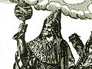

  
[Intangible Textual Heritage](../../index)  [Gnosticism and
Hermetica](../index)  [Index](index)  [Previous](th117)  [Next](th119) 

------------------------------------------------------------------------

[Buy this Book at
Amazon.com](https://www.amazon.com/exec/obidos/ASIN/0766126129/internetsacredte)

------------------------------------------------------------------------

  
*Thrice-Greatest Hermes, Vol. 1*, by G.R.S. Mead, \[1906\], at
Intangible Textual Heritage

------------------------------------------------------------------------

##### ON THE DRINKING OF WINE

VI\. 1. And as for wine, the servants of the God in Sun-city [2](#fn_820) do not at all bring it into the sacred
place, as ’tis not right \[for them\] to drink by day while He, their
Lord and King, looks on.

2\. The rest \[of them [3](#fn_821)\] use it
indeed, but sparingly.

They have, however, many times of abstinence at which they drink no
wine, but spend them in the search for wisdom, learning and teaching the
\[truth\] about the Gods.

3\. The kings used to drink it, though in certain measure according to
the sacred writings, as Hecatæus has narrated, [4](#fn_822) for they were priests \[as well\].

4\. They began to drink it, however, only from the time of
Psammetichus; [5](#fn_823) but before that they
used not to drink wine.

Nor did they make libation of it as a thing dear to the Gods, but as the
blood of those who fought against the Gods, [6](#fn_824)—from whom, when they fell and mingled
with

p. 269

the earth, they think the vines came, and that because of this
wine-drenching makes men to be out of their minds and struck
aside, [1](#fn_825) in that, forsooth, they are
full-filled with the forefathers of its [2](#fn_826) blood. [3](#fn_827)

5\. These things, at any rate Eudoxus says, in Book II. of his
*Circuit,* [4](#fn_828) are thus stated by the
priests.

------------------------------------------------------------------------

### Footnotes

[268:2](th118.htm#fr_819) Heliopolis—the God
being the “Sun.”

[268:3](th118.htm#fr_820) *Sc.* the priests.

[268:4](th118.htm#fr_821) Müller, ii. 389. H.
flourished last quarter of 6th and first 5th century B.C.

[268:5](th118.htm#fr_822) Reigned 671-617 B.C.

[268:6](th118.htm#fr_823) *Sc.* the Titans or
Daimones as opposed to the Gods.

[269:1](th118.htm#fr_824) Or
“de-ranged”—παραπλῆγας. Paraplēx is the first of the daimonian rulers in
*The Books of the Saviour* (*Pistis Sophia,* 367).

[269:2](th118.htm#fr_825) *Sc.* the vine’s.

[269:3](th118.htm#fr_826) Or “with the blood of
its forefathers.”

[269:4](th118.htm#fr_827) Or *Orbit.* Eudoxus
flourished about the middle of the 4th century B.C.; he was initiated
into the Egyptian mysteries, and a great astronomer, obtaining his
knowledge of the art from the priests of Isis.

------------------------------------------------------------------------

[Next: On Fish Taboos](th119)
