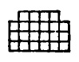

  
[Intangible Textual Heritage](../../index)  [Gnosticism and
Hermetica](../index)  [Index](index)  [Previous](th133)  [Next](th135) 

------------------------------------------------------------------------

[Buy this Book at
Amazon.com](https://www.amazon.com/exec/obidos/ASIN/0766126129/internetsacredte)

------------------------------------------------------------------------

  
*Thrice-Greatest Hermes, Vol. 1*, by G.R.S. Mead, \[1906\], at
Intangible Textual Heritage

------------------------------------------------------------------------

##### THE THEORY OF THE MATHEMATICI

XLI\. 1. Those, however, who combine with the above \[considerations\]
of the Physicists some of the Mathematic \[doctrines\] derived from
star-lore, think that the solar cosmos is called Typhon and the lunar
Osiris. [4](#fn_1096)

2\. For \[they think\] that the Moon, in that its light is generative
and moistening, is favourable both for breedings of animals and
sproutings of plants; whereas the Sun, with untempered and harsh fire,
burns and

p. 319

withers up \[all\] that are growing and blowing, and with fiery heat
renders the major part of the earth entirely uninhabitable, and in many
places utterly masters the Moon.

3\. For which cause Egyptians always call Typhon Sēth, [1](#fn_1097)—that is, “that which oppresses and
constrains by force.”

4\. And they have a myth that Heracles is settled in the Sun and
accompanies him in his revolutions, while Hermes does the same with the
Moon.

5\. For the \[revolutions\] of the Moon resemble works of reason
(*logos*) and super-abundant wisdom, while those of the Sun are like
penetrating strokes \[given\] with force and power. [2](#fn_1098)

6\. Moreover, the Stoics say that the sun is kept burning and nourished
from the sea, [3](#fn_1099) whereas to the
Moon the waters of springs and lakes send up a sweet and mild
exhalation.

XLII\. 1. The Egyptian myth runs that the death of Osiris took place on
the seventeenth, when the full-moon is most conspicuously at the full.

2\. Wherefore the Pythagoreans call this day also “Interception,” [4](#fn_1100) and regard this number as expiable.

3\. For the “sixteen” being square and the “eighteen” oblong [5](#fn_1101)—which alone of plane numbers happen to
have their perimeters equal to the areas contained by them [6](#fn_1102)—the mean, “seventeen,” coming between
them, intercepts and divorces them from one another, and divides

p. 320

the ratio of “nine” to “eight” [1](#fn_1103)
by being cut into unequal intervals.

4\. And eight-and-twenty is the number of years which some say Osiris
lived, and others that he reigned; [2](#fn_1104) for this is the number of the lights
of the Moon, and it rolls out its own circle in this number of days.

5\. And at what they call the Burials of Osiris they cut the tree-trunk
and make it into a crescent-shaped coffin, because the Moon, when it
approaches the Sun, becomes crescent-shaped and hides itself away.

6\. And the tearing of Osiris into fourteen pieces they refer
enigmatically to the days in which the luminary wanes after full-moon up
to new-moon.

7\. And the day on which it first appears, escaping from his beams and
passing by the Sun, they call “Imperfect Good.”

8\. For Osiris is “Good-doer.” The name, indeed, means many things, but
chiefly what they call “Might energising and good-doing.” And the other
name of the God,—Omphis, Hermæus [3](#fn_1105)
says, means \[also\] when translated, “Benefactor.”

XLIII\. 1. Moreover, they think that the risings of the Nile have a
certain analogy with the lights of the Moon.

2\. For the greatest \[rising\], about Elephantinē, is eight-and-twenty
cubits, the same number as are the lights and measures of its monthly
periods; and the least, about Mendes and Xoïs, is of six cubits,
\[analogous\] to the half -moon; while the mean, about Memphis, when it
is the right quantity, \[is\] of fourteen cubits, \[analogous\] to the
full-moon.

p. 321

3\. And \[they consider\] the Apis the animated image of Osiris, and
that he is conceived whenever generative light from the Moon fastens on
a cow in heat.

4\. For which cause also many of the markings of the Apis—lights shading
off into darks—resemble the configurations of the moon.

5\. Moreover, on the new-moon of the month Phamenōth [1](#fn_1106) they keep festival, calling it
“Entrance” [2](#fn_1107) of Osiris into the
Moon, as it is the beginning of spring.

6\. By thus placing the power of Osiris in the Moon, they mean that Isis
consorts with him while being \[at the same time\] the cause of his
birth. [3](#fn_1108)

7\. For which cause also they call the Moon Mother of the cosmos, and
think that she has a male-female nature,—for she is filled by the Sun
and made pregnant, and again of herself sends forth and disseminates
into the air generative principles.

8\. For \[they say\] she does not always overmaster the destruction
wrought by Typhon; [4](#fn_1109) but, though
frequently mastered, even when bound hand and foot she frees herself
again by her generative power, and fights the way through to Horus.

9\. And Horus is the cosmos surrounding the earth—not entirely exempt
from destruction either, nor yet from generation.

XLIV\. 1. Some, moreover, make out of the myth a riddle of the phenomena
of eclipses also.

2\. For the Moon is eclipsed at the full, when the Sun has the station
opposite it, she entering the shadow of the earth,—just as they say
Osiris \[entered\] the

p. 322

coffin. And she again conceals the Sun and causes him to disappear, on
the thirtieth \[of the month\], though she does not entirely destroy
him, as neither did Isis Typhon.

3\. And when Nephthys conceives Anubis, Isis adopts him. For Nephthys is
that which is below the earth and non-manifest, while Isis \[is\] that
which is above the earth and manifest.

4\. And the circle just touching them and called “Horizon,” as being
common to both of them, has been called Anubis, and is likened to a dog
for its characteristic; for the dog has the use of its sight both by day
and night alike.

5\. And Anubis seems to possess this power among Egyptians—just as
Hecate with Greeks—being at one and the same time chthonian and
olympian. [1](#fn_1110)

6\. Some, however, think that Anubis is Kronos; [2](#fn_1111) wherefore as he breeds all things out
of himself and conceives (κύων) \[all\] in himself, he got the name of
Dog (κυών).

7\. There is, then, for the worshippers of Anubis some \[mystery\] or
other that may not be spoken of. [3](#fn_1112)

8\. In olden times, indeed, the dog enjoyed the highest honours in
Egypt; but seeing that when Cambyses [4](#fn_1113) slew the Apis and cast it out, no
\[animal\] approached or touched its carcase but only the dog, he
\[thus\] lost the \[distinction of\] being first and most honoured of
the rest of the animals.

9\. There are some, however, who call the shadow of the earth into which
they think the Moon falls and is eclipsed, Typhon.

------------------------------------------------------------------------

### Footnotes

[318:4](th134.htm#fr_1095) This is a worse
guess than even that of the Physicists. *Cf.* li. 5.

[319:1](th134.htm#fr_1096) *Cf.* lxii. 2 *et
al.*

[319:2](th134.htm#fr_1097) *Cf.* the Stoic
attributes of Heracles in xl. 7.

[319:3](th134.htm#fr_1098) If this is intended
for the Great Sea of Space, it would be credible.

[319:4](th134.htm#fr_1099) ἀντίφραξιν.

[319:5](th134.htm#fr_1100) Square and Oblong
were two of the fundamental “pairs of opposites” among the Pythagoreans.
*Cf.* xlviii. 5.

[319:6](th134.htm#fr_1101)  

[320:1](th134.htm#fr_1102) The sesquioctave.
In areas 8 is half of 16, and 9 of 18; while in a proportional
measuring-rod or canon of 27 units, intervals of 8, 9, and 10 units
succeeding one another complete the 27.

[320:2](th134.htm#fr_1103) *Cf.* xiii. 8, 9.

[320:3](th134.htm#fr_1104) *Cf.* xxxviii. 2.

[321:1](th134.htm#fr_1105) Copt, the
same—roughly corr. to March.

[321:2](th134.htm#fr_1106) ἔμβασιν—or perhaps
“Embarking.”

[321:3](th134.htm#fr_1107) That is, is both
wife and mother.

[321:4](th134.htm#fr_1108) Typhon being the
Sun according to this theory.

[322:1](th134.htm#fr_1109) That is, infernal
and celestial.

[322:2](th134.htm#fr_1110) In the sense of
Time.

[322:3](th134.htm#fr_1111) This seems to
suggest that Plutarch, though he faithfully records what “people say,”
by no means wishes his readers to believe them.

[322:4](th134.htm#fr_1112) But see xi. 4 and
xxxi. 4.

------------------------------------------------------------------------

[Next: The Theory of the Dualists](th135)
