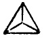

  
[Intangible Textual Heritage](../../index.md)  [Gnosticism and
Hermetica](../index)  [Index](index)  [Previous](th139)  [Next](th141.md) 

------------------------------------------------------------------------

[Buy this Book at
Amazon.com](https://www.amazon.com/exec/obidos/ASIN/0766126129/internetsacredte.md)

------------------------------------------------------------------------

  
*Thrice-Greatest Hermes, Vol. 1*, by G.R.S. Mead, \[1906\], at
Intangible Textual Heritage

------------------------------------------------------------------------

##### CONCERNING THE WORSHIP OF ANIMALS, AND TOTEMISM

LXXII\. 1. As for the \[theory\] that the Gods out of fear of Typhon
changed themselves into these animals—as it were hiding themselves in
the bodies of ibises and dogs and hawks—it beats any juggling or
story-telling.

2\. Also the \[theory\] that all the souls of the dead that persist,
have their rebirth [2](#fn_1221.md) into these
\[animals\] only, is equally incredible.

3\. And of those who would assign some reason connected with the art of
government, some say that Osiris upon his great campaign, [3](#fn_1222.md) divided his force into many
divisions—(they call them companies and squadrons in Greek)—and gave
them all ensigns of animal figures, and that each of these became sacred
and venerated by the clan of those banded together under it.

4\. Others \[say\] that the kings after \[Osiris\], in order

p. 354

to strike terror into their foes, used to appear dressed in wild beasts’
heads of gold and silver.

5\. While others tell us that one of the clever and crafty kings, on
learning that, though the Egyptians were fickle by nature and quick for
change and innovation, they nevertheless possessed an invincible and
unrestrainable might owing to their numbers when in agreement and
co-operation, showed them and implanted into their minds an enduring
superstition,—an occasion of unceasing disagreement.

6\. For in as much as the beasts—some of which he enacted some \[clans\]
should honour and venerate and others others—are hostile and inimical to
one another, and as each one of them by nature likes different food from
the others, each \[clan\] in protecting its own special \[beasts\] and
growing angry at their being injured, was for ever unconsciously being
drawn into the enmities of the beasts, and \[so\] brought into a state
of warfare with the others.

7\. For even unto this day the people of Wolf-town are the only
Egyptians who eat sheep, because the wolf, whom they regard as god,
\[does so\].

8\. And the people of Oxyrhynchus-town, in our own day, when the folk of
Dog-town ate the oxyrhynchus [1](#fn_1223.md)
fish, caught a dog and sacrificing it as a sacred victim, ate it; and
going to war because of this, they handled one another roughly, and
subsequently were roughly handled by the Romans in punishment. [2](#fn_1224.md)

LXXIII\. 1. Again, as many say that the soul of Typhon himself was
parted among these animals, the myths would seem enigmatically to hint
that every irrational and brutal nature is born from a part of the

p. 355

\[paragraph continues\] Evil Daimon, and
that to appease and soothe him they pay cult and service to them.

2\. But if he fall upon them mighty and dire, bringing on them excessive
droughts, or pestilent diseases, or other unlooked-for strange
mischances, then the priests lead away at dark in silence quietly some
of the venerated \[beasts\], and threaten and try to scare away the
first \[one\] of them; if, however, it stops, they consecrate and
sacrifice it, as though, I suppose, this were some kind of chastisement
of the Daimon, or some specially great means of purification in the
greater \[emergencies\].

3\. For in the Goddess-of-child-bed-town [1](#fn_1225.md) they used to burn living men to ashes,
as Manethōs has told us, calling them Typhoneian; and the ashes they
winnowed away and scattered. [2](#fn_1226.md)

4\. This, however, was done publicly, and at one special time, in the
Dog-days; whereas the consecratings of the venerated beasts, which are
never spoken of and take place at irregular times, according to the
emergencies, are unknown to the multitude, except when they have
burials, and \[the priests\] bringing out some of the others, cast them
in \[to the grave with them\] in the presence of all,—in the belief that
they annoy Typhon in return and curtail what gives him pleasure. For
only the Apis and a few other \[animals\] seem to be sacred to Osiris;
while they assign the majority to him \[Typhon\].

5\. And if he \[Osiris\] is really Reason (*Logos*), I think that the
object of our enquiry is found in the case of these \[animals\] that are
admitted to have common honours with him,—as, for instance, the ibis,
and hawk, and dog-headed ape; \[while\] Apis himself \[is his

p. 356

soul . . .\], [1](#fn_1227.md) for thus, you
know, they call the goat at Mendes.

LXXIV\. 1. There remain of course the utilitarian and symbolical
\[reasons\], of which some have to do with one of the two \[Gods\], but
most \[of them\] with both.

2\. As for the ox and sheep and ichneumon, [2](#fn_1228.md) it is clear they paid them honours on
account of their usefulness and utility,—just as Lemnians crested larks
which seek out and break the eggs of locusts, and Thessalians storks,
because when their land produced multitudes of snakes, they came and
destroyed them all—(wherefore they made a law that whoever killed a
stork should be banished [3](#fn_1229).md)—so
with the asp and weasel and scarab, because they discerned in them
certain faint likenesses of the power of the Gods, as it were \[that\]
of the sun in water-drops.

3\. For as to the weasel, many still think and say that as it is
impregnated through the ear and brings forth by the mouth, it is a
likeness of the birth of reason (*logos*). [4](#fn_1230.md)

4\. Again \[they say\] the species of scarab has no female, but all, as
males, discharge their seed into the stuff they have made into
balls, [5](#fn_1231.md) which they roll along by
pushing, moving \[themselves\] in the opposite direction, just as the
sun seems to turn the heaven round in the opposite direction, while it
is \[the heaven\] itself that moves from west to east. [6](#fn_1232.md)

p. 357

5\. And the asp, because it does not age, and moves without limbs with
ease and pliancy, they likened to a star.

LXXV\. 1. Nay, not even has the crocodile had honour paid it without
some show of credible cause, for it alone is tongue-less. [1](#fn_1233.md)

For the Divine Reason (*Logos*) stands not in need of voice, and:

> “Moving on a soundless path with
> justice guides \[all\] mortal things.”  id="fr_1233">[2](#fn_1234.md) 

2\. And they say that it alone, when it is in the water, has its eyes
covered by a smooth and transparent membrane that comes down from the
upper lid, [3](#fn_1235.md) so that they see
without being seen,—an attribute of the First God. [4](#fn_1236.md)

3\. And whenever the female lays her eggs on the land, it is known that
this will be the limit of the Nile’s

p. 358

increase. For as they cannot lay in the water, and fear to do so far
from it, they so accurately fore-feel what will be, that they make use
of the rise of the river for laying their eggs and hatching them, and
yet keep them dry and beyond the danger of being wetted.

4\. And they lay sixty \[eggs\] and hatch them out in as many days, and
the longest-lived of them live as many years,—which is the first of the
measures for those who treat systematically of celestial
\[phenomena\]. [1](#fn_1237.md)

5\. Moreover, of those that have honours paid them for both
\[reasons\] [2](#fn_1238.md)—of the dog, we have
already treated above. [3](#fn_1239.md)

6\. As for the ibis, while killing the death-dealing of the
reptiles, [4](#fn_1240.md) it was the first to
teach them the use of medicinal evacuation, when they observed it being
thus rinsed out and purged by itself. [5](#fn_1241.md)

7\. While those of the priests who are most punctilious in their
observances, in purifying themselves, take the water for cleansing from
a place where the ibis has drunk; for it neither drinks unwholesome or
poisoned [6](#fn_1242.md) water, nor \[even\]
goes near it.

8\. Again, by the relative position of its legs to one another, and \[of
these\] to its beak, it forms an equilateral triangle; and yet again,
the variegation and admixture of its black with its white feathers
suggest the gibbous moon. [7](#fn_1243.md)

9\. Nor ought we to be surprised at Egyptians being so fond of meagre
likenesses; for Greeks too in both their

p. 359

pictured and plastic resemblances of Gods use many such \[vague
indications\].

10\. For instance, in Crete there was a statue of Zeus which had no
ears,—for it behoves the Ruler and Lord of all to listen to no one.

11\. And Pheidias used the serpent in the \[statue\] of Athena, and the
tortoise in that of Aphrodite at Elis,—because on the one hand virgins
need protecting, and on the other because keeping-at-home and silence
are becoming to married women.

12\. Again, the trident of Poseidon is a symbol of the third region,
which the sea occupies, assigned \[to him\] after the heaven and air.
For which cause also they invented the names Amphi-trite and
Trit-ons. [1](#fn_1244.md)

13\. And the Pythagoreans have embellished both numbers and figures with
appellations of Gods.

For they used to call the equilateral triangle Athena—Head-born and
Third-born [2](#fn_1245.md)—because it is divided
by three plumb-lines [3](#fn_1246.md) drawn from
the three angles.

14\. And \[they called\] “one” Apollo, from privation of
multitude, [4](#fn_1247.md) and owing to the
singleness [5](#fn_1248.md) of the monad; and
“two” Strife and Daring, and “three” Justice \[or Rightness\],—for as
wronging and being wronged were according to deficiency and excess,
rightness \[or justice\] was born to equality between them. [6](#fn_1249.md)

p. 360

15\. And what is called the Tetraktys, the six-and-thirty, was \[their\]
greatest oath (as has been said over and over again), and is called
Cosmos,—which is produced by adding together the first four even and
\[the first\] four odd \[numbers\]. [1](#fn_1250.md)

LXXVI\. 1. If, then, the most approved of the philosophers, when they
perceived in soulless and bodiless things a riddle of the Divine, did
not think it right to neglect anything or treat it with disrespect,
still more liking, I think, we should then have for the peculiarities in
natures that are endowed with sense and possess soul and passion and
character,—not paying honour to these, but through them to the Divine;
so that since they are made by Nature into mirrors clearer \[than any
man can make\], we should consider this as the instrument and art of God
who ever orders all things.

2\. And, generally, we should deem that nothing soulless is superior to
a thing with soul, nor one without sense to one possessing it; not even
if one should bring together into one spot all the gold and emeralds in
the world.

3\. For that which is Divine does not reside in colours or shapes or
smoothnesses; nay, all things that either have no share or are not of a
nature to share in life, have a lot of less value than that of dead
bodies. [2](#fn_1251.md)

4\. Whereas the Nature that lives and sees, and has its source of motion
from itself, and knowledge of things that are its and those that are
not, has

p. 361

appropriated both an “efflux of the Good,” [1](#fn_1252.md) and a share of the Thinker “by whom
the universe is steered,” as Heracleitus says. [2](#fn_1253.md)

5\. For which cause the Divine is not less well pourtrayed in these
\[*sc.* animals\] than by means of works of art in bronze and stone,
which while equally susceptible of decay and mutilations, [3](#fn_1254.md) are in their nature destitute of all
feeling and understanding.

6\. With regard to the honours paid to animals, then, I approve this
view more highly than any other that has been mentioned.

------------------------------------------------------------------------

### Footnotes

[353:2](th140.htm#fr_1220.md) παλιγγενεσίαν.

[353:3](th140.htm#fr_1221.md) *Sc.* for
civilising the world.

[354:1](th140.htm#fr_1222.md) Lit.,
“sharp-snout.”

[354:2](th140.htm#fr_1223.md) And such things
occur “even to this day” in India under the British Rāj.

[355:1](th140.htm#fr_1224.md) ἐν εἰλειθυίας
πόλει.

[355:2](th140.htm#fr_1225.md) Over the fields?

[356:1](th140.htm#fr_1226.md) A *lacuna* occurs
here which I have partially filled up, conjecturally, as above.

[356:2](th140.htm#fr_1227.md) An Egyptian animal
of the weasel kind which was said to hunt out crocodiles’ eggs; also
called “Pharaoh’s rat.”

[356:3](th140.htm#fr_1228.md) *Cf.* Arist.,
*Mirab.,* xxiii.

[356:4](th140.htm#fr_1229.md) *Cf.* xxii.
1—“Physiologus” again. For a criticism of this legend, see R. 43.

[356:5](th140.htm#fr_1230.md) *Cf.* x. 9.

[356:6](th140.htm#fr_1231.md) Budge (*op. cit.,*
ii. 379 f.) writes: “The beetle or scarabæus . . . belongs to the family
called Scarabacidæ (Coprophagi), of which the *Scarabæus sacer* is the
type. . . . A remarkable peculiarity exists in the structure and
situation of the hind legs, which are placed so near the extremity of
the body, and so far from each other as to give the insect a most
extraordinary appearance when walking. This peculiar formation is,
nevertheless, particularly serviceable to its possessors in rolling the
balls of excrementitious matter in which they enclose their eggs. . . .
These balls are at first irregular and soft, but, by degrees, and during
the process of rolling along, become rounder and harder; they are
propelled by means of the hind legs. Sometimes these balls are an inch
and a half, or two inches in diameter, and in rolling this along the
beetles stand almost upon their heads, with the heads turned from the
balls.” The scarabæus was called *kheprerȧ* in Egyptian, and was the
symbol of *Kheperȧ* the Great God of creation and resurrection; he was
the “father of the gods,” and the creator of all things in heaven and
earth, self-begotten and self-born; he was usually identified with the
rising sun and new-birth generally.

[357:1](th140.htm#fr_1232.md) “Physiologus”
again, doubtless; it might, however, be said that its tongue is
rudimentary.

[357:2](th140.htm#fr_1233.md) Euripides, *Tro.,*
887.

[357:3](th140.htm#fr_1234.md) Lit., “brow.”

[357:4](th140.htm#fr_1235.md) That is, the
First-born Reason.

[358:1](th140.htm#fr_1236.md) That is,
presumably, either the 60 of the Chaldæans, or the 3 × 4 × 5 of the
“most perfect” triangle of the Mathematici.

[358:2](th140.htm#fr_1237.md) Namely, the
utilitarian and symbolical; *cf.* lxxiv. 1.

[358:3](th140.htm#fr_1238.md) *Cf.* xiv. 6.

[358:4](th140.htm#fr_1239.md) *Cf.* Rawlinson’s
*Herodotus,* ii. 124, 125.

[358:5](th140.htm#fr_1240.md) There is a similar
legend in India, I am told.

[358:6](th140.htm#fr_1241.md) May also mean
“bewitched.”

[358:7](th140.htm#fr_1242.md) That is, the moon
in its third quarter.

[359:1](th140.htm#fr_1243.md) From τριτὸς,
“third.”

[359:2](th140.htm#fr_1244.md) κορυφαγεννῆ καὶ
τριτογένειαν,—that is, Koryphagennēs and Tritogeneia.

[359:3](th140.htm#fr_1245.md) τρισὶ καθέτοις,—a
κάθετος (*sc.* γραμμή) is generally a perpendicular; but here the
reference must be to this appended figure:  

 

[359:4](th140.htm#fr_1246.md) That is,
presumably, ἀ-πόλλων, from ἀ (priv.) and πολλοὶ (many).

[359:5](th140.htm#fr_1247.md) δι’ ἁπλότητα,—the
play being apparently ἀ-πολ (πλο)-της.

[359:6](th140.htm#fr_1248.md) Lit., in the midst.

[360:1](th140.htm#fr_1249.md) The Tetraktys was
ordinarily considered to be the sum of the first four numbers simply,
that is 1 + 2 + 3 + 4 = 10; but here we have it given as 1 + 3 + 5 + 7 =
16, and 2 + 4 + 6 + 8 = 20, and 16 + 20 = 36. The oath is said to have
been: “Yea, by Him who did bestow upon our soul Tetraktys, Ever-flowing
Nature, Source possessing roots”—the “roots” being the four elements.

[360:2](th140.htm#fr_1250.md) *Sc.* which have at
least been the vehicle of life.

[361:1](th140.htm#fr_1251.md) Plat., *Phædr.,*
251 B.

[361:2](th140.htm#fr_1252.md) Mullach, i. 328.

[361:3](th140.htm#fr_1253.md) Reading πηρώσεις.

------------------------------------------------------------------------

[Next: Concerning the Sacred Robes](th141.md)
