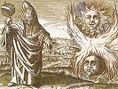

  
[Intangible Textual Heritage](../../index)  [Gnosticism and
Hermetica](../index)  [Index](index)  [Previous](th220)  [Next](th222) 

------------------------------------------------------------------------

[Buy this Book at
Amazon.com](https://www.amazon.com/exec/obidos/ASIN/0766126137/internetsacredte)

------------------------------------------------------------------------

  
*Thrice-Greatest Hermes, Vol. 2*, by G.R.S. Mead, \[1906\], at
Intangible Textual Heritage

------------------------------------------------------------------------

p. 141

#### CORPUS HERMETICUM X. (XI.)

------------------------------------------------------------------------

### THE KEY

##### OF THRICE-GREATEST HERMES

(Text: P. 67-84; Pat. 9b-12.)

1\. *Hermes.* My yesterday’s discourse (*logos*) I did devote to thee,
Asclepius, and so ’tis \[only\] right I should devote to-day’s to Tat;
and this the more because ’tis the abridgment of the General Sermons
(*Logoi*) which he has had addressed to him.

“God, Father and the Good,” then, Tat, hath [1](#fn_239) the same nature, or more exactly,
*energy.*

For *nature* is a predicate of growth, and used of things that change,
both mobile and immobile, that is to say, both human and divine, each
one of which He *willeth* into being.

p. 142

But *energy* consists in something else, as we have shown in treating of
the rest, both things divine and human things [1](#fn_240); which thing we ought to have in mind
when treating of the Good. [2](#fn_241)

2\. God’s energy is then His Will; further His essence is to will the
being of all things. For what is “God and Father and the Good” but the
*to be* of all that are not yet? Nay, subsistence [3](#fn_242) self of everything that is;—this, then,
is God, this Father, this the Good; to Him is added naught of all the
rest.

And though the Cosmos, that is to say the Sun, is also sire himself to
them that share in him; yet so far is he not the cause of good unto the
lives, he is not even of their living.

So that e’en if he be a sire, he is entirely so by the compulsion of the
Good’s Good-will, apart from which nor being nor becoming could e’er be.

3\. Again, the parent is the children’s cause, both on the father’s and
the mother’s side, [4](#fn_243) only by
*sharing in* [5](#fn_244) the Good’s desire
\[that doth pour\] through the Sun. It is the Good which doeth the
creating.

And such a power can be possessed by no one

p. 143

else than Him alone who *taketh* naught, [1](#fn_245) but *wills* all things to be; I will
not, Tat, say *makes.*

For that the *maker* is defective for long periods (in which he
sometimes makes, and sometimes doth not make) both in the quality and in
the quantity \[of what he makes\]; in that he sometimes maketh them so
many and such like, and sometimes the reverse.

But “God and Father and the Good” is \[cause\] for all to be. So are at
least these things for who can see.

4\. For It doth will to be, and It is both Itself and most of all by
reason of [2](#fn_246) Itself. Indeed all other
things beside are just because of It; for the distinctive feature of the
Good is “that it should be known.” Such is the Good, O Tat.

*Tat.* Thou hast, O father, filled us so full [3](#fn_247) of this so good and fairest Sight, that
thereby my mind’s eye hath now become for me almost a thing to worship.

For that the Vision of the Good doth not, like the sun’s beam, fire-like
blaze on the eyes and make them close; nay, on the contrary, it shineth
forth and maketh to increase the seeing [4](#fn_248) of the eye, as far as e’er a man hath
the capacity

p. 144

to hold the inflow of the radiance that the mind alone can see.

Not only does it come more swiftly down to us, but it does us no harm,
and is instinct with all immortal life.

5\. They who are able to drink in a somewhat more than others of this
Sight, ofttimes from out the body fall asleep into this fairest
Spectacle, as was the case with Uranus and Cronus, our forebears. [1](#fn_249) May this be our lot too, O father mine!

*Her.* Yea, may it be, my son! But as it is, we are not yet strung to
the Vision, and not as yet have we the power our mind’s eye to unfold
and gaze upon the Beauty of the Good—Beauty that naught can e’er corrupt
or any comprehend.

For \[only\] then wilt thou upon It gaze when thou canst say no word
concerning It. For Gnosis of the Good is holy silence and a giving
holiday to every sense.

6\. For neither can he who perceiveth It, perceive aught else; nor he
who gazeth on It, gaze on aught else; nor hear aught else, nor stir his
body any way. Staying his body’s every sense and every motion he stayeth
still.

And shining then all round his mind, It shines

p. 145

through his whole soul, and draws it out of body, transforming all of
him to essence.

For it is possible, my son, that a man’s soul should be made like to
God, e’en while it still is in a body, if it doth contemplate the Beauty
of the Good.

7\. *Tat.* Made like to God! What dost thou, father, mean?

*Her.* Of every soul apart are transformations, son.

*Tat.* What meanest thou? Apart!

*Her.* [1](#fn_250) Didst thou not, in the
General Sermons, hear that from One Soul—the All-soul—come all these
souls which are made to revolve in all the cosmos, as though divided
off?

Of these souls, then, it is that there are many changes, some to a
happier lot and some to \[just\] the contrary of this.

Thus some that were once creeping things change into things that in the
water dwell, the souls of water things change to earth-dwellers, those
that live on the earth change into things with wings, and souls that
live in air change into men, while human souls reach the first step of
deathlessness changed into daimones.

And so they circle to the choir of the Inerrant Gods; for of the Gods
there are two choirs, the

p. 146

one Inerrant, and the other Errant. And this is the most perfect glory
of the soul.

8\. But if a soul on entering in the body of a man persisteth in its
vice, [1](#fn_251) it neither tasteth
deathlessness nor shareth in the Good; but speeding back again it turns
into the path that leads to creeping things. This is the sentence of the
vicious soul.

And the soul’s vice is ignorance. [2](#fn_252)
For that the soul who hath no knowledge of the things that are, or
knowledge of their nature, or of Good, is blinded by the body’s passions
and tossed about.

This wretched soul, not knowing what she is, becomes the slave of bodies
of strange form in sorry plight, bearing the body as a load; not as the
ruler, but the ruled. This \[ignorance\] is the soul’s vice.

9\. But on the other hand the virtue of the soul is Gnosis. For he who
knows, he good and pious is, and still while on the earth [3](#fn_253) divine.

*Tat.* But who is such an one, O father mine?

*Her.* He who doth not say much or lend his ear to much. For he who
spendeth time in arguing and hearing arguments, doth shadow

p. 147

fight. For “God, the Father and the Good,” is not to be obtained by
speech or hearing.

And yet though this is so, there are in all the *beings* senses, in that
they cannot without senses *be.*

But Gnosis is far different from sense. For sense is brought about by
that which hath the mastery o’er us, while Gnosis is the end of
science, [1](#fn_254) and science is God’s
gift.

10\. All science is incorporal, the instrument it uses being the mind,
just as the mind employs the body.

Both then come into bodies, \[I mean\] both things that are cognizable
by mind alone and things material. [2](#fn_255)
For all things must consist out of antithesis and contrariety; and this
can otherwise not be.

*Tat.* Who then is this material God of whom thou speakest?

*Her.* Cosmos is *beautiful*, but is not *good* [3](#fn_256)—for that it is material and freely
passible [4](#fn_257); and though it is the
first of all things passible, yet is it in the second rank of being and
wanting in itself.

And though it never hath itself its birth in time, but ever is, yet is
its being in becoming,

p. 148

becoming for all time the genesis of qualities and quantities; for it is
mobile and all material motion’s genesis. [1](#fn_258)

11\. It is intelligible [2](#fn_259) rest that
moves material motion in this way, [3](#fn_260)
since Cosmos is a sphere—that is to say, a head. And naught of head
above’s material, as naught of feet below’s intelligible, [4](#fn_261) but all material.

And head itself moved in a sphere-like way—that is to say, as head
should move, [5](#fn_262) is mind.

All then that are united to the “tissue” of this “head” (in which [6](#fn_263) is soul) are in their nature free from
death,—just as when body hath been made in soul, are things that have
more soul than body.

Whereas those things which are at greater distance from this
“tissue”—there, where are things which have a greater share of body than
of soul—are by their nature subject unto death.

The whole, however, is a life; so that the universe consists of both the
hylic and of the intelligible. [7](#fn_264)

12\. Again, the Cosmos is the first of living

p. 149

things, while man is second after it, though first of things subject to
death.

Man hath the same ensouling power in him as all the rest of living
things [1](#fn_265); yet is he not only not
good, but even evil, [2](#fn_266) for that he’s
subject unto death. [3](#fn_267)

For though the Cosmos also is not good in that it suffers motion, it is
not evil, in that it is not subject unto death. But man, in that he’s
subject both to motion and to death, is evil. [4](#fn_268)

13\. Now then the principles [5](#fn_269) of
man are this-wise vehicled: mind in the reason (*logos*), the reason in
the soul, soul in the spirit, [6](#fn_270)
\[and\] spirit in the body.

Spirit pervading \[body\] [7](#fn_271) by means
of veins and arteries and blood, bestows upon the living creature
motion, and as it were doth bear it in a way.

For this cause some do think the soul is blood, in that they do mistake
its nature, not knowing that \[at death\] it is the spirit that must
first

p. 150

withdraw into the soul, whereon the blood congeals and veins and
arteries are emptied, and then the living creature is withdrawn; and
this is body’s death.

14\. Now from One Source [1](#fn_272) all
things depend; while Source \[dependeth\] from the One and Only \[One\].
Source is, moreover, moved to become Source again; whereas the One
standeth perpetually and is not moved.

Three then are they: “God, the Father and the Good,” Cosmos and man.

God doth contain Cosmos; Cosmos \[containeth\] man. Cosmos is e’er God’s
Son, man as it were Cosmos’s child.

15\. Not that, however, God ignoreth man; nay, right well doth He know
him, and willeth to be known.

This is the sole salvation for a man—God’s Gnosis. This is the Way Up to
the Mount. [2](#fn_273)

By Him alone the soul becometh good, not whiles is good, whiles evil,
but \[good\] out of necessity.

*Tat.* What dost thou mean, Thrice-greatest one?

*Her.* Behold an infant’s soul, my son, that is not yet cut off, [3](#fn_274) because its body is still small and not
as yet come unto its full bulk. [4](#fn_275)

p. 151

*Tat.* How?

*Her.* A thing of beauty altogether is \[such a soul\] to see, not yet
befouled by body’s passions, still all but hanging from the Cosmic Soul!

But when the body grows in bulk and draweth down the soul into its mass,
then doth the soul cut off itself and bring upon itself forgetfulness,
and no more shareth in the Beautiful and Good. And this forgetfulness
becometh vice.

16\. It is the same for them who go out from the body.

For when the soul withdraws into itself, the spirit doth contract itself
within the blood, and soul within the spirit. [1](#fn_276) And then the mind, stript of its
wrappings, and naturally divine, taking unto itself a fiery body, doth
traverse every space, after abandoning the soul unto its judgment and
whatever chastisement it hath deserved.

*Tat.* [2](#fn_277) What dost thou, father,
mean by this? The mind is parted from the soul and soul from

p. 152

spirit? Whereas thou said’st the soul was the mind’s vesture, and the
soul’s the spirit.

17\. *Her.* The hearer, son, should think with him who speaks and
breathe with him [1](#fn_278); nay, he should
have a hearing subtler than the voice of him who speaks.

It is, son, in a body made of earth that this arrangement of the
vestures comes to pass. For in a body made of earth it is impossible the
mind should take its seat itself by its own self in nakedness.

For neither is it possible on the one hand the earthy body should
contain such immortality, nor on the other that so great a virtue should
endure a body passible in such close contact with it. It taketh, then,
the soul for as it were an envelope.

And soul itself, being too a thing divine, doth use the spirit as *its*
envelope, while spirit doth pervade the living creature.

18\. When then the mind doth free itself from the earth-body, it
straightway putteth on its proper robe of fire, with which it could not
dwell in an earth-body.

For earth doth not bear fire; for it is all set in a blaze even by a
small spark. And for this cause is water poured round earth, to be a
guard and wall, to keep the blazing of the fire away.

But mind, the swiftest thing of all divine out-

p. 153

thinkings, and swifter than all elements, hath for its body fire.

For mind being builder [1](#fn_279) doth use
the fire as tool for the construction of all things—the Mind of all
\[for the construction\] of all things, but that of man only for things
on earth.

Stript of its fire the mind on earth cannot make things divine, for it
is human in its dispensation. [2](#fn_280)

19\. The soul in man, however,—not every soul, but one that pious is—is
a daimonic something and divine.

And such a soul when from the body freed, if it have fought the fight of
piety—the fight of piety is to know God and to do wrong to no man—such
soul becomes entirely mind.

Whereas the impious soul remains in its own essence, chastised by its
own self, and seeking for an earthy body where to enter, if only it be
human.

For that no other body can contain a human soul; nor is it right that
any human soul should fall into the body of a thing that doth possess no
reason. For that the law of God is this: to guard the human soul from
such tremendous outrage. [3](#fn_281)

p. 154

20\. *Tat.* How father, then, is a man’s soul chastised?

*Her.* What greater chastisement of any human soul can there be, son,
than lack of piety? What fire has so fierce flame as lack of piety? What
ravenous beast so mauls the body as lack of piety the very soul?

Dost thou not see what hosts of ills the impious soul doth bear?

It shrieks and screams: I burn; I am ablaze; I know not what to cry or
do; ah, wretched me, I am devoured by all the ills that compass me
about; alack, poor me, I neither see nor hear!

Such are the cries wrung from a soul chastised; not, as the many think,
and thou, son, dost suppose, that a \[man’s\] soul, passing from body,
is changed into a beast.

Such is a very grave mistake, for that the way a soul doth suffer
chastisement is this:

21\. When mind becomes a daimon, the law requires that it should take a
fiery body to execute the services of God; and entering in the soul most
impious it scourgeth it with whips made of its sins.

And then the impious soul, scourged with its sins, is plunged in
murders, outrage, blasphemy, in violence of all kinds, and all the other
things whereby mankind is wronged. [1](#fn_282)

p. 155

But on the pious soul the mind doth mount and guide it [1](#fn_283) to the Gnosis’ Light. And such a soul
doth never tire in songs of praise \[to God\] and pouring blessing on
all men, and doing good in word and deed to all, in imitation of its
Sire. [2](#fn_284)

22\. Wherefore, my son, thou shouldst give praise to God and pray that
thou mayst have thy mind Good \[Mind\]. It is, then, to a better state
the soul doth pass; it cannot to a worse.

Further [3](#fn_285) there is an
intercourse [4](#fn_286) of souls; those of the
gods have intercourse with those of men, and those of men with souls of
creatures which possess no reason.

The higher, further, have in charge the lower; the gods look after men,
men after animals irrational, [5](#fn_287)
while God hath charge of all; for He is higher than them all and all are
less than He.

Cosmos is subject, then, to God, man to the Cosmos, and irrationals to
man. But God is o’er them all, and God contains them all.

God’s rays, to use a figure, are His energies; the Cosmos’s are natures;
the arts and sciences are man’s. [6](#fn_288)

p. 156

The energies act through the Cosmos, thence through the nature-rays of
Cosmos upon man; the nature-rays \[act\] through the elements; man
\[acteth\] through the sciences and arts.

23\. This is the dispensation [1](#fn_289) of
the universe, depending from the nature of the One, pervading \[all
things\] through the Mind, than which [2](#fn_290) is naught diviner or of greater energy;
and naught a greater means for the at-oning men to gods and gods to men.

He, \[Mind,\] is the Good Daimon. Blessed the soul that is most filled
with Him, and wretched [3](#fn_291) is the soul
that’s empty of the Mind.

*Tat.* Father, what dost thou mean, again?

*Her.* [4](#fn_292) Dost think then, son, that
every soul hath the Good \[Mind\]? For ’tis of Him we speak, not of the
mind in service [5](#fn_293) of which we just
were speaking, the mind sent down for \[the soul’s\] chastisement.

24\. For soul without the mind “can neither speak nor act.” [6](#fn_294) For oftentimes the mind doth leave the
soul, and at that time the soul nor sees

p. 157

nor understands, but is just like a thing that hath no reason. Such is
the power of mind.

Yet doth it not endure a sluggish [1](#fn_295)
soul, but leaveth such a soul tied to the body and bound tight down by
it. Such soul, my son, doth not have Mind; and therefore such an one
should not be called a *man.* [2](#fn_296) For
that man is a thing-of-life [3](#fn_297)
divine; man is not measured with the rest of lives of things upon the
earth, but with the lives above in heaven, who are called gods.

Nay more, if we must boldly speak the truth, the true “man” is e’en
higher than the gods, or at the \[very\] least the gods and men are
every whit in power each with the other equal.

25\. For no one of the gods in heaven shall come down on the earth,
o’er-stepping heaven’s limit; whereas man doth mount up to heaven and
measure it; he knows what things of it are high, what things are low,
and learns precisely all things else besides. And greater thing than
all; without e’en quitting earth, he doth ascend above. So vast a sweep
doth he possess of ecstasy. [4](#fn_298)

p. 158

For this cause can a man dare say that man on earth is god subject to
death, while god in heaven is man from death immune.

Wherefore the dispensation of all things is brought about *by means
of* [1](#fn_299) these, the twain—Cosmos and
Man [2](#fn_300)—but *by* [3](#fn_301) the One.

------------------------------------------------------------------------

### Footnotes

[141:1](th221.htm#fr_239) The three are only
different names for one idea; the verb is in the singular in the Greek.
*Cf.* *C. H.*, ii. (iii.) 16 and 17: “Good then is God and God is Good”;
and “The other name of God is Father.”

[142:1](th221.htm#fr_240) That is to say,
presumably, in the General Sermons.

[142:2](th221.htm#fr_241) Lit. of this.

[142:3](th221.htm#fr_242) ὕπαρξις. *Cf.* *C.
H.*, xvi. 4.

[142:4](th221.htm#fr_243) Lit. both with regard
to seed and nourishment.

[142:5](th221.htm#fr_244) Lit. *taking.*

[143:1](th221.htm#fr_245) *Cf.* *C. H.*, ii.
(iii.) 16: “The Good is He who gives all things and naught receives.”

[143:2](th221.htm#fr_246) Lit. for.

[143:3](th221.htm#fr_247) ἐπλήρωσας,—reminding
us of πλήρωμα.

[143:4](th221.htm#fr_248) Lit. light.

[144:1](th221.htm#fr_249) See Lact, *D.
Institt.*, i. 11; *P. S. A.*, xi. 4, xxxvii. 3; and Ex. i. 4.

[145:1](th221.htm#fr_250) From here to end of §
8 is quoted by Stobæus, *Phys.*, I. xli. 48 (G. i. 429, 430; W. 416, 18
ff.).

[146:1](th221.htm#fr_251) ἐὰν κακὴ μείνῃ.

[146:2](th221.htm#fr_252) *Cf.* *C. H.*, xii.
(xiii.) 3: “The great ill of the soul is Godlessness”; also below § 20:
“What greater chastisement of any human soul can there be, son, than
lack of piety?”

[146:3](th221.htm#fr_253) Lit. already.

[147:1](th221.htm#fr_254) ἐπιστήμης.

[147:2](th221.htm#fr_255) Or hylic.

[147:3](th221.htm#fr_256) But *cf.* *P. S. A.*,
xxvii. 1.

[147:4](th221.htm#fr_257) That is capable of
suffering, or impressionable by agencies other than itself.

[148:1](th221.htm#fr_258) Genesis and becoming
are both γένεσις in Greek.

[148:2](th221.htm#fr_259) Noëtic as opposed to
hylic—the antithesis and contrariety mentioned above.

[148:3](th221.htm#fr_260) Namely the
ever-becoming of genesis.

[148:4](th221.htm#fr_261) Or mental, in the
sense of being of the same nature as the mind.

[148:5](th221.htm#fr_262) κεφαλικῶς.

[148:6](th221.htm#fr_263) In which “tissue.”

[148:7](th221.htm#fr_264) §§ 12, 13 are quoted
by Stobæus, *Phys.*, I. xxxix. 9 (G. i. 307; W. 350, 13 ff.).

[149:1](th221.htm#fr_265) That is to say, the
world-system itself and all the globes in it.

[149:2](th221.htm#fr_266) *Cf.* Ex. i. 11 and
15.

[149:3](th221.htm#fr_267) Whereas the system
and its globes are regarded as practically immortal.

[149:4](th221.htm#fr_268) Reitzenstein (p. 40,
1) gives a revised text of the major part of this utterance of Hermes,
from “Cosmos is beautiful” onwards, but unfortunately he omits just the
most obscure sentences in it.

[149:5](th221.htm#fr_269) Lit. a man’s soul,
where ψυχὴ is used in a general sense, and not in the particular sense
applied to it in the category which immediately follows.

[149:6](th221.htm#fr_270) πνεύματι.

[149:7](th221.htm#fr_271) *Cf.* *P. S. A.*, vi.
4.

[150:1](th221.htm#fr_272) ἀρχή.

[150:2](th221.htm#fr_273) Lit. to Olympus.

[150:3](th221.htm#fr_274) *Sc.* from the
world-soul.

[150:4](th221.htm#fr_275) *Cf.* the instructive
exposition of Basilides in *F. F. F.*, pp. 274 f.

[151:1](th221.htm#fr_276) This is generally
translated “the spirit is contracted *into* the blood, and the soul into
the spirit,” but such a translation contradicts § 13, where we are told
that “the spirit withdraws *into* the soul” at death. It seems to mean
that the spirit passes *within, out of* the blood, and the soul is then
clothed in a spirit-vesture, or borne in a spirit-vehicle.

[151:2](th221.htm#fr_277) From here to the end
of § 18 is quoted by Stobæus, *Phys.*, xl. 3 (G. i. 312, 313; W. 310, 25
ff.); only the dialogue is ascribed in error to Asclepius and Tat and
not to Hermes and Tat.

[152:1](th221.htm#fr_278) *Cf.* *P. S. A.*, x.
i.

[153:1](th221.htm#fr_279) δημιουργός.

[153:2](th221.htm#fr_280) τῇ διοικήσει, *i.e.*
in its economy.

[153:3](th221.htm#fr_281) This paragraph is
quoted by Stobæus, *Phys.*, xli. 49 (G. i. 430, 431; W. 417, 15 ff.).
For the idea, *cf. P. S. A.*, xxxii. 2.

[154:1](th221.htm#fr_282) *Cf.* *P. S. A.*,
xxv. 4 and xxviii. 1.

[155:1](th221.htm#fr_283) *Cf.* *C. H.*, iv.
(v.) 11; vii. (viii.) 11; ix. (x.) 10; R. 23, n. 5.

[155:2](th221.htm#fr_284) Namely, the Good.

[155:3](th221.htm#fr_285) From here to the end
is quoted by Stobæus, *Phys.*, I. xxxix. 8 (G. i. 305-307; W. 303, 14
ff.).

[155:4](th221.htm#fr_286) κοινωνία. *Cf.* *P.
S. A.*, xxiii. 1.

[155:5](th221.htm#fr_287) *Cf.* *P. S. A.*, v.
1.

[155:6](th221.htm#fr_288) *Cf.* Ex. viii. 1.

[156:1](th221.htm#fr_289) διοίκησις, compare
19.

[156:2](th221.htm#fr_290) *Sc.* the Mind.

[156:3](th221.htm#fr_291) κακοδαίμων, as
opposed to ὁ ἀγαθὸς δαίμων. It is impossible to reproduce the original
word-play in translation.

[156:4](th221.htm#fr_292) Stobæus (Gaisford)
here reads “A.”—that is, Asclepius.

[156:5](th221.htm#fr_293) τοῦ ὑπηρετικοῦ,
compare § 21, “the services of God” (τὰς τοῦ θεοῦ ὑπηρεσίας); that is to
say, Hermes speaks of the Universal Mind and not of the mind in man.

[156:6](th221.htm#fr_294) A quotation from the
ancient gnomic poet Theognis (v. 177). Theognis lived *c.* 570-490 B.C.

[157:1](th221.htm#fr_295) νωτρᾶς,—*?* νωθρᾶς.
Everard translates “an idle or lazy soul,” in his usual slipshod fashion
of inserting doubles; Parthey gives “*inertem animam*”; Ménard, “*l’âme
vicieuse*”; Chambers, “inert.” Several of the old editors omit the
entire sentence.

[157:2](th221.htm#fr_296) *Cf.* Philo, *De
Som.,* § 20; M. i. 639; P. 584 (Ri. iii. 241): “not for those who *are
called* men, but for those who *are truly so.*”

[157:3](th221.htm#fr_297) Or animal.

[157:4](th221.htm#fr_298) ἐκστάσεως, lit.
extension, or consciousness.

[158:1](th221.htm#fr_299) διά.

[158:2](th221.htm#fr_300) *Cf.* *P. S. A.*, x.
3.

[158:3](th221.htm#fr_301) ὑπό.

------------------------------------------------------------------------

[Next: Commentary](th222)
