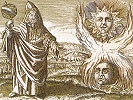

  
[Intangible Textual Heritage](../../index)  [Gnosticism and
Hermetica](../index)  [Index](index)  [Previous](th233)  [Next](th235) 

------------------------------------------------------------------------

[Buy this Book at
Amazon.com](https://www.amazon.com/exec/obidos/ASIN/0766126137/internetsacredte)

------------------------------------------------------------------------

  
*Thrice-Greatest Hermes, Vol. 2*, by G.R.S. Mead, \[1906\], at
Intangible Textual Heritage

------------------------------------------------------------------------

#### COMMENTARY

##### ON THE ADORATION OF IMAGES

The loss of the end of the previous sermon, and also the loss of almost
the whole of (xvii.), is to be accounted for by the falling out of one
or more quires from the original MS. of our Corpus, [4](#fn_628) a phenomenon similar to that already
remarked in the case of C. H., ii. (iii).

p. 287

And that this is the fact is brought out interestingly by the note of
Reitzenstein (p. 193, 1)—namely, that one of the correctors of one of
the copies (Paris MS.) of this faulty original has precisely in these
two places changed the name Asclepius into Tat. He was puzzled, and
thought that his “correction” would set matters right; as a matter of
fact, however, it only adds to the confusion.

What the main subject of our treatise may have been we can hardly
conjecture; part of it, however, must have been devoted to an
explanation of the *rationale* of image-adoration,—“Wherefore pay
worship to the images, O King,”—of which we hear so much in *P. S. A.*

These symbolic images of the Gods are said to have their “forms” (ἰδέας)
in sympathetic relation with the Intelligible World. These are mutual
“reflections,” the one of the other.

Now as the *Ka* of the God was thought to have immediate relation with
the image-symbol of the God, and the Gods were of the Intelligible
World,—the statues of the Gods were thought to be images of the Image in
some special way; they were regarded as providing a straight path or
line of connection between Earth and Heaven, just as a man who made
himself like to the Man after the Likeness became in himself a Way Up.

------------------------------------------------------------------------

### Footnotes

[286:4](th234.htm#fr_629) R. 198.

------------------------------------------------------------------------

[Next: (XVIII.) The Encomium of Kings](th235)
