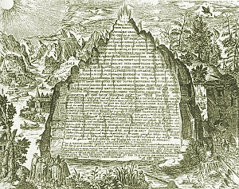

  
[Intangible Textual Heritage](../../index.md)  [Gnosticism and
Hermetica](../index.md) 

------------------------------------------------------------------------

[Buy this Book at
Amazon.com](https://www.amazon.com/exec/obidos/ASIN/0766126145/internetsacredte.md)

------------------------------------------------------------------------

<table width="75%">
<colgroup>
<col style="width: 50%" />
<col style="width: 50%" />
</colgroup>
<tbody>
<tr class="odd">
<td width="50%" data-valign="TOP"> 
The Emerald Tablet of Hermes Trismegistus (click to enlarge)</td>
<td width="50%" data-valign="CENTER"><h1 id="thrice-greatest-hermes-vol.-3" data-align="CENTER">Thrice-Greatest Hermes, Vol. 3</h1>
<h2 id="by-g.r.s.-mead" data-align="CENTER">by G.R.S. Mead</h2>
<h4 id="section" data-align="CENTER">[1906]</h4></td>
</tr>
</tbody>
</table>

------------------------------------------------------------------------

[Volume 1](../th1/index)   \|    [Volume 2](../th2/index.md)   \|   
**Volume 3**

------------------------------------------------------------------------

[Contents](#contents)    [Start Reading](th300.md)    [Page
Index](pageidx)    [Text \[Zipped\]](th3.txt.gz.md)

------------------------------------------------------------------------

|                                                                                                                           |
|---------------------------------------------------------------------------------------------------------------------------|
|  |

This, the third and final part of G.R.S. Meads' collection of Hermetic
literature focuses on the residual texts known from second- and third-
hand references. Many of the longer fragments are gleaned from Stobaeus,
a fifth century CE late pagan anthologizer of Greek literature. The
remainder come from the early Church Fathers, embedded in polemics and
doctrinal discussions. This volume closes with the invaluable series
index, which spans all three volumes.

------------------------------------------------------------------------

 [Title Page](th300.md)  
[Contents](th301.md)  

### I. Excerpts by Stobæus

[Excerpt I. Of Piety and True Philosophy](th302.md)  
[Excerpt II. Of the Ineffability of God](th303.md)  
[Excerpt III. Of Truth](th304.md)  
[Excerpt IV. God, Nature and the Gods](th305.md)  
[Excerpt V. Of Matter](th306.md)  
[Excerpt VI. Of Time](th307.md)  
[Excerpt VII. Of Bodies Everlasting and Bodies Perishable](th308.md)  
[Excerpt VIII. Of Energy and Feeling](th309.md)  
[Excerpt IX. Of the Decans and the Stars](th310.md)  
[Excerpt X. Concerning the Rule of Providence, Necessity and
Fate](th311.md)  
[Excerpt XI. Of Justice](th312.md)  
[Excerpt XII. Of Providence and Fate](th313.md)  
[Excerpt XIII. Of the Whole Economy](th314.md)  
[Excerpt XIV. Of Soul, I.](th315.md)  
[Excerpt XV. Of Soul, II.](th316.md)  
[Excerpt XVI. Of Soul, III.](th317.md)  
[Excerpt XVII. Of Soul, IV.](th318.md)  
[Excerpt XVIII. Of Soul, V.](th319.md)  
[Excerpt XIX. Of Soul, VI.](th320.md)  
[Excerpt XX. The Power of Choice](th321.md)  
[Excerpt XXI. Of Isis to Horus](th322.md)  
[Excerpt XXII. An Apophthegm](th323.md)  
[Excerpt XXIII. From “Aphrodite”](th324.md)  
[Excerpt XXIV. A Hymn of the Gods](th325.md)  
[Excerpt XXV. The Virgin of the World, I.](th326.md)  
[Excerpt XXVI. The Virgin of the World, II.](th327.md)  
[Commentary](th328.md)  
[Excerpt XXVII. From the Sermon of Isis to Horus](th329.md)  
[Commentary](th330.md)  

### II. References and Fragments in the Fathers

[I. Justin Martyr](th331.md)  
[II. Athenagoras](th332.md)  
[III. Clement of Alexandria](th333.md)  
[IV. Tertullian](th334.md)  
[V. Cyprian](th335.md)  
[VI. Arnobius](th336.md)  
[VII. Lactantius](th337.md)  
[VIII. Augustine](th338.md)  
[IX. Cyril of Alexandria](th339.md)  
[X. Suidas](th340.md)  
[XI. Anonymous](th341.md)  

### III. References and Fragments in the Philosophers

[I. Zosimus](th342.md)  
[II. Jamblichus](th343.md)  
[III. Julian the Emperor](th344.md)  
[IV. Fulgentius the Mythographer](th345.md)  

 

[IV. Conclusion](th346.md)  
[Index](th347.md)  
[Works by G. R. S. Mead](th348.md)  
