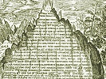

  
[Intangible Textual Heritage](../../index)  [Gnosticism and
Hermetica](../index)  [Index](index)  [Previous](th337)  [Next](th339) 

------------------------------------------------------------------------

[Buy this Book at
Amazon.com](https://www.amazon.com/exec/obidos/ASIN/0766126145/internetsacredte)

------------------------------------------------------------------------

  
*Thrice-Greatest Hermes, Vol. 3*, by G.R.S. Mead, \[1906\], at
Intangible Textual Heritage

------------------------------------------------------------------------

p. 249

#### VIII.

### AUGUSTINE

i. *De Civitate Dei*, xxiii.; Hoffmann (E.), i. 392
(Vienna, 1899-1900). [1](#fn_595)

##### THREE QUOTATIONS FROM THE OLD LATIN VERSION OF THE “PERFECT SERMON”

Augustine is arguing against the views of
Appuleius (first half of the second century) on the cult of the
“daimones,” and in so doing introduces a long disquisition on the
doctrine of “Egyptian Hermes, whom they call Thrice-greatest,”
concerning image-worship, or the consecrated and “ensouled,” or
“animated,” statues of the gods.

In the course of his remarks the Bishop of Hippo quotes at length from a
current Latin version [2](#fn_596) of “The
Perfect Sermon” or “Asclepius” (though without himself giving any
title), which we see at once must have been the very same text that has
come down to us in its entirety. It is precisely the same text, word for
word, with ours; the variants being practically of the most minute
character.

p. 250

First of all Augustine quotes from *P. S. A.*, xxiii. 3, xxiv. 2. This
“prophecy” of the downfall of the Egyptian religion Augustine naturally
takes as referring to the triumph of Christianity, and so he ridicules
Hermes “\[*qui*\] *tam impudenter dolebat, quam imprudentur sciebat*.”

ii. *Ibid.*, xxiv.; Hoffmann, i. 396.

The Bishop of Hippo begins his next chapter with a quotation from *P. S.
A.*, xxxvii. 1, 2, on the same subject, and proceeds scornfully to
criticise the statements of the Trismegistic writer.

iii. *Ibid.*, xxvi.; Hoffmann, i. 402.

After quoting the sentence, from *P. S. A.*, xxiv. 3, in which Hermes
says that the pure temples of Egypt will all be polluted with tombs and
corpses, Augustine proceeds to contend that the gods of Egypt are all
dead men, and in support of his contention he quotes *P. S. A.*, xxxvii.
3, 4.

------------------------------------------------------------------------

### Footnotes

[249:1](th338.htm#fr_595) *Corpus Scriptorum
Ecclesiasticorum Latinorum*, vol. xxx. (Imp. Acad. of Vienna). The date
of the writing of the treatise, *De Civitate Dei*, is fixed as being
about 413-426 A.D.

[249:2](th338.htm#fr_596) *Hujus Ægyptii verba,
sicut in nostram linguam interpretata sunt*.

------------------------------------------------------------------------

[Next: IX. Cyril of Alexandria](th339)
