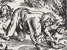

  
[Intangible Textual Heritage](../../index)  [Gothic](../index) 
[Index](index)  [Previous](bow08)  [Next](bow10) 

------------------------------------------------------------------------

[Buy this Book at
Amazon.com](https://www.amazon.com/exec/obidos/ASIN/B002B54F2G/internetsacredte)

------------------------------------------------------------------------

  
*The Book of Were-Wolves*, by Sabine Baring-Gould, \[1865\], at
Intangible Textual Heritage

------------------------------------------------------------------------

p. 100

# CHAPTER VIII.

### FOLK-LORE RELATING TO WERE-WOLVES.

Barrenness of English Folk-lore--Devonshire Traditions--Derivation of
Were-wolf--Cannibalism in Scotland--The Angus Robber--The Carle of
Perth--French Superstitions--Norwegian Traditions--Danish Tales of
Were-wolves--Holstein Stories--The Werewolf in the Netherlands--Among
the Greeks; the Serbs; the White Russians; the Poles; the Russians--A
Russian Receipt for becoming a Were-wolf--The Bohemian
Vlkodlak--Armenian Story--Indian Tales--Abyssinian Budas--American
Transformation Tales--A Slovakian Household Tale--Similar Greek,
Béarnais, and Icelandic Tales.

ENGLISH folk-lore is singularly barren of were-wolf stories, the reason
being that wolves had been extirpated from England under the Anglo-Saxon
kings, and therefore ceased to be objects of dread to the people. The
traditional belief in were-wolfism must, however, have remained long in
the popular mind, though at present it has disappeared, for the word
occurs in old ballads and romances. Thus in Kempion--

O was it war-wolf in the wood?  
    Or was it mermaid in the sea?  
Or was it man, or vile woman,  
    My ain true love, that mis-shaped thee?

p. 101

There is also the romance of *William and the Were-wolf* in
Hartshorn;\[1\] but this professes to be a translation from the
French:--

For he of Frenche this fayre tale ferst dede translate,  
In ese of Englysch men in Englysch speche.

In the popular mind the cat or the hare have taken the place of the wolf
for witches' transformation, and we hear often of the hags attending the
devil's Sabbath in these forms.

In Devonshire they range the moors in the shape of black dogs, and I
know a story of two such creatures appearing in an inn and nightly
drinking the cider, till the publican shot a silver button over their
heads, when they were instantly transformed into two ill-favoured old
ladies of his acquaintance. On Heathfield, near Tavistock, the wild
huntsman rides by full moon with his "wush hounds;" and a white hare
which they pursued was once rescued by a goody returning from market,
and discovered to be a transformed young lady.

Gervaise of Tilbury says in his *Otia Imperalia*--

"Vidimus frequenter in Anglia, per lunationes, homines in lupos mutari,
quod hominum genus *gerulfos* Galli

\[1. HARTSHORN: *Ancient Metrical Tales*, p. 256. See also "The Witch
Cake," in CRUMEK'S *Remains of Nithsdale Song*.\]

p. 102

vocant, Angli vero *wer-wlf,* dicunt: *wer* enim Anglice virum sonat,
*wlf*, lupum." Gervaise may be right in his derivation of the name, and
were-wolf may mean man-wolf, though I have elsewhere given a different
derivation, and one which I suspect is truer. But Gervaise has grounds
for his assertion that *wér* signifies man; it is so in Anglo-Saxon,
*vair* in Gothic, *vir* in Latin, *verr*, in Icelandic, *vîra*, Zend,
*wirs*, old Prussian, *wirs*, Lettish, *vîra*, Sanskrit, *bîr*,
Bengalee.

There have been cases of cannibalism in Scotland, but no bestial
transformation is hinted at in connection with them.

Thus Bœthius, in his history of Scotland, tells us of a robber and his
daughter who devoured children, and Lindsay of Pitscottie gives a full
account.

"About this time (1460) there was ane brigand ta'en with his haill
family, who haunted a place in Angus. This mischievous man had ane
execrable fashion to take all young men and children he could steal away
quietly, or tak' away without knowledge, and eat them, and the younger
they were, esteemed them the mair tender and delicious. For the whilk
cause and damnable abuse, he with his wife and bairns were all burnt,
except ane young wench of a year old who

p. 103

was saved and brought to Dandee, where she was brought up and fostered;
and when she came to a woman's years, she was condemned and burnt quick
for that crime. It is said that when she was coming to the place of
execution, there gathered ane huge multitude of people, and specially of
women, cursing her that she was so unhappy to commit so damnable deeds.
To whom she turned about with an ireful countenance, saying:--'Wherefore
chide ye with me, as if I had committed ane unworthy act? Give me
credence and trow me, if ye had experience of eating men and women's
flesh, ye wold think it so delicious that ye wold never forbear it
again.' So, but any sign of repentance, this unhappy traitor died in the
sight of the people."\[1\]

Wyntoun also has a passage in his metrical chronicle regarding a
cannibal who lived shortly before his own time, and he may easily have
heard about him from surviving contemporaries. It was about the year
1340, when a large portion of Scotland had been devastated by the arms
of Edward III.

About Perth thare was the countrie  
Sae waste, that wonder wes to see;

\[1. LINDSAY'S *Chronicles of Scotland*, 1814, p. 163.\]

p. 104

For intill well-great space thereby,  
Wes nother house left nor herb'ry.  
Of deer thare wes then sic foison (profusion),  
That they wold near come to the town,  
Sae great default was near that stead,  
That mony were in hunger dead.  
A carle they said was near thereby,  
That wold act settis (traps) commonly,  
Children and women for to slay,  
And swains that he might over-ta;  
And ate them all that he get might;  
Chwsten Cleek till name behight.  
That sa'ry life continued he,  
While waste but folk was the countrie.\[1\]

We have only to compare these two cases with those recorded in the last
two chapters, and we see at once how the popular mind in Great Britain
had lost the idea of connecting change of form with cannibalism. A man
guilty of the crimes committed by the Angus brigand, or the carle of
Perth, would have been regarded as a were-wolf in France or Germany, and
would have been tried for Lycanthropy.

S. Jerome, by the way, brought a sweeping charge against the Scots. He
visited Gaul in his youth, about 880, and he writes:--"When I was a
young man in Gaul, I may have seen the Attacotti, a British people who
live upon human flesh; and when they find herds

\[1. WYNTOUN'S *Chronicle*, ii. 236.\]

p. 105

of pigs, droves of cattle, or flocks of sheep in the woods, they cut off
the haunches of the men and the breasts of the women, and these they
regard as great dainties;" in other words they prefer the shepherd to
his flock. Gibbon who quotes this passage says on it: "If in the
neighbourhood of the commercial and literary town of Glasgow, a race of
cannibals has really existed, we may contemplate, in the period of the
Scottish history, the opposite extremes of savage and civilized life.
Such reflections tend to enlarge the circle of our ideas, and to
encourage the pleasing hope that New Zealand may produce in a future
age, the Hume of the Southern hemisphere."

If traditions of were-wolves are scanty in England, it is quite the
reverse if we cross the water.

In the south of France, it is still believed that fate has destined
certain men to be lycanthropists--that they are transformed into wolves
at full moon. The desire to run comes upon them at night. They leave
their beds, jump out of a window, and plunge into a fountain. After the
bath, they come out covered with dense fur, walking on all fours, and
commence a raid over fields and meadows, through woods and villages,
biting all beasts and human beings that come in their way. At

p. 106

the approach of dawn, they return to the spring, plunge into it, lose
their furry skins, and regain their deserted beds. Sometimes the
loup-garou is said to appear under the form of a white dog, or to be
loaded with chains; but there is probably a confusion of ideas between
the were-wolf and the church-dog, bar-ghest, pad-foit, wush-hound, or by
whatever name the animal supposed to haunt a churchyard is designated.

In the Périgord, the were-wolf is called louléerou. Certain men,
especially bastards, are obliged at each full moon to transform
themselves into these diabolic beasts.

It is always at night that the fit comes on. The lycanthropist dashes
out of a window, springs into a well, and, after having struggled in the
water for a few moments, rises from it, dripping, and invested with a
goatskin which the devil has given him. In this condition, the
louléerous run upon four legs, pass the night in ranging over the
country, and in biting and devouring all the dogs they meet. At break of
day they lay aside their goatskins and return home. Often they are ill
in consequence of having eaten tough old hounds, and they vomit up their
undigested paws. One great nuisance to them is the fact that they may be
wounded or killed in their louléerou state. With the

p. 107

first effusion of blood their diabolic covering vanishes, and they are
recognized, to the disgrace of their families.

A were-wolf may easily be detected, even when devoid of his skin; for
his hands are broad, and his fingers short, and there are always some
hairs in the hollow of his hand.

In Normandy, those who are doomed to be loups-garoux, clothe themselves
every evening with a skin called their *hère* or *hure*, which is a loan
from the devil. When they run in their transformed state, the evil one
accompanies them and scourges them at the foot of every cross they pass.
The only way in which a werewolf can be liberated from this cruel
bondage, is by stabbing him three times in the forehead with a knife.
However, some people less addicted to allopathic treatment, consider
that three drops of blood drawn by a needle, will be sufficient to
procure release.

According to an opinion of the vulgar in the same province, the
loup-garou is sometimes a metamorphosis forced upon the body of a damned
person, who, after having been tormented in his grave, has torn his way
out of it. The first stage in the process consists in his devouring the
cerecloth which enveloped his face; then his moans and muffled howls
ring from the tomb,

p. 108

through the gloom of night, the earth of the grave begins to heave, and
at last, with a scream, surrounded by a phosphorescent glare, and
exhaling a fœtid odour, he bursts away as a wolf.

In Le Bessin, they attribute to sorcerers the power of metamorphosing
certain men into beasts, but the form of a dog is that principally
affected by them.

In Norway it is believed that there are persons who can assume the form
of a wolf or a bear (Huse-björn), and again resume their own; this
property is either imparted to them by the Trollmen, or those possessing
it are themselves Trolls.

In a hamlet in the midst of a forest, there dwelt a cottager named
Lasse, and his wife. One day he went out in the forest to fell a tree,
but had forgot to cross himself and say his paternoster, so that some
troll or wolf-witch (varga mor) obtained power over him and transformed
him into a wolf. His wife mourned him for many years, but, one
Christmas-eve, there came a beggar-woman, very poor and ragged, to the
door, and the good woman of the house took her in, fed her well, and
entreated her kindly. At her departure the beggar-woman said that the
wife would probably see her husband again, as he was not dead,

p. 109

but was wandering in the forest as a wolf. Towards night-fall the wife
went to her pantry to place in it a piece of meat for the morrow, when,
on turning to go out, she perceived a wolf standing before her, raising
itself with its paws on the pantry steps, regarding her with sorrowful
and hungry looks. Seeing this she exclaimed, "If I were sure that thou
wert my own Lasse, I would give thee a bit of meat." At that instant the
wolf-skin fell off, and her husband stood before her in the clothes he
wore on the unlucky morning when she had last beheld him.

Finns, Lapps, and Russians are held in particular aversion, because the
Swedes believe that they have power to change people into wild beasts.
During the last year of the war with Russia, when Calmar was overrun
with an unusual number of wolves, it was generally said that the
Russians had transformed their Swedish prisoners into wolves, and sent
them home to invest the country.

In Denmark the following stories are told:--

A man, who from his childhood had been a were-wolf, when returning one
night with his wife from a merrymaking, observed that the hour was at
hand when the evil usually came upon him; giving therefore the reins

p. 110

to his wife, he descended from the vehicle, saying to her, "If anything
comes to thee, only strike at it with thine apron." He then withdrew,
but immediately after, the woman, as she was sitting in the vehicle, was
attached by a were-wolf. She did as the man had enjoined her, and struck
it with her apron, from which it rived a portion, and then ran away.
After some time the man returned, holding in his mouth the rent portion
of his wife's apron, on seeing which, she cried out in terror,--"Good
Lord, man, why, thou art a were-wolf!" "Thank thee, wife," said he, "now
I am free." And from that time he was no more afflicted.

If a female at midnight stretches between four sticks the membrane which
envelopes the foal when it is brought forth, and creeps through it,
naked, she will bear children without pain; but all the boys will be
were-wolves, and all the girls maras. By day the were-wolf has the human
form, though he may be known by the meeting of his eyebrows above the
nose. At a certain time of the night he has the form of a dog on three
legs. It is only when another person tells him that he is a were-wolf,
or reproaches him with being such, that a man can be freed from the ban.

According to a Danish popular song, a hero transformed

p. 111

by his step-mother into a bear, fights with a knight:--

For 'tis she who bath bewitched me,  
A woman false and fell,  
Bound an iron girdle round me,  
If thou can'st not break this belt,  
Knight, I'll thee destroy!  
\*    \*    \*    \*  
The noble made the Christian sign,  
The girdle snapped, the bear was changed,  
And see! he was a lusty knight,  
His father's realm regained.

Kjæmpeviser, p. 147.

When an old bear in Ofodens Priestegjeld was killed, after it had caused
the death of six men und sixty horses, it was found to be girded with a
similar girdle.

In Schleswig and Holstein they say that if the were-wolf be thrice
addressed by his baptismal name, he resumes his human form.

On a hot harvest day some reapers lay down in the field to take their
noontide sleep, when one who could not sleep observed that the fellow
next to him rose softly, and having girded himself with a strap, became
a were-wolf.

A young man belonging to Jägerup returning late one night from Billund,
was attacked, when near Jägerup, by three were-wolves, and would
probably

p. 112

have been torn to pieces, had he not saved himself by leaping into a
rye-field, for there they had no more power over him.

At Caseburg, on the isle of Usedom, a man and his wife were busy in the
field making hay, when after some time the woman said to the man that
she had no more peace, she could stay no longer, and went away. But she
had previously desired her husband to promise, that if perchance a wild
beast should come that way, he would cast his hat at it and then run
away, and it would do him no injury. She had been gone but a short
while, when a wolf came swimming across the Swine, and ran directly
towards the haymakers. The man threw his hat at it, which the animal
instantly tore to rags. But in the meantime a boy had run up with a
pitchfork, and he dabbed the wolf from behind: in the same moment it
became changed, and all saw that the boy had killed the man's wife.

Formerly there were individuals in the neighbourhood of Steina, who, by
putting on a certain girdle, could transform themselves into
were-wolves. A man of the neighbourhood, who had such a girdle, forgot
one day when going out to lock it up, as was his wont. During his
absence, his little son chanced to find it;

p. 113

he buckled it round him., and was instantaneously turned into an animal,
to all outward appearance like a bundle of peat-straw, and he rolled
about like an unwieldy bear. When those who were in the room perceived
this, they hastened in search of the father, who was found in time to
come and unbuckle the belt, before the child had done any mischief. The
boy afterwards said, that when he had put on the girdle, he was seized
with such a raging hunger, that he was ready to tear in pieces and
devour all that came in his way.

The girdle is supposed to be made of human skin, and to be three
finger-breadths wide.

In East Friesland, it is believed, when seven girls succeed each other
in one family, that among them one is of necessity a were-wolf, so that
youths are slow in seeking one of seven sisters in marriage.

According to a curious Lithuanian story related by Schleicher in his
*Litauische Märchen*, a person who is a were-wolf or bear has to remain
kneeling in one spot for one hundred years before he can hope to obtain
release from his bestial form.

In the Netherlands they relate the following tale:--A man had once gone
out with his bow to attend a shooting match at Rousse, but when about
half way to

p. 114

the place, he saw on a sudden, a large wolf spring from a thicket, and
rush towards a young girl, who was sitting in a meadow by the roadside
watching cows. The man did not long hesitate, but quickly drawing forth
an arrow, took aim, and luckily hit the wolf in the right side, so that
the arrow remained sticking in the wound, and the animal fled howling to
the wood.

On the following day he heard that a serving-man of the burgomaster's
household lay at the point of death, in consequence of having been shot
in the right side, on the preceding day. This so excited the archer's
curiosity, that he went to the wounded man, and requested to see the
arrow. He recognized it immediately as one of his own. Then, having
desired all present to leave the room, he persuaded the man to confess
that he was a were-wolf and that he had devoured little children. On the
following day he died.

Among the Bulgarians and Sloyakians the were-wolf is called *vrkolak*, a
name resembling that given it by the modern Greeks
βρύκολακας?&lt;?/ι?&gt;. The Greek were-wolf is closely related to the
vampire. The lycanthropist falls into a cataleptic trance, during which
his soul leaves his body, enters that of a wolf and ravens for blood. On
the return of the soul, the body is exhausted and aches

p. 115

as though it had been put through violent exercise. After death
lycanthropists become vampires. They are believed to frequent
battlefields in wolf or hyæna shapes, and to suck the breath from dying
soldiers, or to enter houses and steal the infants from their cradles.
Modern Greeks call any savage-looking man, with dark complexion, and
with distorted, misshapen limbs, a βρύκολακας, and suppose him to be
invested with power of running in wolf-form.

The Serbs connect the vampire and the were-wolf together, and call them
by one name *vlkoslak*. These rage chiefly in the depths of winter: they
hold their annual gatherings, and at them divest themselves of their
wolf-skins, which they hang on the trees around them. If any one
succeeds in obtaining the skin and burning it, the vlkoslak is
thenceforth disenchanted.

The power to become a were-wolf is obtained by drinking the water which
settles in a foot-print left in clay by a wolf.

Among the White Russians the *wawkalak* is a man who has incurred the
wrath of the devil, and the evil one punishes him by transforming him
into a wolf and sending him among his relations, who recognize him and
feed him well. He is a most amiably disposed

p. 116

were-wolf, for he does no mischief, and testifies his affection for his
kindred by licking their hands. He cannot, however, remain long in any
place, but is driven from house to house, and from hamlet to hamlet, by
an irresistible passion for change of scene. This is an ugly
superstition, for it sets a premium on standing well with the evil one.

The Sloyakians merrily term a drunkard a vlkodlak, because, forsooth, he
makes a beast of himself. A Slovakian household were-wolf tale closes
this chapter.

The Poles have their were-wolves, which rage twice in the year--at
Christmas and at midsummer.

According to a Polish story, if a witch lays a girdle of human skin on
the threshold of a house in which a marriage is being celebrated, the
bride and bridegroom, and bridesmaids and groomsmen, should they step
across it, are transformed into wolves. After three years, however, the
witch will cover them with skins with the hair. turned outward;
immediately they will recover their natural form. On one occasion, a
witch cast a skin of too scanty dimensions over the bridegroom, so that
his tail was left uncovered: he resumed his human form, but retained his
lupine caudal appendage .

p. 117

The Russians call the were-wolf *oborot*, which signifies "one
transformed." The following receipt is given by them for becoming one.

"He who desires to become an oborot, let him seek in the forest a
hewn-down tree; let him stab it with a small copper knife, and walk
round the tree, repeating the following incantation:--

On the sea, on the ocean, on the island, on Bujan,  
On the empty pasture gleams the moon, on an ashstock lying  
In a green wood, in a gloomy vale.  
Toward the stock wandereth a shaggy wolf.  
Horned cattle seeking for his sharp white fangs;  
But the wolf enters not the forest,  
But the wolf dives not into the shadowy vale,  
Moon, moon, gold-horned moon,  
Cheek the flight of bullets, blunt the hunters' knives,  
Break the shepherds' cudgels,  
Cast wild fear upon all cattle,  
On men, on all creeping things,  
That they may not catch the grey wolf,  
That they may not rend his warm skin  
My word is binding, more binding than sleep,  
More binding than the promise of a hero!

"Then he springs thrice over the tree and runs into the forest,
transformed into a wolf."\[1\]

In the ancient Bohemian Lexicon of Vacerad (A. D. 1202) the were-wolf is
called vilkodlak, and is explained as faunus. Safarik says under that
head,-

\[1. SACHAROW: *Inland*, 1838, No. 17.\]

p. 118

"Incubi sepe improbi existunt mulieribus, et earum peragunt concubitum,
quos demones Galli *dusios* nuncupant." And in another place:
"Vilkodlaci, incubi, sive invidi, ab inviando passim cum animalibus,
unde et incubi dicuntur ab incubando homines, i. e. stuprando, quos
Romani faunos ficarios dicunt."

That the same belief in lycanthropy exists in Armenia is evident from
the following story told by Haxthausen, in his *Trans-Caucasia*
(Leipzig, i. 322):--"A man once saw a wolf, which had carried off a
child, dash past him. He pursued it hastily, but was unable to overtake
it. At last he came upon the hands and feet of a child, and a little
further on he found a cave, in which lay a wolf-skin. This he cast into
a fire, and immediately a woman appeared, who howled and tried to rescue
the skin from the flames. The man, however, resisted, and, as soon as
the hide was consumed, the woman had vanished in the smoke."

In India, on account of the prevalence of the doctrine of
metempsychosis, the belief in transformation is widely diffused. Traces
of genuine lycanthropy are abundant in all regions whither Buddism has
reached. In Ceylon, in Thibet, and in China, we find it still forming a
portion of the national creed.

p. 119

In the Pantschatantra is a story of an enchanted Brahmin's son, who by
day was a serpent, by night a man.

Vikramâditya's father, the son of Indra, was condemned to be an ass by
day and a man by night.

A modern Indian tale is to this effect:--A prince marries a female ape,
but his brothers wed handsome princesses. At a feast given by the queen
to her stepdaughters, there appears an exquisitely beautiful lady in
gorgeous robes. This is none other than the she-ape, who has laid aside
her skin for the occasion: the prince slips out of the room and burns
the skin, so that his wife is prevented from resuming her favourite
appearance.

Nathaniel Pierce\[1\] gives an account of an Abyssinian superstition
very similar to that prevalent in Europe.

He says that in Abyssinia the gold. and silversmiths are highly
regarded, but that the ironworkers are looked upon with contempt, as an
inferior grade of beings. Their kinsmen even ascribe to them the power
of transforming themselves into hyænas, or other savage beasts. All
convulsions and hysterical disorders are attributed to the effect of
their evil eye. The Amhara

\[1. *Life and Adventures of Nathaniel Pierce*, written by himself
during a residence in Abyssinia from 1810-19. London, 1831.\]

p. 120

call them *Buda*, the Tigré, *Tebbib*. There are also Mahomedan and
Jewish Budas. It is difficult to explain the origin of this strange
superstition. These Budas are distinguished from other people by wearing
gold ear-rings, and Coffin declares that he has often found hyænas with
these rings in their ears, even among the beasts which he has shot or
speared himself. But how the rings got into their ears is more than
Coffin was able to ascertain.

Beside their power to transform themselves into hyænas or other wild
beasts, all sorts of other strange things are ascribed to them; and the
Abyssinians are firmly persuaded that they rob the graves by midnight,
and no one would venture to touch what is called *quanter*, or dried
meat in their houses, though they would not object to partake of fresh
meat, if they had seen the animal, from which it came, killed before
them. Coffin relates, as eye-witness of the fact, the following story:--

Among his servants was a Buda, who, one evening, whilst it was still
light, came to his master and asked leave of absence till the following
morning. He obtained the required leave and departed; but scarcely had
Coffin turned his head, when one of his men

p. 121

exclaimed,--"Look! there he is, changing himself into hyæna," pointing
in the direction taken by the Buda. Coffin turned to look, and although
he did not witness the process of transformation, the young man had
vanished from the spot on which he had been standing, not a hundred
paces distant, and in his place was a hyæna running away. The place was
a plain without either bush or tree to impede the view. Next morning the
young man returned, and was charged by his companions with the
transformation: this he rather acknowledged than denied, for he excused
himself on the plea that it was the habit of his class. This statement
of Pierce is corroborated by a note contributed by Sir Gardner Wilkinson
to Rawlinson's *Herodotus* (book iv. chap. 105). "A class of people in
Abyssinia are believed to change themselves into hyænas when they like.
On my appearing to discredit it, I was told by one who lived for years
there, that no well-informed person doubted it, and that he was once
walking with one of them, when he happened to look away for a moment,
and on turning again towards his companion, he saw him trotting off in
the shape of a hyæna. He met him afterwards in his old form. These
worthies are blacksmiths.--G. W."

p. 122

A precisely similar superstition seems to have existed in America, for
Joseph Acosta (*Hist. Nat. des Indes*) relates that the ruler of a city
in Mexico, who was sent for by the predecessor of Montezuma, transformed
himself, before the eyes of those who were sent to seize him, into an
eagle, a tiger, and an enormous serpent. He yielded at last, and was
condemned to death. No longer in his own house, he was unable to work
miracles so as to save his life. The Bishop of Chiapa, a province of
Guatemala, in a writing published in 1702, ascribes the same power to
the Naguals, or national priests, who laboured to bring back to the
religion of their ancestors, the children brought up as Christians by
the government. After various ceremonies, when the child instructed
advanced to embrace him, the Nagual suddenly assumed a frightful aspect,
and under the form of a lion or tiger, appeared chained to the young
Christian convert.--(*Recueil de Voyages*, tom. ii. 187.)

Among the North American Indians, the belief in transformation is very
prevalent. The following story closely resembles one very prevalent all
over the world.

"One Indian fixed his residence on the borders of the Great Bear lake,
taking with him only a dog big

p. 123

with young. In due time, this dog brought forth eight pups. Whenever the
Indian went out to fish, he tied up the pups, to prevent the straying of
the litter. Several times, as he approached his tent, he heard noises
proceeding from it, which sounded like the talking, the laughing, the
crying, the wail, and the merriment of children; but, on entering it, he
only perceived the pups tied up as usual. His curiosity being excited by
the noises he had heard, he determined to watch and learn whence these
sounds proceeded, and what they were. One day he pretended to go out to
fish, but, instead of doing so, he concealed himself in a convenient
place. In a short time he again heard -voices, and, rushing suddenly
into the tent, beheld some beautiful children sporting and laughing,
with the dog-skins lying by their side. He threw the dog-skins into the
fire, and the children, retaining their proper forms, grew up, and were
the ancestors of the dog-rib nation."--(*Traditions of the North
American Indians*, by T. A. Jones, 1830, Vol. ii. p. 18.)

In the same work is a curious story entitled *The Mother of the World*,
which bears a close analogy to another world-wide myth: a woman marries
a dog, by night the dog lays aside its skin, and appears as a man. p. 124 This may be compared with the tale of Björn
and Bera already given.

I shall close this chapter with a Slovakian household tale given by T.
T. Hanush in the third volume of *Zeitschrift für Deutsche Mythologie*.

The Daughter of the Vlkolak

"There was once a father, who had nine daughters, and they were all
marriageable, but the youngest was the most beautiful. The father was a
were-wolf. One day it came into his head: 'What is the good of having to
support so many girls?' so he determined to put them all out of the way.

"He went accordingly into the forest to hew wood, and he ordered his
daughters to let one of them bring him his dinner. It was the eldest who
brought it.

"'Why, how come you so early with the food?' asked the woodcutter.

"'Truly, father, I wished to strengthen you, lest you should fall upon
us, if famished!'

"'A good lass! Sit down whilst I eat.' He ate, and whilst he ate he
thought of a scheme. He rose and said: I My girl, come, and I will show
you a pit I have been digging.'

p. 125

"'And what is the pit for? '

"'That we may be buried in it when we die, for poor folk will not be
cared for much after they are dead and gone.'

"So the girl went with him to the side of the deep pit. 'Now hear,' said
the were-wolf, 'you must die and be cast in there.'

"She begged for her life, but all in vain, so he laid hold of her and
cast her into the grave. Then he took a great stone and flung it in upon
her and crushed her head, so the poor thing breathed out her soul. When
the were-wolf had done this he went back to his work, and as dusk came
on, the second daughter arrived, bringing him food. He told her of the
pit, and brought her to it, and cast her in, and killed her as the
first. And so he dealt with all his girls up to the last. The youngest
knew well that her father was a were-wolf, and she was grieved that her
sisters did not return; she thought, 'Now where can they be? Has my
father kept them for companionship; or to help him in his work?' So she
made the food which she was to take him, and crept cautiously through
the wood. When she came near the place where her father worked, she
heard his strokes felling timber, and smelt smoke. She saw

p. 126

presently a large fire and two human heads roasting at it. Turning from
the fire, she went in the direction of the axe-strokes, and found her
father.

"See,' said she, 'father, I have brought you food.'

"That is a good lass,' said he. 'Now stack the wood for me whilst I
eat.'

"'But where are my sisters?' she asked.

"'Down in yon valley drawing wood,' he replied 'follow me, and I will
bring you to them.'

"They came to the pit; then he told her that he had dug it for a grave.
'Now,' said he, 'you must die, and be cast into the pit with your
sisters. '

"'Turn aside, father,' she asked, 'whilst I strip of my clothes, and
then slay me if you will.'

"He turned aside as she requested, and then--tchich! she gave him a
push, and he tumbled headlong into the hole he had dug for her.

"She fled for her life, for the were-wolf was not injured, and he soon
would scramble out of the pit.

"Now she hears his howls resounding through the gloomy alleys of the
forest, and swift as the wind she runs. She hears the tramp of his
approaching feet, and the snuffle of his breath. Then she casts behind
her her handkerchief. The were-wolf seizes this with teeth

p. 127

and nails, and rends it till it is reduced to tiny ribands. In another
moment he is again in pursuit foaming at the mouth, and howling
dismally, whilst his red eyes gleam like burning coals. As he gains on
her, she casts behind her her gown, and bids him tear that. He seizes
the gown and rives it to shreds, then again he pursues. This time she
casts behind her her apron, next her petticoat, then her shift, and at
last rums much in the condition in which she was born. Again the
were-wolf approaches; she bounds out of the forest into a hay-field, and
hides herself in the smallest heap of hay. Her father enters the field,
runs howling about it in search of her, cannot find her, and begins to
upset the different haycocks, all the while growling and gnashing his
gleaming white fangs in his rage at her having escaped him. The foam
flakes drop at every step from his mouth, and his skin is reeking with
sweat. Before he has reached the smallest bundle of hay his strength
leaves him, he feels exhaustion begin to creep over him, and he retires
to the forest.

"The king goes out hunting every clay; one of his dogs carries food to
the hay-field, which has most unaccountably been neglected by the
hay-makers for three days. The king, following the dog, discovers

p. 128

the fair damsel, not exactly 'in the straw,' but up to her neck in hay.
She is carried, hay and all, to the palace, where she becomes his wife,
making only one stipulation before becoming his bride, and that is, that
no beggar shall be permitted to enter the palace.

"After some years a beggar does get in, the beggar being, of course,
none other than her were-wolf father. He steals upstairs, enters the
nursery, cuts the throats of the two children borne by the queen to her
lord, and lays the knife under her pillow.

"In the morning, the king, supposing his wife to be the murderess,
drives her from home, with the dead princes hung about her neck. A
hermit comes to the rescue, and restores the babies to life. The king
finds out his mistake, is reunited to the lady out of the hay, and the
were-wolf is cast off a high cliff into the sea, and that is the end of
him. The king, the queen, and the princes live happily, and may be
living yet, for no notice of their death has appeared in the newspaper."

 

This story bears some resemblance to one told by Von Hahn in his
*Griechische und Albanesische Märchen*; I remember having heard a very
similar one in the Pyrenees; but the man who flies from the were-wolf

p. 129

is one who, after having stripped off all his clothes, rushes into a
cottage and jumps into a bed. The were-wolf dares not, or cannot,
follow. The cause of his flight was also different. He was a freemason
who had divulged the secret, and the were-wolf was the master of his
lodge in pursuit of him. In the Bearnais story, there is nothing similar
to the last part of the Slovakian tale, and in the Greek one the
transformation and the pursuit are omitted, though the woman-eater is
called "dog's-head," much as an outlaw in the north of Europe was said
to be wolf-headed.

It is worthy of notice in the tale of *The Daughter of the Ulkolak*,
that the were-wolf fit is followed by great exhaustion,\[1\] and that
the wolf is given clothes to tear, much as in the Danish stories already
related. There does not seem to be any indication of his Laving changed
his shape, at least no change is mentioned, his hands are spoken of, and
he swears and curses his daughter in broad Slovakian. The fit very
closely resembles that to which Skallagrim, the Icelander, was subject.
It is a pity that the maid Bràk in the Icelandic tale did not fall upon
her legs like the young lady in the hay.

\[1. Compare this with the exhaustion following a Berserkir fit, and
that which succeeded the attacks to which M. Bertrand was subject.\]

------------------------------------------------------------------------

[Next: Chapter IX. Natural Causes of Lycanthropy](bow10)
