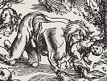

  
[Intangible Textual Heritage](../../index)  [Gothic](../index.md) 
[Index](index)  [Previous](bow10)  [Next](bow12.md) 

------------------------------------------------------------------------

[Buy this Book at
Amazon.com](https://www.amazon.com/exec/obidos/ASIN/B002B54F2G/internetsacredte.md)

------------------------------------------------------------------------

  
*The Book of Were-Wolves*, by Sabine Baring-Gould, \[1865\], at
Intangible Textual Heritage

------------------------------------------------------------------------

p. 153

# CHAPTER X.

### MYTHOLOGICAL ORIGIN OF THE WERE-WOLF MYTH.

Metempsychosis--Sympathy between Men and Beasts--Finnbog and the
Bear--Osage and the Beaver--The Connexion of Soul and
Body--Buddism--Case of Mr. Holloway--Popular ideas concerning the
Body--The derivation of the German Leichnam--Feather
Dresses--Transmigration of Souls--A Basque Story--Story from the
Pantschatantra--Savage ideas regarding Natural Phenomena--Thunder,
Lightning, and Cloud--The origin of the Dragon--John of Bromton's Dragon
a Waterspout--The Legend of Typhoeus--Allegorizing of the Effects of a
Hurricane--Anthropomorphosis--The Cirrus Cloud, a Heavenly
Swan--Urvaci--The Storm-cloud a Daemon--Vritra and Rakschasas--Story of
a Brahmin and a Rakschasas

TRANSFORMATION into beasts forms an integral portion of all mythological
systems. The gods of Greece were wont to change themselves into animals
in order to carry out their designs with greater speed, security, and
secrecy, than in human forms. In Scandinavian mythology, Odin changed
himself into the shape of an eagle, Loki into that of a salmon. Eastern
religions abound in stories of transformation.

The line of demarcation between this and the

p. 154

translation of a beast's soul into man, or a man's soul into a beast's
(metempsychosis) is very narrow.

The doctrine of metempsychosis is founded on the consciousness of
gradation between beasts and men. The belief in a soul-endowed animal
world was present among the ancients, and the laws of intelligence and
instinct were misconstrued, or were regarded as a puzzle, which no man
might solve.

The human soul with its consciousness seemed to be something already
perfected in a pre-existing state, and, in the myth of metempsychosis,
we trace the yearnings and gropings of the soul after the source whence
its own consciousness was derived, counting its dreams and
hallucinations as gleams of memory, recording acts which had taken place
in a former state of existence.

Modern philosophy has resumed the same thread of conjecture, and thinks
to see in man the perfected development of lower organisms.

After death the translation of the soul was supposed to continue. It
became either absorbed into the *nous*, into Brahma, into the deity, or
it sank in the scale of creation, and was degraded to animate a brute.
Thus the doctrine of metempsychosis was emphatically one of rewards and
punishments, for the condition of the soul

p. 155

after death depended on its training during life. A savage and
bloodthirsty man was exiled, as in the case of Lycaon, into the body of
a wild beast: the soul of a timorous man entered a hare, and drunkards
or gluttons became swine.

The intelligence which was manifest in the beasts bore such a close
resemblance to that of man, in the childhood and youth of the world,
that it is not to be wondered at, if our forefathers failed to detect
the line of demarcation drawn between instinct and reason. And failing
to distinguish this, they naturally fell into the belief in
metempsychosis.

It was not merely a fancied external resemblance between the beast and
man, but it was the perception of skill, pursuits, desires, sufferings,
and griefs like his own, in the animal creation, which led man to detect
within the beast something analogous to the soul within himself; and
this, notwithstanding the points of contrast existing between them,
elicited in his mind so strong a sympathy that, without a great stretch
of imagination, he invested the beast with his own attributes, and with
the full powers of his own understanding. He regarded it as actuated by
the same motives, as subject to the same laws of honour, as moved by the
same prejudices, and

p. 156

the higher the beast was in the scale, the more he regarded it as an
equal. A singular illustration of this will be found in the Finnboga
Saga, c. xi.

"Now we must relate about Finnbog. Afterward in the evening, when men
slept, he rose, took his weapons, and went forth, following the tracks
which led to the dairy farm. As was his wont, he stepped out briskly
along the spoor till he came to the dairy. There he found the bear lying
down, and he had slain the sheep, and he was lying on them lapping their
blood. Then said Finnbog: 'Stand up, Brain! make ready against me; that
becomes you more than crouching over those sheep's carcases.'

"The bear sat up, looked at him, and lay down again. Finnbog said, 'If
you think that I am too fully armed to match with you, I will do this,'
and he took of his helmet and laid aside his shield. Then he said, Stand
up now, if you dare! '

"The bear sat up, shook his head, and then cast himself down again.
"Finnbog exclaimed, 'I see, you want us both to be *boune* alike!' so he
flung aside his sword and said, 'Be it as you will; now stand up if you
have the heart that I believe you have, rather than one such as was
possessed by these rent sheep.'

p. 157

"Then Bruin stood up and prepared to fight."

The following story taken from the mouth of an Osage Indian by J. A.
Jones, and published in his *Traditions of the North American Indians*,
shows how thoroughly the savage mind misses the line of demarcation
between instinct and reason, and how the man of the woods looks upon
beasts as standing on an equality with himself.

An Osage warrior is in search of a wife: he admires the tidy and shrewd
habits of the beaver. He accordingly goes to a beaver-hut to obtain one
of that race for a bride. "In one corner of the room sat a beaver-woman
combing the heads of some little beavers, whose ears she boxed very
soundly when they would not lie still. The warrior, *i. e.* the
beaver-chief, whispered the Osage that she was his second wife, and was
very apt to be cross when there was work to be done, which prevented her
from going to see her neighbours. Those whose heads she was combing were
her children, he said, and she who had made them rub their noses against
each other and be friends, was his eldest daughter. Then calling aloud,
'Wife,' said he, 'what have you to eat? The stranger is undoubtedly
hungry; see, he is pale, his eye has no fire, and his step is like that
of a moose.'

p. 158

"Without replying to him, for it was a sulky day with her, she called
aloud, and a dirty-looking beaver entered. 'Go,' said she, 'and fetch
the stranger something to eat.' With that the beaver girl passed through
a small door into another room, from which she soon returned, bringing
some large pieces of willow-bark, which she laid at the feet of the
warrior and his guest. While the warrior-beaver was chewing the willow,
and the Osage was pretending to do so, they fell to talking over many
matters, particularly the wars of the beavers with the otters, and their
frequent victories over them. He told our father by what means the
beavers felled large trees, and moved them to the places where they
wished to make dams; how they raised to an erect position the poles for
their lodges, and how they plastered them so as to keep out rain. Then
he spoke of their employments when they had buried the hatchet; of the
peace and happiness and tranquillity they enjoyed when gathered into
companies, they rested from their labours, and passed their time in
talking and feasting, and bathing, and playing the game of bones, and
making love. All the while the young beaver-maiden sat with her eyes
fixed upon the Osage, at every pause moving a little nearer, till at
length she was at

p. 159

his side with her forepaw upon his arm; a minute more and she had placed
it around his neck, and was rubbing her soft furry cheek against his.
Our ancestor, on his part, betrayed no disinclination to receive her
caresses, but returned them with equal ardour. The old beaver seeing
what was going on, turned his back upon them, and suffered them to be as
kind to each other as they pleased. At last, turning quickly round,
while the maiden, suspecting what was coming, and pretending to be
abashed, ran behind her mother, he said, 'To end this foolery, what say
you to marrying my daughter? She is well brought up, and is the most
industrious girl in the village. She will flap more wall with her tail
in a day than any maiden in the nation; she will gnaw down a larger tree
betwixt the rising of the sun and the coming of the shadows than many a
smart beaver of the other sex. As for her wit, try her at the game of
the dish, and see who gets up master; and for cleanliness, look at her
petticoat?' Our father answered that he did not doubt that she was
industrious and cleanly, able to gnaw down a very large tree, and to use
her tail to very good purpose; that he loved her much, and wished to
make her the mother of his children. And thereupon the bargain was
concluded."

p. 160

These two stories, the one taken from Icelandic saga, the other from
American Indian tradition, shew clearly the oneness which the
uncultivated mind believes to exist between the soul of man and the soul
of beast. The same sentiments actuate both man and brute, and if their
actions are unlike, it is because of the difference in their formation.
The soul within is identical, but the external accidents of body are
unlike.

Among many rude as well as cultivated people, the body is regarded as a
mere garment wrapped around the soul. The Buddist looks upon identity as
existing in the soul alone, and the body as no more constituting
identity, than the clothes he puts on or takes off. He exists as a
spirit; for convenience he vests himself in a body; sometimes that body
is human, sometimes it is bestial. As his soul rises in the spiritual
scale, the nobler is the animal form which it tenants. Budda himself
passed through various stages of existence; in one he was a hare, and
his soul being noble, led him to immolate himself, in order that he
might offer hospitality to Indra, who, in the form of an old man, craved
of him food and shelter. The Buddist regards animals with reverence; an
ancestor may be tenanting the body of the ox he is driving, or a
descendant may be running at

p. 161

his side barking, and wagging his tail. When he falls into an ecstasy,
his soul is leaving his body for a little while, it is laying aside its
raiment of flesh and blood and bone, to return to it once more when the
trance is over. But this idea is not confined to Buddists, it is common
everywhere. The spirit or soul is supposed to be imprisoned in the body,
the body is but the lantern through which the spirit shines, "the
corruptible body" is believed to "press down the soul," and the soul is
unable to attain to perfect happiness till it has shuffled off this
earthy coil. Butler regards the members of the body as so many
instruments used by the soul for the purpose of seeing, hearing,
feeling, &c., just as we use telescopes or crutches, and which may be
rejected without injury to our individuality.

The late Mr. J. Holloway, of the Bank of England, brother to the
engraver of that name, related of himself that, being one night in bed,
and unable to sleep, he had fixed his eyes and thoughts with uncommon
intensity on a beautiful star that was shining in at the window, when he
suddenly found his spirit released from his body and soaring into space.
But instantly seized with anxiety for the anguish of his wife, if she
discovered his body apparently dead beside her, he

p. 162

returned, and re-entered it with difficulty. He described that returning
as a returning from light into darkness, and that whilst the spirit was
free, he was alternately in the light or the dark, accordingly as his
thoughts were with his wife or with the star. Popular mythology in most
lands regards the soul as oppressed by the body, and its liberation is
considered a deliverance from the "burden" of the flesh. Whether the
soul is at all able to act or express itself without a body, any more
than a fire is able to make cloth without the apparatus of boiler and
machinery, is a question which has not commended itself to the popular
mind. But it may be remarked that the Christian religion alone is that
which raises the body to a dignity equal to that of the soul, and gives
it a hope of ennoblement and resurrection never dreamed of in any
mythological system.

But the popular creed, in spite of the most emphatic testimony of
Scripture, is that the soul is in bondage so long as it is united to a
body, a creed entirely in accordance with that of Buddism.

If the body be but the cage, as a poet\[1\] of our own has been pleased
to call it, in which dwells the imprisoned soul, it is quite possible
for the soul to change

\[1. VAUGHN, *Sitex Scintillans*.\]

p. 163

its cage. If the body be but a vesture clothing the soul, as the Buddist
asserts, it is not improbable that it may occasionally change its
vesture.

This is self-evident, and thus have arisen the countless tales of
transformation and transmigration which are found all over the world.
That the same view of the body as a mere clothing of the soul was taken
by our Teutonic and Scandinavian ancestors, is evident even from the
etymology of the words *leichnam*, *lîkhama*, used to express the
soulless body.

I have already spoken of the Norse word *hamr*, I wish now to make some
further remarks upon it. *Hamr* is represented in Anglo-Saxon by *hama*,
*homa*, in Saxon by *hamo*, in old High German by *hamo*, in old French
by *homa*, *hama*, to which are related the Gothic *gahamon*,
*ufar-hamon*, *ana-hamon*, ἐνδύεσθαι, ἐπενδύεσθαι; *and-hamon*,
*af-hamon*, ἀπεκδύειν ἐκδύεσθαἰ thence also the old High German
*hemidi*, and the modern *Hemde*, garment. In composition we find this
word, as *lîk-hagnr*, in old Norse; in old High German *lîk-hamo*,
Anglo-Saxon *lîk-hama*, and *flæsc-hama*, Old Saxon, *lîk-hamo*, modern
German *Leich-nam*, a body, *i. e.* a garment of flesh, precisely as the
bodies of birds are called in old Norse *fjaðr-hamr*, in Anglo-Saxon

p. 164

feðerhoma, in Old Saxon *fetherhamo*, or feather-dresses and the bodies
of wolves are called in old Norse *ûlfshamr*, and seals' bodies in
Faroëse *kôpahamr*. The significance of the old verb *að hamaz* is now
evident; it is to migrate from one body to another, and *hama-skipti* is
a transmigration of the soul. The method of this transmigration
consisted in simply investing the body with the skin of the animal into
which the soul was to migrate. When Loki, the Northern god of evil, went
in quest of the stolen Idunn, he borrowed of Freyja her falcon dress,
and at once became, to all intents and purposes, a falcon. Thiassi
pursued him as he left Thrymheimr, having first taken upon him an
eagle's dress, and thereby become an eagle.

In order to seek Thor's lost hammer, Loki borrowed again of Freyja her
feather dress, and as be flew away in it, the feathers sounded as they
winnowed the breeze (*fjaðrhamr dunði*).

In like manner Cædmon speaks of an evil spirit flying away in
feather-dress: "þät he mid feðerhomon fleôgan meahte, windan on wolkne"
(Gen. ed. Gr. 417), and of an angel, "þuo þar suogan quam engil þes
alowaldon obhana fun radure faran an feðerhamon" (Hêlj. 171, 23), the
very expression made use of when

p. 165

speaking of a bird: "farad an feðarhamun" (Hêlj. 50,11).

The soul, in certain cases, is able to free itself from the body and to
enter that of beast or man--in this form stood the myth in various
theological systems.

Among the Finns and Lapps it is not uncommon for a magician to fall into
a cataleptic condition, and during the period his soul is believed to
travel very frequently in bodily form, having assumed that of any animal
most suitable for its purpose. I have given instances in a former
chapter. The same doctrine is evident in most cases of lycanthropy. The
patient is in a state of trance, his body is watched, and it remains
motionless, but his soul has migrated into the carcase of a wolf, which
it vivifies, and in which it runs its course. A curious Basque story
shows that among this strange Turanian people, cut off by such a flood
of Aryan nations from any other members of its family, the same
superstition remains. A huntsman was once engaged in the chase of it
bear among the Pyreneean peaks, when Bruin turned suddenly on him and
hugged him to death, but not before he had dealt the brute its mortal
wound. As the huntsman expired, he breathed

p. 166

his soul into the body of the bear, and thenceforward ranged the
mountains as a beast.

One of the tales of the Sanskrit book of fables, the *Pantschatantra*,
affords such a remarkable testimony to the Indian belief in
metempsychosis, that I am tempted to give it in abstract.

A king was one day passing through the marketplace of his city, when he
observed a hunchbacked merryandrew, whose contortions and jokes kept the
bystanders in a roar of laughter. Amused with the fellow, the king
brought him to his palace. Shortly after, in the hearing of the clown, a
necromancer taught the monarch the art of sending his soul into a body
not his own.

Some little while after this, the monarch, anxious to put in practice
his newly acquired knowledge, rode into the forest accompanied by his
fool, who, he believed, had not heard, or, at all events comprehended,
the lesson. They came upon the corpse of a Brahmin lying in the depth of
the jungle, where he had died of thirst. The king, leaving his horse,
performed the requisite ceremony, and instantly his soul had migrated
into the body of the, Brahmin, and his own lay as dead upon the ground.
At the same moment,

p. 167

however, the hunchback deserted his body, and possessed himself of that
which had been the king's, and shouting farewell to the dismayed
monarch, he rode back to the palace, where he was received with royal
honours. But it was not long before the queen and one of the ministers
discovered that a screw was somewhere loose, and when the quondam king,
but now Brahmin, arrived and told his tale, a plot was laid for the
recovery of his body. The queen asked her false husband whether it were
possible to make her parrot talk, and he in a moment of uxorious
weakness promised to make it speak. He laid his body aside, and sent his
soul into the parrot. Immediately the true king jumped out of his
Brahmin body and resumed that which was legitimately his own, and then
proceeded, with the queen, to wring the neck of the parrot.

But besides the doctrine of metempsychosis, which proved such a fertile
mother of fable, there was another article of popular mythology which
gave rise to stories of transformation. Among the abundant superstitions
existing relative to transformation, three shapes seem to have been
pre-eminently affected--that of the swan, that of the wolf, and that of
the serpent. In many of the stories of those transformed, it is evident
that the

p. 168

individual who changes shape is regarded with superstitious reverence,
as a being of a higher order--of a divine nature. In Christian
countries, everything relating to heathen mythology was regarded with a
suspicious eye by the clergy, and any miraculous powers not sanctioned
by the church were attributed to the evil one. The heathen gods became
devils, and the marvels related of them were supposed to be effected by
diabolic agency. A case of transformation which had shown the power of
an ancient god, was in Christian times considered as an instance of
witchcraft. Thus stories of transformation fell into bad odour, and
those who changed shapes were no longer regarded as heavenly beings,
commanding reverence, but as miserable witches deserving the stake.

In the infancy of the world, when natural phenomena were ill-understood,
expressions which to us are poetical were of a real significance. When
we speak of thunder rolling, we use an expression which conveys no
further idea than a certain likeness observed between the detonations
and the roll of a vehicle; but to the uninstructed mind it was more. The
primæval savage knew not what caused thunder, and tracing the
resemblance between it and the sound of wheels, he at once concluded
that the

p. 169

chariot of the gods was going abroad, or that the celestial spirits were
enjoying a game of bowls.

We speak of fleecy clouds, because they appear to us soft and light as
wool, but the first men tracing the same resemblance, believed the light
vapours to be flocks of heavenly sheep. Or we say that the clouds are
flying: the savage used the same expression, as he looked up at the
mackerel sky, and saw in it flights of swans coursing over the heavenly
lake. Once more, we creep nearer to the winter fire, shivering at the
wind, which we remark is howling around the house, and yet we do not
suppose that the wind has a voice. The wild primæval men thought that it
had, and because dogs and wolves howl, and the wind howled, and because
they had seen dogs and wolves, they concluded that the storm-wind was a
night-hound, or a monstrous wolf, racing over the country in the
darkness of the winter night, ravening for prey.

Along with the rise of this system of explaining the operations of
nature by analogies in the bestial world, another conclusion forced
itself on the untaught mind. The flocks which strayed in heaven were no
earthly sheep, but were the property of spiritual beings, and were
themselves perhaps spiritual; the swans which flew

p. 170

aloft, far above the topmost peak of the Himalaya, were no ordinary
swans, but were divine and heavenly. The wolf which howled so wildly in
the long winter night, the hounds, whose bay sounded so. dismally
through the shaking black forest, were no mundane wolves and hounds, but
issued from the home of a divine hunter, and were themselves wondrous,
supernatural beings of godlike race.

And so, the clouds having become swans, the swan-clouds were next
believed to be divine beings, valkyries, apsaras, and the like, seen by
mortals in their feather-dresses, but appearing among the gods as
damsels. The storm-wind having been supposed to be a wolf, next was
taken to be a tempestuous god, who delighted to hunt on earth in lupine
form.

I have mentioned also the serpent shape, as being one very favourite in
mythology. The ancient people saw the forked and writhing lightning, and
supposed it to be a heavenly fiery serpent, a serpent which had godlike
powers, which was in fact a divine being, manifesting himself to mortals
under that form. Among the North American Indians, the lightning is
still regarded as the great serpent, and the thunder is supposed to be
his hissing.

p. 171

"Ah!" exclaimed a Magdeburg peasant to a German professor, during a
thunder-storm, as a vivid forked gleam shot to earth, "what a glorious
snake was that!" And this resemblance did not escape the Greeks.

ἕλικες δ᾽ ἐκλάμπουσι στεροπης ξάπυροι.

Æsch. Prom. 1064.

δράκοντα πυρσόνωτον, ὅς ἄπλατον ἀμφελικτὸς  
ἕλικ᾽ ἐφρούρει, κτανών.

Eurip. Herc. F. 395.

And according to Aristotle, ἑλικίαι are the lightnings, γραμμοειδως
φερόμενοι.

It is so difficult for us to unlearn all we know of the nature of
meteorological phenomena, so hard for us to look upon atmospheric
changes as though we knew nothing of the laws that govern them, that we
are disposed to treat such explanations of popular myths as I have given
above, as fantastic and improbable.

But among the ancients all solutions of natural problems were tentative,
and it is only after the failure of every attempt made to explain these
phenomena on supernatural grounds that we have been driven to the
discovery of the true interpretation. Yet among the vulgar a vast amount
of mythology remains, and is used still to explain atmospheric
mysteries. The other day a p. 172 Yorkshire
girl, when asked why she was not afraid of thunder, replied because it
was only her Father's voice; what knew she of the rushing together of
air to fill the vacuum caused by the transit of the electric fluid? to
her the thunder-clap was the utterance of the Almighty. Still in North
Germany does the peasant say of thunder, that the angels are playing
skittles aloft, and of the snow, that they are shaking up the
feather-beds in heaven.

The myth of the dragon is one which admits, perhaps more than any other,
of identification with a meteorological phenomenon, and presents to us
as well the phase of transition from theriomorphosis to
anthropomorphosis.

The dragon of popular mythology is nothing else than the thunderstorm,
rising at the horizon, rushing with expanded, winnowing, black pennons
across the sky, darting out its forked fiery tongue, and belching fire.
In a Slovakian legend, the dragon sleeps in a mountain cave through the
winter months, but, at the equinox, bursts forth--"In a moment the
heaven was darkened and became black as pitch, only illumined by the
fire which flashed from dragon's jaws and eyes. The earth shuddered, the
stones rattled down the mountain sides into the glens. Right and left,
left and

p. 173

right, did the dragon lash his tail, overthrowing pines and beeches,
snapping them as rods. He evacuated such floods of water that the
mountain torrents were full. But after a while his power was exhausted,
he lashed no more with his tail, ejected no more water, and spat no more
fire."

I think it is impossible not to see in this description, a spring-tide
thunderstorm. But to make it more evident that the untaught mind did
regard such a storm as a dragon, I think the following quotation from
*John of Brompton's Chronicle* will convince the most sceptical:
"Another remarkable thing is this, that took place during a certain
month in the Gulf of Satalia (on the coast of Pamphylia). There appeared
a great and black dragon which came in clouds, and let down his head
into the water, whilst his tail seemed turned to the sky; and the dragon
drew the water to him by drinking, with such avidity, that, if any ship,
even though laden with men or any other heavy articles, had been near
him when drinking, it would nevertheless have been sucked up and carried
on high. In order however to avoid this danger, it is necessary, when
people see it, at once to make a great uproar, and to shout and hammer
tables, so that the dragon, hearing the noise,

p. 174

and the voices of those shouting, may withdraw himself far off. Some
people, however, assert that this is not a dragon, but the sun drawing
up the waters of the sea; which seems more probable."\[1\] Such is John
of Brompton's account of a waterspout. In Greek mythology the dragon of
the storm has begun to undergo anthropomorphosis. Typhœus is the son of
Tartarus and Terra; the storm rising from the horizon may well be
supposed to issue from the earth's womb, and its characteristics are
sufficient to decide its paternity. Typhœus, the whirlwind or typhoon,
has a hundred dragon or serpent heads, the long writhing strive of
vapour which run before the hurricane cloud. He belches fire, that is,
lightnings issue from the clouds, and his roaring is like the howling of
wild dogs. Typhœus ascends to heaven to make war on the gods, who fly
from him in various fantastic shapes; who cannot see in this ascent the
hurricane climbing up the vault of sky, and in the flying gods, the many
fleeting fragments of white cloud which are seen drifting across the
heavens before the gale!

Typhœus, according to Hesiod, is the father of all bad winds, which
destroy with rain and tempest, all in

\[1. Apud TWYSDEN, Hist. Anglicæ Script. x. 1652. p. 1216.\]

p. 175

fact which went among the Greeks by the name of λαίλαψ, bringing injury
to the agriculturist and peril to the voyager.

᾽Εκ δὲ Τυφωέος ἔστ᾽ ἀνέμων μένος ὑγρὸν ἄεπτων,  
νόσφι Νότου Βορέω τε, καὶ ἀργέστεω Ζεφύρου τε·  
οἵ γε μὲν ἐν θεόφιν γενεὴ, θνητοϊσ μέγ᾽ ὄνειαρ·  
αἱ δ᾽ ἄλλαι μαψαῦραι ἐπιπνείουσι θαλασσαν·  
αἱ δ᾽ ἠ?'τοι πίπτουσαι ἐς ηεροειδεά πόντον,  
πῆμα μέγα θνητοῖσι, κακῇ θύουσιν ἀέλλῃ·  
ἄλλοτε δ᾽ ἄλλαι ἀείσι, διασκιδνᾶσι τε νῆας,  
ναύτας τε φθείρουσι · κακοῦ δ᾽ οὐ γίγνεται ἀλκὴ  
ἀνδράσιν, οἵ κείνῃσι σινάντωνται κατὰ πόντον·  
αἱ δ᾽ αῦ᾽ καὶ κατὰ γαῖαν ἀπείριτον, ἀνθεμόεσσαν  
ἔργ᾽ ἐρατὰ φθείρουσι χαμαιγενέων ἀνθρώπων,  
πιμπλεῦσαι κόνιός τε καὶ ἀργαλέου κολοσυρτοῦ

Hesiod. Theog. 870,

seq.

In both modern Greek and Lithuanian household mythology the dragon or
drake has become an ogre, a gigantic man with few of the dracontine
attributes remaining. Von Hahn, in his *Griechische und Albanesische
Märchen*, tells many tales of drakes, and in all, the old
characteristics have been lost, and the drake is simply a gigantic man
with magical and superhuman powers.

It is the same among the Lithuanian peasantry. A dragon walks on two
legs, talks, flirts with a lady, and marries her. He retains his evil
disposition, but has sloughed off his scales and wings.

p. 176

Such is the change which has taken place in the popular conception of
the dragon, which is an impersonification of the thunderstorm. A similar
change has taken place in the swan-maiden and were-wolf myths.

In ancient Indian Vedaic mythology the apsaras were heavenly damsels who
dwelt in the tether, between earth and sun. Their name, which signifies
"the shapeless," or "those who go in the water "--it is uncertain which.
is the correct derivation--is expressive of the white cirrus, constantly
changing form, and apparently floating swan-like on the blue heaven-sea.
These apsaras, according to the Vedaic creed, were fond of changing
their shapes, appearing generally as ducks or swans, occasionally as
human beings. The souls of heroes were given to them for lovers and
husbands. One of the most graceful of the early Indian myths is the
story of the apsaras, Urvaçî. Urvaçî loved Puravaras and became his
'wife, on the condition that she was n-ever to behold him in a state of
nudity. They remained together for years, till the heavenly companions
of Urvaçî determined to secure her return to them. They accordingly
beguiled Puravaras into leaving his bed in the darkness of night, and
then with a lightning flash they disclosed him, in his nudity, to his

p. 177

wife, who was thereupon constrained to leave him. He pursued her, full
of sorrow at his loss, and found her at length swimming in a large lotus
pond, in swan's shape.

That this story is not a mere invention, but rests on some mythological
explanation of natural phenomena, I think more than probable, as it is
found all over the world with few variations. As every Aryan branch
retains the story, or traces of it, there can be no doubt that the
belief in swan-maidens, who swam in the heavenly sea, and who sometimes
became the wives of those fortunate men who managed to steal from them
their feather dresses, formed an integral portion of the old
mythological system of the Aryan family, before it was broken up into
Indian, Persian, Greek, Latin, Russian, Scandinavian, Teutonic, and
other races. But more, as the same myth is found. in tribes not Aryan,
and far removed from contact with European or Indian superstition,--as,
for instance, among Samoyeds and American Indians,--it is even possible
that this story may be a tradition of the first primæval stock of men.

But it is time for me to leave the summer cirrus and turn to the
tempest-born rain-cloud. It is represented

p. 178

in ancient Indian mythology by the Vritra or Râkshasas. At first the
form of these dæmons was uncertain and obscure. Vritra is often used as
an appellative for a cloud, and kabhanda, an old name for a rain-cloud,
in later times became the name of a devil. Of Vritra, who envelopes the
mountains with vapour, it is said, "The darkness stood retaining the
water, the mountains lay in the belly of Vritra." By degrees Vritra
stood out more prominently as a dæmon, and he is described as a
"devourer" of gigantic proportions. In the same way Râkshasas obtained
corporeal form and individuality. He is a misshapen giant "like to a
cloud," with a red beard and red hair, with pointed protruding teeth,
ready to lacerate and devour human flesh. His body is covered with
coarse bristling hair, his huge mouth is open, he looks from side to
side as he walks, lusting after the flesh and blood of men, to satisfy
his raging hunger, and quench his consuming thirst. Towards nightfall
his strength increases manifold. He can change his shape at will. He
haunts the woods, and roams howling through the jungle; in short, he is
to the Hindoo what the were-wolf is to the European.

A certain wood was haunted by a Râkschasa; he one day came across a
Brahmin, and with a bound reached

p. 179

his shoulders, and clung to them, exclaiming, "Heh! go on with you!" And
the Brahmin, quaking with fear, advanced with him. But when he observed
that the feet of the Râkschasa were as delicate as the stamens of the
lotus, he asked him, How is it that you have such weak and slender feet?
The Râkschasa replied, "I never walk nor touch the earth with my feet. I
have made a vow not to do so." Presently they came to a large pond. Then
the Râkschasa bade the Brahmin wait at the edge whilst he bathed and
prayed to the gods. But the Brahmin thought: "As soon as these prayers
and ablutions are over, he will tear me to pieces with his fangs and eat
me. He has vowed not to walk; I will be off post haste!" so he ran away,
and the Râkschasa dared not follow him for fear of breaking his VOW.
(*Pantschatantra*, v. 13.) There is a similar story in the Mahâbhârata,
xiii., and in the Kathâ Sarit Sâgara, v. 49-53.

I have said sufficient to show that natural phenomena gave rise to
mythological stories, and that these stories have gradually
deteriorated, and have been degraded into vulgar superstitions. And I
have shown that both the doctrine of metempsychosis and the mythological
explanations of meteorological changes have given rise to

p. 180

abundant fable, and among others to the popular and wide-spread
superstition of lycanthropy. I shall now pass from myth to history, and
shall give instances of bloodthirstiness, cruelty, and cannibalism.

p. 181

------------------------------------------------------------------------

[Next: Chapter XI. The Maréchal de Retz.-I. The Investigation of
Charges.](bow12.md)
