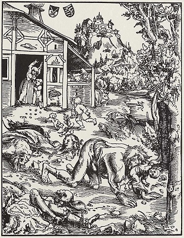

  
[Intangible Textual Heritage](../../index)  [Gothic](../index) 

------------------------------------------------------------------------

[Buy this Book at
Amazon.com](https://www.amazon.com/exec/obidos/ASIN/B002B54F2G/internetsacredte)

------------------------------------------------------------------------

<table width="75%">
<colgroup>
<col style="width: 50%" />
<col style="width: 50%" />
</colgroup>
<tbody>
<tr class="odd">
<td width="50%" data-valign="TOP"></td>
<td width="50%" data-valign="CENTER"><h1 id="the-book-of-were-wolves" data-align="CENTER">THE BOOK OF WERE-WOLVES</h1>
<h2 id="by-sabine-baring-gould" data-align="CENTER">by SABINE BARING-GOULD</h2>
<h4 id="section" data-align="CENTER">[1865]</h4></td>
</tr>
</tbody>
</table>

------------------------------------------------------------------------

[Contents](#contents)    [Start Reading](bow00)    [Page
Index](pageidx)    [Text \[Zipped\]](bow.txt.gz)

------------------------------------------------------------------------

|                                                                                                                           |
|---------------------------------------------------------------------------------------------------------------------------|
|  |

Sabine Baring-Gould (1834-1924) was a Vicar in the Church of England in
Devon, an archaeologist, folklorist, historian and a prolific author.
Baring-Gould was also a bit eccentric. He reputedly taught classes with
a pet bat on his shoulder. He is best known for writing the hymn 'Onward
Christian Soldiers'.

This book is one of the most cited references about werewolves. The Book
of the Were-Wolf takes a rationalistic approach to the subject.

The book starts off with a straightforward academic review of the
literature of shape-shifting; however, starting with Chapter XI, the
narrative takes a strange turn into sensationalistic 'true crime'
case-studies of cannibals, grave desecrators, and blood fetishists,
which have a tenuous connection with lycanthropy. This includes an
extended treatment of the case of Giles de Rais, the notorious associate
of Joan of Arc, who was convicted and executed for necrosadistic crimes.
[Margaret Murray](../../pag/wcwe/wcweapp4) had a controversial theory
about this subject.

Nevertheless, the first ten chapters of this book constitute an
essential work on the subject of werewolves. This etext was scanned at
Intangible Textual Heritage.

------------------------------------------------------------------------

 [Title Page](bow00)  
[Contents](bow01)  
[Chapter I. Introductory](bow02)  
[Chapter II. Lycanthropy Among the Ancients](bow03)  
[Chapter III. The Were-Wolf in the North](bow04)  
[Chapter IV. The Origin of the Scaninavian Were-Wolf](bow05)  
[Chapter V. The Were-Wolf in the Middle Ages](bow06)  
[Chapter VI. A Chamber of Horrors](bow07)  
[Chapter VII. Jean Grenier](bow08)  
[Chapter VIII. Folk-Lore Relating to Were-Wolves](bow09)  
[Chapter IX. Natural Causes of Lycanthropy](bow10)  
[Chapter X. Mythological Origin of the Were-Wolf Myth](bow11)  
[Chapter XI. The Maréchal de Retz.-I. The Investigation of
Charges.](bow12)  
[Chapter XII. The Maréchal de Retz.--II. The Trial](bow13)  
[Chapter XIII. Maréchal de Retz.--III. The Sentence and
Execution.](bow14)  
[Chapter XIV. A Galician Were-Wolf](bow15)  
[Chapter XV. Anomalous Case.--The Human Hyæna.](bow16)  
[Chapter XVI. A Sermon on Were-Wolves](bow17)  
