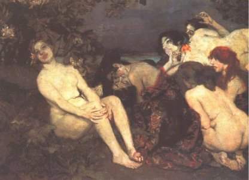

[Intangible Textual Heritage](../../index)  [Gothic](../index.md) 
[Esoteric](../../eso/index.md) 

------------------------------------------------------------------------

<table data-widht="75%">
<colgroup>
<col style="width: 50%" />
<col style="width: 50%" />
</colgroup>
<tbody>
<tr class="odd">
<td width="50%" data-valign="CENTER"> 
<em>The Vampires, by Istvan Csok [1907]</em></td>
<td width="50%" data-valign="CENTER"><h1 id="the-vampire-codex" data-align="CENTER">The Vampire Codex</h1>
<h2 id="michelle-belanger" data-align="CENTER">Michelle Belanger</h2></td>
</tr>
</tbody>
</table>

------------------------------------------------------------------------

|                                                                                                                           |
|---------------------------------------------------------------------------------------------------------------------------|
|  |

#### Important Note

This is the Internet Edition of *the Vampire Codex*. This text is
copyrighted and has been donated to the Internet Sacred Text Archive by
the author. For more information, please refer to the
[Introduction](vc00.md). You can also visit the author's home page at
[www.michellebelanger.com](https://www.michellebelanger.com/.md).

You can also purchase the latest edition of this book by clicking on
Amazon link to the right.

------------------------------------------------------------------------

[Introduction](vc00.md)  
[I. The Kheprian Charge](vc01.md)  
[II. Beginnings](vc02.md)  
[III. Catalysts of Change](vc03.md)  
[IV. Awakenings](vc04.md)  
[V. Potential](vc05.md)  
[VI. Other Awakened](vc06.md)  
[VII. Fledglings](vc07.md)  
[VIII. The Beacon](vc08.md)  
[IX. Characteristics](vc09.md)  
[X. Subtle Body Changes](vc10.md)  
[XI. Separateness](vc11.md)  
[XII. Basic Feeding](vc12.md)  
[XIII. Breath and Life](vc13.md)  
[XIV. Assimilating Energy](vc14.md)  
[XV. Blood and Life](vc15.md)  
[XVI. Geography of the Energy Body](vc16.md)  
[XVII. More on Feeding](vc17.md)  
[XIX. Dreamwalking](vc18.md)  
[XX. Choosing Donors](vc19.md)  
[XXI. The Kiss and the Curse](vc20.md)  
[XXII. Subtle Links](vc21.md)  
[XXIII. Feeding Through Links](vc22.md)  
[XXIV. Manipulating Links](vc23.md)  
[XXV. Cautionary Notes](vc24.md)  
[XXVI. The Caste System](vc25.md)  
[XXVII. Priests](vc26.md)  
[XXVIII. Counselors](vc27.md)  
[XXIX. Warriors](vc28.md)  
[XXX. Subtle Reality Basics](vc29.md)  
[XXXI. Augmentation](vc30.md)  
[XXXII. Subtle Perception](vc31.md)  
[XXXIII. Manifesting](vc32.md)  
[XXXIV. Nature of the Aura](vc33.md)  
[XXXV. Perceiving the Aura](vc34.md)  
[XXXVI. Energy Manipulation](vc35.md)  
[XXXVII. The Energy Ball](vc36.md)  
[XXXVIII. Augmented Healing](vc37.md)  
[XXXIX. Advanced Healing Techniques](vc38.md)  
[XLI. Shielding Techniques](vc39.md)  
[XLIII. Creating Filters](vc40.md)  
[XLIV. Spiritual Cleansings](vc41.md)  
[XLV. Otherside Beings](vc42.md)  
[XLVI. Creating Change](vc43.md)  
[XLVII. Cycles](vc44.md)  
[A Few Notes in Closing the Codex](vc45.md)  
