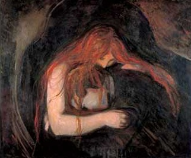

  
[Intangible Textual Heritage](../../index)  [Gothic](../index) 

------------------------------------------------------------------------

[Buy this Book at
Amazon.com](https://www.amazon.com/exec/obidos/ASIN/B002B3YD5C/internetsacredte)

------------------------------------------------------------------------

<table width="75%">
<colgroup>
<col style="width: 50%" />
<col style="width: 50%" />
</colgroup>
<tbody>
<tr class="odd">
<td width="50%" data-valign="TOP"></td>
<td width="50%" data-valign="CENTER"><h1 id="the-vampire" data-align="CENTER">THE VAMPIRE</h1>
<h4 id="his-kith-and-kin" data-align="CENTER">HIS KITH AND KIN</h4>
<h2 id="by-montague-summers" data-align="CENTER">by Montague Summers</h2>
<h4 id="section" data-align="CENTER">[1928]</h4></td>
</tr>
</tbody>
</table>

------------------------------------------------------------------------

[Contents](#contents)    [Start Reading](vkk00)    [Page
Index](pageidx)    [Text \[Zipped\]](vkk.txt.gz)

------------------------------------------------------------------------

|                                                                                                                           |
|---------------------------------------------------------------------------------------------------------------------------|
|  |

Montague Summers (1880-1948) was suposedly a member of the Roman
Catholic clergy. There is a 25 year gap in his biography during which it
is speculated he dabbled in the dark arts. Summers wrote numerous
serious books about the witch hunts, vampires, werewolves, and other
occult subjects. He violently disagreed with [Margaret
Murray](../../pag/murray), and advocated the death penalty for witches!

In this work Summers discusses the vampire phenomena from a relentless
Catholic perspective; he either belives in the literal reality of
vampires, or is pulling our leg. However, this is not a hoax. This book
has all of the apparatus to qualify as an academic study, including
footnotes, extensive quotations in the original languages, and
references to rare source documents. Of particular interest is the final
chapter, which traces the development of the vampire craze in 19th
century literature.

--John Bruno Hare, January 29th, 2002

A reader has contributed the following information, which clears up some
of the murk about Summer's academic career and clerical background (and
also supplies a middle name which is not found anywhere in his
bibliography):

There is an entry for Summers in Crockford's Clerical Dictionary, 1909,
p. 1394, col. b:

Summers, Argustus (sic) Montague, Bitton, Bristol.--Trin.Coll.Ox. BA
1905, MA 1906. Lich.Theol.Coll. 1904. Ordained 1908 Bristol. Curate of
Bitton, Dio. Bristol. 1908.

"He was ordained as an Anglican (Church of England) priest: I was unable
to find any mention of him in the Catholic Directory so \[I\] 'deduce'
that he was high church and left to become a Roman though whether his
priesthood went with him, or not, I do not know."

------------------------------------------------------------------------

 [Title Page](vkk00)  
[Contents](vkk01)  
[Introduction](vkk02)  
[Chapter I. The Origins of the Vampire](vkk03)  
[Chapter II. The Generation of the Vampire](vkk04)  
[Chapter III. The Traits and Practice of Vampirism](vkk05)  
[Chapter IV. The Vampire in Assyria, the East, and Some Ancient
Countries](vkk06)  
[Chapter V. The Vampire in Literature](vkk07)  
[Bibliography](vkk08)  
