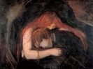

  
[Intangible Textual Heritage](../../index)  [Gothic](../index) 
[Index](index)  [Next](vkk01) 

------------------------------------------------------------------------

[Buy this Book at
Amazon.com](https://www.amazon.com/exec/obidos/ASIN/B002B3YD5C/internetsacredte)

------------------------------------------------------------------------

  
*The Vampire, His Kith and Kin*, by Montague Summers, \[1928\], at
Intangible Textual Heritage

------------------------------------------------------------------------

# THE VAMPIRE

#### HIS KITH AND KIN

## by Montague Summers

#### London, K. Paul Trench, Trubner \[1928\]

#### New York, E.P. Dutton & Co. \[1929\]

###### Scanned, proofed and formatted at Intangible Textual Heritage, January, 2002.

------------------------------------------------------------------------

[Next: Contents](vkk01)
