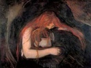

  
[Intangible Textual Heritage](../../index)  [Gothic](../index) 
[Index](index)  [Previous](vkk00)  [Next](vkk02) 

------------------------------------------------------------------------

[Buy this Book at
Amazon.com](https://www.amazon.com/exec/obidos/ASIN/B002B3YD5C/internetsacredte)

------------------------------------------------------------------------

  
*The Vampire, His Kith and Kin*, by Montague Summers, \[1928\], at
Intangible Textual Heritage

------------------------------------------------------------------------

p. iii

# CONTENTS

|                                                                   |                           |
|-------------------------------------------------------------------|---------------------------|
| INTRODUCTION                                                      | [v](vkk02.htm#page_v)     |
| I. THE ORIGINS OF THE VAMPIRE                                     | [1](vkk03.htm#page_1)     |
| II\. THE GENERATION OF THE VAMPIRE                                | [77](vkk04.htm#page_77)   |
| III\. THE TRAITS AND PRACTICE OF VAMPIRISM                        | [140](vkk05.htm#page_140) |
| IV\. THE VAMPIRE IN ASSYRIA, THE EAST, AND SOME ANCIENT COUNTRIES | [217](vkk06.htm#page_217) |
| V. THE VAMPIRE IN LITERATURE                                      | [271](vkk07.htm#page_271) |
| BIBLIOGRAPHY                                                      | [341](vkk08.htm#page_341) |
| INDEX                                                             | 349                       |

------------------------------------------------------------------------

[Next: Introduction](vkk02)
