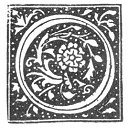

  
[Intangible Textual Heritage](../../index)  [Grimoires](../index.md) 
[Esoteric](../../eso/index)  [Index](index)  [Previous](abr001.md) 
[Next](abr003.md) 

------------------------------------------------------------------------

p. xv

The Introduction is set in italics in the original book. For
readability, I have inverted the italics in the etext.--JBH.

# INTRODUCTION,

BY

S. L. MAC GREGOR MATHERS.

|                    |
|--------------------|
|  |

WING perhaps to the circumstance that the indispensable "Bædecker"
accords only a three or four line notice to the "Bibliothèque de
l'Arsenal"; but few English or American visitors to Paris are acquainted
with its name, situation, or contents, though nearly all know at least
by sight the "Bibliothèque Nationale" and the "Bibliothèque Mazarin".

This "Library of the Arsenal," as it is now called, was founded as a
private collection by Antoine René Voyer D'Argenson, Marquis de Paulny;
and was first opened to the public on the 9th Floréal, in the fifth year
of the French Republic (that is to say, on 28th April, 1797), or just a
century ago. This Marquis de Paulny was born in the year 1722, died in
1787, and was successively Minister of War, and Ambassador to
Switzerland, to Poland, and to the Venetian Republic. His later years
were devoted to the formation of this Library, said to be one of the
richest private collections known. It was acquired in 1785 by the Comte
D’Artois, and to-day belongs to the State. It is situated on the right
bank of the Seine, in the Rue de Sully, near the river, and not far from
the Place de la Bastille, and is known as the "Bibliothèque de
l'Arsenal". In round numbers it now possesses 700,000 printed books, and
about 8000 manuscripts, many of them being of considerable value.

Among the latter is this Book of the Sacred Magic of Abra-Melin, as
delivered by Abraham the Jew unto his son Lamech; which I now give to
the public in printed form for the first time.

p. xvi

Many years ago I heard of the existence of this manuscript from a
celebrated occultist, since dead; and more recently my attention was
again called to it by my personal friend, the well-known French author,
lecturer and poet, Jules Bois, whose attention has been for some time
turned to occult subjects. My first-mentioned informant told me that it
was known both to Bulwer Lytton and Éliphas Lévi, that the former had
based part of his description of the Sage Rosicrucian Mejnour on that of
Abra-Melin, while the account of the so-called Observatory of Sir Philip
Derval in the "Strange Story" was to an extent copied from and suggested
by that of the Magical Oratory and Terrace, given in the Eleventh
Chapter of the Second Book of this present work. Certainly also the
manner of instruction applied by Mejnour in "Zanoni" to the Neophyte
Glyndon, together with the test of leaving him alone in his abode to go
on a short journey and then returning unexpectedly, is closely similar
to that employed by Abra-Melin to Abraham, with this difference, that
the latter successfully passed through that test, while Glyndon failed.
It would also be especially such experiments as those described at
length in the Third Book, which the author of the "Strange Story" had in
view when he makes Sir Philip Derval in the MS. history of his life
speak of certain hooks describing occult experiments, some of which he
had tried and to his surprise found succeed.

This rare and unique manuscript of the Sacred Magic of Abra-Melin, from
which the present work is translated, is a French translation from the
original Hebrew of Abraham the Jew. It is in the style of script usual
at about the end of the seventeenth and beginning of the eighteenth
centuries, and is apparently by the same hand as another MS. of the
Magic of Picatrix [1](#fn_0.md) also in the
"Bibliothèque de l'Arsenal". I know of no other existing copy or replica
of this Sacred Magic of Abra-Melin, not even in the British Museum,
whose enormous collection of Occult Manuscripts I have very thoroughly
studied.

p. xvii

Neither have I ever heard by traditional report of the existence of any
other copy. [1](#fn_1.md) In giving it now to the
Public, I feel, therefore, that I am conferring a real benefit upon
English and American students of Occultism, by placing within their
reach for the first time a Magical work of such importance from the
Occult standpoint.

The Manuscript is divided into three Books, each with its separate Title
Page, surrounded by an ornamental border of simple design, in red and
black ink, and which is evidently not intended to be symbolical in the
slightest degree, but is simply the work of a conscientious caligraphist
wishing to give an appearance of cleanness and completeness to the Title
Page. The wording of each is the same: "*Livre Premier (Second* or
*Troisième,* as the case may be*) de la Sacrée Magie que Dieu donna à
Moyse, Aaron, David, Salomon et à d'autres Saints Patriarches et
Prophetes qui enseigne la vraye sapience Divine laissée par Abraham à
Lamech son Fils traduite de l'hébreu 1458*". I give the translated title
at the commencement of each of the Three Books.

On the fly-leaf of the original MS. is the following note in the
handwriting of the end of the eighteenth century:--

"This Volume contains 3 Books, of which here is the first.--The Abraham
and the Lamech, of whom there is here made question, were Jews of the
fifteenth century, and it is well known that the Jews of that period
possessing the Cabala of Solomon passed for being the best Sorcerers and
Astrologers." Then follows in another and recent hand:--

"Volume composed of three parts--

 

|     |      |            |        |              |
|-----|------|------------|--------|--------------|
| 1st | part | 102        | pages. |              |
| 2nd | "    | 194        | "      |              |
| 3rd | "    | <u>117</u> | "      |              |
|     |      | 413        | "      |              |
|     |      |            |        | June, 1883." |

 

p. xviii

The style of the French employed in the text of the MS. is somewhat
vague and obscure, two qualities unhappily heightened by the almost
entire absence of any attempt at punctuation, and the comparative rarity
of paragraphic arrangement. Even the full stop at the close of a
sentence is usually omitted, neither is the commencement of a fresh one
marked by a capital letter. The following example is taken from near the
end of the Third Book: "*Cest pourquoy la premiere chose que tu dois
faire principalement ates esprits familiers sera de leur commander de ne
tedire jamais aucune chose deuxmemes que lorsque tu les interrogeras
amoins queles fut pour tavertir des choses qui concerne ton utilite
outon prejudice parceque situ ne leur limite pas leparler ils tediront
tant etdesi grandes choses quils tofusquiront lentendement et tu ne
scaurois aquoy tentenir desorte que dans la confusion des choses ils
pourroient te faire prevariquer ettefaire tomber dans des erreurs
irreparables ne te fais jamais prier en aucune chose ou tu pourras aider
et seccourir tonprochain et nattends pas quil tele demande mais tache
descavoir afond*," etc. This extract may he said to give a fair idea of
the average quality of the French. The style, however, of the First Book
is much more colloquial than that of the Second and Third, it being
especially addressed by Abraham to Lamech, his son, and the second
person singular being employed throughout it. As some English readers
may be ignorant of the fact, it is perhaps as well here to remark that
in French "*tu*," thou, is only used between very intimate friends and
relations, between husband and wife, lovers, etc.; while "*vous*," you,
is the more usual mode of address to the world in general. Again, in
sacred books, in prayers, etc., "*vous*" is used, where we employ "thou"
as having a more solemn sound than "*tu*". Hence the French verb
"*tutoyer*," = "to he very familiar with, to be on extremely friendly
terms with any one, and even to be insolently familiar". This First Book
contains advice concerning Magic, and a description of Abraham's Travels
and experiences, as well as a mention of the many

p. xix

marvellous works he had been able to accomplish by means of this system
of Sacred Magic. The Second and Third Books (which really contain the
Magic of Abra-Melin, and are practically based on the two MSS. entrusted
by him to Abraham, the Jew, but with additional comments by the latter)
differ in style from the former, the phraseology is quaint and at times
vague, and the second person plural, "*vous*," is employed for the most
part instead of "*tu*".

The work may then be thus roughly classified.--

First Book:=Advice and Autobiography; both addressed by the Author to
his son Lamech.

Second Book:=General and complete description of the means of obtaining
the Magical Powers desired.

Third Book:=The application of these Powers to produce an immense number
of Magical results.

Though the chapters of the Second and Third Books have special headings
in the actual text, those of the First Book have none; wherefore in the
"Table of Contents" I have supplemented this defect by a careful
analysis of their subject matter.

This system of Sacred Magic Abraham acknowledges to have received from
the Mage Abra-Melin; and claims to have himself personally and actually
wrought most of the wonderful effects described in the Third Book, and
many others besides.

Who then was this Abraham the Jew? It is possible, though there is no
mention of this in the MS., that he was a descendant of that Abraham the
Jew who wrote the celebrated Alchemical work on twenty-one pages of bark
or papyrus, which came into the hands of Nicholas Flamel, and by whose
study the latter is said eventually to have attained the possession of
the "Stone of the Wise". The only remains of the Church of Saint Jacques
de la Boucherie which exists at the present day, is the tower, which
stands near the Place du Châtelet, about ten minutes' walk from the
[Bibliothèque](errata.htm#0.md) de l'Arsenal; and there is yet a street
near this tower which bears the title of "Rue

p. xx

\[paragraph continues\] Nicolas Flamel," so that his memory still
survives in Paris, together with that of the Church close to which he
lived, and to which, after the attainment of the Philosopher's Stone, he
and his wife Pernelle caused a handsome peristyle to he erected.

From his own account, the author of the present work appears to have
been born in. A. D. 1362, and to have written this manuscript for his
son, Lamech, in 1458, being then in his ninety-sixth year. That is to
say, that he was the contemporary both of Nicholas Flamel and Pernelle,
and also of the mystical Christian Rosenkreutz, the founder of the
celebrated Rosicrucian Order or Fraternity in Europe. Like the latter,
he appears to have been very early seized with the desire of obtaining
Magical Knowledge; like him and Flamel, he left his home and travelled
in search of the Initiated Wisdom; like them both, he returned to become
a worker of wonders. At this period, it was almost universally believed
that the Secret Knowledge was only really obtainable by those who were
willing to quit their home and their country to undergo dangers and
hardships in its quest; and this idea even obtains to an extent in the
present day. The life of the late Madame Blavatsky is an example in
point.

This period in which Abraham the Jew lived was one in which Magic was
almost universally believed in, and in which its Professors were held in
honour; Faust (who was probably also a contemporary of our author),
Cornelius Agrippa, Sir Michael Scott, and many others I could name, are
examples of this, not to mention the celebrated Dr. Dee in a later age.
The history of this latter Sage, his association with Sir Edward Kelly,
and the part he took in the European politics of his time are too well
known to need description here.

That Abraham the Jew was not one whit behind any of these Magicians in
political influence, is evident to an one who peruses this work. He
stands a dim and shadowy figure behind e tremendous complication of
central European upheaval at that terrible and instructive epoch; as
Adepts of his type always appear and always have appeared upon the
theatre of history in great crises of nations. The age which could boast
simultaneously

p. xxi

three rival claimants to the direction of two of the greatest levers of
the society of that era--the Papacy and the Germanic Empire--when the
jealousies of rival Bishoprics, the overthrow of Dynasties, the Roman
Church shaken to her foundations, sounded in Europe the tocsin of that
fearful struggle which invariably precedes social reorganisation, that
wild whirlwind of national convulsion which engulfs in its vortex the
civilisation of a yesterday, but to prepare the reconstitution of a
morrow. The enormous historical importance of such men as our Author is
always underrated, generally doubted; notwithstanding that like the
writing on the wall at Belshazzar's feast, their manifestation in the
political and historical arena is like the warning of a MENE, MENE
TEKEL, UPUARSIN, to a foolish and undiscerning world.

The full and true history of any Adept could only be written by himself,
and even then, if brought before the eyes of the world at large, how
many persons would lend credence to it? and even the short and
incomplete statement of the notable events of our Author's life
contained in the First Book, will be to most readers utterly incredible
of belief. But what must strike all alike is the tremendous faith of the
man himself, as witnessed by his many and dangerous journeyings for so
many years through wild and savage regions and places difficult of
access even in our own day with all the increased facilities of transit
which we enjoy. This faith at length brought him its reward, though only
at the moment when even he was becoming discouraged and sick at heart
with disappointed hope. Like his great namesake, the forefather of the
Hebrew race, he had not in vain left his home, his "Ur of the Chaldees,"
that he might at length discover that Light of Initiated Wisdom, for
which his soul had cried aloud within him for so many years. This
culmination of his wanderings was his meeting with Abra-Melin, the
Egyptian Mage. From him he received that system of Magical instruction
and practice which forms the body of the Second and Third Books of this
work.

In the Manuscript original this name is spelt in several

p. xxii

different ways, I have noted this in the text wherever it occurs. The
variations are: Abra-Melin, Abramelin, Abramelim, and Abraha-Melin. From
these I have selected the orthography Abra-Melin to place on the title
page, and I have adhered to the same in this Introduction.

As far as can be gathered from the text, the chief Place of residence of
Abraham the Jew after his travels was Würzburg, or, as it was called in
the Middle Ages, "Herbipolis". He appears to have married his cousin,
and by her to have had two sons, the elder, named Joseph, whom he
instructed in the Mysteries of the Holy Qabalah, and Lamech, the
younger, to whom he bequeaths this system of Sacred Magic as a legacy,
and to whom the whole of the First Book is addressed. He speaks further
of three daughters, to each of whom he gave 100,000 golden florins as a
dowry. He expressly states that he obtained both his wife, and a
treasure of 3,000,000 golden florins, by means of some of the Magical
Operations described in the Third Book. He further admits that his first
inclination to Qabalistical and Magical studies was owing to certain
instructions in the Secrets of the Qabalah, which he received when young
from his father, Simon; so that after the death of the latter his most
earnest desire was to travel in search of an Initiated Master.

To the sincere and earnest student of Occultism this work cannot fail to
be of value, whether as an encouragement to that most rare and necessary
quality, unshaken faith; as an aid to his discrimination between true
and false systems of Magic; or as Presenting an assemblage of directions
for the production of Magical effects, which the Author of the book
affirms to have tried with success.

Especially valuable are the remarks of Abraham the Jew on the various
Professors of the "Art which none may name" in the course of his
wanderings and travels; the account of the many wonders he worked; and,
above all, the careful classification of the Magical Experiments in the
Third Book, together with his observations and advice thereon.

p. xxiii

Not least in interest are the many notable persons of that age for or
against whom he performed marvels: The Emperor Sigismund of Germany:
Count Frederic the Quarreller: the Bishop of his city (probably either
John I., who began the foundation of the Würzburg University in 1403
with the authorisation of Pope Boniface IX., or else Echter von
Mespelbrunn, who completed the same noble work): the Count of Warwick:
Henry VI. of England: the rival Popes--John XXIII., Martin V., Gregory
XII., and Benedict XIII.: the Council of Constance: the Duke of Bavaria:
Duke Leopold of Saxony: the Greek Emperor, Constantine Palæologos: and
probably the Archbishop Albert of Magdeburg: and also some of the
Hussite Leaders--a roll of names celebrated in the history of that
stirring time.

Considering the era in which our Author lived, and the nation to which
he belonged, he appears to have been somewhat broad in his religious
views; for not only does he insist that this Sacred system of Magic may
be attained by any one, whether Jew, Christian, Mahometan, or Pagan, but
he also continually warns Lamech against the error of changing the
religion in which one has been brought up; and he alleges this
circumstance as the reason of the occasional failures of the Magician
Joseph of Paris (the only other person he mentions besides himself and
Abra-Melin who was acquainted with this particular system of Magic),
namely that having been brought up a Christian, he had renounced that
faith and become a Jew. At first sight it does not seem clear from the
Occult Point of view what particular Occult disadvantage should be
attached to such a line of action. But we must remember, that in his
age, the conversion to another religion invariably meant an absolute,
solemn and thorough *renunciation and denial of any truth in the
religion previously professed by the convert*. Herein would be the
danger, because whatever the errors, corruption, or mistakes in any
particular form of religion, all are based on and descended from the
acknowledgment of Supreme Divine Powers. Therefore to deny any religion

p. xxiv

\[paragraph continues\] (instead of only abjuring the mistaken or
erroneous parts thereof) would be equivalent to denying formally and
ceremonially the truths on which it was originally founded; so that
whenever a person having once done this should begin to practise the
Operations of the Sacred Magic, he would find himself compelled to
affirm with his whole will-force those very formulas which he had at one
time *magically and ceremonially* (though ignorantly) denied; and
whenever he attempted to do this, the occult Law of Reaction would raise
as a Ceremonial Obstacle against the effect which he should wish to
produce, the memory of that Ceremonial Denial which his previous
renunciation had firmly sealed in his atmosphere. And the force of this
would be in exact Proportion to the manner and degree in which he had
renounced his former creed. For of all hindrances to Magical action, the
very greatest and most fatal is unbelief, for it checks and stops the
action of the Will. Even in the commonest natural operations we see
this. No child could learn to walk, no student could assimilate the
formulas of any science, were the impracticability and impossibility of
so doing the first thing in his mind. Wherefore it is that all Adepts
and Great Teachers of Religion and of Magic have invariably insisted on
the necessity of faith.

But though apparently more broad in view in admitting the excellence of
every religion, unfortunately he shows the usual injustice to and
jealousy of women which has distinguished men for so many ages, and
which as far as I can see arises purely and simply from an innate
consciousness that were women once admitted to compete with them on any
plane without being handicapped as they have been for so many centuries,
the former would speedily prove their superiority, as the Amazons of old
did; which latter (as the writings even of their especial enemies, the
Greeks, unwillingly admit) when overcome, were conquered by superior
numbers, not by superior valour. However, Abraham the Jew grudgingly
admits that the Sacred Magic may he attained by a virgin, while at the
same time dissuading any one from teaching it to her! The numerous
advanced female occult students of the present day are the best answer
to this.

p. xxv

But notwithstanding the forementioned shortcomings, his advice on the
manner of using Magical Power, when acquired, to the honour of God, the
welfare and relief of our neighbour, and for the benefit of the whole
Animate Creation, is worthy of the highest respect; and no one can
peruse it without feeling that his highest wish was to act up to his
belief.

His counsel, however, of a retired life after attaining Magical Power by
his system (I do not speak of the retirement during the six months'
preparation for the same) is not borne out by his own account of his
life, wherein we find him so constantly involved in the contests and
convulsions of the time. Also, however much the life of a hermit or
anchorite may appear to be advocated, we rarely, if ever, find it
followed by those Adepts whom I may perhaps call the initiated and
wonderworking medium between the Great Concealed Adepts and the Outer
World. An example of the former class we may find in our Author, an
example of the latter in Abra-Melin.

The particular scheme or system of Magic advocated in the present work
is to an extent "*sui generis*," but to an extent only. It is rather the
manner of its application which makes it unique. In Magic, that is to
say, the Science of the Control of the Secret Forces of Nature, there
have always been two great schools, the one great in Good, the other in
Evil the former the Magic of Light, the latter that of Darkness the
former usually depending on the knowledge and invocation of the Angelic
natures, the latter on the method of evocation of the Demonic races.
Usually the former is termed White Magic, as opposed to the latter, or
Black Magic.

The invocation of Angelic Forces, then, is an idea common in works of
Magic, as also are the Ceremonies of Pact with and submission to the
Evil Spirits. The system, however, taught in the present work is based
on the following conception: (α) That the Good Spirits and Angelic
Powers of Light are superior in Power to the Fallen Spirits of Darkness.
(β) That these latter as a punishment have been condemned to the service
of the Initiates of the Magic of Light. (This Idea is to be found

p. xxvi

also in the Kôran; or, as it is frequently and perhaps more correctly
written, "Qûr-an".) (γ) As a consequence of this doctrine, all *ordinary
material effects and phenomena* are produced by the labour of the Evil
Spirits under the command usually of the Good. (δ) That consequently
whenever the Evil Demons can escape from the control of the Good, there
is no evil that they will not work by way of vengeance. (ε) That
therefore sooner than obey man, they will try to make him their servant,
by inducing him to conclude Pacts and Agreements with them. (ζ) That to
further this project, they will use every means that offers to obsess
him. (η) That in order to become an Adept, therefore, and dominate them;
the greatest possible firmness of will, purity of soul and intent, and
power of self-control is necessary. (θ) That this is only to be attained
by self-abnegation on every plane. (ι) That man, therefore, is the
middle nature, and natural controller of the middle nature between the
Angels and the Demons, and that therefore to each man is attached
naturally both a Guardian Angel and a Malevolent Demon, and also certain
Spirits that may become Familiars, so that with him it rests to give the
victory unto the which he will. (κ) That, therefore, in order to control
and make service of the Lower and Evil, the knowledge of the Higher and
Good is requisite (*i.e.*, in the language of the Theosophy of the
present day, the knowledge of the Higher Self).

From this it results that the *magnum opus* propounded in this work is:
by purity and self-denial to obtain the knowledge of and conversation
with one's Guardian Angel, so that thereby and thereafter we may obtain
the right of using the Evil Spirits for our servants in all material
matters.

This, then, is the system of the Secret Magic of Abra-Melin, the Mage,
as taught by his disciple Abraham the Yew; and elaborated down to the
smallest points.

Except in the professed Black Magic Grimoires, the necessity of the
invocation of the Divine and Angelic Forces to control the Demons is
invariably insisted upon in the operations

p. xxvii

of evocation described and taught in Mediæval Magical Manuscripts and
published works. So that it is not so much, as I have before said, this
circumstance, as the mode of its development by the Six Moons'
preparation, which is unusual; while again, the thorough and complete
classification of the Demons with their offices, and of the effects to
be produced by their services, is not to be found elsewhere.

Apart from the interest attaching to the description of his travels, the
careful manner in which Abraham has made note of the various persons he
had met professing to be in the possession of Magical powers, what they
really could do and could not do, and the reasons of the success or
failure of their experiments, has a particular value of its own.

The idea of the employment of a Child as Clairvoyant in the invocation
of the Guardian Angel is not unusual; for example, in the "Mendal," a
style of Oriental Divination familiar to all readers of Wilkie Collins'
novel, "The Moonstone," ink is poured into the palm of a Child's hand,
who, after certain mystical words being recited by the Operator, beholds
visions clairvoyantly therein. The celebrated evocation at which the
great Mediæval Sculptor, Benvenuto Cellini, is said to have assisted,
also was in part worked by the aid of a Child as Seer. Cagliostro [1](#fn_2.md) also is said to have availed himself of the
services of Children in this particular. But for my part I cannot
understand the imperative necessity of the employment of a Child in the
Angelic evocation, if the Operator be pure in mind, and has developed
the clairvoyant faculty which is latent in every human being, and which
is based on the utilisation of the thought-vision. This thought-vision
is exercised almost unconsciously by every one in thinking of either a
place, person, or thing, which they know well; immediately, coincident
with the thought, the image springs before the mental sight; and it is
but the conscious and voluntary development of this which is the basis
of what is commonly called clairvoyance. Among the Highlanders of
Scotland, the faculty, as is well known, is of common

p. xxviii

manifestation; and by the English it is usually spoken of as
"Second-Sight".

Unfortunately, like far too many modern Occultists, Abraham the Jew
shows a marked intolerance of Magical systems differing from his own;
even the renowned name of Petrus di Abano [1](#fn_3.md) is not sufficient to save the "Heptameron or
Magical Elements" from condemnation in the concluding part of the Third
Book. Works on Magic, Written Conjurations, Pentacles, Seals, and
Symbols, the employment of Magical Circles, the use of any language but
one's mother tongue, appear at first sight to be damned wholesale,
though on a more careful examination of the text I think we shall find
that it is rather their abuse through ignorance of their meaning which
he intends to decry, than their intelligent and properly regulated use.

It will be well here to carefully examine these points from the occult
standpoint of an Initiate, and for the benefit of real students.

Abraham in several places insists that the basis of this system of
Sacred Magic is to be found in the Qabalah. Now, he expressly states
that he has instructed his eldest son, Joseph, herein as being his right
by primogeniture, even as he himself had received somewhat of Qabalistic
instruction from his father, Simon. But this system Magic he bequeaths
to his younger son, Lamech, *expressly as a species of recompense to him
for not being taught the Qabalah*, his status as a younger son being
apparently a serious traditional disqualification. This being so, the
reason is evident why he warns Lamech against the use of certain Seals,
Pentacles, incomprehensible words, etc.; because most of these being
based on the secrets of the Qabalah, their use by a person ignorant
hereof might he excessively dangerous through the not only possible but
probable perversion of the Secret Formulas therein contained. Any
advanced student of Occultism who is conversant with Mediæval works on
Magic, whether MS. or printed, knows the enormous and incredible number
of errors in the Sigils, Pentacles, and Hebrew or

p. xxix

\[paragraph continues\] Chaldee Names, which have arisen from ignorant
transcription and reproduction; this being carried to such an extent
that in some cases the use of the distorted formulas given would
actually have the effect of producing the very opposite result to that
expected from them. (I have commented at length on this subject in my
notes to the "Key of Solomon," published by me a few years ago.)
Wherefore Abraham the Jew it appears to me, in his anxiety to save his
son from dangerous errors in Magical working, has preferred to endeavour
to fill him with contempt for any other systems and methods of operation
than the one here laid down. For also besides the unintentional
perversions of Magical Symbols I have above mentioned, there was further
the circumstance not only possible but probable of the many Black Magic
Grimoires falling into his hands, as they evidently had into Abraham's,
the Symbols in which are in many cases *intentional* perversions of
Divine Names and Seals, so as to attract the Evil Spirits and repel the
Good.

For the Third Book of this work is crowded with Qabalistic Squares of
Letters, which are simply so many Pentacles, and in which the Names
employed are the very factors which make them of value. Among them we
find a form of the celebrated SATOR, AREPO, TENET, OPERA, ROTAS, which
is one of the Pentacles in the "Key of Solomon" Abraham's formula is
slightly different:--

 

|     |     |     |     |     |
|-----|-----|-----|-----|-----|
| S   | A   | L   | O   | M   |
| A   | R   | E   | P   | O   |
| L   | E   | M   | E   | L   |
| O   | P   | E   | R   | A   |
| M   | O   | L   | A   | S   |

 

and is to be used for obtaining the love of a maiden.

The Pentacle in my "Key of Solomon the King" is classed under Saturn,
while the above is applied to the nature of Venus.

p. xxx

\[paragraph continues\] I give the Hebrew form (see Appendix A, Table of
Hebrew and Chaldee Letters) of Equivalents:--

|     |     |     |     |     |
|-----|-----|-----|-----|-----|
| Sh  | A   | Th  | V   | R   |
| A   | R   | H   | P   | V   |
| Th  | H   | N   | H   | Th  |
| V   | P   | H   | R   | A   |
| R   | V   | Th  | A   | Sh  |

\[paragraph continues\] Or in Latin Letters:--

|     |     |     |     |     |
|-----|-----|-----|-----|-----|
| S   | A   | T   | O   | R   |
| A   | R   | E   | P   | O   |
| T   | E   | N   | E   | T   |
| O   | P   | E   | R   | A   |
| R   | O   | T   | A   | S   |

\[paragraph continues\] In the Key of Solomon it is (as being a
Pentacle) inscribed within a double circle, wherein is written the
following versicle from Psalm lxxii., v. 8: "His dominion shall be also
from the one sea unto the other, and from the flood unto the world's
end". In the Hebrew, this versicle consists of exactly twenty-five
letters, the number of the letters of the square. It will be at once
noticed that both this form and that given by Abraham the Jew are
*perfect examples of double Acrostics*, that is, that they read in every
direction, whether horizontal or perpendicular, whether backwards or
forwards. But the form given as a Pentacle in the "Key of Solomon the
King" is there said to be of value in adversity, and for repressing the
pride of the Spirits.

This example therefore shows clearly that it is not so much the use of
Symbolic Pentacles that Abraham is opposed to, as their ignorant
perversions and inappropriate use.

p. xxxi

It is also to be observed, that while many of the Symbolic Squares of
Letters of the Third Book present the nature of the double Acrostic,
there are also many which do not, and in the case of a great number the
letters do not fill up the square entirely, but are arranged somewhat in
the form of a gnomon, etc. Others again leave the centre part of the
square blank.

In Appendix C [1](#fn_4.md) to the Introduction I
will, for the sake of comparison, give some examples of Angelic
invocation taken from other sources.

Abraham the Jew repeatedly admits, as I have before urged, that this
particular System of the Sacred Magic of Abra-Melin has its Basis in the
Qabalah. It is well to examine what is here meant. The Qabalah itself is
divided into many parts; the great bulk of it is of a mystic doctrinal
nature, giving the inner Occult meaning to the Jewish Sacred Writings.
Also it employs the numerical values of the Hebrew Letters, to draw
analogies between words, the total numerical value of whose letters is
the same; this branch alone is a most complicated study, and it will be
foreign to our purpose to go into it here; the more so as my work, the
"Kabbalah Unveiled," treats at length of all these points. The so-called
Practical Qabalah is the application of the mystic teachings to the
production of Magical ejects. For the classification of Divine and
Angelic Names; of Hosts and Orders of Angels, Spirits, and Demons; of
particular Names of Archangels, Angels, Intelligences, and Demons, is to
be found carried out even to minute detail in the Qabalah, so that the
knowledge hereof can give a critical appreciation of the
correspondences, sympathies, and antipathies obtaining in the Invisible
World. Therefore what Abraham means is, that this system of Sacred Magic
is thoroughly reliable, because correct in all its attributions, and
that this being so, there is no chance of the Operator using Names and
Formulas on wrong occasions and in error.

But also it is notable that Abraham the Jew (probably again with the
intent of confusing Lamech as little as possible)

p. xxxii

speaks only of two great classes of Spirits: the Angels and the Devils;
the former to control, the latter to be controlled; and leaves entirely
out of consideration, or rather does not describe that vast race of
beings, the Elemental Spirits, who in themselves comprise an infinitude
of various divisions of classification, some of these being good, some
evil, and a great proportion neither the one nor the other. Evidently,
also, many of the results proposed to be attained in the Third Book,
would imply the use of the Elemental Spirits rather than that of the
Demons. No advanced Adept, such as Abraham evidently was, could possibly
be ignorant of their existence, power, and value; and we are therefore
forced to conclude either that he was unwilling to reveal this knowledge
to Lamech; or, which is infinitely more probable, that he feared to
confuse him by the large amount of additional instruction which would be
necessary to make him thoroughly understand their classification,
nature, and offices. This latter line of action would be the less
imperative, as the correctness of the symbols of the Third Book would
minimise chances of error; and what Abraham is undertaking to teach
Lamech, is how to arrive at practical Magical results; rather than the
Secret Wisdom of the Qabalah.

It is entirely beyond the scope of this Introduction for me to give here
any lengthy dissertation on the natures, good or evil, of Spiritual
beings. I will therefore, only state brie y and concisely the principal
differences between Angels, Elementals, and Devils.

We may then conclude that Angels, though themselves divided into
numerous orders and classes, possess generally the following
characteristics: That they are entirely good in nature and operation,
the conscient administrators of the Divine Will upon the plane of the
material universe; that they are responsible, not irresponsible agents,
and therefore capable of fall; and that they are independent of the
currents of the infinite Secret Forces of Nature, and can therefore act
beyond them, though their classification and qualities will cause them
to be more sympathetic with certain among these forces than

p. xxxiii

with the rest, and this in varying degree. Also that they are superior
in power to Men, Spirits, Elementals, and Devils.

The Elementals on the other hand, though consisting of an infinitude of
classes, are the Forces of the Elements of Nature, the administrators of
the currents thereof; and can therefore never act beyond and
independently of their own particular currents. In a sense, therefore,
they are irresponsible for the action of a current as a whole, though
responsible for the part thereof in which they Immediately act.
Therefore also they are at the same time subject to the general current
of the Force, wherein they live, move, and have their being; though
superior to the immediate and particular part of it which they direct.
Such races, superior to man in intuition, and magical powers; inferior
to him in other ways; superior to him in their power in a particular
current of an Element; inferior to him in only partaking of the nature
of that one Element; are of necessity to be found constantly recurring
in all the Mythologies of Antiquity. The Dwarfs and Elves f the
Scandinavians; the Nymphs, Hamadryads, and Nature Spirits of the Greeks;
the Fairies good and bad of the legends dear to our childish days; the
host of Mermaids, Satyrs, Fauns, Sylphs, and Fays; the Forces intended
to be attracted and propitiated by the Fetishes of the Negro-Race; are
for the most part no other thing than the ill-understood manifestations
of this great class, the Elementals. Among these, some, as I have before
observed, are good; such are the Salamanders, Undines, Sylphs, and
Gnomes, of the Rosicrucian Philosophy; many are *frightfully* malignant,
delighting in every kind of evil, and might easily be mistaken for
Devils by the uninitiated, save that their power is less; a great
proportion are neither good nor evil, irrationally working either; just
as a monkey or a parrot might act; in fact such closely resemble animals
in their nature, and especially *combinations* of animals, in which
forms distorted and mingled, would lie their symbolic manifestation.
Another very large class, would not act *irrationally* in this manner;
but with *intent*, only always following the predominant force either
good

p. xxxiv

or evil in their then entourage; a spirit of this kind, for example,
attracted into an assembly of good persons would endeavour to excite
their ideas towards good; attracted among evil-minded persons would
incite them mentally to crime. Among how many criminals is not their
only excuse that "*they thought they kept hearing something telling them
to commit the crime*"! Yet these suggestions would not always arise from
Elementals alone, but frequently from the depraved astral remnants of
deceased evil persons.

Devils, on the other hand, are far more powerful than Elementals, but
their action for Evil is parallel to that of the Good Angels for Good;
and their malignancy is far more terrible than that of the Evil
Elementals, for not being, like them, subjected to the limits of a
certain current, their sphere of operation extends over a far greater
area; while the Evil they commit is never irrational or mechanical, but
worked with full consciousness and intent.

I do not agree entirely with the manner of behaviour, advised by Abraham
towards the Spirits; on the contrary, the true Initiates have always
maintained that the very greatest courtesy should be manifested by the
Exorciser, and that it is only when they are obstinate and recalcitrant
that severer measures should he resorted to; and that even with the
Devils we should not *reproach them for their condition*; seeing that a
contrary line of action is certain to lead the Magician into error. But,
perhaps, Abraham has rather intended to warn Lamech against the danger
of yielding to them in an Exorcism even in the slightest degree.

The word "Demon" is evidently employed in this work almost as a synonym
of Devil; but, as most educated people are aware, it is derived from the
Greek "*Daimon*," which anciently simply meant any *Spirit, good or
bad*.

A work filled with suggestive Magical references is the well-known
"Arabian Nights," and it is interesting to notice the number of
directions in the Third Book of this work for producing similar effects
to those there celebrated.

p. xxxv

For example, the ninth chapter of the Third Book gives the symbols to be
employed for changing human beings into animals, one of the commonest
incidents in the "Arabian Nights," as in the story of the "first old man
and the hind," that of the "three Calendars and the five ladies of
Bagdad," that of "Beder and Giauhare," etc., etc.; as distinct from the
*voluntary transformation of the Magician into another form*, as
exemplified in the "story of the Second Calendar," the symbols for which
are given in the twenty-first chapter of our Third Book.

Again these chapters will recall to many of my readers the extraordinary
magical effects which Faust is said to have produced; who, by the way,
as I have before remarked, was in all probability contemporary with
Abraham the Jew.

But the mode of their production as given in this work is not the Black
Magic of Pact and Devil-worship, against which our Author so constantly
inveighs, but instead a system of Qabalistic Magic, similar to that of
the "Key of Solomon the King" and the "Clavicles of Rabbi Solomon,"
though differing in the circumstance of the prior invocation of the
Guardian Angel once for all, while in the works I have just mentioned
the Angels are invoked in *each* Evocation by means of the Magical
Circle. Such works as these, then, and their like, it could not be the
intention of Abraham to decry, seeing that like his system they are
founded on the Secret Knowledge of the Qabalah; as this in its turn was
derived from that mighty scheme of Ancient Wisdom, the Initiated Magic
of Egypt. For to any deep student at the same time of the Qabalah and of
modern Egyptology, the root and origin of the former is evidently to be
sought in that country of Mysteries, the home of the Gods whose symbols
and classification formed so conspicuous a part of the Sacred Rites; and
from which even to the present day, so many recipes of Magic have
descended. For we must make a very careful distinction between the
really Ancient Egyptian Magic, and the Arabian ideas and traditions
prevailing in Egypt in recent times. I think it is the learned

p. xxxvi

\[paragraph continues\] Lenormant who points out in his work on Chaldean
Magic, that the great difference between this and the Egyptian was that
the Magician of the former School indeed invoked the Spirits, but that
the latter allied himself with and took upon himself the characters and
names of the Gods to command the Spirits by, in his Exorcism; which
latter mode of working would not only imply on his part a critical
knowledge of the nature and power of the Gods; but also the affirmation
of his reliance upon them, and his appeal to them for aid to control the
forces evoked; in other words, the most profound system of White Magic
which it is possible to conceive.

The next point worthy of notice is what Abraham urges regarding the
preferability of employing one's mother tongue both in prayer and
evocation; his chief reason being the absolute necessity of
comprehending utterly and thoroughly with the whole soul and heart, that
which the lips are formulating. While fully admitting the necessity of
this, I yet wish to state some reasons in favour of the employment of a
language other than one's own. Chief, and first, that it aids the mind
to conceive the higher aspect of the Operation; when a different
language and one looked upon as sacred is employed, and the phrases in
which do not therefore suggest matters of ordinary life. Next, that
Hebrew, Chaldee, Egyptian, Greek, Latin, etc., if properly pronounced
are more sonorous in vibration than most modern languages, and from that
circumstance can suggest greater solemnity. Also that the farther a
Magical Operation is removed from the commonplace, the better. But I
perfectly agree with Abraham, that it is before all things imperative
that the Operator should thoroughly comprehend the import of his Prayer
or Conjuration. Furthermore the words in these ancient languages imply
"formulas of correspondences" with more ease than those of the modern
ones.

Pentacles and Symbols are valuable as an equilibrated and fitting basis
for the reception of Magical force; but unless the Operator can *really*
attract that force to them, they are nothing but so many dead, and to
him worthless, diagrams.

p. xxxvii

\[paragraph continues\] But used by the Initiate who fully comprehends
their meaning, they become to him a powerful protection and aid,
seconding and focussing the workings of his Will.

At the risk of repeating what I have elsewhere said, I must caution the
Occult student against forming a mistaken judgment from what Abraham the
Jew says regarding the use of Magic Circles and of Licensing the Spirits
to Depart. It is true that in the Convocation of the Spirits as laid
down by him, it is not necessary to form a Magic Circle for defence and
protection; but why?--*Because the whole group of the Bedchamber,
Oratory, and Terrace, are consecrated by the preparatory Ceremonies of
the previous Six Moons*; so that the whole place is protected, and the
Magician is, as it were, *residing constantly within a Magic Circle*.
Therefore also the Licensing to Depart may be to a great extent
dispensed with because the Spirits cannot break into the consecrated
limit of the periphery of the walls of the house. But let the worker of
ordinary Evocations be assured that were this not so, and the
Convocation was performed in an unconsecrated place, without any Magical
Circle having been traced for defence, the invocation to visible
appearance of such fearful potencies as Amaymon, Egyn, and Beelzebub,
would probably result in the death of the Exorcist on the spot; such
death presenting the symptoms of one arising from Epilepsy, Apoplexy, or
Strangulation, varying with the conditions obtaining at the time. Also
the Circle having been once formed, let the Evocator guard carefully
against either passing, or *stooping*, or *leaning* beyond, its limits
during the progress of the Exorcism, before the license to depart has
been given. Because that, even apart from other causes, the whole object
and effect of the Circle working, is to create abnormal atmospheric
conditions, by exciting a different status of force within the Circle to
that which exists without it; so that even without any malignant occult
action of the Spirits, the sudden and unprepared change of atmosphere
will seriously affect the Exorciser in the intensely strained state of
nervous tension he will then be in. Also the License to Depart should

p. xxxviii

not be omitted, because the Evil Forces will be only too glad to revenge
themselves on the Operator for having disturbed them, should he
incautiously quit the Circle without having previously sent them away,
and if necessary even forced them to go by contrary conjurations.

I do not share Abraham's opinion as to the necessity of withholding the
Operation of this Sacred Magic from a Prince or Potentate. Every great
system of Occultism has its own Occult Guards, who will know how to
avenge mistaken tampering therewith.

At the risk of repeating myself I will once more earnestly caution the
Student against the dangerous automatic nature of certain of the Magical
Squares of the Third Book; for, if left carelessly about, they are very
liable to obsess sensitive persons, children, or even animals.

Abraham's remarks concerning the errors of Astrology in the common
sense, and of the attribution of the Planetary Hours are worthy of
careful note. Yet I have found the *ordinary* attribution of the
Planetary Hours effective to an extent.

In all cases where there is anything difficult or obscure in the text, I
have added copious explanatory notes; so many indeed as to form a
species of commentary in parts. Especially have those on the Names of
the Spirits cost me incredible labour, from the difficulty of
identifying their root-forms. The same may be said of those on the
Symbols of the Third Book.

Wherever I have employed parentheses in the actual text, they shew
certain words or phrases supplied to make the meaning clearer.

In conclusion I will only say that I have written this explanatory
Introduction purely and solely as a help to genuine Occult students; and
that for the opinion of the ordinary literary critic who neither
understands nor believes in Occultism, I care nothing.

87 RUE MOZART, AUTEUIL, PARIS.

 

------------------------------------------------------------------------

### Footnotes

[xvi:1](abr002.htm#fr_0.md) Probably the same as Gio
Peccatrix the Magician, the author of many Manuscripts on Magic.

[xvii:1](abr002.htm#fr_1.md) Since writing the
above, I have heard casually that a copy of at least part, or perhaps of
the whole, is said to exist in Holland.

[xxvii:1](abr002.htm#fr_2.md) See Appendix B.

[xxviii:1](abr002.htm#fr_3.md) Born about 1250.

[xxxi:1](abr002.htm#fr_4.md) See Appendix C,
"Examples of Angelic Invocation".

------------------------------------------------------------------------

[Next: Appendix A: Hebrew and Chaldee Alphabet](abr003.md)
