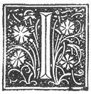

  
[Intangible Textual Heritage](../../index)  [Grimoires](../index) 
[Esoteric](../../eso/index)  [Index](index)  [Previous](abr008) 
[Next](abr010) 

------------------------------------------------------------------------

### THE THIRD CHAPTER.

|                    |
|--------------------|
|  |

HAVE already said in the preceding chapter that shortly after the death
of my father, I attached myself unto the research of the True Wisdom,
and of the Mystery of the Lord. Now in this chapter I will briefly
mention the places and countries by which I have passed in order to
endeavour to learn those things which are good. And I do this in order
that it may serve thee for a rule and example not to waste thy youth in
petty and useless pursuits, like little girls sitting round the
fireplace. For there is nothing more deplorable and more unworthy in a
man than to find himself ignorant in all circumstances. He who worketh
and travelleth learneth much and he who knoweth not how to conduct and
govern himself when far from his native land, will know still less in
his own house how to do so. I dwelt then, after the death of my father,
for four years with my brothers and sisters, and I studied with care how
to put to a profitable use what my father had left me after his death;
and seeing that my means were insufficient to counterbalance

p. 8

the expenses which I was compelled to be at, after having set in order
all my affairs and business as well as my strength permitted; I set out,
and I went into Vormatia [1](#fn_21) to Mayence,
in order to find there a very aged Rabbi named Moses, in the hope that I
had found in him that which I sought. As I have said in the preceding
chapter, his Science had no foundation such as that of the True Divine
Wisdom. I remained with him for four years, miserably wasting all that
time there, and persuading myself that I had learned all that I wished
to know, [2](#fn_22) and I was only thinking of
returning to my paternal home, when I casually met a young man of our
sect, named SAMUEL, a native of Bohemia, whose manners and mode of life
showed me that be wished to live, walk, and die in the Way of the Lord
and in His Holy Law; and I contracted so strong a bond of friendship
with him that I showed him all my feelings and intentions. As he had
resolved to make a journey to Constantinople, in order to there join a
brother of his father, and thence to pass into the Holy Land wherein our
forefathers had dwelt, and from the which for our very great errors and
misdeeds we had been chased and cast forth by God. He, [3](#fn_23) having so willed it, the moment that
he [4](#fn_24) had made me acquainted with his
design, I felt an extraordinary desire to accompany him in his journey,
and I believe that Almighty God wished by this means to awaken me, for I
could take no rest until the moment that we mutually and reciprocally
passed our word to each other and swore to make the voyage together.

On the 13th day of February, in the year 1397, we commenced our journey,
passing through Germany,

p. 9

\[paragraph continues\] Bohemia, Austria, and thence by Hungary and
Greece unto Constantinople, where we remained two years, and I should
never have quitted it, had not death taken Samuel from me at length
through a sudden illness. Finding myself alone, a fresh desire for
travel seized me, and so much was my heart given thereto, that I kept
wandering from one place to another, until at length I arrived in Egypt,
where constantly travelling for the space of four years in one direction
and another, the more I practised the experiments of the magic of RABBIN
MOSES, the less did it please me. I pursued my voyage towards our
ancient country, where I fixed my residence for a year, and neither saw
nor heard of any other thing but misery, calamity, and unhappiness.
After this period of time, I there found a Christian who also was
travelling in order to find that which I was seeking also myself Having
made an agreement together, we resolved to go into the desert parts of
Arabia for the search for that which we ardently desired; feeling sure
that, as we had been told, there were in those places many just and very
learned men, who dwelt there in order to be able to study without any
hindrance, and to devote themselves unto that Art for which we ourselves
were seeking; but as we there found nothing equivalent to the trouble we
had taken, or which was worthy of our attention, there came into my head
the extravagant idea to advance no farther, but to return to my own
home. I communicated my intention to my companion, but he for his part
wished to follow out his enterprise and seek his good fortune; so I
prepared to return,

------------------------------------------------------------------------

### Footnotes

[8:1](abr009.htm#fr_21) "*Vormatie*"; that is to
say, the district under the government of the town of Worms, called in
Latin "Vormatia" anciently.

[8:2](abr009.htm#fr_22) in the previous chapter
he says that he remained in this path of study for ten years.

[8:3](abr009.htm#fr_23) *I.e.*, God.

[8:4](abr009.htm#fr_24) Samuel.

------------------------------------------------------------------------

[Next: The Fourth Chapter](abr010)
