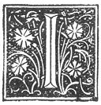

  
[Intangible Textual Heritage](../../index)  [Grimoires](../index.md) 
[Esoteric](../../eso/index)  [Index](index)  [Previous](abr013.md) 
[Next](abr015.md) 

------------------------------------------------------------------------

p. 27

### THE EIGHTH CHAPTER.

|                    |
|--------------------|
|  |

N order to show that Man ought to make use of the good things of the
Lord by applying them unto a good end, that is to say, unto His honour
and glory, both for his own use and that of his neighbour; I will
describe in a few words in this present chapter many and the most
considerable operations which I have carried out; and the which, with
the aid of the All-Powerful Lord and of the Holy Angels, by the means of
this Art I have easily conducted unto the desired end. And I write not
this description in any way to vaunt myself, nor out of vain glory, the
which would be a great sin against God, because it is He Who hath done
the whole, and not I; but only do I write this that it may serve for
instruction unto others, so that they may know wherein they ought to
avail themselves of this Art, as also that they may use it to the honour
of Him Who hath given this wisdom Unto men. and glorify Him; and in
order that each one may know how great and inexhaustible are the
treasures of the Lord, and render unto Him particular thanks for so
precious a gift. And especially (do I thank Him) for having granted unto
me, who am but a little worm of Earth, through the means of ABRAMELIN
the power to give and communicate unto others this Sacred Science. After
my death a book will be found, which I commenced to write at the time
when I was beginning to put in practice this Art, which, reckoning the
number of the years, was in 1409, until to-day on which I am arrived at
the 96th [1](#fn_45.md) year of mine age, with all
honour and augmentation of fortune; and in this book can be read in
detail even to the very least thing which I have

p. 28

done. But here, as I have aforesaid, I will describe only the most
remarkable.

Up till now I have healed of persons of all conditions, bewitched unto
death, no less than 8413, and belonging unto all religions, without
making an exception in any case.

I gave unto mine Emperor SIGISMOND, [1](#fn_46.md)
a very

p. 29

clement Prince, a Familiar Spirit of the Second Hierarchy, even as he
commanded me, and he availed himself of its services with prudence. He
wished also to possess the secret of the whole operation, but as I was
warned by the Lord that it was not His Will, he contented himself with
what was permitted, not as Emperor, but as a private person; and I even
by means of mine Art facilitated his marriage with his wife; and I
caused him to overcome the great difficulties which opposed his
marriage.

I delivered also the Count FREDERICK [1](#fn_47.md)
by the means

p. 30

of 2000 artificial cavalry (the which I by mine Art caused to appear
according unto the tenor of the Twenty-ninth Chapter of the Third Book
here following), free out of the hands of the Duke Leopold of Saxonia;
the which Count Frederick without me would have lost both his own life,
and his estate as well (which latter would not have descended) unto his
heirs.

Unto the BISHOP OF OUR CITY also, I showed the betrayal of his
government at Orembergh, one year before the same occurred; and I say no
more concerning this because he is an Ecclesiastic [1](#fn_48.md) passing over in silence all that I have
further done to render unto him service.

The COUNT OF VARVICH [2](#fn_49.md) was delivered
by me from

p. 31

prison in England the night before he was to have been beheaded.

I aided the flight of the DUKE, [1](#fn_50.md) and
of his POPE JOHN, [2](#fn_51.md) from the Council
of Constance, who would otherwise

p. 32

have fallen into the hands of the enraged Emperor and the latter having
asked me to predict unto him which one of the two Popes, John XXIII. and
Martin V., should gain in the end, my prophecy was verified; that
fortune befalling which I had predicted unto him at Ratisbon.

At the time when I was lodged at the house of the DUKE OF BAVARIA, [1](#fn_52.md) my Lord, for matters of the greatest
importance; the door of my room was forced, and I had the value of
83,000 Hungarian pieces stolen from me in jewels and money. As soon as I
returned, the thief (although he was a Bishop!) was forced to himself
bring it back to me in person and to return with his own hands to me the
money, jewels, and account books, and to give me the principal reasons
which had forced him to commit the theft, rather than any other person.

Six months ago I did write unto the GRECIAN EMPEROR, [2](#fn_53.md) and I warned him that the affairs of his
Empire were in a very bad condition, and that his Empire itself was on
the brink of ruin, [3](#fn_54.md) unless he could
appease the Anger of God. As there only remaineth unto me but a little
while to live, those who remain after me will receive the news of the
result of this prophecy.

The Operation of the thirteenth chapter [4](#fn_55.md) of the Second Book, I have twice
performed; once in the house

p. 33

of Savonia; [1](#fn_56.md) and another time in the
MARQUISATE OF MAGDEBURGH, and I was the cause that their estates were
handed down unto their children.

Now when once the faculty of being able to avail oneself of the Sacred
Magic hath been obtained, it is permissible to demand from the Angel a
sum of coined money proportionate unto thy birth, quality and capacity,
the which without difficulty will be granted unto thee. Such money is
taken from the Hidden Treasures. It is, however, necessary to note that
in all Treasures one is allowed to take the fifth part, God permitting
the same, although some braggart chatterers [2](#fn_57.md) do say that there be an infinitude hereof
which be destined and reserved unto Anti-Christ, I do not for a moment
say that this may not be true; but undoubtedly from the same Treasures
one may also take the fifth part. There are yet more which be destined
unto others. Mine own particular treasure was assigned unto me at
Herbipolis; [3](#fn_58.md) and I performed the
Operation of the eighth chapter [4](#fn_59.md) of
the Third Book; it was not in any way guarded, and was very ancient. It
was of gold, which had never been struck into ingots; and which I
afterwards caused to be beaten out and converted into its equivalent
weight of golden florins, by the Spirits; the which was done in a few
hours; (and I did this operation seeing that) mine own possessions were

p. 34

few and of little worth; and so poor was I that in order to marry a
person who had a considerable dowry, I was forced to make use of mine
Art, and I employed the Fourth Sign of the Third Book and the Third
Sign [1](#fn_60.md) of the nineteenth chapter; and
I married my cousin with 40,000 golden florins as a dowry, the which sum
served as a cover to my fortune.

All the Signs which are in the Eighteenth Chapter [2](#fn_61.md) have been made use of by me so many times
that I could not count them. However, they are all given in the
Book [3](#fn_62.md) already mentioned.

I made great and wonderful experiments with the Signs of the
second [4](#fn_63.md) and eighth [5](#fn_64.md) chapters of the Third Book. The First
Sign [6](#fn_65.md) of the first chapter of the
Third Book is the most perfect.

It is necessary to be prompt and adroit in all these operations, seeing
that in the things which belong unto God we can easily commit still
greater errors than those into which SOLOMON fell.

All these Signs have I worked with great ease and pleasure, and with
very great utility (unto myself and others). All these operations and
others in infinite number have I performed by the Signs which be in the
Third Book, and never have I failed in attaining mine end, I have always
been obeyed (by the Spirits), and everything hath succeeded with me
because I have myself obeyed the Commandments of God. Also I have

p. 35

from point to point followed out that which mine Angel hath counselled
and prescribed unto me; following out also exactly that which
ABRA-MELIN [1](#fn_66.md) had taught me, the which
is the same that I shall write in the Two following Books, and which I
shall exemplify and explain more clearly; because the instructions which
I received, although in very obscure words and Hieroglyphics, have
caused me to attain mine object, and have never permitted me to err and
fall into pagan, strange, and superstitious idolatries; I being always
kept in the Way of the Lord, Who is the True, the Only, the Infallible
End, for arriving at the possession of this Sacred Magic.

------------------------------------------------------------------------

### Footnotes

[27:1](abr014.htm#fr_45.md) As this MS. bears the
date of 1458, Abraham must have been born in 1362, and was consequently
47 years old in 1409.

[28:1](abr014.htm#fr_46.md) Sigismond, Emperor of
Germany, was born the 14th February, 1368, and died at Znaïm on the 9th
December, 1437. Son of the Emperor Charles IV. and of Anne of Silesia,
he received an excellent education. At ten years of age his father gave
him the Margravate of Brandenburg, and two years later he was betrothed
to Mary, the daughter of Louis the Great of Hungary, whom he afterwards
married. He was nominated by his father-in-law his successor on the
throne of Poland. But the nobles preferred Ladislaus, the nephew of
Casimir the Great. However, in 1386, he took possession of Hungary,
repulsed the Poles, overcame the rebellious nobles; and then marched
against the Wallachians and Turks, but he was beaten, and later,
notwithstanding the help of France and England, he lost the Battle of
Nicopolis in 1396. He escaped on board a vessel in the Black Sea and for
eighteen months was a fugitive from his Kingdom; and a; the moment of
his re-entering Hungary he was made prisoner by the discontented nobles,
and shut up in the citadel of Ziklos. Escaping thence into Bohemia, he,
however, reconquered his throne, and in 1410 was raised to the Empire by
one party among the Electors, while Josse, Marquis of Moravia, and
Wenceslaus were elected by other factions. A remarkable coincidence,
seeing that at this moment when three Emperors possessed the Empire, the
Papacy had also three Popes, *viz.*: John XXIII. (Balthazar Cossa), a
Neapolitan; Gregory XII. (Ange Conrario), a Venetian; and Benedict XIII.
(Pierre de Lune), a Spaniard. The death of Josse, and the resignation of
Wenceslaus, left Sigismond sole master of the Empire. After having
received the Silver Crown at Aix-la-Chapelle in 1414, he went to preside
at the Council of Constance, where John Huss was condemned,
notwithstanding the safe conduct which he had obtained from the Emperor.
He endeavoured to end the differences between the Roman and Greek
Churches, visited France and England under pretext of reconciling
Charles VI. and Henry V., but, as some say, in order to form a league
with the latter against France, so as to recover the ancient Kingdom of
Arles. The death of his brother, Wenceslaus, in 1419, rendered him
Master of Bohemia, at the moment when the revolt of the Hussites was at
its height. He commenced a war of extermination against them, but was
defeated by Ziska in 1420, p. 29 and a war of
fifteen years' duration ensued. In 1431, whilst he was being crowned
King of Italy at Milan, his troops experienced such severe defeats that
he was forced to concede advantageous terms to the rebels. But
dissensions arose among them, and Sigismond profited by this to
completely crush them at length and make Bohemia submit. He reigned
twenty-seven years as Emperor of Germany, eighteen years as King of
Bohemia, and fifty-one years as King of Hungary. His second wife, Barbe,
has been called by some, *the Messalina of Germany*.

[29:1](abr014.htm#fr_47.md) Frederick I., surnamed
the Quarreller, Duke and Elector of Saxony, was born at Altenburg in
1369, and died in 1428. He was son of the Landgrave and Margrave
Frederick the Severe, and of Catherine, Countess of Henneberg. At only
four years of age, Frederick had been betrothed to Anne, daughter of the
Emperor Charles IV.; later on he had serious disputes concerning this
matter with the Emperor Wenceslaus (the brother of Anne), who had
disposed of her hand to another, but who ultimately consented, in 1397,
to pay Frederick a considerable sum by way of damages. In 1388 he fought
as ally of the Burgrave of Nuremberg in the war of the German towns; and
gained his knightly spurs in 1391, in the war which he, in concert with
the Teutonic Knights, waged against the Lithuanians. Next, he fought
against Wenceslaus. He married Catherine of Brunswick in 1402, and after
various wars and quarrels, the University of Leipzig was founded in
1409. The indefatigable activity which this Prince displayed from 1420
against the movements of the Hussites, who were directly menacing his
possessions, pointed him out as a valuable auxiliary to the Emperor
Sigismond, who was then in a very critical position. In order to assure
himself definitely of the alliance of Frederick the Quarreller, the
Emperor conferred upon him the Electorate and Duchy of Saxony; but the
former could not long enjoy his new found dignities in peace, for the
Emperor shifted the whole weight of the war with the Hussites on to his
shoulders. As the other German Princes did not respond readily to the
Elector's appeal, the latter had the misfortune to lose the greater part
of his p. 30 Army near Brux in 1425. But his
wife, Catherine, summoned the whole of Catholic Germany to unite in a
Crusade against the innovating Hussites; *while 20,000 strange and
foreign Warriors came unexpectedly to range themselves under the
Standard of Frederick*. It is to be noted that Abraham the Jew puts the
Artificial Cavalry he supplied at 2000 (though this may easily be a slip
for 20,000) and rumour would of course soon magnify the number. But the
Elector was at length defeated at the disastrous battle of Aussig in
1426, where the *élite* of the German Warriors fell. The following year
again witnessed a fresh defeat of the Elector, and the chagrin which
this excited, ultimately led to his death. He was succeeded by his son,
Frederick II., called "the Good" born in 1411, who began to reign in
1428, and died in 1464 (see *Dict. Larousse*).

[30:1](abr014.htm#fr_48.md) The same ambiguity
exists in the French as in the translation, as to whether it is Abraham
or the Bishop who passes over the matter in silence. *Et je n'en dis pas
davantage acause quil est un eclesiastique passant sous silence ceque
joy fait deplus pour luy rendre service*. (I preserve the orthography of
the French original.)

[30:2](abr014.htm#fr_49.md) By "Count of Varvich,"
Abraham evidently means "Count of Warwick," as throughout the MS. a w is
never used, but always a v, wherever the former occurs in a proper name.
This Count of Warwick is probably Henri de Beauchamp, the brother-in-law
of Warwick the "King-Maker," and son of that Richard de Beauchamp, so
infamous for his instrumentality in bringing about the torture and
burning of the heroic Joan of Arc. Henri de Beauchamp was at first
deprived of his goods by Henry VI.; but in 1444 that Monarch created him
Duke of Warwick, and later, King of the islands of Wight, Jersey, and
Guernsey. He did not long survive to enjoy these honours (*Dict.
Larousse*).

[31:1](abr014.htm#fr_50.md) Probably Albert V. of
Austria.

[31:2](abr014.htm#fr_51.md) Pope John XXIII.
(Balthazar Cossa), Pope from 1410 to 1415, was born at Naples. He had
been a corsair in his youth, and at first, after his entry into holy
orders, was only notable for his debauches, his exactions, and his
violence, Pope Boniface IX. nevertheless appointed him Cardinal in 1402,
and afterwards Legate of Bologna, where he is said to have given himself
up to such excesses that Gregory XII. thought it necessary to
excommunicate him. Notwithstanding this Cossa was elected to the Papacy
at the time when the Church was shaken by internal dissension. He
promised at first to renounce the Pontificate, if on their side Gregory
XII. and Benedict XIII. would abandon their claims. However, he mounted
the Papal Throne, and declared for the side of Louis d'Anjou in the war
between the latter and Ladislaus regarding the Throne of Naples. At
length, after the taking of Rome by Ladislaus, he was forced to implore
the support of the Emperor Sigismond. The latter consented to grant him
his protection, but on the sole condition of the convocation of the
Council of Constance. After much hesitation, and after having taken
every possible precaution to ensure his personal safety, John XXIII.
consented to the assembling of the Council, which he opened 7th
November, 1414. Being then summoned to lay aside the Papal Mitre, he
judged it prudent to consent; but a few days later, he succeeded in
escaping in disguise, during a tournament given by the Duke of Austria.
He retired to Lauffembourg, and protested against the abdication, which
he declared to have been obtained from him by force. The Council was for
a moment struck with fear and consternation, but the firmness of the
Emperor Sigismond, coupled with the effect of the declaration of J.
Gerson that the General Councils had higher authority than the Papacy,
prevailed. John XXIII. was summoned to appear before the Council, but
refused; and soon after, being abandoned by the Duke of Austria, who was
too weak to resist the power of the Emperor, he was arrested at
Fribourg, and conducted to Rudolfcell. On the 29th May, 1415, this
Pontiff was solemnly deposed by the Council of Constance as being given
to simony, impudent, a secret poisoner, and a spendthrift of the wealth
of the Church; and was imprisoned in the Castle of Heidelberg. At the
end of four years he recovered his liberty, on payment of 30,000 golden
crowns, and went to Rome, where he made his submission to Martin V., and
was by him appointed Cardinal-Bishop of Frascati, and Senior of the
Sacred College. He died a few months later at Florence, either of
anxiety or by poison.

[32:1](abr014.htm#fr_52.md) Either Ernest or
William I. of Bavaria. They were brothers, and reigned conjointly. From
his calling the Duke of Bavaria, his Lord, it would appear that he was
living under his dominion, but it is curious that up to this point
Abraham has never mentioned the name of his own town.

[32:2](abr014.htm#fr_53.md) Constantine Palæologos,
who was the thirteenth and last Greek Emperor. He was killed, and
Constantinople taken by the Turks under Mahomet II. The direct
descendant of Constantine Palæologos to-day, is the Princess Eugénie di
Cristoforo-Palæologæ-Nicephoræ-Comnenæ.

[32:3](abr014.htm#fr_54.md) *A deux doigts de sa
perte*.

[32:4](abr014.htm#fr_55.md) This chapter is
entitled: "Concerning the Convocation of the Good Spirits".

[33:1](abr014.htm#fr_56.md) Thus in MS.--? Saxonia.

[33:2](abr014.htm#fr_57.md) *Quelques hableurs*.

[33:3](abr014.htm#fr_58.md) Herbipolis is the Latin
mediaeval name of the town of Wurtzbourg in Bavaria. It seems from this
passage that it was probably the city of Abraham the Jew, and therefore
the one intended a few paragraphs before where he speaks of the "Bishop
of our town". Wurzbourg and the surrounding district formed a Bishopric,
and in the time of Abraham it was the scene of constant struggles
between the Bishop and his party, and the burghers. Later, formidable
persecutions against the Jews took place there, and many edicts were
promulgated against witchcraft.

[33:4](abr014.htm#fr_59.md) This is evidently an
error for either the sixth, the sixteenth, or the twenty-eighth chapter;
probably the latter.

[34:1](abr014.htm#fr_60.md) To make oneself loved
by a relation.

[34:2](abr014.htm#fr_61.md) The Eighteenth Chapter
is entitled: "How to heal divers maladies".

[34:3](abr014.htm#fr_62.md) *I.e.* the Third Book.

[34:4](abr014.htm#fr_63.md) The Second Chapter is
entitled: "How to obtain information and be enlightened concerning every
kind of proposition and all doubtful sciences".

[34:5](abr014.htm#fr_64.md) The Eighth Chapter is
entitled: "How to excite Tempests".

[34:6](abr014.htm#fr_65.md) "To know all sorts of
matters past and to come, which are, however, not opposed to God and to
His Holy Will."

[35:1](abr014.htm#fr_66.md) Thus spelt here.

------------------------------------------------------------------------

[Next: The Ninth Chapter](abr015.md)
