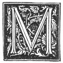

  
[Intangible Textual Heritage](../../index)  [Grimoires](../index) 
[Esoteric](../../eso/index)  [Index](index)  [Previous](abr017) 
[Next](abr019) 

------------------------------------------------------------------------

### THE TWELFTH CHAPTER.

|                    |
|--------------------|
|  |

INE intention was in no way to be so prolix in this First Book; but what
will not paternal love do? and the importance of the matter permitteth
it.

Let each one who will carry out this glorious enterprise rest in peace
and surety, because in these Three Books is comprised all that can be
necessary for this operation. For I have written it with much care,
attention, and exactitude; so that there is no phrase which doth not
give thee some instruction or advice. However, I pray such an one for
the love of God, Who reigneth and will reign eternally, to commence no
operation unless beforehand for the space of Six Months he hath read and
re-read this Book with care and attention, considering all points in
detail; for I am more than sure that he will

p. 44

not encounter any doubtful matter which he will not be able to solve
himself, but further day by day will he assume unto himself a great and
ardent desire, pleasure, and will, to undertake this so glorious
operation; the which can be effected by any person of any religion
soever, [1](#fn_79) provided, however, that
during the Six Moons he hath not committed any sin against the Law and
Commandments of God.

Now it remaineth unto me, O LAMECH, my son, to show unto thee the marks
of my extreme paternal tenderness, by giving thee two principal pieces
of advice, by the means of which, and observing all the other
particulars which I shall describe, thou (and any person unto whom thou
shalt accord this Sacred Science) mayest indubitably arrive at the
perfection of this same Wisdom. It is necessary, however, to understand
that many have undertaken this operation; and that some have obtained
their wish; but that there are others who have not succeeded, and the
reason of this hath been because their Good Angel hath not appeared unto
them in the day of the Conjuration, their Angel being by its nature
Amphiteron, [2](#fn_80) because the Angelic
nature differeth to so great an extent from that of men, that no
understanding nor science could express or describe it, as regardeth
that great purity wherewith they [3](#fn_81) be
invested.

I do not wish that thou, LAMECH, my son, and thy successor, and friends,
should be deprived of a so great treasure. I in no way wish to abandon
thee in so essential a matter. The other point is the Psalm which I will
tell thee also; and though thou givest the operation unto another
person, although he be a friend, thou shalt in no

p. 45

wise communicate this unto him, because this Psalm is the preservative
against all those to whom thou shalt have given the Holy Magic, should
they wish to make use of it against thee; and thou shalt be able thyself
to make excellent use of it against them. This was granted by the Lord
unto DAVID for his own preservation.

For the first point: the day being come when it is necessary to perform
the Orations, Prayers, and Convocations of thy Guardian Angel, thou
shalt have a little Child [1](#fn_82) of the age
of six, seven, or eight years at the most, who shall be clothed in
white, the which child thou shalt have washed from head to foot, and
thou shalt place upon his forehead a veil of white silk very fine and
transparent, which covereth the forehead even unto the eyes; and upon
the veil it is necessary to write beforehand in gold with a brush a
certain Sign made and marked in the manner and order as it will be shown
in the Third Book; the which doth serve to conciliate and to give grace
unto the mortal and human creature to behold the face of the Angel. He
who operateth shall do the same thing, but upon a veil of black silk,
and shall put it on in the same manner as the Child. After this thou
shalt make the Child enter into the Oratory and thou shalt cause him to
place the fire and the perfume in the censer, then he shall kneel before
the Altar; and he who performeth the operation shall be at the door and
prostrate upon the ground, making his Oration, and supplicating his Holy
Angel that he will deign to appear and show himself unto this innocent
being, [2](#fn_83) giving unto him another Sign
if it be necessary in order to see him himself [3](#fn_84) on the two following days.

It is requisite that he who shall operate shall take heed to in no wise
regard the Altar, but having his face

p. 46

towards the ground let him continue his Orations, and as soon as the
child shall have seen the Angel thou shalt command him to tell thee, and
to look upon the Altar and take the lamen or plate of silver which thou
shalt have placed there for this purpose, in order to bring it unto thee
if it be necessary, and whatever other thing the Holy Angel shall have
written thereon, wherewith thou oughtest to work on the two following
days. The which being done he will disappear. Which being carefully
done, the Child will tell thee (for this, it is necessary to have
instructed him beforehand), and thou shalt command him to bring unto
thee the little plate, [1](#fn_85) by the which
when thou hast received it thou shalt know what the Angel hath ordered
thee to do. And thou shalt cause it to be replaced upon the Altar, and
thou shalt quit the Oratory, thou shalt close it, and thou shalt in no
wise enter therein during the first day, and thou shalt be able to send
away the Child. And he who shall perform the Operation shall prepare
himself during the rest of the day for the morrow following, to enjoy
the admirable presence of the Holy Guardian Angel, in order to obtain
the end so earnestly desired, and which shall not fail thee if thou
followest the Path which He shall show unto thee. And these two Signs
are the Key of the whole Operation. Unto the Glory of the Most Holy Name
of God and of His Holy Angels!

END OF THE FIRST BOOK.

 

------------------------------------------------------------------------

### Footnotes

[44:1](abr018.htm#fr_79) It is noticeable how
constantly Abraham the Jew insists upon this point.

[44:2](abr018.htm#fr_80) This word in Greek
would mean "exhausted in every way," or "hemmed in and hindered on every
side."

[44:3](abr018.htm#fr_81) *I.e.*, the Angels.

[45:1](abr018.htm#fr_82) The following
instructions recall some of Cagliostro's methods of magical working.

[45:2](abr018.htm#fr_83) *I.e.*, the Child.

[45:3](abr018.htm#fr_84) *I.e.*, the Operator.

[46:1](abr018.htm#fr_85) *I.e.*, the lamen of
silver, previously alluded to.

------------------------------------------------------------------------

[Next: Prologue](abr019)
