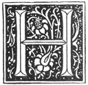

  
[Intangible Textual Heritage](../../index)  [Grimoires](../index.md) 
[Esoteric](../../eso/index)  [Index](index)  [Previous](abr043.md) 
[Next](abr045.md) 

------------------------------------------------------------------------

# THE THIRD BOOK

###### OF THE

### HOLY MAGIC,

###### WHICH GOD GAVE UNTO MOSES, AARON, DAVID, SOLOMON, AND OTHER SAINTS, PATRIARCHS AND PROPHETS; WHICH TEACHETH THE TRUE DIVINE WISDOM.

\_\_\_\_\_\_\_\_\_

###### *BEQUEATHED BY ABRAHAM UNTO LAMECH HIS SON.*

\_\_\_\_\_\_\_\_\_

###### TRANSLATED FROM THE HEBREW.

\_\_\_\_\_\_\_\_\_

1458

 

p. 163

# THE THIRD BOOK.

### (THE PROLOGUE.)

|                    |
|--------------------|
|  |

E who shall have faithfully observed that which hath been taught unto
him, and shall have with a good will obeyed the Commandments of God, let
him, I say, be certain that this Veritable and Loyal Wisdom shall be
accorded unto him; and also that the Perfidious BELIAL can do no
otherwise than become his slave, together with all his Pestiferous
Generation.

However I pray the True God who governeth, ruleth over, and maintaineth
all that He hath created; that thou, O Lamech, my son, or whomsoever he
may be unto whom thou shalt have granted this Sacred Operation, mayest
work it out, having always before thee the Fear of God, and in no way
use it for Evil, because God the Eternal hath wished herein to leave us
our free will, but woe unto him who shall abuse His Divine Grace. Yet I
say not but that if an enemy should attempt thy life, that it is
permissible unto thee if necessary to destroy him; but in any other case
lay not thine hand unto the sword, but use gentler methods. Be kind and
affable unto every one. One may also serve a friend without harm unto
oneself.

David and King Solomon could have destroyed their enemies in an instant,
but they did not so; in imitation

p. 164

of God Himself who chastiseth not unless He is outraged.

If thou shalt perfectly observe these rules, all the following Symbols
and an infinitude of others will be granted unto thee by thy Holy
Guardian Angel; thou thus living for the Honour and Glory of the True
and only God, for thine own good, and that of thy neighbour. Let the
Fear of God be ever before the eves and the heart of him who shall
possess this Divine Wisdom and Sacred Magic.

------------------------------------------------------------------------

[Next: The First Chapter: To Know All Manner of Things Past and
Future](abr045.md)
