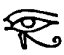

  
[Intangible Textual Heritage](../../index)  [Grimoires](../index) 
[Index](index)  [Previous](bcm48)  [Next](bcm50) 

------------------------------------------------------------------------

### § 8. Concerning Aspersion and Cleansing

In the preparation of the instruments, as already abundantly evident,
and in the more important works which follow it. the ceremonies of
aspersion and fumigation, that is, of purifying and consecrating, are
continually enjoined. Sprinkling is performed with the *Aspergillus*,
which, according to the *Grimorium Verum*, should be composed of mint,
marjory and rosemary, bound about with a thread woven by a virgin girl.
It should be made on the day and in the hour of Mercury, the moon
waxing. The ewer, in the canons of procedure established by *True Black
Magic*, should be a pot of glazed earth, [2](#fn_147) filled with fresh spring

p. 178

water, in which some salt has been cast. The following Psalms should be
recited over it:--*Domine, ne in furore tuo arguas me*, and *Domine,
exaudi orationem meam*, [1](#fn_148) with the
addition of this

PRAYER

O Thou most powerful Lord, my God, my rest, and my life I Do Thou help
me, Most Holy Father! In Thee I place my hope, Who art the God of
Abraham, God of Isaac, God of Jacob, God of the Angels and Archangels,
God of the Prophets, and God the Creator of all things. In all humility,
and with the invocation of Thy Holy Name, I pray that Thou will
vouchsafe to bless this water, that in whatsoever place it shall be cast
it may sanctify our bodies and our souls, through Thee, Most Holy
ADONAY*, Whose reign is without end. Amen*.

The *Aspergillus* recommended by this Ritual differs somewhat from the
former, being of vervain, periwinkle, sage, mint, valerian, ash and
basil, taking care not to use hyssop [2](#fn_149) but rosemary in place thereof. It should
be fitted with a handle of virgin hazel, three palms in length, and
bound as before. The following characters should be engraved on one side
of the said handle:--

 

 [  
Click to view](img/17800.jpg)

 

This *Aspergillus* may be used on any occasion with perfect assurance
that all phantoms will be expelled from every place which shall be
sprinkled thereby with water duly exorcised. The prayer to be used at
sprinkling is thus given by the

p. 179

Grimorium Verum:--*In the Name of God Immortal, may God asperge thee,
N., and cleanse thee from all illusion and from all wickedness, and thou
shall be whiter than snow*.

When asperging add also: *In the Name of the Father* ✠ *and of the Son*
✠ *and of the Holy Ghost* ✠*. Amen*.

Concerning Incense and Fumigation

The *Grimorium Verum* prescribes a cruse or chafing-dish for fumigation,
adding, with a decorative redundance corresponding to its impossible
spirit, that it should be filled with freshly kindled coal and fresh
fire, the whole blazing. Place aromatics thereon, and perfume what you
would, saying: *Angels of God, be our help, and by you be our work
fulfilled*! ZAZAY, SALMAY, DALMAY, ANGERECTON, LEDRION, AMISOR, EUCHEY,
OR! *Great Angels! And do Thou also, O* ADONAY*, be present and impart
hereto such virtue that this creature may receive a form, whereby our
work may be accomplished! In the Name of the Father* ✠ *and of the Son*
✠ *and of the Holy Ghost*. ✠ *Amen*. . . . Recite the Seven Psalms which
follow *Judicium tuum Regi da* and *Laudate Dominum omnes gentes*. [1](#fn_150)

The perfumes are aloes wood and incense for most occasions, and mace for
the fumigation of the circle. The *Book of True Black Magic* omits mace
but substitutes benzoin and storax, and any others at choice, without
specific distinction as to the circle. The following Prayers, Exorcisms
and Benedictions, to be said over the aromatic perfumes, occur in the
two Rituals, the first and third being common to both, and borrowed from
the *Key of Solomon*; the second, also referable to the same source, is
not found in the *Grimorium Verum*.

p. 180

FIRST EXORCISM

O God of Abraham ✠, *God of Isaac* ✠, *and God of Jacob* ✠, *vouchsafe
to bless and sanctify these creatures, of whatsoever species they may
be, so that they may obtain virtue and Power to discern good spirits
from bad, even phantoms and enemies, through Thee, O* ADONAY, *Who
livest and reignest for ever and ever. Amen*.

SECOND EXORCISM

I exorcise thee, O impure Spirit, who art the phantom of the Enemy. In
the Name of God Almighty, come out from this kind, with all thy
falsehood and wickedness, so that it may become sanctified and
exorcised, in the Name of God Almighty; that all virtues may inspire
those who partake of this odour; that the Spirit of God may descend, and
the virtue of the Lord manifest, in the burning of this species; and
that no phantom may dare to accost it. Through the Ineffable Name of God
Almighty. Amen.

THIRD EXORCISM

Deign, O Lord, to sanctify this creature, so that it may become a signal
remedy for the human race, and the salvation of our souls and bodies,
through the invocation of Thy Most Holy Name, that so all creatures
which inhale the smoke of this kind may have health of body and soul.
Through that Lord Who hath created the ages of ages. So be it.

This done, sprinkle the perfumes with exorcised water, and set them
aside in the silken cloth for use as prescribed. When

p. 180

you would fumigate anything, take new coal which has not been kindled,
set it alight, and while it is still black, exorcise it, saying:

EXORCISM OF THE LIGHTED COAL

I exorcise thee, O creature of Fire, by Hint Who hath made all things!
Do thou expel from thee all phantoms, so that they may in no wise harm
or trouble us in our work, by the invocation of the Most High Creator.
Amen. O Saviour, Almighty and merciful, bless Thy creature of this kind,
so that no harm may come to him who shall make use of it. Amen.

In concluding this portion of its ceremonial, the *Book of True Black
Magic* states that there are occasions on which perfumes of a stinking
or malodorous kind must be used. As the first point of their
preparation, the operator must say over them: ADONAY, LAZAY, DELMAY,
AMAY, SADAY, ELOY, [1](#fn_151) *by the
invocation, O Saviour, of Thy Most Holy Name, vouchsafe us, through this
kind, the help of Thy grace, and may it assist us in all things which we
need to fulfil; may all malice pass out herefrom, may it be blessed and
sanctified in Thy most powerful Name. Amen*.

Asperge the stinking perfume with exorcised water, place it in the
silken cloth and use it as needed, but always in the name of the Most
Holy ADONAY. So doing, thou shalt obtain thy desire, says the
"Manuscript discovered at Jerusalem in the Sepulchre of Solomon." [2](#fn_152)

------------------------------------------------------------------------

### Footnotes

[177:1](bcm48.htm#fr_147) The mutilations of
the Divine Names in the Grimoires are part of the distinguishing
characteristics of these works, and hence they are preserved in the
text. It may scarcely be necessary to inform the student that the words
mentioned should read AHIH, ASHR, AHIH.

[177:2](bcm49.htm#fr_148) The *Key of Solomon*
offers choice between a vessel of brass, of lead varnished within and
without, and of earth.

[178:1](bcm49.htm#fr_149) Psalm vi. and Psalm
xlii. in the Vulgate.

[178:2](bcm49.htm#fr_150) The plant here
condemned is prescribed by the *Key of Solomon*.

[179:1](bcm49.htm#fr_151) As these Psalms,
lxxi. and cxvi. in the Vulgate, are widely separated from each other,
and so also in the Authorised Version, it is difficult to determine
those which are referred to in the text.

[180:1](bcm49.htm#fr_152) The names given in
the *Key of Solomon* are *Adonai, Lazai, Dalmai, Aima, Elohi*.

[180:2](bcm49.htm#fr_153) A short way to Magic
by means of perfumes is given by Nyrauld in his work on Lycanthropy. To
discern future events, fumigate yourself with linseed and seed of
psellium, or with roots of violets and wild parsley. To drive away evil
spirits and phantoms, make a perfume of calamon, peony, mint and *palma
Christi*. To attract serpents, burn the windpipe of a stag; to expel
them, burn a horn of the same animal. Make a perfume with gall of fish,
thyme, roses and aloe wood. When kindled, sprinkle with water or blood,
and presently the whole house will seem full of water or of blood, as
the case may be. Add earth which has been turned up by a ploughshare,
and the ground will appear to tremble. The enumeration might be
continued almost indefinitely.

------------------------------------------------------------------------

[Next: Section 9: Concerning the Time of Operation](bcm50)
