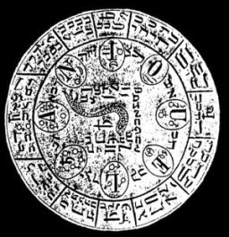

# Grimoires

<table width="75%">
<colgroup>
<col style="width: 50%" />
<col style="width: 50%" />
</colgroup>
<tbody>
<tr class="odd">
<td width="50%" data-valign="CENTER"></td>
<td width="50%" data-valign="CENTER"><h1 id="grimoires">Grimoires</h1></td>
</tr>
</tbody>
</table>

The name "Grimoire" is derived from the word "Grammar". A grammar is a
description of a set of symbols and how to combine them to create
well-formed sentences. A Grimoire is, appropriately enough, a
description of a set of magickal symbols and how to combine them
properly. Most of the texts linked below are descriptions of traditional
European ritual magick, which is based on Judeo-Christianity. Even
though this must not be confused with neo-Paganism, many of the
neo-Pagan traditions use similar rituals and techniques, albeit with a
different (usually Celtic) vocabulary.

Note: These historical texts are presented for research and
entertainment purposes only; we can't answer any questions about the
material contained in them. Please refer to the [sacred-texts
FAQ](../faq.md) before sending any email about these texts.

------------------------------------------------------------------------

  
 [The Book of the Sacred Magic of
Abramelin the Mage](abr/index.md) Translated by S.L. MacGregor Mathers \[1900\].   This grimoire is a
primary source for modern ceremonial magic. 

  
 [The Magus](magus/index.md) By
Francis Barrett \[1801\].   One of the rarest and
most reputable treatments of ceremonial magic. Discusses topics
such as alchemy, astrology, and the Kabbalah. 

  
 [The Book of Ceremonial
Magic](bcm/index.md)   by Arthur Edward
Waite \[1913\].   Comprehensive descriptions of rituals from classic
grimoires, including extensive illustrations of magical seals.
Grimoires covered include the Greater and Lesser Keys of Solomon, the
Grimorium Verum, and the Black Pullet. Also known as the Book of Black
Magic. 

  
 [Sixth Book of
Moses](moses6/index.md)  
 [Seventh Book of
Moses](moses7/index.md)   Two very mysterious
grimoires. These two grimoires (originating from the same book)
are often cited as being used by Vodun/Obeah practitioners. Although
they claim to be Kabbalistic in nature, there is very little if any
actual Kabbalah to be found in them. Rather this appears to be a
traditional ritual magick system with incantations to summon and dismiss
spirits to achieve worldly ends. Published in 1849, and translated into
English in 1880, the *6th and 7th Books of Moses* claim to include
material from 1338, 1383 and 1501, including portions reputedly
translated from the "Cuthan-Samaritan" language, which has been extinct
since the 12th Century A.D., and about which very little is known. The
most interesting aspects of this book are the unique illustrations of
magickal seals, with letters in Hebrew and an unknown script; and the
lists of names of demonic entities. Note: the images in this grimoire
were originally printed in the 19th Century using very primitive
printing technology. To prepare them for publication on the Internet,
they were scanned from the best source available and then
image-processed to bring out details. Unfortunately some of these plates
have illegible portions. Note: the first five books of Moses are the
traditionally the first five books of the Bible. 

 [The Key of Solomon The
King](kos/index.md).  
translated by S. Liddell MacGregor Mathers
\[1888\]   The key to modern
ceremonial magic. Although the author of this grimoire was
traditionally the biblical King Solomon, it was probably written in the
13th Century A.D. It was translated by S. Liddell MacGregor Mathers in
1888; Mathers subsequently had a lot of influence in the Golden Dawn
movement, one of the sources of modern ritual magic; it is said that he
co-wrote its rituals with W.B. Yeats. Mathers also translated the
[Kabbalah](../jud/tku/index.md). 

  
 [The Lesser Key of
Solomon](lks/index.md) by S.L. MacGregor
Mathers and Aleister Crowley \[1904\].   The companion Grimoire to
the Greater Key of Solomon, (for which, see above). It focuses on
the characteristics of the various demons, and the summoning rituals.

  
 [Pow-wows; or Long Lost
Friend](../ame/pow/index.md) by George
Hohman \[1820\].   A
grimoire in the "Pow-wow" tradition of the Pennsylvania Dutch. In
spite of the name, Pow-wow is not a Native American tradition, but a
rural European healing and hexing system which was imported into America
in the 18th and 19th Century by German immigrants. After nearly dying
out it has experienced a small revival in recent years. 
