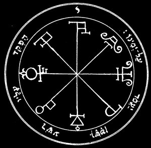

  
[Intangible Textual Heritage](../../index)  [Grimoires](../index) 

------------------------------------------------------------------------

<table width="75%">
<colgroup>
<col style="width: 50%" />
<col style="width: 50%" />
</colgroup>
<tbody>
<tr class="odd">
<td data-valign="CENTER" width="50%"></td>
<td data-valign="CENTER" width="50%"><h1 id="the-key-of-solomon-the-king" data-align="CENTER">THE KEY OF SOLOMON THE KING</h1>
<h5 id="clavicula-salomonis" data-align="CENTER">(CLAVICULA SALOMONIS)</h5>
<h2 id="by-s.-liddell-macgregor-mathers" data-align="CENTER">by S. LIDDELL MACGREGOR MATHERS</h2>
<h4 id="section" data-align="CENTER">[1888]</h4></td>
</tr>
</tbody>
</table>

------------------------------------------------------------------------

[Title Page](kos00)  
[Preface](kos01)  
[List of Plates](kos02)  
[Preliminary Discourse](kos03)  
[Introduction (from Add. MSS. 10862)](kos04)  
[Introduction from Landsdowne MSS. 1203](kos05)  

### Book I

[Chapter I. Concerning the Divine Love Which Ought To Precede the
Acquisition of This Knowledge](kos06)  
[Chapter II. Of the Days, And Hours, And of the Virtues of the
Planets](kos07)  
[Chapter III. Concerning the Arts](kos08)  
[Chapter IV. The Confession To Be Made By the Exorcist](kos09)  
[Chapter V Prayers And Conjurations](kos10)  
[Chapter VI. Stronger And More Potent Conjuration](kos11)  
[Chapter VII. An Extremely Powerful Conjuration](kos12)  
[Chapter VIII. Concerning the Medals Or Pentacles, And the Manner of
Constructing Them](kos13)  
[Chapter IX. Of the Experiment Concerning Things Stolen, And How It
Should Be Performed](kos14)  
[Chapter X. Of the Experiment of Invisibility, And How It Should Be
Performed](kos15)  
[Chapter XI. To Hinder A Sportsman From Killing Any Game](kos16)  
[Chapter XII. How To Make the Magic Garters](kos17)  
[Chapter XIII. How To Make the Magic Carpet Proper For Interrogating the
Intelligences, So As To Obtain An Answer Regarding Whatsoever Matter One
May Wish To Learn](kos18)  
[Chapter XIV. How To Render Thyself Master of A Treasure Possessed By
the Spirits](kos19)  
[Chapter XV. Of the Experiment of Seeking Favour And Love](kos20)  
[Chapter XVI. How Operations of Mockery, Invisibility, And Deceit Should
Be Prepared](kos21)  
[Chapter XVII. How Extraordinary Experiments And Operations Should Be
Prepared](kos22)  
[Chapter XVIII. Concerning the Holy Pentacles Or Medals](kos23)  

### Plates

[The Order of the Pentacles](kos24)  
[Plate II](kos25)  
[Plate III](kos26)  
[Plate IV](kos27)  
[Plate V.](kos28)  
[Plate VI](kos29)  
[Plate VII](kos30)  
[Plate VIII](kos31)  
[Plate IX](kos32)  
[Plate X](kos33)  
[Plate XI](kos34)  
[Plate XII](kos35)  

### Book II

[Prefatory Note](kos36)  
[Chapter I.](kos37)  
[Chapter II. In What Manner the Master of the Art Should Keep, Rule, And
Govern Himself](kos38)  
[Chapter III.](kos39)  
[Chapter IV. Concerning the Fasting, Care, And Things To Be
Observed](kos40)  
[Chapter V. Concerning the Baths, And How They Are To Be
Arranged](kos41)  
[Chapter VI. Of the Garments And Shoes of the Art](kos42)  
[Chapter VII. Of Places Wherein We May Conveniently Execute the
Experiments And Operations of the Art](kos43)  
[Chapter VIII. Of the Knife, Sword, Sickle, Poniard, Dagger, Lance,
Wand, Staff, And Other Instruments of Magical Art](kos44)  
[Chapter IX. Of the Formation of the Circle](kos45)  
[Chapter X. Concerning Incense, Suffumigations, Perfumes, Odours, And
Similar Things Which Are Used In Magical Arts](kos46)  
[Chapter XI. Of the Water, And of the Hyssop](kos47)  
[Chapter XII. Of the Light, And of the Fire](kos48)  
[Chapter XIII. Concerning the Precepts of the Art](kos49)  
[Chapter XIV. Of the Pen, Ink, And Colours](kos50)  
[Chapter XV. Of the Pen of the Swallow And of the Crow](kos51)  
[Chapter XVI. Of the Blood of the Bat, Pigeon, And Other
Animals](kos52)  
[Chapter XVII. Of Virgin Parchment, Or Virgin Paper, And How It Should
Be Prepared](kos53)  
[Chapter XVIII. Of Wax And Virgin Earth](kos54)  
[Chapter XIX. Concerning the Needle And Other Iron Instruments](kos55)  
[Chapter XX. Concerning the Silken Cloth](kos56)  
[Chapter XXI. Concerning Characters, And the Consecration of the Magical
Book](kos57)  
[Chapter XXII. Concerning Sacrifices To the Spirits, And How They Should
Be Made](kos58)  

### Appendices

[Ancient Fragment of the Key of Solomon](kos59)  
[The Qabalistical Invocation of Solomon](kos60)  
[Plate XV. The Mystical Alphabets](kos61)  
