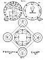

  
[Intangible Textual Heritage](../../index)  [Grimoires](../index.md) 
[Index](index)  [Next](kos01.md) 

------------------------------------------------------------------------

# THE KEY OF

# SOLOMON THE KING

#### (CLAVICULA SALOMONIS)

#### NOW FIRST TRANSLATED AND EDITED FROM ANCIENT MSS. IN THE BRITISH MUSEUM

###### BY

#### S. LIDDELL MACGREGOR MATHERS

###### AUTHOR OF 'THE KABBALAH UNVEILED,' 'THE TAROT,' ETC.

#### George Redway, London

\[1888\]

###### Scanned at Intangible Textual Heritage, July 2000. J. B. Hare, redactor. Reformatted August 2003. This text is in the public domain. These files may be used for any non-commercial purpose, provided this notice of attribution is preserved intact.

 

 [  
Click to enlarge](img/kos01.jpg.md)  
Plate I.

 

------------------------------------------------------------------------

[Next: Preface](kos01.md)
