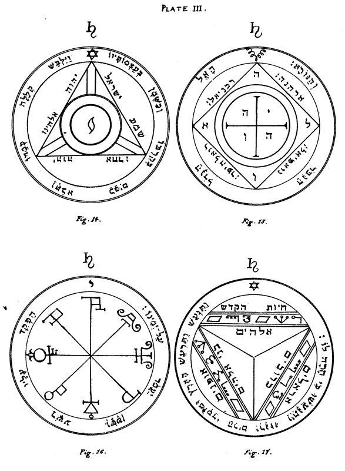

  
[Intangible Textual Heritage](../../index)  [Grimoires](../index.md) 
[Index](index)  [Previous](kos25)  [Next](kos27.md) 

------------------------------------------------------------------------

# PLATE III.

   
Plate III.

\_\_\_\_\_\_\_\_\_\_\_\_\_\_\_\_\_\_\_\_\_\_

Figure 14.--The Fourth Pentacle of Saturn.--This Pentacle serveth
principally for executing all the experiments and operations of ruin,
destruction, and death. And when it is made in full perfection, it
serveth also for those Spirits which bring news, when thou invokest them
from the side of the South.

p. 68

Editor's Note.--The Hebrew words around the sides of the triangle are
from Deut. Vi. 4:--'Hear, O Israel, IHVH ALHINV is IHVH AChD.' The
surrounding versicle is from Psalm cix. 18:--'As he clothed himself with
cursing like as with a garment, so let it come into his bowels like
water, and like oil into his bones.' In the centre of the Pentacle is
the mystic letter Yod.

\_\_\_\_\_\_\_\_\_\_\_\_\_\_\_\_\_\_\_\_\_\_

Figure 15.--The Fifth Pentacle of Saturn.--This Pentacle defendeth those
who invoke the Spirits of Saturn during the night; and chaseth away the
Spirits which guard treasures.

Editor's Note.--The Hebrew letters in the angles of the Cross are those
of the Name IHVH. Those in the angles of the Square form ALVH, Eloah.
Round the four sides of the Square are the Names of the
Angels:--Arehanah, Rakhaniel, Roelhaiphar, and Noaphiel. The versicle
is:--'A Great God, a Mighty, and a Terrible.'--Deut. x. 17.

\_\_\_\_\_\_\_\_\_\_\_\_\_\_\_\_\_\_\_\_\_\_

Figure 16.--The Sixth Pentacle of Saturn.--Around this Pentacle is each
Name symbolised as it should be. The person against whom thou shalt
pronounce it shall be obsessed by Demons.

Editor's Note.--It is formed from Mystical Characters of Saturn. Around
it is written in Hebrew: 'Set thou a wicked one to be ruler over him,
and let Satan stand at his right hand.'

\_\_\_\_\_\_\_\_\_\_\_\_\_\_\_\_\_\_\_\_\_\_

Figure 17.--The Seventh and Last Pentacle of Saturn.--This Pentacle is
fit for exciting earthquakes, seeing that the power of each order of
Angels herein invoked is sufficient to make the whole Universe tremble.

Editor's Note.--Within the Pentacle are the Names of the Nine Orders of
Angels, those of six of them in ordinary Hebrew Characters, and the
remainder in the letters which are known as 'The Passing of the River.'
These Nine Orders are:--1. CHAIOTH HA-QADESCH, Holy Living Creatures; 2.
AUPHANIM, Wheels; 3. ARALIM, Thrones; 4. CHASCHMALIM, Brilliant Ones; 5.
SERAPHIM, Fiery Ones; 6. MELAKIM, Kings; 7. ELOHIM, Gods; 8. BENI
ELOHIM, Sons of the Elohim; 9. KERUBIM, Kerubim. The versicle is from
Psalm xviii. 7:--'Then the earth shook and trembled, the foundations of
the hills also moved and were shaken, because He was wroth.'

------------------------------------------------------------------------

[Next: Plate IV](kos27.md)
