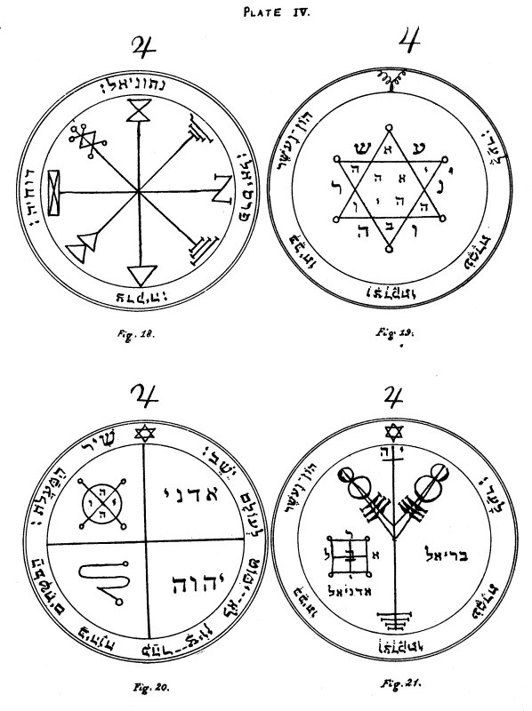

  
[Intangible Textual Heritage](../../index)  [Grimoires](../index.md) 
[Index](index)  [Previous](kos26)  [Next](kos28.md) 

------------------------------------------------------------------------

# PLATE IV.

   
PLATE IV.

### JUPITER.

\_\_\_\_\_\_\_\_\_\_\_\_\_\_\_\_\_\_\_\_\_\_

Figure 18.--The First Pentacle of Jupiter.--This serveth to invoke the
Spirits of Jupiter, and especially those whose Names are written around
the Pentacle, among whom Parasiel is the Lord and Master of Treasures,
and teacheth how to become possessor of places wherein they are.

Editor's Note.--This Pentacle is composed of Mystical Characters of
Jupiter. Around it are the Names of the Angels:--Netoniel, Devachiah,
Tzedeqiah, and Parasiel, written in Hebrew.

\_\_\_\_\_\_\_\_\_\_\_\_\_\_\_\_\_\_\_\_\_\_

Figure 19.--The Second Pentacle of Jupiter.--This is proper for
acquiring glory, honours, dignities, riches, and all kinds of good,
together with great tranquillity of mind; also to discover Treasures and
chase away the Spirits who preside over them. It should be written upon
virgin paper or parchment, with the pen of the swallow and the blood of
the screech-owl.

Editor's Note.--In the centre of the Hexagram are the letters of the
Name AHIH, Eheieh; in the upper and lower angles of the same, those of
the Name AB, the Father; in the remaining angles those of the Name IHVH.
I believe the letters outside the Hexagram in the re-entering angles to
be intended for those of the first two words of the versicle, which is
taken from Psalm cxii. 3:--'Wealth and Riches are in his house, and his
righteousness endureth for ever.'

\_\_\_\_\_\_\_\_\_\_\_\_\_\_\_\_\_\_\_\_\_\_

Figure 20.--The Third Pentacle of Jupiter.--This defendeth and
protecteth those who invoke and cause the Spirits to come. When they
appear show unto them this Pentacle, and immediately they will obey.

Editor's Note.--In the upper left corner is the Magical Seal of Jupiter
with the letters of the Name IHVH. In the others are the Seal of the
Intelligence of Jupiter, and the Names Adonai and IHVH.--Around it is
the versicle from Psalm cxxv. 1:--'A Song of degrees. They that trust in
IHVH shall be as Mount Zion, which cannot be removed, but abideth for
ever.'

\_\_\_\_\_\_\_\_\_\_\_\_\_\_\_\_\_\_\_\_\_\_

Figure 21.--The Fourth Pentacle of Jupiter.--It serveth to acquire
riches and honour, and to possess much wealth. Its Angel is Bariel. It
should be engraved upon silver in the day and hour of Jupiter when he is
in the Sign Cancer.

p. 70

Editor's Note.--Above the Magical Sigil is the Name IH, Iah. Below it
are the Names of the Angels Adoniel and Bariel, the letters of the
latter being arranged about a square of four compartments. Around is the
versicle from Psalm cxii. 3:--'Wealth and Riches are in his house, and
his righteousness endureth for ever.'

------------------------------------------------------------------------

[Next: Plate V.](kos28.md)
