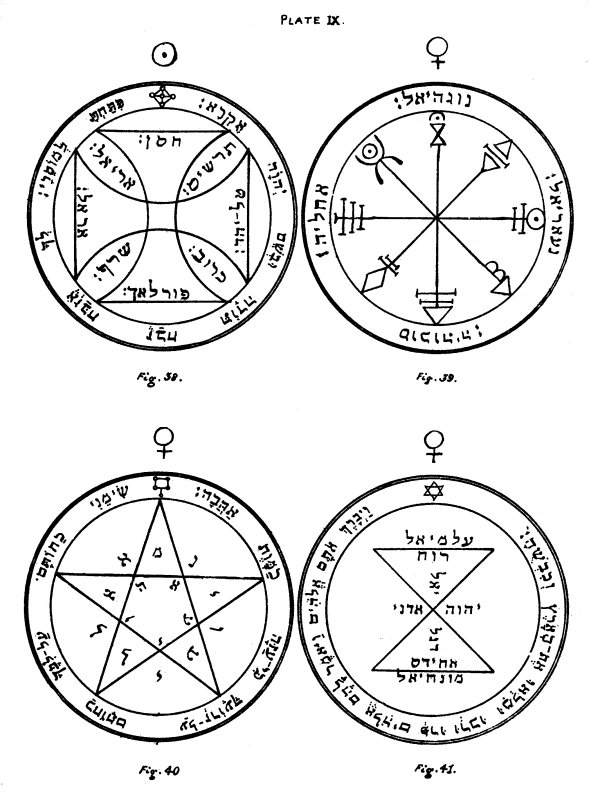

  
[Intangible Textual Heritage](../../index)  [Grimoires](../index.md) 
[Index](index)  [Previous](kos31)  [Next](kos33.md) 

------------------------------------------------------------------------

# PLATE IX.

   
PLATE IX.

\_\_\_\_\_\_\_\_\_\_\_\_\_\_\_\_\_\_\_\_\_\_

Figure 38.--The Seventh and last Pentacle of the Sun.--If any be by
chance imprisoned or detained in fetters of iron, at the presence of
this Pentacle, which should be engraved in Gold on the day and hour of
the Sun, he will be immediately delivered and set at liberty.

Editor's Note.--On the Arms of the Cross are written the Names of
Chasan, Angel of Air; Arel, Angel of Fire; Phorlakh, Angel of Earth; and
Taliahad, Angel of Water. Between the four Arms of the Cross are written
the names of the four Rulers of the Elements: Ariel, Seraph, Tharshis,
and Cherub. The versicle is from Psalm cxvi. 16, 17:--'Thou hast broken
my bonds in sunder. I will offer unto thee the sacrifice of
thanksgiving, and will call upon the Name of IHVH.'

\_\_\_\_\_\_\_\_\_\_\_\_\_\_\_\_\_\_\_\_\_\_

### VENUS.

Figure 39.--The First Pentacle of Venus.--This and those following serve
to control the Spirits of Venus, and especially those herein written.

Editor's Note.--Mystical Characters of Venus, and the Names of the
Angels: Nogahiel, Acheliah, Socodiah (or Socohiah) and Nangariel.

\_\_\_\_\_\_\_\_\_\_\_\_\_\_\_\_\_\_\_\_\_\_

Figure 40.--The Second Pentacle of Venus.--These Pentacles are also
proper for obtaining grace and honour, and for all things which belong
unto Venus, and for accomplishing all thy desires herein.

Editor's Note.--The letters round and within the Pentagram form the
Names of Spirits of Venus. The versicle is from Canticles viii.
6:--'Place me as a signet upon thine heart, as a signet upon thine arm,
for love is strong as death.'

p. 75

Figure 41.--The Third Pentacle of Venus.--This, if it be only shown unto
any person, serveth to attract love. Its Angel Monachiel should be
invoked in the day and hour of Venus, at one o'clock or at eight.

Editor's Note.--The following Names are written within the Figure IHVH,
Adonai, Ruach, Achides, Ægalmiel, Monachiel, and Degaliel. The versicle
is from Genesis i. 28:--'And the Elohim blessed them, and the Elohim
said unto them, Be ye fruitful, and multiply, and replenish the earth,
and subdue it.'

------------------------------------------------------------------------

[Next: Plate X](kos33.md)
