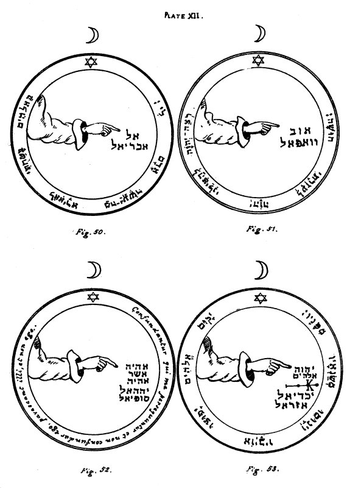

  
[Intangible Textual Heritage](../../index)  [Grimoires](../index.md) 
[Index](index)  [Previous](kos34)  [Next](kos36.md) 

------------------------------------------------------------------------

p. 77

# PLATE XII.

   
PLATE XII.

\_\_\_\_\_\_\_\_\_\_\_\_\_\_\_\_\_\_\_\_\_\_

Figure 50.--The Second Pentacle of the Moon.--This serveth against all
perils and dangers by water, and if it should chance that the Spirits of
the Moon should excite and cause great rain and exceeding tempests about
the Circle, in order to astonish and terrify thee; on showing unto them
this Pentacle, it will all speedily cease.

Editor's Note.--A hand pointing to the Name El, and to that of the Angel
Abariel. The versicle is from Psalm lvi. ii:--'In Elohim have I put my
trust, I will not fear, what can man do unto me

\_\_\_\_\_\_\_\_\_\_\_\_\_\_\_\_\_\_\_\_\_\_

Figure 51.--The Third Pentacle of the Moon.--This being duly borne with
thee when upon a journey, if it be properly made, serveth against all
attacks by night, and against every kind of danger and peril by Water.

Editor's Note.--The Names Aub and Vevaphel. The versicle is from Psalm
xl. 13:--'Be pleased O IHVH to deliver me, O IHVH make haste to help
me.'

\_\_\_\_\_\_\_\_\_\_\_\_\_\_\_\_\_\_\_\_\_\_

Figure 52.--The Fourth Pentacle of the Moon.--This defendeth thee from
all evil sorceries, and from all injury unto soul or body. Its Angel,
Sophiel, giveth the knowledge of the virtue of all herbs and stones; and
unto whomsoever shall name him, he will procure the knowledge of all.

Editor's Note.--The Divine Name Eheieh Asher Eheieh, and the Names of
the Angels Yahel and Sophiel. The versicle is:--'Let them be confounded
who persecute me, and let me not be confounded; let them fear,and not
I.'

\_\_\_\_\_\_\_\_\_\_\_\_\_\_\_\_\_\_\_\_\_\_

Figure 53.--The Fifth Pentacle of the Moon.--It serveth to have answers
in sleep. Its Angel Iachadiel serveth unto destruction and loss, as well
as unto the destruction of enemies. Thou mayest also call upon him by
Abdon and Dalé against all Phantoms of the night, and to summon the
souls of the departed from Hades.

Editor's Note.--The Divine Names IHVH and Elohim, a mystical character
of the Moon, and the Names of the Angels Iachadiel and Azarel. The
versicle is from Psalm lxviii. 1:--'Let God arise, and let His enemies
be scattered; let them also who hate Him flee before Him.'

\_\_\_\_\_\_\_\_\_\_\_\_\_\_\_\_\_\_\_\_\_\_

[Figure 54](kos44.htm#img_kos13.md)--The Sixth and Last Pentacle of the
Moon.--This is wonderfully good, and serveth excellently to excite and
cause heavy rains, if it be engraved upon a plate of silver; and if it
be placed under water,

p. 78

as long as it remaineth there, there will be rain. It should be
engraved, drawn, or written in the day and hour of the Moon.

Editor's Note.--The Pentacle is composed of mystical characters of the
Moon, surrounded by a versicle from Genesis vii. 11, 12:--'All the
fountains of the great deep were broken up . . . and the rain was upon
the earth.'

\[This is the end of the Holy Pentacles, in all which I have, to the
best of my power, restored the Hebrew letters and mystical characters
correctly. I have further given nearly every versicle in pointed Hebrew,
instead of in the Latin; so that the Occult student might not be
inconvenienced by having to search out the same in a Hebrew Bible. The
restoration of the Hebrew letters in the body of the Pentacles has been
a work of immense difficulty, and has extended over several years.}

------------------------------------------------------------------------

[Next: Prefatory Note](kos36.md)
