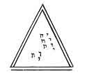

  
[Intangible Textual Heritage](../../index)  [Grimoires](../index.md) 
[Index](index)  [Previous](ma146)  [Next](ma148.md) 

------------------------------------------------------------------------

p. 132

CHAP. XXV.

OF THE NUMBER TEN, AND THE SCALE.

THE number Ten is called every number, or an [universal](errata.htm#2.md)
number, complete, signifying the full course of life; for beyond that we
cannot number but by replication; and it either implies all numbers
within itself, or explains them by itself, and its own, by multiplying
them; wherefore it is accounted to be of manifold religion and power,
and is applied to the purging of souls. Hence the antients called
ceremonies Denary, because they were to be expiated and to offer
sacrifices, and were to abstain from some certain things for ten days.

There are ten sanguine parts of man: the menstrues, the sperm, the
plasonatic spirit, the mass, the humours, the organical body, the
vegetative part, the sensitive part, reason, and the mind. There are,
also, ten simple integral parts constituting man: the bone, cartilage,
nerve, fibre, ligament, artery, vein, membrane, flesh, and skin. There
are, also, ten parts of which a man consists intrinsically: the spirit,
the brain, the lungs, the heart, the liver, the gall, the spleen, the
kidnies, the testicles, and the matrix. There are ten curtains in the
temple, ten strings in the psaltery, ten musical instruments with which
the psalms were sung, the names whereof were--*neza*, on which their
odes were sung; *nablum*, the same as organs; *mizmor*, on which the
Psalms; *sir*, on which the Canticles; *tehila*, on which orations;
*beracha*, on which benedictions; *halel*, on which praises; *hodaia*,
on which thanks; *asre*, on which the felicity of any one; *hallelujah*,
on which the praises of God only, and contemplations. There were also
ten singers of psalms, *viz.* *Adam, Abraham, Melchisedeck, Moses,
Asaph, David, Solomon*, and *the three sons of Chora*. There are, also,
ten commandments. And then tenth day after the ascension of Christ, the
Holy Ghost came down. Lastly, this is the number, in which Jacob,
wrestling with the Angel all night, overcame, and, at the rising of the
sun, was blessed, and called by the name of Israel. In this number,
Joshua overcame thirty-one kings; and David overcame Goliah and the
Philistines; and Daniel escaped the danger of the lions. This number is
also circular, as unity; because, being heaped together, returns into a
unity, from whence it had its beginning; and it is the end and
perfection of all numbers, and the

p. 133

beginning of tens. As the number ten flows back into a unity, from
whence it proceeded, so every thing that is flowing is returned back to
that from which it had the beginning of its flux: so water returns to
the sea, from whence it had its beginning; the body returns to the
earth, from whence it was taken; time returns into eternity, from whence
it flowed; the spirit shall return to God, who gave it; and, lastly,
every creature returns to nothing, from whence it was created. [1](#fn_12.md) Neither is it supported but by the word of
God, in whom all things are hid, and all things with the number ten, and
by the number ten, make a round, as Proclus says, taking their beginning
from God, and ending in him. God, therefore (that first unity, or one
thing), before he communicated himself to inferiors, diffused himself
first into the first of numbers, *viz.* the number three; then into the
number ten, as into ten ideas and measures of making all numbers and all
things, which the Hebrews call ten attributes, and account ten divine
names; from which cause there cannot be a further number. Hence all tens
have some divine thing in them, and in the law are required as his own,
together with the first fruits, as the original of all things and
beginning of numbers, and every tenth is as the end given to him, who is
the beginning and end of all things.

SCALE OF THE NUMBER TEN.

 

p. 134

THE SCALE OF THE NUMBER TEN.

<table data-border="" data-cellspacing="1" data-cellpadding="9" width="957">
<colgroup>
<col style="width: 8%" />
<col style="width: 8%" />
<col style="width: 8%" />
<col style="width: 8%" />
<col style="width: 8%" />
<col style="width: 8%" />
<col style="width: 8%" />
<col style="width: 8%" />
<col style="width: 8%" />
<col style="width: 8%" />
<col style="width: 8%" />
<col style="width: 8%" />
</colgroup>
<tbody>
<tr class="odd">
<td width="9%" data-valign="TOP">
In the original
</td>
<td colspan="3" width="23%" data-valign="TOP">
יהוהיהויהי 
The name of Jehovah of ten letters collected,
</td>
<td colspan="2" width="14%" data-valign="TOP">
ואו הא 
The name of Jehovah of ten letters
</td>
<td colspan="2" width="14%" data-valign="TOP">
יוד הא 
Extended,
</td>
<td colspan="3" width="21%" data-valign="TOP">
אלהימ צבאוט 
The name Elohim Sabaoth
</td>
<td width="19%" data-valign="TOP">
The name of God with ten letters,
</td>
</tr>
<tr class="even">
<td width="9%" data-valign="TOP">
 
</td>
<td width="8%" data-valign="TOP">
אהיה 
Eheie, 
כתר 
Kether
</td>
<td width="8%" data-valign="TOP">
ויהוה 
Jod Jehovah, 
חכמה 
Hochmah,
</td>
<td width="7%" data-valign="TOP">
יהוה אלהים 
Jehovah Elohim, 
בינה 
Binah,
</td>
<td width="7%" data-valign="TOP">
אל 
El, 
הכד 
Hesed,
</td>
<td width="7%" data-valign="TOP">
אלהים גיבר 
Elohim Gibor, 
גבירה 
Geburah,
</td>
<td width="7%" data-valign="TOP">
אליה 
Eloha, 
תפארת 
Tiphereth,
</td>
<td width="7%" data-valign="TOP">
יהוה צבאות 
Jehovah Saboath, 
נצה 
Nezah,
</td>
<td width="7%" data-valign="TOP">
אלהימצבאות 
Elohim Saboath, 
הוד 
Hod,
</td>
<td width="7%" data-valign="TOP">
שדי 
Sadai, 
יסוד 
Jesod,
</td>
<td width="7%" data-valign="TOP">
אדני 
Adonai melech; 
מלכות Malchuth
</td>
<td width="19%" data-valign="TOP">
Ten names of God. Ten Sephiroth.
</td>
</tr>
<tr class="odd">
<td width="9%" data-valign="TOP">
In the intelligible world,
</td>
<td width="8%" data-valign="TOP">
Seraphim, Hajothhakados, Merattron,
</td>
<td width="8%" data-valign="TOP">
Cherubim, Orphanim, Jophiel,
</td>
<td width="7%" data-valign="TOP">
Thrones, Aralim, Zaphkiel,
</td>
<td width="7%" data-valign="TOP">
Dominations, Hasmallim, Zadkiel,
</td>
<td width="7%" data-valign="TOP">
Powers, Seraphim, Camael,
</td>
<td width="7%" data-valign="TOP">
Virtues, Malachim, Raphael,
</td>
<td width="7%" data-valign="TOP">
Principalities, Elohim, Haniel,
</td>
<td width="7%" data-valign="TOP">
Archangels, Ben Elohim, Michael,
</td>
<td width="7%" data-valign="TOP">
Angels, Cherubim, Gabriel,
</td>
<td width="7%" data-valign="TOP">
Blessed souls; Issim; The soul of Messiah;
</td>
<td width="19%" data-valign="TOP">
Ten orders of the blessed, according to Dionysius. Ten orders of the blessed, according to the traditions of men. Ten angels ruling.
</td>
</tr>
<tr class="even">
<td width="9%" data-valign="TOP">
In the celestial world,
</td>
<td width="8%" data-valign="TOP">
Reschith hagallalim, the primum mobile,
</td>
<td width="8%" data-valign="TOP">
Masloth, the sphere of the Zodiac,
</td>
<td width="7%" data-valign="TOP">
Sabbathi, the sphere of Saturn,
</td>
<td width="7%" data-valign="TOP">
Zedeck, the sphere of Jupiter,
</td>
<td width="7%" data-valign="TOP">
Madim, the sphere of Mars,
</td>
<td width="7%" data-valign="TOP">
Schemes, the sphere of the Sun,
</td>
<td width="7%" data-valign="TOP">
Noga, the sphere of Venus,
</td>
<td width="7%" data-valign="TOP">
Cochab, the sphere of Mercury,
</td>
<td width="7%" data-valign="TOP">
Levanah, the sphere of the Moon,
</td>
<td width="7%" data-valign="TOP">
Holom Jesodoth, the sphere of the elements;
</td>
<td width="19%" data-valign="TOP">
Ten spheres of the world.
</td>
</tr>
<tr class="odd">
<td width="9%" data-valign="TOP">
In the elementary world,
</td>
<td width="8%" data-valign="TOP">
A dove,
</td>
<td width="8%" data-valign="TOP">
A lizard,
</td>
<td width="7%" data-valign="TOP">
A dragon,
</td>
<td width="7%" data-valign="TOP">
An eagle,
</td>
<td width="7%" data-valign="TOP">
A horse
</td>
<td width="7%" data-valign="TOP">
Lion,
</td>
<td width="7%" data-valign="TOP">
Man,
</td>
<td width="7%" data-valign="TOP">
The fox,
</td>
<td width="7%" data-valign="TOP">
Bull,
</td>
<td width="7%" data-valign="TOP">
Lamb;
</td>
<td width="19%" data-valign="TOP">
Ten animals consecrated to the gods.
</td>
</tr>
<tr class="even">
<td width="9%" data-valign="TOP">
In the lesser world,
</td>
<td width="8%" data-valign="TOP">
Spirit,
</td>
<td width="8%" data-valign="TOP">
Brain,
</td>
<td width="7%" data-valign="TOP">
Spleen,
</td>
<td width="7%" data-valign="TOP">
Liver,
</td>
<td width="7%" data-valign="TOP">
Gall,
</td>
<td width="7%" data-valign="TOP">
Heart,
</td>
<td width="7%" data-valign="TOP">
Kidnies,
</td>
<td width="7%" data-valign="TOP">
Lungs,
</td>
<td width="7%" data-valign="TOP">
Genitals,
</td>
<td width="7%" data-valign="TOP">
Matrix;
</td>
<td width="19%" data-valign="TOP">
Ten parts intrinsical of man.
</td>
</tr>
<tr class="odd">
<td width="9%" data-valign="TOP">
In the infernal world,
</td>
<td width="8%" data-valign="TOP">
False gods,
</td>
<td width="8%" data-valign="TOP">
Lying spirits,
</td>
<td width="7%" data-valign="TOP">
Vessels of iniquity,
</td>
<td width="7%" data-valign="TOP">
Revengers of wickedness,
</td>
<td width="7%" data-valign="TOP">
Jugglers,
</td>
<td width="7%" data-valign="TOP">
Airy powers,
</td>
<td width="7%" data-valign="TOP">
Furies, the seminaries of evil,
</td>
<td width="7%" data-valign="TOP">
Sifters, or triers,
</td>
<td width="7%" data-valign="TOP">
Tempters, or ensnarers,
</td>
<td width="7%" data-valign="TOP">
Wicked souls bearing rule;
</td>
<td width="19%" data-valign="TOP">
Ten orders of the damned.
</td>
</tr>
</tbody>
</table>

 

------------------------------------------------------------------------

### Footnotes

[133:1](ma147.htm#fr_12.md) At the last, the
elements give up what they have ever received; the sea gives up her
dead, the fire gives up its fuel; the earth gives up the seminal virtue,
&c.; and the air gives up whatever voice, sound, or impression it has
received, so that not an oath, lie, or secret blasphemy, but what will
appear as clear as noon daylight at the great day of God.

------------------------------------------------------------------------

[Next: Chapter XXVI: Of The Numbers Eleven And Twelve, With The
Cabalistical Scale](ma148.md)
