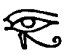

  
[Intangible Textual Heritage](../../index)  [Grimoires](../index.md) 
[Index](index)  [Previous](ma218)  [Next](ma220.md) 

------------------------------------------------------------------------

p. 46

CHAP. VII.

OF THE ORDER OF EVIL SPIRITS, AND THEIR FALL, AND DIFFERENT NATURES.

THERE are some of the school of theologians, who distribute the evil
spirits into nine degrees, as contrary to the nine orders of angels.
Therefore, the first of these, which are called false gods, who,
usurping the name of God, would be worshipped for gods, and require
sacrifices and adorations; as that devil who said to Christ, "If thou
wilt fall down and worship me, I will give thee all these things,"
shewing him all the kingdoms of the world; and the prince of these is he
who said, I will ascend above the height of the clouds, and will be like
to the Most High, who is called Beelzebub, that is, an old god. In the
second place, follow the spirits of lies, of which sort was he who went
forth, and was a lying spirit in the mouth of the prophet of Ahab; and
the prince of these is the serpent Pytho, from whence Apollo is called
Pythius, and that woman a Pythoness, or witch, in Samuel, and the other
in the gospel, who had Pytho in her belly. Therefore, these kind of
devils join themselves to the oracles, and delude men by divinations and
predictions, so that they may be deceived. In the third order, are the
vessels of iniquity, which are called vessels of wrath: these are the
inventors of evil things, and all wicked arts; as in Plato, that devil
Theutus, who taught cards and dice; for all wickedness, malice, and
deformity, proceeds from these, of which in *Genesis*, in the
benedictions of Simeon and Levi, Jacob said, "vessels of iniquity are in
their habitations, into their counsel let not my soul come;" which the
*Psalmist* calls vessels of death, *Isaiah*, vessels of fury; and
*Jeremiah*, vessels of wrath; *Ezekiel*, vessels of destroying and
slaying; and their prince is Belial, which signifies, without a yoke,
and disobedient, a prevaricator, and an apostate; of whom Paul to the
Corinthians says, "what agreement has Christ with Belial?" Fourthly,
follow the revengers of evil, and their prince is Asmodeus, *viz.*
causing judgment. After these, in the fifth place, come the deluders,
who imitate miracles, and serve

 

 [  
Click to view](img/pl10.jpg.md)

 

p. 47

conjurers and witches, and seduce the people by their miracles, as the
serpent seduced Eve, and their prince is Satan, of whom it is written in
the Revelation, "that he seduces the whole world, doing great signs, and
causing fire to descend from heaven in the sight of men; seducing the
inhabitants of the earth by these signs, which are given him to do."
Sixthly, the aerial powers offer themselves and join themselves to
thunder and lightning, corrupting the air, causing pestilences, and
other evils; in the number of which are the four angels of whom the
Revelations speak, to whom it is given to hurt the earth and the sea,
holding the four winds from the four corners of the earth and their
prince is called Meririm: he is the meridian devil, a boiling spirit, a
devil raging in the south, whom *Paul*, to the *Ephesians*, calls "the
prince of the power of the air, and the spirit which works in the
children of disobedience." The seventh mansion the furies possess, who
are powers of evil, discords, war, and devastation; whose name in the
Revelation is called in Greek, *Apollyon*; in the Hebrew, *Abaddon*,
that is, destroying and wasting. In the eighth place are the accusers or
inquisitors, whose prince is Astaroth, that is, a searcher out; in the
Greek language he is called Diabolus, that is, an accuser or
calumniator; which in the Revelation is called the "accuser of the
brethren, accusing them night and day before the face of God." Moreover,
the tempters and ensnarers have the last place; one of which is present
with every man, which we call the evil genius, and their prince is
*Mammon*, which is interpreted covetousness. But we of the Cabala
unanimously maintain that evil spirits do wander up and down this
inferior world, enraged against, all whom we call devils; of whom
*Austin*, in his first book of the Incarnation of the Word, to
*Januarius*, says, concerning the devils and his angels contrary to
virtues, the ecclesiastical preachers have taught that there are such
things, but what they are, and who they are, he has not clear enough
expounded: yet there is this opinion among them, that this devil was an
angel, and being made an apostate, persuaded many of the angels to fall
with him, who to this day are called his angels. Greece,
notwithstanding, thinks not that these are damned, nor that they are all
purposely evil; but that from the creation of the world the dispensation
of things is ordained by

p. 48

this means, that the [tormenting](errata.htm#7.md) of sinful souls is made
over to them. The other theologians say, that no devil was created evil,
but that they were driven and cast out of heaven from the orders of good
angels, for their pride whose fall not only our and the *Hebrew
theologians*, but also the *Assyrians*, *Arabians*, *Egyptians*, and
*Greeks*, do confirm by their tenets. *Pherycies*, the *Assyrian*,
describes the fall of the devils; and *Ophis*, that is, the devilish
serpent, was the head of that rebelling army; Trismegistus sings the
same fall, in his Pimander; and Homer, under the name of Ararus, in his
verses; and Plutarch, in his Discourse on Usury, signifies that
Empedocles knew that the fall of the devils was in this manner; the
devils themselves often confess their fall. They being cast out into
this valley of misery, some that are near to us wander up and down in
this obscure air; others inhabit lakes, rivers, and seas; others the
earth, and terrify earthly things, and invade those who dig wells and
metals, cause the gaping of the earth, to strike together the
foundations of the mountains, and vex not only men but also other
creatures; some being content with laughter and delusion only, do
contrive rather to weary men than to hurt them; some heightening
themselves to the length of a giant's body, and again shrinking
themselves down to the smallest of pigmies, and changing themselves into
different forms, to disturb men with vain fear; others study lies and
blasphemies, as we read of one in third book of Kings, saying, "I will
go forth and be a lying spirit in the mouth of all the prophets of
Ahab." But the worst sort of devils are those who lie in wait, and
overthrow passengers in their journies, and rejoice in wars and effusion
of blood, and afflict men with most cruel stripes: we read of such in
*Matthew*, "for fear of whom no man dare pass that way." Moreover, the
Scripture reckons up *nocturnal*, *diurnal*, and *meridional* devils;
and describes other spirits of wickedness by different names, as we read
in *Isaiah* of satyrs, screech-owls, sirens, storks, owls; and in the
*Psalms*, of asps, basilisks, lions, dragons; and in the *Gospel*, we
read of scorpions, and Mammon, and the prince of this world, and rulers
of darkness, of all whom Beelzebub is the prince, whom the Scripture
calls the Prince of wickedness.

 

 [  
Click to view](img/pl11.jpg.md)

 

------------------------------------------------------------------------

[Next: Chapter VII: Of The Annoyance Of Evil Spirits, And The
Preservation We Have From Good Spirits](ma220.md)
