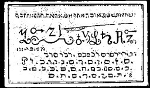

  
[Intangible Textual Heritage](../../index)  [Grimoires](../index) 
[Index](index)  [Previous](m600)  [Next](m602) 

------------------------------------------------------------------------

# THE MYSTERY OF THE FIRST SEAL

Seal of the Choir of the Ministering Archangels

CONJURATION

I, N.N., a servant of God, desire, call upon the OCH, and conjure thee
through water, fire, air, and earth, and everything that lives and moves
therein, and by the most holy names of God, Agios, Tehirios, Perailtus,
Alpha et Omega, Beginning and End, God and Man-Sabaoth, Adanai, Agla,
Tetragramaton, Emanuel, Abua, Ceus, Elioa, Torna, Deus Salvator, Aramma,
Messias, Clerob, Michael, Abreil, Achleof, Gachenas et Peraim, Eei
Patris et Peraim Eei filii, et Peraim Dei spiritus Teti, and the words
by which Solomon and Manasses, Cripinus and Agrippa conjured the
spirits, and by whatever else thou mayest be conquered, that you will
yield obedience to me, N.N. the same as Isaac did to Abraham, and appear
before me, N.N. this instant, in the beautiful, mild, human form of a
youth, and bring what I desire. (This the conjuror must name).

The most useful ministering arch angels of this seal are the following
with their Hebrew verbis revelatis Citatiori divinitus coactivis: Uriel,
Arael, Zacharael, Gabriel, Raphael, Theoska, Zywolech, Hemohon, Yhael,
Tuwahel, Donahan, Sywaro, Samohayl, Zowanus, Ruweno Ymoeloh, Hahowel,
Tywael. The particularly great secret and special use of this seal is
that if this seal is buried in the earth, where treasures exist, they
will come to the surface of themselves, without any presence during a
full moon.

------------------------------------------------------------------------

[Next: The Mystery of The Second Seal](m602)
