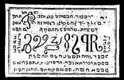

  
[Intangible Textual Heritage](../../index)  [Grimoires](../index) 
[Index](index)  [Previous](m606) 

------------------------------------------------------------------------

# THE MYSTERY OF THE SEVENTH SEAL.

Seal of the Angels of the Seven Planets and Spirits.

CONJURATION.

I, N.N., a servant of God, call upon, desire, and conjure thee, Ahael,
Banech, by the most holy words Agios, (Tetr.,) Eschiros, Adonai, Alpha
et Omega, Raphael, Michael, Uriel, Schmaradiel, Zaday, and by all the
known names of Almighty God, by whatever thou, Ahael, canst be
compelled, that thou appear before me, in a human form, and fulfil what
I desire. Fiat, Fiat, Fiat. (This must be named by the conjuror.)

The most obedient Angels and Spirits of this Seal of the Seven Planets
are the following: Ahaeb, Baneh, Yeschnath, Hoschiah, Betodah, Leykof,
Yamdus, Zerenar, Sahon. This Seal, when laid upon the treasure earth, or
when placed within the works of a mine, will reveal all the precious
contents of the mine.
