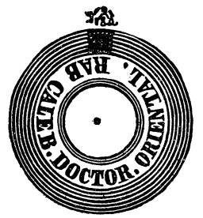
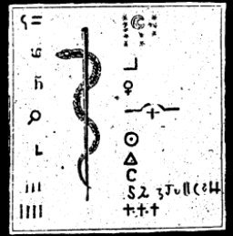

  
[Intangible Textual Heritage](../../index)  [Grimoires](../index) 
[Index](index)  [Next](m701) 

------------------------------------------------------------------------

# THE SEVENTH BOOK OF MOSES

{Title Page I}

BIBLIA,

ARCANA MAGICA ALEXANDER,

ACCORDING TO THE

Tradition of the Sixth and Seventh Books of Moses,

BESIDES

MAGICAL LAWS.

Ex Verbis Revelatis (II) Intellectui Sigillatis Verbis.

NUNC APOSTOLICA  CONSECRATIONE

DR NOVO CONFIRMATO. Script. de Ellbio.

ANNO MCCCLXXXIII.

 

{Title Page II.}

EXTRACT

FROM THE

MAGICAL KABALA,

OF THE

SIXTH AND SEVENTH

BOOKS OF MOSES,

By

S. T. N.

Translated for the first time from the Cuthan-Samaritan Language into
English.

ANNO MDCCXXVI.

 

{Title Page III.}

BIBLIA

Arcana Magica Alexandri (Magi),

ACCORDING TO

(REVEALED) TRADITION OF THE SIXTH AND SEVENTH

BOOKS OF MOSES.

TOGETHER WITH THE

MAGICAL LAWS.

Ex Verbis H. (human) Intellectui Sigillatis Verbis.

Nunc Apostolis  (Anctoritate) Consecrata de Novo
Confirmato

   (Licentia.)

Script de Eppbio.

ANNO MCCCXXXVII

 

Biblia Arcana Magica Alexander,

ACCORDING TO THE TRADITION OF THE SIXTH AND SEVENTH BOOKS OF MOSES.

TOGETHER WITH THE MAGICAL LAWS.

Ex Verbis (H) Intellectui Sigillatis Verbis Nunc Apostalica

Consecrat de Nove Confirmati  

SCRIPT DE ELSTRO.

MCCCLXXXIII

------------------------------------------------------------------------

[Next: The Twelve Tables of the Spirits](m701)
